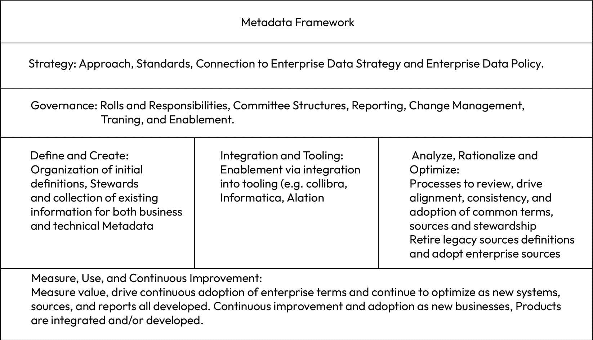

# 6

# 元数据管理

本章面向任何有兴趣了解高层次元数据管理、理解最佳实施策略，或处于两者之间的人。理解本章的内容不需要具备任何元数据管理的先前经验。

建立一个高价值、高回报的元数据管理能力对于任何数据治理项目来说都是绝对必要的。首席数据与分析官的成功与失败取决于能否回答一些基本的核心问题：公司数据在哪里？谁拥有它？它是如何分类的？它安全吗？我能否利用它创造价值？我知道如何降低数据风险吗？通过学习这些问题的答案，并了解如何战术性地设立一个成功的元数据管理能力，我们将深入探讨元数据这一关键能力。

简而言之，元数据是关于数据的信息。元数据功能用于使数据更加易于理解、访问和重复使用。元数据管理是创建、存储、组织、维护和使用元数据的过程。根据我的经验，元数据是最被低估的数据能力之一，但它是任何数据管理项目的基础。当元数据得到良好部署和管理时，它是成功的根本，而当元数据资金不足或未得到充分利用时，它则是失败的根源。

元数据管理很重要，原因有很多。首先，它有助于提高数据的质量。通过提供关于数据的信息，元数据可以帮助确保数据的准确性、完整性和一致性。其次，元数据可以帮助让数据更容易访问。通过提供搜索和筛选元数据的方式，用户可以更轻松地找到所需的数据。第三，元数据有助于使数据更加可重复使用。

通过提供关于数据的上下文和使用方式的信息，元数据可以帮助用户了解数据在不同场景下的使用方式。在本章中，我们将涵盖以下内容：

+   元数据管理定义

+   元数据管理的价值

+   核心元数据能力

+   构建最佳的元数据能力

+   为成功设置元数据管理

# 元数据管理定义

在我们深入细节之前，我认为对基本定义达成一致非常重要。根据我的经验，数据专业人员有时为了避免冒犯听众，在启动数据能力时会跳过基本定义。然而，从基础定义开始是可以优雅地进行的，这样既不会冒犯业务领导者，又能帮助听众理解我们将要完成的任务。

我喜欢从一个简单的幻灯片开始，标题为“在我们开始之前”。这个简单而有影响力的引导幻灯片可以通过一个基本的前提和以下口头声明设置：“在我们深入细节之前，我想花一点时间确保我们大家对今天要讨论的内容有相同的理解。就我个人而言，我并不是一生都在做元数据的专家，因此，让我们花一点时间来定义一下当我们谈论元数据时的含义。”这个简单却不冒犯的引导能够让团队在定义上达成一致，而不会让我们听起来像是在对利益相关者说教。

所以，在这方面，在我们开始之前，让我们先明确一下定义。当我们谈论**元数据**时，重要的是要说明，所有的元数据不过是关于我们数据的信息。你可能会听到它被描述为“关于数据的数据”。仅仅捕捉数据关于数据的信息是不够的，我们必须将其付诸实践，这就需要**元数据管理**。

## 什么是元数据管理？

元数据管理是每个公司都需要理解和管理的基础能力。有效的元数据管理能力可以向用户提供关于数据的基本信息，包括以下内容：

+   存在哪些数据

+   数据的创造者是谁

+   数据创建的时间

+   数据创建的地点

+   数据意味着什么

+   数据来自哪里

元数据可以用于做很多事情，但至少它帮助用户做以下几件事：

+   发现数据资产

+   理解数据的背景

+   建立对信息的信任

+   消费数据

有三种类型的元数据需要积极管理：业务元数据、技术元数据和操作元数据。这三种元数据结合在一起，有助于更好地理解数据资产，并能够从数据中解锁更多价值。我们先从一些基本定义开始。

+   **业务元数据**：它将数据领域与业务数据管理员联系起来，推动业务数据定义，并负责将业务元数据与跨企业的技术元数据连接起来。

+   **技术元数据**：它包含来自物理数据的物理数据元素和属性，支持数据追溯，并推动对数据转换的理解。技术元数据展示了数据来自于物理数据库、系统以及跨企业的数据流。技术元数据还描述了数据的结构、存储、格式和处理方式。这种类型的元数据通常包括数据类型、列名和表结构等数据。

+   **操作元数据**：它包含有关数据是如何以及何时创建或转换的信息。可能包括时间戳、位置或作业执行日志等信息。

这三种类型的元数据对于强大的数据管理非常重要。它们服务于不同的目的，通常由不同的用户使用（例如，业务元数据通常用于支持业务数据管理员，而技术元数据对于技术数据管理员角色更为关键）。

### 元数据示例

让我们将这些定义具体化。我们从有关结构化数据的元数据开始，例如客户数据记录，如客户数据平台数据库表中所示：

| ID | 名字 | 姓氏 | 街道地址 | 城市 | 州 | 国家 | 邮政编码 | 电话号码 |
| --- | --- | --- | --- | --- | --- | --- | --- | --- |
| 12345 | Bob | Smith | 123 Main Street | Anytown | IA | USA | 11111 | 555-555-5555 |
| 67890 | Nancy | Glad | 456 Town Place | Anytown | IA | USA | 11111 | 555-555-5556 |

图 6.1 – 示例数据记录

#### 业务元数据

业务元数据将包括以下内容：

+   每个字段的定义（例如，ID、名字、姓氏、街道地址等）。

+   业务数据管理员

+   技术数据管理员

+   客户数据的来源（即客户数据平台）

这些业务元数据在数据目录系统中可能如下所示：

| 业务术语 | 业务定义 | 业务数据管理员 | 技术数据管理员 | 授权来源 |
| --- | --- | --- | --- | --- |
| 客户 ID | 分配给个人客户的唯一标识符 | Asha Sinha | Sally Smith | 客户数据平台 |
| 客户名 | 客户的合法名 | Bob Jones | Henrik Hans | 客户数据平台 |
| 客户姓氏 | 客户的合法姓氏 | Bob Jones | Henrik Hans | 客户数据平台 |

图 6.2 – 来自客户数据平台的客户数据字段的数据目录记录示例

请注意，客户数据平台中的表头可能简单为“ID”，而在数据目录中，术语更为具体（客户 ID）。这是因为“ID”表头可能以不同方式使用，并不专属于客户。我们必须使用独特的术语和定义，以推动适当的理解和具体性，从而在公司内部实现共同的语言。

#### 技术元数据

技术元数据将包括以下内容：

+   数据存储位置

+   接口信息

+   有关表格和字段结构的信息

+   数据类型

+   相关领域的链接

+   索引

关于非结构化数据（如图片）的元数据可能包含以下内容：

+   图像标题

+   图像描述

+   图像日期

+   图像位置

+   图像版权

# 元数据管理的价值

当我考虑数据管理能力的价值时，我会从部署这项能力后，我能够做的事情出发，衡量与当前状况的差距。我该如何衡量这种差异呢？它可能体现在节省的资金、避免的罚款、节省的员工时间、创造的收入、释放的机会价值，或是这些因素的组合。任何一个价值维度都能使得这项能力值得部署。

与元数据的不同之处在于，随后的数据管理能力（正如我们将在*第七章*至*第十一章*中探讨的）如果没有元数据能力的支撑，将无法发挥其最大潜力。因此，这项能力是基础性的，在衡量元数据管理的价值时也需要考虑这一点。元数据管理能力的价值包含五个核心要素：

+   **透明度**：元数据管理使数据具有透明性。技术元数据告诉我们数据的来源，数据来自哪些系统，是否曾经转置或以其他方式变更，并帮助我们更好地理解数据。当我们了解数据的来源和历程时，我们对数据的透明度增加，从而提高了对数据的信任。

+   **管理**：元数据管理帮助我们推动数据的责任归属。当我们知道自己拥有的数据时，我们可以为数据指定数据管理员，从而确保责任的落实。当我们知道谁对数据负责时，我们能够创建一个环境，让有专人负责数据的使用。这种管理模式帮助公司能够识别任何责任方，并推动数据管理的进一步责任落实。当数据管理员存在并且职责明确时（正如我们在数据治理政策中所述），公司便能从对数据的额外关注中获得益处。

重要提示

记住，高质量管理的关键在于作为服务提供者，而非数据所有者。所有权的概念可能会导致“稀缺”思维方式，从而阻碍数据管理员共享数据。数据代表着企业资产，除非隐私、法律或其他规定要求对数据进行保密，否则数据应当可供共享使用。

+   **清晰度**：元数据管理使公司能够清晰地了解术语、来源和所有权。通过推动清晰度，业务部门、分析师、工程师和高管们能够轻松对齐目标。

+   **可重用性**：元数据管理使公司能够定位、理解并使用（和重用）企业的数据资产。

+   **基础能力**：元数据管理是后续数据管理能力（如数据质量、架构优化和数据操作）所需的关键基础能力。如果我们不知道自己拥有哪些数据，就很难衡量数据的质量、优化数据源或将其纳入一般数据操作中管理。我们必须拥有高质量、可靠且可访问的元数据，以推动这些附加能力的实现。

## 为什么元数据重要？

元数据管理提供了在公司内部建立信息理解和组织所需的能力。元数据管理的积极特性使公司能够通过共享数据资产促进数据的使用，支持数据变更管理的洞察力，并确保适当的控制和保护，以遵守法规、政策和整体合规性。

通过构建元数据管理能力，你可以期望推动的业务成果包括以下内容：

+   **搜索和定位**业务数据和技术数据的能力（节省数据用户数小时甚至数周的时间，无需通过内部社交网络询问同事数据位置，或者在尝试找到最佳数据源时进行多次迭代）

+   **理顺常见术语**，使企业范围内的术语统一（将业务与统一的分类法对齐）

+   **良好管理数据的能力**，并推动其他关键数据管理能力，如治理、数据质量、数据架构和主数据管理

# 核心元数据能力

业务元数据能力应由数据管理解决方案团队领导，该团队隶属于首席数据与分析官办公室。业务元数据必须由中央主导，并应与公司各地的业务数据管理人员密切合作，提供端到端的元数据流程和技术解决方案，包括启用元数据管理所需的工具和流程，从而推动业务价值。在本节中，我们将介绍数据管理解决方案团队在部署和管理企业范围内时需要负责的核心能力。

图 6.3 – 示例元数据框架

## 元数据标准

元数据标准是公司如何创建、管理和使用元数据的指南或期望。这些标准帮助公司定义数据资产、系统、流程和使用的必要措施，从而确保全公司范围内的一致性，并且元数据是值得信赖的。

### 为什么元数据标准重要？

元数据标准对元数据管理的成功至关重要，因为标准可以统一公司范围内如何部署、使用和利用元数据管理的预期。元数据管理标准有四个核心原则，标准中应全面解决以下问题：

+   元数据是企业资产，具有价值，应当相应地进行管理。

+   元数据管理是一个企业范围的能力，需要企业范围的领导力。

+   需要问责制；没有任何一个人或团队能够单独或孤立地推动企业范围的元数据管理。

+   关于元数据管理的决策必须从企业的角度进行，而不是偏袒某个用户或某个团队，而是考虑企业整体的利益。

### 如何衡量进展

衡量元数据标准部署进展的简单方法有两个方面：标准的发布和标准的采用。对于发布，您需要发布一个适用于整个企业的标准。除了确保发布日期符合预期，并且定期修订按计划进行外，其他方面无需过多衡量。

成功的第二个衡量标准是标准的采用。您可以根据部门、数据领域、系统或业务数据负责人设定采用指标——无论哪种方式适合您的数据管理计划。重要的组成部分是数据管理能力的一致性。例如，如果您按数据领域来衡量，您应按数据领域衡量所有数据管理能力，以推动一致性地采用。

### 谁来管理元数据标准？

首席数据与分析官（CDAO）办公室最终负责公司的业务术语表。在 CDAO 办公室内，负责管理所有元数据、数据质量和主要数据的数据管理解决方案团队，应推动满足元数据标准的需求；然而，通常情况下，数据治理负责人将负责通过一致的流程发布所有企业数据标准，并最终发布元数据标准。

数据治理负责人还可能管理公司数据标准的合规性，元数据管理负责人则对部署和采用进展负责。在标准开发过程中，应该咨询业务和技术数据负责人。数据领域高层应被告知这些标准。

### 您应该如何使用它？

元数据标准应作为指南，帮助用户了解元数据管理所需的要求，定义能力、可用的解决方案，以帮助用户遵守标准并使用元数据管理。该标准应定义关键术语，建立流程，告知用户应使用哪些元数据工具，并总体上推动使用户能够使用这一关键数据管理能力。

在某些组织中，元数据标准可能还会告知读者关于资金要求、变更管理以及标准之外的内容。

## 业务术语表

业务词汇表和数据目录都代表了关键的元数据管理能力，但它们的目的不同，且通常服务于略有不同的受众。**业务词汇表**很像一本常见的词典——它创造了清晰性。它包含了与你公司相关的数据的关键业务术语及其定义。业务词汇表应提供搜索功能，以便用户搜索和找到他们所需要的数据，帮助理解数据的关键特征，并推动某些工作流程，建议更改并批准业务元数据。

重要说明

有时业务词汇表也被称为数据字典。

业务词汇表通常由业务用户使用（但技术用户也可能从中受益），以帮助推动对数据的理解和含义，它们通常包含以下信息：

+   **术语**：我们正在定义的内容

+   **定义**：对术语的清晰简洁描述

+   **同义词**：具有与该术语相同意义的其他术语

+   **反义词**：具有与该术语相反意义的其他术语

+   **示例**：术语的使用示例

+   **备注**：任何其他相关信息（可选字段）

### 为什么业务词汇表很重要？

对任何公司来说，业务词汇表都很重要，因为它作为公司讨论关键信息的共同语言。统一业务术语有助于日常运营，它确保了公司内的每个人，从首席执行官到普通分析师，都在使用相同的语言。

重要说明

在我曾经工作过的一家公司，我们花了将近 18 个月时间来统一“客户”这一术语的企业定义。因为我们的一些业务单元是面向企业的（B2B），而一些是面向消费者的（B2C），所以定义需要足够宽泛，以涵盖这两种商业模式，但又必须足够具体，以避免包括潜在客户或线索。统一整个业务定义涉及到众多利益相关者，其中一些人对这一术语非常热衷。尽管协调工作非常困难，但我们必须确保正确定义，以确保企业的报告和决策保持一致。如果没有这种统一，我们无法向高层管理或董事会报告信息。

### 如何衡量进展

在构建你的业务词汇表能力时，你需要向相关利益方、经理，甚至企业数据委员会汇报进展。可以使用几个指标来衡量和传达团队在交付方面的进展。以下是一些示例：

+   由系统完成的业务词汇表数量/系统数量

+   上传到业务词汇表中的业务术语数量/已定义的术语数量

+   已批准的业务术语数量/已定义的业务术语数量

+   没有业务词汇表的应用程序数量/应用程序总数

+   没有指定负责人/业务术语的数量

+   已完成业务术语表的数据领域数量/数据领域数量

### 如何衡量价值？

这是业务术语表中最难的部分之一。大部分价值是定性的。缺乏业务术语表通常会在整个企业中产生影响，甚至影响到组织的最高层。我来举个例子说明。

### 示例

曾经有一位 CEO 要求我统一我们公司最重要的术语。他们说：“但是，别做得太慢。”

问题是什么？为什么 CEO 需要我们统一最重要的术语？

我们正在进行业务转型并改变商业模式。他在与各个业务总经理沟通时遇到了问题，因为各个总经理的收入数字与财务团队的数字不一致。当我们深入探讨时，我们发现总经理们使用的收入定义在总经理之间差异很大，而且与财务的定义也不同。财务团队必须做出多次调整以符合 GAAP，这导致了内部报告与外部报告之间的显著差异。这引发了高级层级的多次讨论关于数据差异。想象一下这些会议的成本。

当我们统一了业务术语和计算方法后，团队们的会议效率大幅提高，数据驱动的讨论让每个人都能达成共识。

以下是几种衡量价值的方法：

+   **减少错误**：业务术语表可以通过在生成报告之前先定义术语来减少报告中的错误。通过提前统一定义，你可以防止在报告制作后，业务方和报告制作方在数据对齐上产生不一致，导致需要重新编写报告。

+   **提高效率**：拥有业务术语表可以通过更快速地查找和使用信息来提高效率。组织规模越大，影响越显著。

正如你可能注意到的，这是时间节省。你可以创建一个模型来衡量这些假设，并与业务用户验证这些假设。例如，我们认为，一旦我们定义了业务术语表，且提供了足够的定义和来源，我们预计每个报告的生产时间将减少 20 小时，因为前期统一对比今天的反复调整。通过使用这个 20 小时 x 100 个报告每年的假设，我们预测每年可以节省 2000 小时的劳动力（相当于一个全职员工）。如果贵公司每年生产 1000 份报告（或 10000 份），想象一下这个简单解决方案能带来的影响。

### 谁负责管理业务术语表？

首席数据与分析官办公室最终负责公司的业务词汇表。在 CDAO 办公室内，负责管理所有元数据、数据质量和主数据的数据管理解决方案团队应当推动企业业务词汇表的构建，以及支持此项工作所需的工具。

大多数公司都会指定一位专注于元数据管理的领导来推动本章中概述的能力。在我之前的所有数据团队中，我都有一个团队，人数从 3 到 15 人不等（对于大公司，人数有时更多）专注于这一领域。为什么要这么大？如果你正在为一家拥有 6000 个应用程序的公司对齐企业词汇表，你将需要强大的流程、论坛和工具，以及支持交付的路线图。这项工作永远不会“完成”。随着公司发展、服务新市场、拓展新客户群体并部署新系统，所有这些都会导致你的团队需要进行更多的业务词汇表工作。

### 一个成熟的业务词汇表能力是什么样的？

当你努力为公司成熟业务词汇表能力时，你可以采取一系列措施来推动更多的成熟度和业务词汇表的使用。在成熟的数据治理项目中，业务词汇表通常是针对特定系统或数据领域创建的，但在更成熟的公司中，会创建企业词汇表以标准化公司内的业务定义。企业业务词汇表通常能实现以下能力：

+   综合且合理化的业务词汇表，与重复项/部门词汇表对比

+   推动本体论的采用

+   术语的合理化及其与数据资产的关联

+   实现跨领域业务术语的关联

最终，整个企业对与业务术语相关的完整信息进行对齐，包括意义、关系和沿袭，这有助于推动真正的企业业务词汇表。在之前的例子中，我与 CEO 一起推动了全公司统一的关键指标报告，我们从他希望标准化的九个术语开始了企业业务词汇表的构建。从那里起，团队不断完善标准化的企业业务词汇表，同时将更多标准化术语加入到我们的服务指标项目中。

然而，开始这项工作并不需要 CEO 的要求；你应该将跨公司合成和合理化业务词汇表作为标准项目的一部分。最简单的起点是识别你在数据领域和/或系统中已经存在的重复项，然后可以轻松确定企业定义。这些共同的定义就是你的“企业”业务术语。

你会发现有些情况下，企业定义已达成一致，但某些部门有其独特的定义，它是企业部门定义的一个子组件，专门为该部门而设。例如，你可能会有一个企业术语，如“收入”。而对于某个部门，你可能会按产品线来记录收入。虽然企业的收入术语包含了通用定义，但当部门在指定其产品线时，他们可能会称之为“产品 A 收入”，以明确它是收入，但只针对特定的产品。

### 如何实施业务词汇表？

1.  **范围**：定义业务词汇表的范围。你可以从一个系统、一个团队、一个数据领域、一个程序或整个公司开始。确保明确你将交付的内容，并在开始时定义成功标准，以确保与利益相关者的一致性。

1.  **引导利益相关者**：定义流程，并解释预期、时间需求以及他们可以期待的结果。

1.  **收集所有可用的材料**：你可能会惊讶地发现，业务词汇表或术语定义的某些部分已经存在。有时，团队会将这些信息保存在电子表格或共享演示文稿中。利用现有的资料作为起点。

1.  **定义术语**：与业务数据管理人员和信息使用者合作，定义术语的定义，统一同义词和反义词，提供示例，并收集相关笔记。

1.  **发布词汇表**：将收集到的信息应用到你的企业业务词汇表中。

## 数据目录

这存储了关于组织数据资产的信息，如数据位置、格式、血缘和质量。**数据目录**通常是数据工程师、数据科学家及其他技术用户的一个关键元数据功能。数据目录可能包括其他相关信息，如数据源链接、分类或其他相关信息。数据目录通常包含每个数据资产的关键信息，如以下内容：

+   **名称**：数据资产的名称。

+   **描述**：数据资产的描述。

+   **位置**：数据资产所在的位置。

+   **格式**：数据资产的格式（如整理的数据集、报告等）。

+   **血缘**：数据资产的历史（有关血缘的更多信息请参见 *第八章*）

+   **质量**：有关资产质量的信息，如准确性、完整性等（有关数据质量的更多信息请参见 *第九章*）。

+   **标签**：这些标签可以用来组织和搜索数据资产，也可以使用一定的格式进行驱动（例如，报告、客户、供应商等）。

我希望数据目录能为业务用户提供已经创建的有用数据集，这将加速公司发现和洞察的速度。理想情况下，这个功能应当使业务用户能够通过添加新信息来不断改进数据目录中的内容。

### 为什么这很重要？重要的是什么？

随着公司发展，数据对公司整体成功变得更加关键，个人和团队花费过多时间寻找他们信任的数据。根据我的经验，通常会出现一个转折点：要么发生不好的事情（例如数据泄露、监管要求等），要么基于对公司“历史知识”的依赖，操作变得痛苦且难以继续，扩展也成为了一个挑战。数据目录是解决方案，帮助个人和团队在公司内部查找、寻找和使用数据，通过让个人重用常见的数据资产。

这个问题并不新鲜。根据 2001 年 IDC 的一篇白皮书，"*1998 年的一项调查发现，76%的公司高管认为信息是“至关重要”的，是公司最重要的资产。然而，60%的人表示，时间限制和缺乏寻找信息的理解阻碍了员工找到所需信息*。" 此外，《福布斯》报道，2018 年，数据专业人员仍然将 50%的时间花在寻找和治理数据上。

以下是一些可能需要数据目录的指示因素：

1.  你的业务分析师很难找到他们需要的数据来填充报告和/或商业智能工具

1.  在数据湖中找到信息非常困难，甚至几乎不可能

1.  即使数据可以找到，理解它仍然是一个挑战

1.  没有数据或数据资产的所有权，因此找到可以回答基本问题的人几乎是不可能的，或者非常耗时

1.  重用其他个人的数据资产需要你知道该数据资产的存在以及是谁创建的，这样你也可以使用它

1.  没有验证数据可信性的流程

1.  数据的来源不明，因此使用时需要盲目依赖

### 你如何衡量价值？

根据我的经验，大多数公司还没有完全采纳数据目录，而数据目录是解决这些常见问题的最简便方法。虽然有很多方式来计算价值（例如，依赖错误数据的成本、因错误报告信息而被罚款的成本、时间成本等），但计算数据目录价值的最简单且最不具争议的方式是计算员工的时间。只需拿一个数据分析师的薪水成本，假设为 100,000 美元，结合前面提到的 50%时间花费在寻找信息上。这意味着他们每年 50%的薪水都花费在寻找和管理他们负责的数据上：

**USD 100,000 * 50% =** **USD 50,000**

一家公司雇佣了多少数据分析师？10 个？100 个？根据每个分析师的成本进行相应的乘算。

数据目录服务的费用是多少？通常，这包括总拥有成本，涵盖了许可费用、服务器成本以及工具管理费用（元数据分析师）。

搜索时浪费的时间与更多富有成效的任务相比，如何衡量？

所有这些答案都应该在贵公司决定是否投资企业数据目录时考虑到。别忘了考虑没有此能力所错失的机会。如果你不需要每天派遣分析师去寻找数据，你们能做些什么？他们能否创造出新的收入生成想法？机会和成本的整体图景有助于揭示数据目录为贵公司带来的真正价值。

### 应该使用哪些指标来衡量成熟度？

+   已录入数据目录的数据资产数量

+   具有完整信息的数据资产数量

+   数据管家认证的数据资产数量（意味着，经过验证的来源、数据质量和已识别的所有权）

+   具有数据管家的数据资产数量

+   在所有数据资产中被重复使用的数据资产数量

+   具有完整数据血缘的数据资产数量

+   每个数据领域在企业数据目录中记录的数据资产数量/数据资产数量

示例

在我以前的工作中，我们需要对数据资产进行合理化，这是客户数据转型的一部分。最初，我们的客户数据分布在整个公司。随着我们部署统一的客户数据记录系统，我们将客户数据资产合理化，并纳入企业数据目录。这为公司提供了经过批准或“授权”的定义、资产和黄金数据源的位置。任何其他来源的客户数据都被视为“非认证”，并且 CDAO 不保证其可靠性。

### 谁来管理它？

类似于业务词汇表，你可能会为数据目录设置多个管理层次。你可能会有部门级或数据领域驱动的数据目录，这些目录由业务数据管家或业务数据团队来管理。

这些业务数据领导者将与 CDAO 办公室的元数据领导者合作，建立并有效管理企业数据目录。理想情况下，组织应拥有一个专属的企业数据目录，并能够管理和标记特定于单一数据领域的信息。这种透明度对于数据演化至关重要，例如，当一个以前仅在某个部门级别使用的数据资产被发现并在企业级别采用时。如果部门/数据领域的透明度在企业层面不可见，那么数据资产就无法被有效利用。

然而，如果你的组织没有数据目录能力，拥有基于部门或领域的数据目录是一个很好的起点。你不需要工具就能开始。你可以使用像电子表格这样简单的工具，等准备好投资时再成熟为更专业的工具。

### 成熟度是什么样的？

企业范围内与数据资产相关的完整信息的一致性，包括其意义、关系和血统，推动了一个真正的企业数据目录。成熟的数据目录能力应该让业务用户非常容易地确定以下内容：

+   你拥有什么数据

+   谁对数据负责？

+   数据的来源

+   数据是否可信？

+   在哪里可以找到数据（理想情况下，可以提供一个链接）。

无缝且安全的企业范围内数据资产访问，包括与身份访问管理的集成，确保合适的人在合适的时间拥有对合适资产的访问权限，这是最优的。当数据目录让数据易于查找时，用户却要花费数天、数周甚至数月等待访问批准时，可能会感到非常沮丧。

简单的可发现性/复杂的搜索（例如，由 AI 驱动）使这一能力更具吸引力。一些新功能会根据你的搜索历史建议额外的资产。数据目录中嵌入的推荐使得用户更容易找到所需的内容，有时还会发现一些他们不知道自己想要的额外信息。

### 你应该如何使用它？

+   业务用户应该通过**搜索**数据目录来找到他们需要的数据。

+   更轻松且**一致地**理解使用的数据（共同语言）。

+   帮助业务用户**更好地解读** **技术信息**。

+   使用数据来**创造洞察**，以回答关键的商业问题。

# 构建最优的元数据管理能力。

在 2021 年，我参加了一次访谈，当时大胆地（在当时）表示元数据是最被低估的数据治理能力。现在，到了 2023 年底，我仍然站在这一观点上。我坚信元数据是所有数据治理的动力。直到今天，我仍然被问到公司应如何最大化他们在数据治理方面的投资，每次我都会建议通过创建和优化数据市场来加大对元数据能力的投资。

## 什么是数据市场？

数据市场是我所称之为“数据能力业务”的东西，这意味着它由数据办公室驱动。当技术支持和赋能时，**数据市场**是公司创建所有数据资产购物体验的单一平台。数据市场的基础由元数据驱动，使用户能够轻松地从单一平台访问数据资产。搜索和发现的便捷性是世界级数据市场的关键特性。

数据市场能够解决公司的一些问题，包括但不限于以下内容：

+   定位跨组织的数据（1：M 平台/系统/来源）

+   识别重复数据（数据资产的泛滥），推动简化工作

+   识别数据质量问题，推动修复工作

+   推动数据定义、计算、来源以及数据资产质量的透明度

## 数据市场中包含什么？

数据市场包含元数据（业务和技术）和数据资产，提供用于数据管理活动的工作流，并且以企业的统一透明度完成所有这些工作。你应该包括以下内容：

+   数据治理政策（链接到）

+   数据管理工作流，支持提议定义、审批等操作

+   业务词汇表

+   数据字典

+   数据血统

+   数据产品（链接、所有者和认证状态）

+   认证的数据资产（报告和策划的数据集）

+   标准化的企业 KPI

+   上述能力的 数据质量指标

## 为什么数据市场很重要？

数据市场是一个无缝的、互联的体验，提供前述能力，使公司能够快速、高效且通过设计实现信任与透明度地找到所需的数据。如果时间对你的业务至关重要，数据市场能够加速洞察的实现，远远超过其他任何能力。我见过的最好的数据市场，始终专注于提供出色的用户体验，保持用户界面的简单、内容的相关性，并专注于内容的质量而非数量。

在后台，CDAO 办公室可能会花费时间集成各种功能、系统和流程，以便使数据市场为用户提供愉悦的体验。不要犹豫，投入资源发展这一能力。我从利益相关者那里收到的最大抱怨一直是难以找到可信的信息，而数据市场正好解决了这一问题。如果你能够让组织各级利益相关者轻松找到他们完成工作所需的信息，你就会在数据领导力方面获得成功。

## 衡量成果和投资回报

+   每月的独立用户数（你可以按业务单元或地区跟踪，以获得更具体的情报）（或任何与你的业务相关的时间范围）。

+   入驻数据市场的独立数据产品/资产数量。

+   入驻数据市场的独立认证数据产品/资产数量。

+   连接的系统数量。

+   基于角色的用户计数。这会在设定的时间段（例如每月或每季度）内追踪使用人数，并确定哪些角色在一段时间内的使用情况更多或更少，从而可以探究原因并推动更多的使用。一些示例包括数据工程师、数据分析师、业务分析师和高层管理人员。

# 为成功设置元数据管理

最终，一个优秀的元数据项目帮助公司回答基本的数据问题，如：我们有哪些数据？这些数据如何分类？我们的数据在哪里？谁对它负责？我如何找到它？我可以使用它吗？能够回答这些基本问题，正是使元数据管理项目成功的关键。首席数据官（CDAO）和元数据管理领导者必须共同传递这一能力的价值主张。我的建议是，不要害怕分享缺乏强大元数据管理时可能出现的问题，同时也要强调当拥有强大的元数据管理项目时，能够带来的好处。

虽然从表面上看，这一能力似乎相当简单，但在大型公司中实施强大的项目需要时间、专注和清晰的价值沟通。我建议从一个数据领域或单一系统开始，在公司内部推动实施。在你们努力收集元数据的同时，启动数据市场能力将使公司能够利用团队在构建元数据管理能力过程中所付出的所有努力，以便以易于理解的方式呈现出来。

# 结论

随后的章节中的其他数据治理能力将建立在这一元数据能力的基础上。如果你无法有效管理元数据，那么衡量数据质量、建立授权的配置点、优化架构以及为常见数据集（如客户或产品）构建权威数据源将变得更加困难。因此，在公司推进数据治理成熟度的过程中，早期并且频繁地传达这一基础能力的重要性至关重要。

通过本章的学习，你应该能够充分解释元数据管理的重要性，包括它为何是所有其他能力成功的前提，理解如何设计强大的元数据管理功能，以及如何定义并实施适合公司实际需求的元数据管理方案。下一章将讨论元数据的主题，但将重点介绍元数据管理的更多[技术方面](https://computhink.com/wp-content/uploads/2015/10/IDC20on20The20High20Cost20Of20Not20Finding20Information.pdf)。

# [参考文献](https://computhink.com/wp-content/uploads/2015/10/IDC20on20The20High20Cost20Of20Not20Finding20Information.pdf)

+   [`computhink.com/wp-content/uploads/2015/10/IDC20on20The20High20Cost20Of20Not20Finding20Information.pdf`](https://computhink.com/wp-content/uploads/2015/10/IDC20on20The20High20Cost20Of20Not20Finding20Information.pdf)

+   [`www.forbes.com/sites/forbestechcouncil/2019/12/17/reality-check-still-spending-more-time-gathering-instead-of-analyzing/?sh=4363228128ff`](https://www.forbes.com/sites/forbestechcouncil/2019/12/17/reality-check-still-spending-more-time-gathering-instead-of-analyzing/?sh=4363228128ff)
