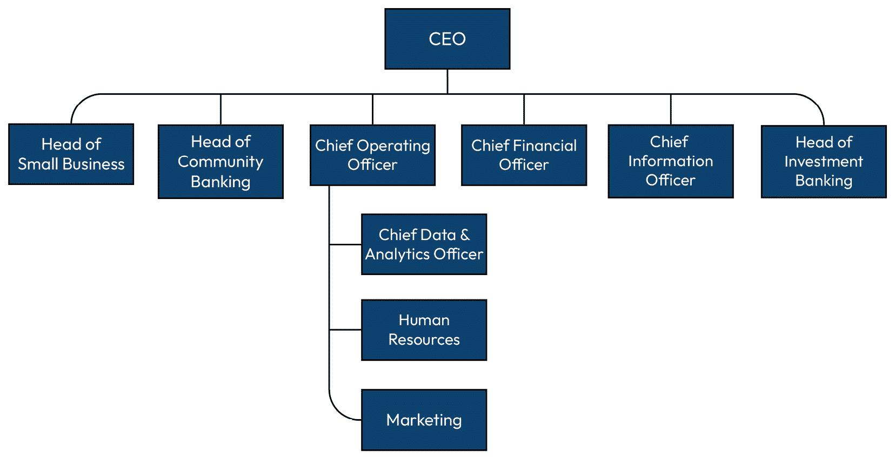
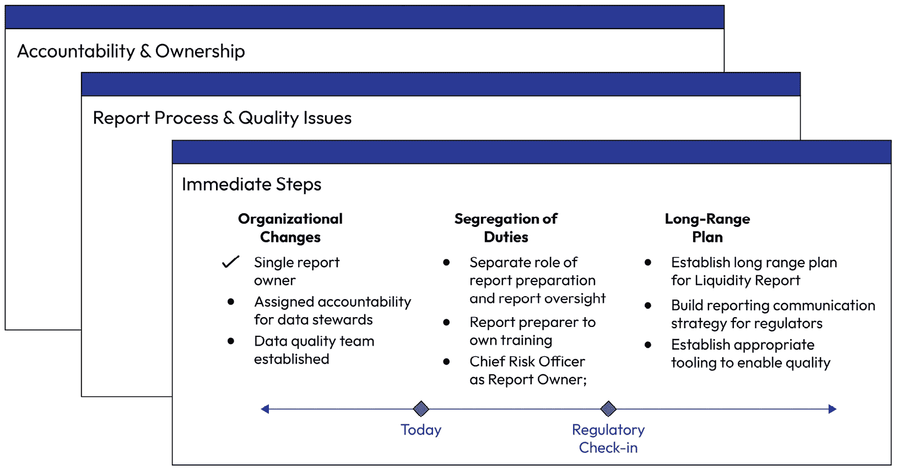

# 17

# 案例研究 - 金融机构

在本章的最后部分，我将带领您走完应用前 16 章中讨论的许多能力和方法的步骤。这个现实世界的案例将准确展示如果我面对类似的场景，我（或者我带领的团队）会怎么做。虽然现实世界中的金融机构与本章案例研究之间有共同之处，但该情况是虚构的。

我们将一起探讨如何将我们所学的内容应用到高度监管的机构中。以本例为例，我们将以银行为例，但类似的原则也可以适用于其他高度监管的实体，如保险公司或医疗机构。我将重点讲解如何识别每个即将到来的场景中的具体要求，以及如何修改上一章中的指导方针，以满足案例的独特需求。

我们将一起探讨三个问题集：

+   如何在监管压力期间识别快速获胜的机会

+   如何向执行团队成员传达长期解决方案和高价值投资

+   如何设计有影响力的迭代交付

# 场景 - 高度监管实体 - 银行业务

过去几年中，金融机构的数据已从一个需要控制的风险转变为认识到数据资产是战略性洞察源，可以在整个企业中加以利用。因此，首席数据与分析官（CDAO）的角色也从专注于数据与分析的防守角度（防止坏事发生）转变为进攻角度（利用数据和洞察力为公司推动附加收入和客户体验）。这一变化使 CDAO 从幕后走向了成为受信任的业务高管。

为了本案例的目的，我们将以*中西部银行*为例。*中西部银行*是一家虚构的公司，服务于美国中部大约 25 个州。它为客户提供包括支票账户、存款账户、退休服务、个人银行业务、抵押贷款及其他贷款产品以及信用卡服务在内的核心金融产品。*中西部银行*还专注于小企业银行业务，优先支持中小企业，并为其提供定制化解决方案。最近，*中西部银行*由于现金处理不当和当前经济环境中的流动性问题，受到了主要监管机构的压力。因此，监管机构将审查重点放在了其流动性报告流程以及银行内的其他数据和报告流程上。

*中西部银行*面临着三个需要立即关注的主要挑战：

+   监管机构和高层管理团队面临着巨大的压力，迫切需要找出如何解决中西部银行存在的问题。他们期待迅速采取行动并取得成果。你需要确定可以迅速采取什么措施来展示良好的进展，并且要快速推进。

+   银行对如何解决各级数据和报告挑战的长期计划尚不明确。许多高层管理人员对数据平台不太熟悉，你需要找出如何以他们能够理解的方式向这些利益相关者传递信息，以支持你和公司需求。

+   最后，你需要交付渐进的成果，因此，你需要一个计划，展示快速胜利和长期的渐进交付。

需要注意的是，你是被聘请来领导这一工作的，而且是该银行历史上首位担任该职务的首席数据与分析官。你加入时，急需快速产生影响，但你的利益相关者对 CDAO 的职责不太了解，你需要花些时间向他们解释你的工作内容，以及你将如何帮助他们应对这一压力重重的局面。

作为这一工作的领导者，以下页面将解释在这种情况下你应该做什么。

# 识别快速胜利

中西部银行聘请你担任首席数据与分析官。你在第一季度中期加入了公司。在经历了一个颠簸的第四季度和年终结算过程后，监管机构发现用于管理组织短期现金头寸的流动性报告存在大量不准确之处。主要监管机构要求对报告的制作进行全面审查，包括所有基础系统和数据流，并对公司进行审查。这个报告对于银行至关重要，因为它比较了短期资产（现金、可转换证券等）和短期负债（存款、短期贷款等）。通过比较这些数值，银行能够确定其履行义务的能力，避免发生流动性危机，使组织陷入资不抵债的境地。

你在第一天与经理坐下来讨论：首席运营官。他们解释道，虽然你作为首席数据与分析官（CDAO）的角色比仅仅解决这个报告的问题要广泛，但这是一个你被要求领导整改的关键问题。

替代方案

你可以选择拒绝这个请求，建议你应该专注于所有关键报告，仅关注长期解决方案。这个选项可能提供一个更具战略性、长远的解决方案；然而，它无法解决眼前迫切的问题：流动性报告的数据治理和报告流程。

你主导这项修复工作的做法并没有得到首席风险官的积极回应，因为他们负责公司的风险管理流程，并且是流动性风险监督过程的负责人，包括报告的制作。你主导这项修复项目，实际上有些越过了 CRO 的职权范围。然而，监管机构认定首席风险官在这种情况下未能正确履行其 CRO 职责，因此 CEO 决定将其排除在修复团队之外。

另一种选择

你可以建议 CRO 保留这项工作，并将其作为同行支持。这种做法如果 CEO 没有特别要求你担任领导角色的话，可能是可行的。很可能有一些你不知道的因素，导致 CRO 被排除在这项修复工作之外。你应该与 CRO 合作，建立关系以便于自己入职，并了解这一情况是如何展开的。然而，通过回避或建议 CRO 接手这项工作，你可能会削弱自己的可信度，特别是在作为新员工的情况下，你的可信度仍在建立中。

图 17.1 – 部分组织结构图，中西部银行

## 初步发现

你首先与 CEO 的直接下属逐一进行会谈，他们被统称为**执行领导团队**（**ELT**）。ELT 举行了一个没有 CRO 参与的闭门会议，讨论如何处理这个问题。你被要求在第二周末的会议上做汇报。因此，你不到两周的时间里，需要尽可能多地了解问题，并制定一个大致的计划来解决问题。

### ELT

你请求与每位 ELT 成员以及他们各自团队中的一些成员会面，收集关于中西部银行失败的相关知识。每个人都愿意会面，包括市场营销团队——他们表示，这一事件对客户情绪造成了巨大打击。你还与主要监管机构的负责人进行了会面，了解他们对银行失败的看法。

另一种选择

你可以在不与执行团队会面的情况下准备一种方法，以消除可能参与导致公司陷入这种局面现有团队成员的偏见。然而，如果你选择不涉及执行团队，你可能会冒着与关键支持者断绝关系的风险，而这些支持者是你作为公司新领导者成功所必需的。其次，你可能会错过建立成功修复计划所需的关键背景信息。

他们都表示，报告目前由风险团队进行整合，但这是一个跨职能的合作。数据从小企业、社区银行和投资部门收集。每个**业务单元**（**BU**）的数据会提交给公司风险部的 Sally 进行整合，并最终由首席风险官向企业风险委员会汇报和展示。由于此次事件，首席风险官最近被安排在首席运营官之下。经过企业风险委员会的审查后，报告会根据要求发布给监管机构。

### 首席风险官

此外，你还要求首席风险官与您见面。经过一番推脱后，首席风险官同意了与你见面。你告诉她，你不是来做任何评判的，而是想了解她知道的对解决问题有帮助的情况。她解释说，她知道流动性报告非常依赖人工处理，且负责报告的团队非常年轻，缺乏对数据质量重要性的培训。由于这个历史原因，她任命了 Sally 来整合来自各个团队的数据，以便“有人来完成这项工作”，但她承认这并不是正确的做法，业务单元中的某个人应该真正负责报告的编制。

替代选项

你可以选择*不*与首席风险官见面。由于她被定位为当前问题的负责人，你可以避免将她卷入整改过程。然而，既然她仍然在职且依然是首席风险官，她仍然有一定的角色要扮演，尽管这个角色比问题出现之前小了很多。你可以选择是否包括她，但这两种选择对你来说都有风险。我认为报告过程的复杂性要求尽可能多的背景信息，包含她是出于一种诚意的行为。

她还提到流动性数据来自不同的业务部门，且责任/可追溯性不明确。当问题被提出时，似乎从未有一个人能承担起解决问题的任务。某些问题在几个月甚至几年中都未得到解决。因此，报告中存在已知的数据问题，这些问题长期存在。

### 报告编制人

你与 Sally 坐下来，她目前担任报告编制人的角色。当你见到她时，她显得明显沮丧，甚至有些焦虑。她知道这份报告“本不该是她的工作”，但由于没有人做这项工作，最后还是落到了她身上。由于多年来业务的人员流动，Sally 对报告的形成过程有很多了解。作为“天然历史学家”，她最终承担了这个角色。Sally 解释了以下情况：

+   她知道报告中存在许多问题，尽管她尽了最大努力，但仍未能找到帮助她解决数据传输问题的人员（其中许多问题被记录在电子表格中）。

+   她经常收到带有错误的文件，这些错误未被解决

+   Sally 把这些知识大部分都记在心里，感激终于有人开始听取她的意见

你表示，尽管非常感激她介入支持公司准备这份关键报告，但你承诺会找到合适的人来负责未来的这个流程，她可以恢复其作为监督的适当角色。你要求 Sally 记录她已知的问题，帮助启动这个流程，她也同意了。

## 关键主题

ELT 提出了一些关键观察结果，并将其纳入了你的即时行动计划，这些观察结果得到了 CRO 的进一步支持：

| 主题 | 观察结果 |
| --- | --- |
| 未能适当分隔职责 | Sally 不应同时准备和审核报告，因为这样会造成前线管理和第二线管理之间的职责分隔问题。这消除了风险管理的监督作用。 |
| 培训差距 | 银行的流动性流程缺乏适当的理解，这归因于缺乏关于如何正确处理数据和报告的重要性培训，包括数据将如何使用。 |
| 沟通障碍 | 如果有人发现数据或报告中存在问题，往往缺乏清晰的指引，说明这些信息应该传递给谁或应该采取什么措施。许多问题未被报告，已知的报告错误依然存在。 |
| 责任和问责 | 不清楚是谁负责报告的制作（与默认执行工作的人员区分开）。也不清楚谁最终对报告负责。 |
| 数据质量 | 与 ELT 讨论时，提出了许多已知的数据质量问题。问题的严重性或不重要性尚不清楚。 |

表格 17.1 – 报告中的关键观察结果

## 快速胜利

根据关键主题，你立即实施了以下变化，并将其纳入了你发送给 ELT 的 2 周报告中：

+   **问责制**：在企业财务部识别了一位报告准备者 Asha，负责将所有部门的数据整合成一份报告。由于财务部门的技能，这立即提升了对关键数据元素的有效控制的理解和重要性。

+   **职责分隔**：将报告准备和报告监督的角色分开，以便对流动性风险报告能力进行适当的第二道防线。这有效地让 Sally 能够审核并提供报告监督，这是她的适当职责。

+   **培训**：指定报告准备者负责培训所有参与报告准备的人员，包括数据管理员、数据治理、风险管理、报告负责人和首席风险官（CRO），使他们了解报告的内容、用途以及在准备报告时遵循适当控制的重要性。这项培训专注于每个人的角色及其重要性，以及如何在发现问题时采取适当措施。

+   **文档化**：报告准备者 Asha 与技术数据管理员合作，记录了数据从源头到报告的流动方式，这提高了对报告中使用的数据复杂性和报告准备流程的可见性。

+   **所有权**：任命首席风险官 Sally 为报告负责人，明确责任归属。

+   **数据质量**：收集了已知的数据和报告问题列表。为 Asha 创建了一个流程，使其能够持续获取并优先处理已知问题。

你带着一份三页的总结展示文档，向 ELT 概述了你发现的情况以及为解决问题所采取的立即措施：

图 17.2 – ELT 的总结材料

# 向高管团队传递长期解决方案的消息

在与公司 ELT 会面后的第 2 周末，你获得了全力支持，继续推进项目的下一个阶段：长期可持续性。你制定了一个针对长期解决方案的攻坚计划，并在初步汇报后 2 周，将以下计划反馈给 ELT：

+   **建立数据和报告治理**：这个具体案例变得至关重要，因为监管机构对这个特定报告提出了关切。然而，ELT 审查的所有关键报告缺乏治理，应该对其进行评估、审查并适当治理。

+   **制定政策**：需要有正式的政策要求，明确如何识别关键报告、推动有效治理所需的各个角色、每个角色的要求，以及存储关键信息的位置。

+   **建立适当的工具**：公司缺乏有效的数据治理工具。至少需要一个数据目录和数据质量工具。

+   **建立数据质量框架**：公司需要指定一名数据质量负责人，负责为企业定义数据质量框架。此人将设置并定义数据质量的要求，协助选择和操作工具，并支持衡量和报告全企业透明的数据质量，直至 ELT。

+   **自动化报告流程**：构建流动性报告的过程突显了在中西部银行（The Bank of the Midwest）生成关键报告时，工作具有较强的手动性质。在可能的情况下，自动化报告流程将加快流程并减少人为错误的风险。此过程需要持续设计和实施。

+   **集中数据平台**：企业内手动干预的程度以及使用电子表格传输数据的情况，造成了一个高强度的人工时间消耗环境，同时也增加了错误的风险。仅为了生成流动性报告，就共享了数百个电子表格；当这种情况推广到所有关键报告时，这一数字急剧增加。从长远来看，需要实施一个集中式数据平台，提供生成关键报告和运营业务所需数据的单一数据源。

你提出了三种推动长期计划的方案，涵盖了不同的速度、人员配备和成本。最终，执行领导团队（ELT）批准了大约 800 万美元的预算，以支持你提出的最快且最具可持续性的计划。该计划包括战略性招聘你计划中列出的关键人员，并立即雇佣承包商以迅速推动进展。首席财务官（CFO）和首席运营官（COO）同意在 ELT 层面共同赞助这项工作，并将共同主持企业数据委员会，以监督此项工作。接下来，你将这些计划提交给监管机构。

# 向监管机构报告

在与 ELT 会面并确保资金到位后，你会见了中西部银行的主要监管机构。在第一次会议中，你阐述了你的角色和立即需要解决流动性报告问题，并推动公司整体数据管理的需求。你使用了与 ELT 会议中相同的材料（在你上任两周后进行的会议及随后的会议）。监管机构特别提到，他赞赏管理层与他及其团队分享的内容的透明度和一致性。

总体而言，监管机构喜欢你与 CFO 和 COO 共同制定的方案和计划。他的唯一反馈是基于他对中西部银行的信任，以及从发现问题到你加入团队之间的时间差。因此，他要求你在计划中加入顾问，以便更快地推动计划的执行，并通过第三方验证你的方案。

你的经理——首席运营官（COO）出席了会议，并支持监管机构的要求，邀请额外的顾问提供对你的计划的外部意见。该额外资金也已获得批准。

# 如何设计具有影响力的迭代交付方案

接下来，你需要实现你的计划。你与企业数据委员会建立了定期的月度会议节奏，持续监督项目的成功，以确保工作的透明度和持续的支持。你将工作分为三个领域：

1.  对流动性报告转型的即时监督

1.  所有相关数据和报告的远程转型

1.  数据管理和分析战略的远程实施

随着你推进这个计划的设计，三个领域中的每一个都在企业数据委员会上得到了更新的时间。你展示了短期更新和长期更新的混合内容。例如，你持续关注的一个领域是数据质量。

在第一次会议中，你展示了数据质量的现状：没有框架、没有负责人，也没有衡量数据质量的工具。你利用顾问收集了流动性报告的数据质量现状，以进一步量化问题：

+   70% 的问题与基础数据质量的差距有关

+   75 人被手动部署用于对每个报告的数据进行对账

+   15 名合同资源用于手动清洗数据

+   8%的记录在多个电子表格中重复

从短期来看，你展示了由项目资助的合同资源如何立即减少这些问题的数量。从长期来看，你展示了通过自动化和实施中央数据库的迭代改进，并能够基于这个初步的数据质量基线来衡量其影响。

你在长期计划的每个领域都采取了非常相似的方法，展示了不仅仅是在里程碑结束时的“胜利”，而是特别利用*第五章*中的信息，量化每个里程碑结果的影响，重点不仅在于交付了什么，还在于为什么这对业务有影响。你可能考虑了以下几点：

+   数据质量的百分比改进（例如，40%）

+   报告生产速度的提升

+   减少手动流程

你的团队为报告开发了一个“可信”指标，作为项目的一部分。这个指标表明了报告的可信度。如果报告是完全记录的，具有源流，并且质量得到了衡量并且在报告所有者定义的可接受阈值内，那么报告将被标记为“认证”。这为执行领导团队提供了信心，表明该报告已经得到首席数据和分析办公室的认可，可以依赖。

此外，监管机构在每次会议后两周也收到了与企业数据委员会相同的材料。监管机构随后有机会提供评论、反馈或提问。随着时间的推移，他们对这种方法建立了信心，最终减少了会议的频率。

# 结果

你能够迅速做出这些变化，是因为问题在 ELT 层级得到了可见性，并且监管推动要求迅速做出改变。你因立即采取行动并在组织中快速产生影响而收获了极大的反馈。这不仅对公司产生了立即的影响，还使你自己确立了作为关键业务领导者的地位。以下是你所取得成就的概述：

+   **3 个月时**：你能够展示报告的端到端流程，拥有对所有关键角色的明确所有权和责任，并且已经发布了草拟的政策供评论和审查。你已开始对所需工具进行供应商评估，并且逐步缩小选择范围。你建立了数据质量框架，利用了咨询资源，并开始与承包商一起实施手动质量检查。

+   **6 个月时**：你能够展示完全批准的政策、关键报告中的范围框架、明确的所有关键报告的所有权和责任、工具实施计划、解决即时问题的方案，并且监管机构已经降低了对“中西部银行”的关注度。

+   **12 个月时**：你的团队已完全投入工作。关键平台和工具的首次版本已经投入生产，且正在进行逐步上线。你已经将数据质量问题的数量减少了超过 50%，并且自动化了 20%的手动流程。流动性报告已成为你们组织的黄金标准，你的团队能够将精力转向其他报告以进行进一步改进。

不要浪费危机。当你获得领导团队的关注时，正如这个案例所展示的，你有机会展示（而不仅仅是讲述）如何以更加可信的方式更好地管理数据。这是如何创造即时价值的绝佳例子，同时也展示了通过长期投资可以做得更好的方面。

# 结论

在审视这个案例中的方法时，结合前面 16 章的内容，我希望能非常清楚地看到，数据治理没有单一的方法。每个公司和每个情况都是独特的。在一家公司的有效方法在另一家同类型的公司中未必能奏效。这就是为什么在这一章中我提供了替代选项，并在全书中展示了我之前成功和失败的例子。最终，任何数据专业人士的职业生涯中都会有成功和失败。对于我来说，最难学到的一课是：今年推荐的方法可能是过去曾推荐过的，但现在有效是因为公司面临着新的挑战或优先事项。因此，有时，仅仅是变化的环境就会让之前被拒绝的建议在现在的环境中奏效。

背景很重要。你愿意花时间建立本章中概述的能力的信任，将决定你的整体数据治理计划的成功。除了基于*第二部分*中的能力或书中提供的具体例子，最好的建议就是：倾听。

你的利益相关者与你讨论数据，因为他们在某种程度上相信，你能够帮助他们。构建有意义、真正能产生影响的解决方案的最佳和最有效方法是倾听你的利益相关者，并共同开发适合他们的解决方案。相反，你能做的最糟糕的事情就是进入一个组织，提出一套不具备独特性的统一建议。从倾听开始，然后一起构建。

产生影响的最佳方式是按照本案例研究中所概述的方法进行。倾听，开始交付小而快速的成果，进行有效的沟通以获得支持，并通过迭代交付以取得影响。最后，确保透明且经常性地衡量并报告你的进展。通过为开放沟通和持续交付奠定基础，你将建立对数据的信任。

我在为你加油！
