# *第一章*：数据分析简介

在我们开始使用 `pandas` 进行数据分析的实践介绍之前，我们需要学习数据分析的基础知识。那些曾经查看过软件库文档的人都知道，如果你不知道自己在找什么，它可能会让人感到压倒性的复杂。因此，掌握不仅是编码方面的技能，还需要掌握分析数据所需的思维方式和工作流程，这将对未来提升我们的技能集非常有帮助。

与科学方法类似，数据科学也有一些常见的工作流程，当我们想进行分析并展示结果时，可以遵循这些流程。这个过程的核心是**统计学**，它为我们提供了描述数据、做出预测以及得出结论的方法。由于不要求具备统计学的先验知识，本章将让我们接触到在本书中将要使用的统计概念，以及可以进一步探索的领域。

在掌握基础知识之后，我们将为本书的剩余部分设置我们的 Python 环境。Python 是一门强大的语言，其用途远远超出了数据科学：例如构建 web 应用程序、软件开发和网页抓取等。为了在项目之间有效地工作，我们需要学习如何创建**虚拟环境**，这样可以将每个项目的依赖关系隔离开来。最后，我们将学习如何使用 Jupyter Notebooks，以便跟随书中的内容进行实践。

本章将涵盖以下主题：

+   数据分析的基础

+   统计基础

+   设置虚拟环境

# 本章材料

本书的所有文件都可以在 GitHub 上找到：[`github.com/stefmolin/Hands-On-Data-Analysis-with-Pandas-2nd-edition`](https://github.com/stefmolin/Hands-On-Data-Analysis-with-Pandas-2nd-edition)。虽然不一定需要 GitHub 账户来完成本书中的内容，但创建一个账户是个好主意，因为它可以作为任何数据/编程项目的作品集。此外，使用 Git 将提供一个版本控制系统，并使协作变得更容易。

提示

阅读这篇文章，了解一些 Git 基础：[`www.freecodecamp.org/news/learn-the-basics-of-git-in-under-10-minutes-da548267cc91/`](https://www.freecodecamp.org/news/learn-the-basics-of-git-in-under-10-minutes-da548267cc91/)。

为了获取文件的本地副本，我们有几个选项（按从最不实用到最实用的顺序排列）：

+   下载 ZIP 文件并在本地解压文件。

+   直接克隆仓库，而不是先 fork。

+   先 fork 仓库然后克隆它。

本书为每一章都提供了练习；因此，建议那些希望将自己的解答与原始内容一起保存在 GitHub 上的读者**fork**仓库并**克隆**fork 后的版本。当我们 fork 一个仓库时，GitHub 会在我们自己的个人资料下创建一个包含原始仓库最新版本的仓库。然后，任何时候我们对自己的版本做出更改，都可以将更改推送回去。请注意，如果我们只是克隆仓库，将无法享受到这一点。

启动此过程的相关按钮在以下截图中已被圈出：


](img/Figure_1.1_B16834.jpg)

图 1.1 – 获取本地代码副本以便跟随

重要提示

克隆过程将把文件复制到当前工作目录中的一个名为`Hands-On-Data-Analysis-with-Pandas-2nd-edition`的文件夹中。为了创建一个文件夹来放置这个仓库，我们可以使用`mkdir my_folder && cd my_folder`。这将创建一个名为`my_folder`的新文件夹（目录），然后将当前目录更改为该文件夹，之后我们就可以克隆仓库。我们可以通过在命令之间添加`&&`来将这两个命令（以及任何数量的命令）连接起来。这可以理解为*然后*（前提是第一个命令成功执行）。

这个仓库为每一章提供了文件夹。本章的材料可以在[`github.com/stefmolin/Hands-On-Data-Analysis-with-Pandas-2nd-edition/tree/master/ch_01`](https://github.com/stefmolin/Hands-On-Data-Analysis-with-Pandas-2nd-edition/tree/master/ch_01)找到。虽然本章大部分内容不涉及编程，但你可以在 GitHub 网站上跟随`introduction_to_data_analysis.ipynb`笔记本，直到我们在本章末尾设置环境为止。设置完成后，我们将使用`check_your_environment.ipynb`笔记本来熟悉 Jupyter 笔记本并运行一些检查，确保一切都为本书的其余部分做好准备。

由于用于生成这些笔记本内容的代码并不是本章的主要内容，因此大部分代码已被分离到`visual_aids`包中，该包用于创建视觉效果以便在本书中解释概念，还有`check_environment.py`文件。如果你选择查看这些文件，不必感到不知所措；本书将涵盖所有与数据科学相关的内容。

每一章都有练习；然而，仅此一章中有一个`exercises.ipynb`笔记本，其中包含生成一些初始数据的代码。完成这些练习需要具备基本的 Python 知识。对于想复习基础的读者，请确保运行本章材料中附带的`python_101.ipynb`笔记本，进行快速入门。对于更正式的介绍，官方的 Python 教程是一个很好的起点：[`docs.python.org/3/tutorial/index.html`](https://docs.python.org/3/tutorial/index.html)。

# 数据分析基础

数据分析是一个高度迭代的过程，包括收集、准备（清洗）、**探索性数据分析**（**EDA**）和得出结论。在分析过程中，我们将频繁回顾这些步骤。下图展示了一个通用的工作流程：

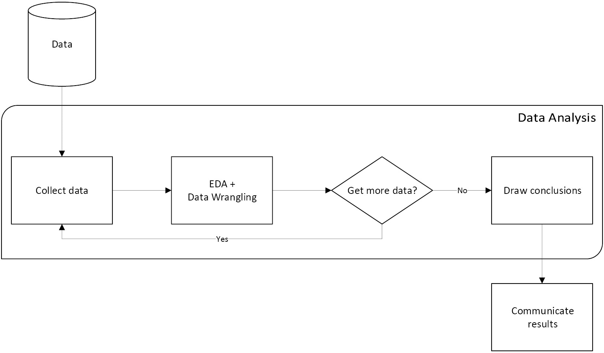

图 1.2 – 数据分析工作流程

在接下来的几节中，我们将概述每个步骤，首先是数据收集。实际上，这个过程通常偏向于数据准备阶段。调查发现，尽管数据科学家最不喜欢数据准备工作，但它占据了他们 80%的工作时间（[`www.forbes.com/sites/gilpress/2016/03/23/data-preparation-most-time-consuming-least-enjoyable-data-science-task-survey-says/`](https://www.forbes.com/sites/gilpress/2016/03/23/data-preparation-most-time-consuming-least-enjoyable-data-science-task-survey-says/)）。这一数据准备步骤正是`pandas`大放异彩的地方。

## 数据收集

数据收集是任何数据分析的自然第一步——我们无法分析没有的数据。实际上，我们的分析可以在我们拥有数据之前就开始。当我们决定想要调查或分析什么时，我们必须考虑可以收集哪些对分析有用的数据。虽然数据可以来自任何地方，但在本书中我们将探讨以下几种数据来源：

+   使用网页抓取从网站的 HTML 中提取数据（通常使用 Python 包，如`selenium`、`requests`、`scrapy`和`beautifulsoup`）

+   `cURL`或`requests` Python 包

+   数据库（可以通过 SQL 或其他数据库查询语言提取数据）

+   提供数据下载的互联网资源，如政府网站或雅虎财经

+   日志文件

    重要说明

    *第二章*，*使用 Pandas DataFrame*，将教会我们如何处理上述数据来源。*第十二章*，*前方的道路*，提供了许多寻找数据源的资源。

我们周围充满了数据，因此可能性是无限的。然而，重要的是要确保我们收集的数据有助于我们得出结论。例如，如果我们试图确定温度较低时热巧克力的销售量是否更高，我们应该收集每天售出的热巧克力数量和当天的温度数据。虽然了解人们为获取热巧克力旅行的距离可能很有趣，但这与我们的分析无关。

在开始分析之前，不要过于担心找到完美的数据。很可能，总会有一些我们想要从初始数据集中添加/删除、重新格式化、与其他数据合并或以某种方式更改的内容。这就是数据清理发挥作用的地方。

## 数据清理

**数据清理**是准备数据并将其转换为可以用于分析的格式的过程。数据的一个不幸现实是，它通常是“脏”的，这意味着在使用之前需要进行清理（准备）。以下是我们可能遇到的一些数据问题：

+   `100`而不是`1000`，或是打字错误。此外，可能会记录多个相同条目的版本，比如`New York City`、`NYC`和`nyc`。

+   **计算机错误**：也许我们有一段时间没有记录条目（缺失数据）。

+   **意外值**：也许记录数据的人决定用问号表示数字列中的缺失值，这样该列中的所有条目就会被当作文本处理，而不是数字值。

+   **信息不完整**：想象一下一个带有可选问题的调查；并不是每个人都会回答这些问题，因此我们会有缺失数据，但这并非由于计算机或人为错误。

+   **分辨率**：数据可能是按秒收集的，而我们需要按小时的数据来进行分析。

+   **领域的相关性**：通常，数据是作为某个过程的产物被收集或生成的，而不是专门为我们的分析而收集。为了将其转化为可用状态，我们需要对其进行清理。

+   **数据的格式**：数据可能以不利于分析的格式记录，这需要我们对其进行重塑。

+   **数据记录过程中的配置错误**：来自配置错误的跟踪器和/或 Web 钩子的数据可能会缺失字段或以错误的顺序传递。

大多数数据质量问题是可以解决的，但有些问题是无法解决的，比如当数据是按天收集的，而我们需要按小时的数据。这时，我们有责任仔细检查我们的数据，处理任何问题，以确保我们的分析不被扭曲。我们将在*第三章*《使用 Pandas 的数据清理》和*第四章*《Pandas 数据框架的聚合》中详细讨论这个过程。

一旦我们对数据进行了初始清理，我们就准备好进行 EDA 了。请注意，在 EDA 过程中，我们可能需要一些额外的数据整理：这两个步骤是高度交织在一起的。

## 探索性数据分析

在 EDA 过程中，我们使用可视化和总结统计来更好地理解数据。由于人脑擅长发现视觉模式，数据可视化对于任何分析都是至关重要的。事实上，某些数据的特征只能在图表中观察到。根据我们的数据，我们可能创建图表来查看感兴趣的变量随时间的变化情况，比较每个类别包含多少观察结果，查找异常值，查看连续和离散变量的分布等等。在*第五章*，*使用 Pandas 和 Matplotlib 可视化数据*，以及*第六章*，*使用 Seaborn 和自定义技术绘图*，我们将学习如何为 EDA 和演示创建这些图表。

重要提示

数据可视化非常强大；不幸的是，它们经常会误导。一个常见问题源于*y*轴的刻度，因为大多数绘图工具默认会放大以展示近距离的模式。软件很难知道每种可能图形的合适轴限制；因此，在展示结果之前，我们的工作是适当调整坐标轴。您可以阅读更多有关图表可能误导的方法，详见[`venngage.com/blog/misleading-graphs/`](https://venngage.com/blog/misleading-graphs/)。

在我们之前看到的工作流程图（*图 1.2*）中，EDA 和数据整理共享一个框。这是因为它们密切相关：

+   在进行 EDA 之前，数据需要准备好。

+   在 EDA 过程中创建的可视化可能表明需要进行额外的数据清理。

+   数据整理使用总结统计来查找潜在的数据问题，而 EDA 则用于理解数据。当我们进行 EDA 时，不正确的清理将扭曲研究结果。此外，需要数据整理技能来跨数据子集获取总结统计。

在计算总结统计时，我们必须牢记我们收集到的数据类型。数据可以是**定量**的（可测量的数量）或**分类**的（描述、分组或类别）。在这些数据类别中，我们有进一步的细分，可以让我们知道可以在其上执行哪些操作。

例如，分类数据可以是 `on = 1` / `off = 0`。请注意，`on` 大于 `off` 的事实是没有意义的，因为我们任意选择这些数字来表示 `on` 和 `off` 的状态。当类别之间有排名时，它们是 `low < medium < high`。

定量数据可以使用**区间尺度**或**比例尺度**。区间尺度包括像温度这样的量。我们可以用摄氏度来测量温度，并比较两个城市的温度，但说一个城市的温度是另一个城市的两倍并没有意义。因此，区间尺度的值可以通过加法/减法进行有意义的比较，但不能通过乘法/除法进行比较。比例尺度则是那些可以通过比率（乘法和除法）进行有意义比较的值。例如，价格、大小和数量都属于比例尺度。

完成 EDA 后，我们可以通过得出结论来决定接下来的步骤。

## 得出结论

在我们收集了分析所需的数据、清理了数据并进行了深入的 EDA（探索性数据分析）之后，就到了得出结论的阶段。这时，我们总结 EDA 中的发现，并决定接下来的步骤：

+   在可视化数据时，我们是否注意到了任何模式或关系？

+   我们是否可以从数据中做出准确的预测？继续对数据进行建模是否有意义？

+   我们是否需要处理缺失的数据点？如何处理？

+   数据的分布情况如何？

+   数据是否能帮助我们回答问题或为我们正在调查的问题提供洞察？

+   我们是否需要收集新的或额外的数据？

如果我们决定对数据进行建模，这将涉及到机器学习和统计学。虽然严格来说，这不属于数据分析范畴，但通常是下一步，我们将在*第九章*，*Python 中的机器学习入门*，和*第十章*，*做出更好的预测——优化模型*中讨论。此外，我们将在*第十一章*，*机器学习异常检测*中看到这个过程在实践中的应用。作为参考，*附录*中的*机器学习工作流*部分提供了一张完整的工作流图，展示了从数据分析到机器学习的全过程。*第七章*，*金融分析——比特币与股市*，和*第八章*，*基于规则的异常检测*，将集中讨论从数据分析中得出结论，而不是构建模型。

下一节将回顾统计学内容；有统计学基础的读者可以跳过并直接阅读*设置虚拟环境*部分。

# 统计学基础

当我们想要对所分析的数据做出观察时，我们常常（如果不是总是的话）以某种方式借助统计学。我们所拥有的数据被称为**样本**，它是从（并且是）**总体**中观察到的一个子集。统计学有两大类：描述性统计和推断性统计。通过**描述性统计**，顾名思义，我们的目的是*描述*样本。**推断性统计**则是利用样本统计量来*推断*或推测有关总体的某些信息，比如潜在的分布情况。

重要提示

样本统计量被用作总体参数的**估计量**，这意味着我们必须量化它们的偏差和方差。对此有多种方法；一些方法会对分布的形状做出假设（参数法），而另一些则不会（非参数法）。这些内容远远超出了本书的范围，但了解它们是有益的。

通常，分析的目标是为数据创造一个故事；不幸的是，统计数据非常容易被误用。这正是某句名言的主题：

"有三种谎言：谎言、可恶的谎言和统计数据。"

— 本杰明·迪斯雷利

这在推断性统计中尤为突出，推断性统计在许多科学研究和论文中用于展示研究者发现的显著性。这是一个更为高级的话题，因为本书并非统计学书籍，我们将仅简要介绍推断性统计背后的一些工具和原理，读者可以进一步深入学习。我们将专注于描述性统计，帮助解释我们正在分析的数据。

## 抽样

在我们尝试进行任何分析之前，有一个重要的事情需要记住：我们的样本必须是**随机样本**，且能够代表总体。这意味着数据必须是无偏采样的（例如，如果我们在询问人们是否喜欢某个体育队，我们不能只问该队的球迷），同时我们应该确保样本中包含（理想情况下）总体中所有不同群体的成员（在体育队的例子中，我们不能只问男性）。

当我们讨论在*第九章*中关于机器学习的内容时，*在 Python 中入门机器学习*，我们需要对数据进行抽样，而数据本身就是一个初步的样本。这称为**重采样**。根据数据的不同，我们需要选择不同的抽样方法。通常，我们最好的选择是**简单随机抽样**：我们使用随机数生成器随机挑选行。当数据中有不同的组时，我们希望我们的样本是**分层随机抽样**，这种方法会保持数据中各组的比例。在某些情况下，我们没有足够的数据来使用上述的抽样策略，因此我们可能会采用有放回的随机抽样（**自助法**）；这称为**自助样本**。请注意，我们的基础样本需要是随机样本，否则我们可能会增加估计量的偏差（如果是便利样本，由于某些行在数据中出现的频率较高，我们可能会更频繁地选择这些行，但在真实的总体中，这些行的出现频率可能没有那么高）。我们将在*第八章*中看到自助法的一个例子，*基于规则的异常检测*。

重要提示

讨论自助法背后的理论及其后果远远超出了本书的范围，但可以通过观看这个视频来了解基本概念：[`www.youtube.com/watch?v=gcPIyeqymOU`](https://www.youtube.com/watch?v=gcPIyeqymOU)。

你可以在[`www.khanacademy.org/math/statistics-probability/designing-studies/sampling-methods-stats/a/sampling-methods-review`](https://www.khanacademy.org/math/statistics-probability/designing-studies/sampling-methods-stats/a/sampling-methods-review)阅读更多关于抽样方法的信息，以及它们的优缺点。

## 描述性统计

我们将从描述性统计的**单变量统计**开始讨论；单变量意味着这些统计量是从一个（**单**）变量计算出来的。本节中的所有内容都可以扩展到整个数据集，但统计量将是按我们记录的每个变量来计算的（意味着如果我们有 100 个速度和距离的配对观测值，我们可以计算整个数据集的平均值，这将给出平均速度和平均距离的统计数据）。

描述性统计用于描述和/或总结我们正在处理的数据。我们可以通过**集中趋势**的度量开始数据的总结，它描述了大多数数据集中在哪个区域，并且通过**离散度**或**分散度**的度量来表示数据值的分布范围。

### 集中趋势的度量

集中趋势的度量描述了我们数据分布的中心位置。有三种常用的统计量作为中心的度量：均值、中位数和众数。每种方法都有其独特的优点，取决于我们处理的数据类型。

#### 均值

也许最常见的用于总结数据的统计量是平均值，或`(0 + 1 + 1 + 2 + 9)/5`：

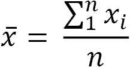

我们用*x*i 来表示变量*X*的第*i*个观察值。注意，变量本身用大写字母表示，而具体的观察值则用小写字母表示。*Σ*（希腊大写字母*Sigma*）用于表示求和，在均值的公式中，它的求和范围从*1*到*n*，其中*n*是观察值的数量。

关于均值，有一点需要注意，那就是它对**异常值**（由与我们分布不同的生成过程产生的值）非常敏感。在前面的例子中，我们只处理了五个数据值；然而，9 远大于其他数字，并把均值拉高了，几乎比除了 9 以外的所有值都要高。在我们怀疑数据中存在异常值时，可能更倾向于使用中位数作为我们的集中趋势度量。

#### 中位数

与均值不同，**中位数**对异常值具有较强的鲁棒性。以美国的收入为例；最高的 1%收入远高于其他人群，这会使均值偏高，从而扭曲对平均收入的认知。然而，中位数能更好地代表平均收入，因为它是我们数据的第 50 百分位数；这意味着 50%的数据值大于中位数，50%的数据值小于中位数。

提示

*i*百分位数是指数据中有*i*%的观察值小于该值，因此 99 百分位数是*X*中的值，表示 99%的*x*小于它。

中位数是通过从一个有序数列中取中间值来计算的；如果数据的个数是偶数，则取中间两个值的平均值。如果我们再次使用数字 0、1、1、2 和 9，那么我们的中位数是 1。请注意，这个数据集的均值和中位数是不同的；然而，取决于数据的分布，它们可能是相同的。

#### 众数

**众数**是数据中最常见的值（如果我们再次使用数字 0、1、1、2 和 9，那么 1 就是众数）。在实践中，我们常常会听到类似“分布是双峰的或多峰的”（与单峰分布相对）的说法，这表示数据的分布有两个或更多的最常见值。这并不一定意味着它们每个出现的次数相同，而是它们比其他值的出现次数显著多。如下面的图所示，单峰分布只有一个众数（位于**0**），双峰分布有两个众数（分别位于**-2**和**3**），而多峰分布有多个众数（分别位于**-2**、**0.4**和**3**）：


图 1.3 – 可视化连续数据的众数

理解众数的概念在描述连续分布时非常有用；然而，在大多数情况下，当我们描述连续数据时，我们会使用均值或中位数作为中心趋势的度量。而在处理分类数据时，我们通常会使用众数。

### 分散度的度量

知道分布的中心在哪里，只是帮助我们部分总结数据分布——我们还需要知道数据如何围绕中心分布，以及它们之间的距离有多远。分散度的度量告诉我们数据的分布情况；这将指示我们的分布是狭窄（低分散）还是宽广（分布很广）。与中心趋势的度量一样，我们有多种方式来描述分布的分散度，选择哪种方式取决于情况和数据。

#### 范围

**范围**是最小值（**最小值**）和最大值（**最大值**）之间的距离。范围的单位与数据的单位相同。因此，除非两个数据分布的单位相同且测量的是相同的事物，否则我们不能比较它们的范围并说一个比另一个更分散：


从范围的定义中，我们可以看出，为什么它并不总是衡量数据分散度的最佳方式。它给出了数据的上下界限；然而，如果数据中存在异常值，范围就会变得没有意义。

另一个关于范围的问题是，它没有告诉我们数据如何在其中心周围分散；它实际上只是告诉我们整个数据集的分散程度。这就引出了方差的问题。

#### 方差

**方差**描述了观察值与其平均值（均值）之间的分散程度。总体方差表示为*σ*²（读作*西格玛平方*），样本方差表示为*s*²。它是通过计算离均值的平均平方距离来得出的。注意，必须对这些距离进行平方，这样均值以下的距离就不会与均值以上的距离相互抵消。

如果我们希望样本方差成为总体方差的无偏估计量，我们需要除以*n - 1*而不是*n*，以弥补使用样本均值而非总体均值的偏差；这就是贝塞尔修正（[`en.wikipedia.org/wiki/Bessel%27s_correction`](https://en.wikipedia.org/wiki/Bessel%27s_correction)）。大多数统计工具默认会给出样本方差，因为获取整个总体的数据是*非常*罕见的：


方差给我们提供了一个带有*平方*单位的统计量。这意味着，如果我们从以美元（$）表示的收入数据开始，那么我们的方差将是以美元平方（$²）为单位的。当我们试图了解数据的分布时，这并不十分有用；我们可以使用**幅度**（大小）本身来查看某个事物的分布情况（大值 = 大范围），但除此之外，我们需要一个单位与数据相同的分布度量。为此，我们使用标准差。

#### 标准差

我们可以使用**标准差**来查看数据点离均值有多远，*平均而言*。小的标准差意味着值接近均值，而大的标准差意味着值分散得更广。这与我们想象的分布曲线有关：标准差越小，曲线的峰值越窄（**0.5**）；标准差越大，曲线的峰值越宽（**2**）：

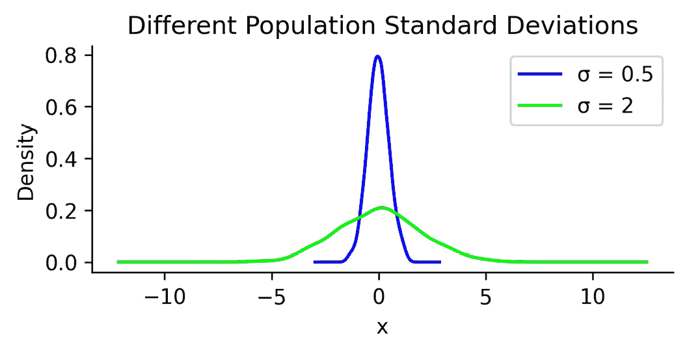

图 1.4 – 使用标准差来量化分布的扩散

标准差仅仅是方差的平方根。通过执行这个操作，我们得到的统计量使用的单位可以让我们再次理解（以收入为例，使用$作为单位）：


请注意，人口标准差用*σ*表示，样本标准差用*s*表示。

#### 变异系数

当我们从方差转到标准差时，我们的目的是得到一个更具意义的单位；然而，如果我们想将一个数据集的分散度与另一个数据集进行比较，我们需要再次使用相同的单位。解决这一问题的一种方法是计算**变异系数**（**CV**），它是无单位的。变异系数是标准差与均值的比值：


我们将在*第七章*《金融分析——比特币与股市》中使用这个指标；由于变异系数是无单位的，我们可以用它来比较不同资产的波动性。

#### 四分位距

到目前为止，除了范围，我们讨论了基于均值的分散度量；现在，我们将探讨如何使用中位数作为集中趋势的度量来描述数据的扩散。如前所述，中位数是第 50 百分位数或第 2**四分位数**（Q2）。百分位数和四分位数都是**分位数**——将数据划分为包含相同比例数据的相等组的值。百分位数将数据分成 100 个部分，而四分位数将其分成四个部分（25%、50%、75%和 100%）。

由于分位数整齐地划分了数据，并且我们知道每个部分中有多少数据，它们是帮助我们量化数据分布的理想选择。一个常见的度量是**四分位距**（**IQR**），即第三四分位数和第一四分位数之间的距离：


IQR 给出了围绕中位数的数据显示的分布*并且*量化了分布中 50%数据的离散度。当检查数据是否存在异常值时，它也很有用，我们将在*第八章*中讨论，“基于规则的异常检测”。此外，IQR 可以用来计算一个无单位的离散度度量，我们接下来会讨论。

#### 四分位数离散系数

就像当我们使用均值作为中心趋向度时会有变异系数一样，当我们使用中位数作为中心度量时，也有**四分位离散系数**。这个统计量也是无单位的，因此可以用来比较不同的数据集。它通过将**半四分位距**（IQR 的一半）除以**中位数**（第一四分位数和第三四分位数之间的中点）来计算：

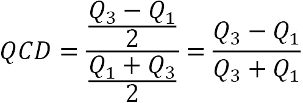

我们将在*第七章*，“金融分析——比特币与股市”中再次看到这个度量，当时我们会评估股票的波动性。现在，让我们看看如何使用中心趋向度和离散度度量来总结数据。

### 总结数据

我们已经看到了许多可以用来通过数据的中心和离散度来总结数据的描述性统计量；实际上，在深入一些其他前述的度量指标之前，查看**5 数概括**并可视化分布被证明是有帮助的第一步。正如其名称所示，5 数概括提供了五个描述性统计量来总结我们的数据：

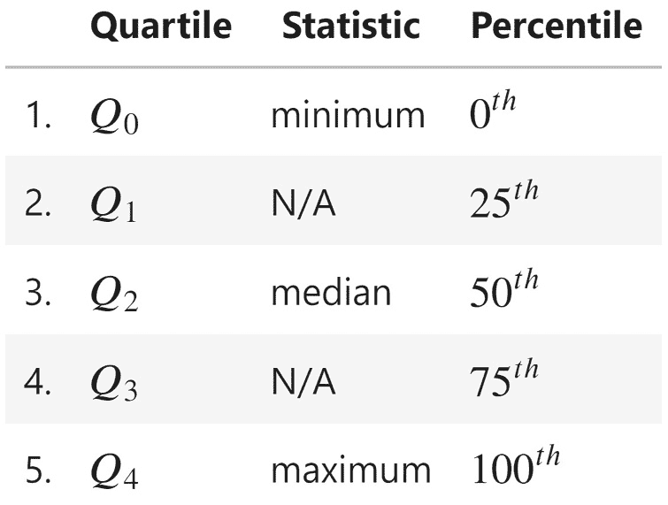

图 1.5 – 5 数概括

**箱型图**（或称箱线图）是 5 数概括的可视化表示。中位数用盒子中的粗线表示。盒子的顶部是 Q3，底部是 Q1。盒子两侧的线（胡须）延伸到最小值和最大值。根据我们绘图工具使用的约定，尽管如此，它们可能只延伸到某个统计量；任何超出这些统计量的值都被标记为异常值（使用点表示）。对于本书而言，胡须的下界为**Q**1 **– 1.5 * IQR**，上界为**Q**3 **+ 1.5 * IQR**，这被称为**Tukey 箱型图**：

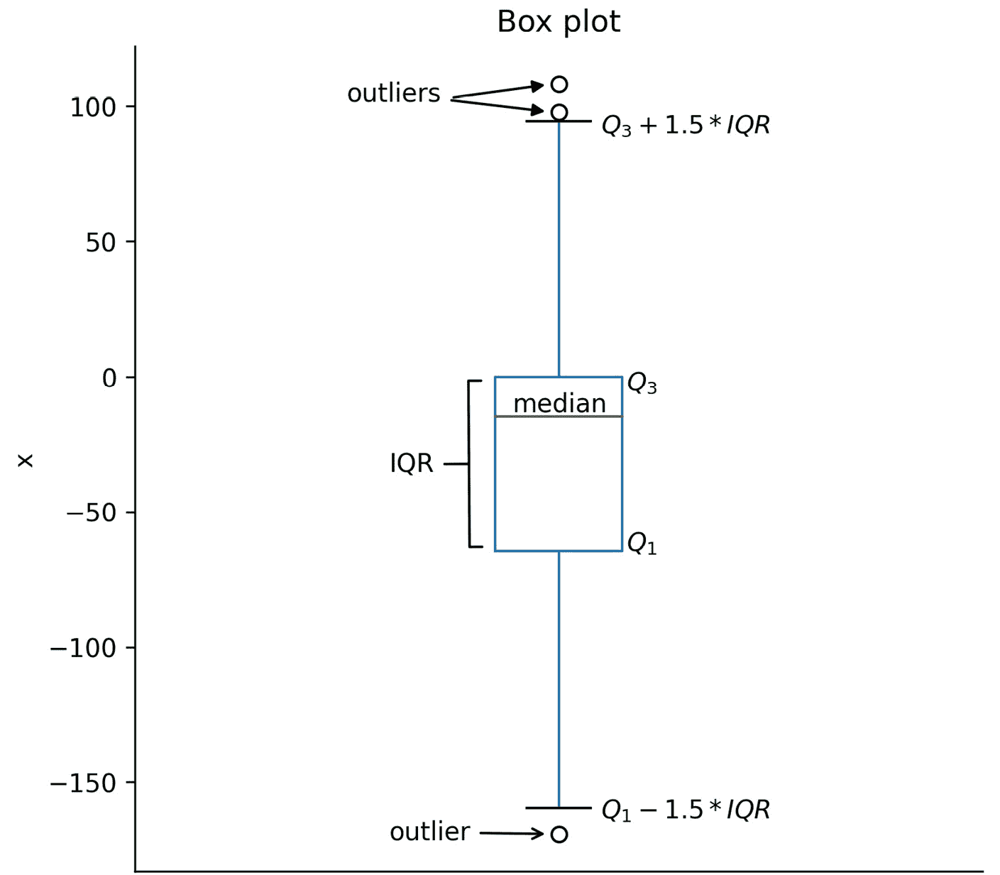

图 1.6 – Tukey 箱型图

虽然箱型图是了解数据分布的一个很好的工具，但它不能显示每个四分位数内部的分布情况。为了这个目的，我们使用**直方图**来处理**离散**变量（例如：人数或书籍数量），使用**核密度估计**（**KDEs**）来处理**连续**变量（例如：身高或时间）。虽然我们可以在离散变量上使用 KDE，但这容易让人产生混淆。直方图适用于离散和连续变量；然而，在这两种情况下，我们必须记住，选择的分箱数量会轻易改变我们看到的分布形状。

制作直方图时，会创建若干个等宽的分箱，并为每个分箱的值添加相应高度的条形。以下图为一个具有 10 个分箱的直方图，展示了与*图 1.6*中生成箱型图的数据相同的三个中心趋势度量：


图 1.7 – 直方图示例

重要提示

实际操作中，我们需要调整分箱数量以找到最佳值。然而，我们必须小心，因为这可能会误导分布的形状。

KDE 类似于直方图，不同之处在于，KDE 不是为数据创建分箱，而是绘制一个平滑的曲线，它是分布**概率密度函数**（**PDF**）的估计。PDF 适用于连续变量，并告诉我们概率在各个值之间的分布。PDF 的值越高，表示对应值的概率越大：


图 1.8 – 带有标记中心位置的 KDE

当分布开始偏斜，且一侧尾部较长时，均值中心度量容易被拉向那一侧。非对称的分布会表现出一定的**偏度**。**左偏（负偏）分布**具有左侧长尾；**右偏（正偏）分布**具有右侧长尾。在负偏的情况下，均值会小于中位数，而在正偏的情况下则相反。当没有偏度时，均值和中位数相等：


图 1.9 – 可视化偏度

重要提示

另一个统计量是**峰度**，它比较分布中心的密度与尾部的密度。偏度和峰度都可以通过 SciPy 包进行计算。

我们数据中的每一列都是一个**随机变量**，因为每次观察时，我们会根据潜在的分布获得一个值——它不是静态的。当我们对获得*X*或更小值的概率感兴趣时，我们使用**累积分布函数**（**CDF**），它是概率密度函数（PDF）的积分（曲线下的面积）：


随机变量*X*小于或等于特定值*x*的概率记作*P(X ≤ x)*。对于连续变量，获得精确值*x*的概率是 0。这是因为该概率将是从*x*到*x*的 PDF 积分（曲线下宽度为零的面积），即为 0：


为了实现可视化，我们可以从样本中估计累积分布函数（CDF），称为**经验累积分布函数**（**ECDF**）。由于这是累积的，在*X*轴上的值等于*x*时，*Y*值表示的是累积概率*P(X ≤ x)*。让我们以**P(X ≤ 50)**，**P(X = 50)**和**P(X > 50)**为例进行可视化：


图 1.10 – 可视化累积分布函数

除了检查数据的分布外，我们可能还需要使用概率分布进行模拟等用途（如在*第八章*中讨论的*基于规则的异常检测）或假设检验（见*推断统计*部分）；让我们来看一些我们可能会遇到的分布。

### 常见分布

尽管有许多概率分布，每个分布都有特定的应用场景，但有一些我们会经常遇到。**高斯分布**或**正态分布**呈钟形曲线，参数化由其均值（*μ*）和标准差（*σ*）。**标准正态分布**（*Z*）的均值为 0，标准差为 1。许多自然现象遵循正态分布，如身高。请注意，测试一个分布是否符合正态分布并非易事——有关更多信息，请参见*进一步阅读*部分。

**泊松分布**是一种离散分布，通常用来模拟到达事件。到达之间的时间可以通过**指数分布**来建模。两者都由它们的均值λ（*λ*）定义。**均匀分布**在其区间内对每个值赋予相同的概率。我们经常使用它来生成随机数。当我们生成一个随机数以模拟一次成功/失败的结果时，这叫做**伯努利试验**。它通过成功概率（*p*）进行参数化。当我们多次进行同样的实验（*n*）时，总成功次数便是一个**二项式**随机变量。伯努利分布和二项式分布都是离散的。

我们可以可视化离散和连续分布；然而，离散分布给我们提供了一个**概率质量函数**（**PMF**）而不是概率密度函数（PDF）：

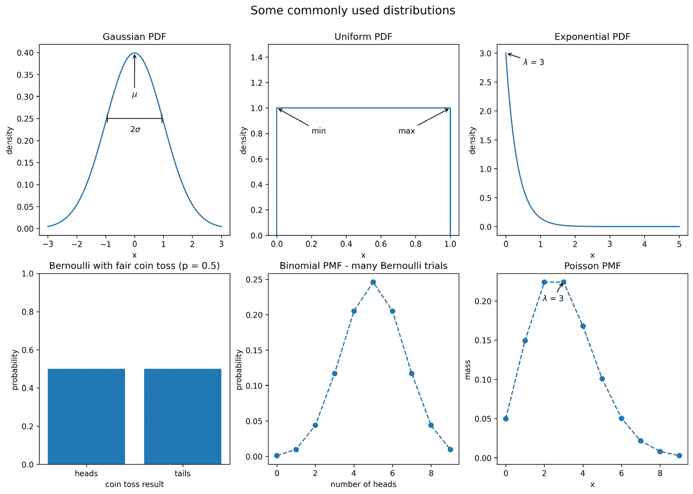

图 1.11 – 可视化一些常用的分布

我们将在*第八章*，*基于规则的异常检测*中使用这些分布，当我们模拟一些登录尝试数据以进行异常检测时。

### 缩放数据

为了比较来自不同分布的变量，我们必须对数据进行**缩放**，我们可以通过使用**最小-最大缩放**来实现。我们取*每个*数据点，减去数据集的最小值，然后除以范围。这将**标准化**我们的数据（将其缩放到[0, 1]的范围内）：


这不是缩放数据的唯一方式；我们还可以使用均值和标准差。在这种情况下，我们将从每个观察值中减去均值，然后除以标准差来**标准化**数据。这给出了我们所知道的**Z-分数**：


我们得到了一个均值为 0 且标准差（和方差）为 1 的标准化分布。Z-分数告诉我们每个观察结果与均值相差了多少个标准差；均值的 Z-分数为 0，而一个比均值低 0.5 个标准差的观察结果的 Z-分数为-0.5。

当然，还有其他方式来缩放我们的数据，我们最终选择的方式将取决于我们的数据及其用途。通过牢记中心趋势和离散度的测量，您将能够确定如何在遇到的任何其他方法中进行数据缩放。

### 量化变量之间的关系

在前面的章节中，我们处理的是单变量统计，并且只能对我们关注的变量做出某些描述。通过多变量统计，我们试图量化变量之间的关系，并尝试预测未来的行为。

**协方差**是一种用于量化变量之间关系的统计量，它显示一个变量随着另一个变量的变化（也称为它们的联合方差）：


重要提示

*E[X]* 对于我们来说是一个新的符号。它被读作*X 的期望值*或*X 的期望*，通过将*X*的所有可能值乘以它们的概率相加来计算——它是*X*的长期平均值。

协方差的大小不容易解释，但它的符号告诉我们变量是正相关还是负相关。然而，我们也希望量化变量之间关系的*强度*，这就引出了相关性。**相关性**告诉我们变量如何在方向（相同或相反）和大小（关系的强度）上共同变化。为了找到相关性，我们通过将协方差除以变量标准差的乘积来计算**皮尔逊相关系数**，其符号为*ρ*（希腊字母*rho*）：


这使得协方差标准化，并产生一个介于-1 和 1 之间的统计量，便于描述相关性的方向（符号）和强度（大小）。相关系数为 1 被称为完美正相关（线性相关），-1 则为完美负相关。接近 0 的值表示没有相关性。如果相关系数接近 1 的绝对值，那么变量被认为是强相关的；而接近 0.5 的相关系数则表示变量间的相关性较弱。

让我们通过散点图来看一些例子。在*图 1.12*的最左边的子图（**ρ = 0.11**）中，我们看到变量之间没有相关性：它们看起来像是没有模式的随机噪声。下一个图（**ρ = -0.52**）有弱的负相关性：我们可以看到，随着*x*变量的增加，*y*变量下降，尽管仍有一些随机性。第三个图（**ρ = 0.87**）有强的正相关性：*x*和*y*一起增加。最右边的图（**ρ = -0.99**）有接近完美的负相关性：随着*x*的增加，*y*减少。我们还可以看到点如何形成一条直线：


图 1.12 – 比较相关系数

为了快速估计两个变量之间关系的强度和方向（并判断是否存在关系），我们通常会使用散点图，而不是计算精确的相关系数。这是因为以下几个原因：

+   在可视化中寻找模式更容易，但通过查看数字和表格得出相同的结论则需要更多的工作。

+   我们可能会看到变量之间似乎有关联，但它们可能不是*线性*相关的。查看视觉表现可以很容易地判断我们的数据是否实际上是二次的、指数的、对数的或其他非线性函数。

以下两个图都显示了强正相关的数据，但通过观察散点图，显然这些数据并不是线性的。左边的是对数型的，而右边的是指数型的：


图 1.13 – 相关系数可能会误导人

很重要的一点是，尽管我们可能发现*X*和*Y*之间存在相关性，但这并不意味着*X 导致 Y*，或者*Y 导致 X*。可能存在某个*Z*实际上同时引起了这两者；也许*X*导致某个中介事件，从而导致*Y*，或者这其实只是巧合。请记住，我们往往没有足够的信息来报告因果关系——*相关性并不意味着因果关系*。

提示

一定要查看 Tyler Vigen 的*虚假相关性*博客([`www.tylervigen.com/spurious-correlations`](https://www.tylervigen.com/spurious-correlations))，里面有一些有趣的相关性。

### 总结统计量的陷阱

有一个非常有趣的数据集，展示了当我们仅使用总结统计量和相关系数来描述数据时，我们必须多么小心。它还向我们展示了绘图并非可选项。**安斯科姆四重奏**是一个包含四个不同数据集的集合，它们具有相同的总结统计量和相关系数，但当被绘制出来时，很明显它们并不相似：


图 1.14 – 总结统计量可能会误导人

请注意，*图 1.14* 中的每个图都具有相同的最佳拟合线，其方程为**y = 0.50x + 3.00**。在下一节中，我们将高层次地讨论这个直线是如何创建的，以及它代表了什么意义。

重要提示

总结统计量在我们了解数据时非常有帮助，但要小心仅仅依赖它们。记住，统计数据可能会误导人；在得出任何结论或继续分析之前，务必先绘制数据图表。你可以在[`en.wikipedia.org/wiki/Anscombe%27s_quartet`](https://en.wikipedia.org/wiki/Anscombe%27s_quartet)了解更多关于安斯科姆四重奏的内容。此外，也要查看**Datasaurus Dozen**，这是 13 个数据集，它们具有相同的总结统计量，访问地址为[`www.autodeskresearch.com/publications/samestats`](https://www.autodeskresearch.com/publications/samestats)。

## 预测与预报

假设我们最喜欢的冰淇淋店请求我们帮助预测他们在某一天能卖出多少冰淇淋。他们相信外面的温度对他们的销售有很大的影响，因此他们收集了在不同温度下售出冰淇淋的数量。我们同意帮助他们，第一步就是绘制他们收集的数据的散点图：


图 1.15 – 不同温度下冰淇淋销售的观察结果

我们可以在散点图中观察到一个上升趋势：在较高温度下，卖出的冰激凌更多。然而，为了帮助冰激凌店，我们需要找到一种方法来从这些数据中做出预测。我们可以使用一种叫做**回归分析**的技术，通过一个方程来描述温度和冰激凌销售量之间的关系。通过这个方程，我们将能够**预测**在某一温度下的冰激凌销售量。

重要说明

请记住，相关性并不意味着因果关系。人们可能会在气温升高时购买冰激凌，但气温升高并不一定导致人们购买冰激凌。

在*第九章*《Python 中的机器学习入门》中，我们将深入讨论回归分析，因此本讨论将仅为概述。回归有许多种类型，会产生不同的方程，例如线性回归（我们将在这个例子中使用）和逻辑回归。我们的第一步是确定**因变量**，即我们想要预测的量（冰激凌销售量），以及我们将用来预测它的变量，这些被称为**自变量**。虽然我们可以有许多自变量，但我们的冰激凌销售例子只有一个自变量：温度。因此，我们将使用简单线性回归将温度和销售量之间的关系建模为一条直线：


图 1.16 – 拟合冰激凌销售数据的直线

上一个散点图中的回归线得出了以下关系方程：


假设今天温度是 35°C——我们将把这个值代入方程中的*温度*。结果预测冰激凌店将销售 24.54 个冰激凌。这个预测值位于前图中的红线旁边。注意，冰激凌店实际上不能卖部分冰激凌。

在将模型交给冰激凌店之前，重要的是要讨论我们得到的回归线中的虚线和实线部分之间的区别。当我们使用回归线的实线部分进行预测时，我们正在使用**插值**，这意味着我们将预测回归所建立时的温度下的冰激凌销售量。另一方面，如果我们试图预测在 45°C 时会卖出多少个冰激凌，这就是**外推**（虚线部分），因为在我们进行回归时并没有包括这么高的温度。外推可能非常危险，因为许多趋势并不会无限延续。人们可能会决定由于温度过高而不外出，这意味着他们将不会销售预测的 39.54 个冰激凌，而是会销售零个。

在处理时间序列时，我们的术语略有不同：我们通常会根据过去的值来**预测**未来的值。预测是时间序列的一种预测类型。然而，在尝试对时间序列建模之前，我们通常会使用一个叫做**时间序列分解**的过程，将时间序列分解成多个组成部分，这些组成部分可以以加法或乘法的方式组合，并可作为模型的组成部分。

**趋势**组件描述了时间序列在**长期**内的行为，而不考虑季节性或周期性效应。通过趋势，我们可以对时间序列的长期变化做出广泛的判断，比如*地球人口在增加*或*某只股票的价值停滞不前*。**季节性**组件解释了时间序列中与季节相关的系统性变化。例如，纽约市街头的冰淇淋车在夏季数量较多，冬季则几乎消失；这种模式每年都会重复，不管每年夏天的实际数量是否相同。最后，**周期性**组件解释了时间序列中其他无法用季节性或趋势解释的异常或不规则波动；例如，飓风可能会导致冰淇淋车数量在**短期内**减少，因为在户外不安全。由于周期性成分的不可预测性，这一部分很难通过预测来预见。

我们可以使用 Python 来**分解**时间序列为趋势、季节性和**噪声**或**残差**。周期性成分被包含在噪声中（随机且不可预测的数据）；在我们去除时间序列中的趋势和季节性后，剩下的就是残差：

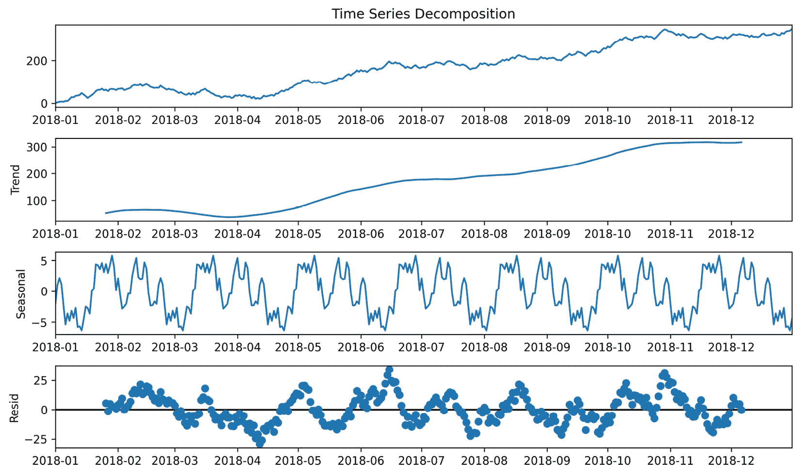

图 1.17 – 时间序列分解的示例

在构建时间序列预测模型时，一些常见的方法包括指数平滑法和 ARIMA 模型。**ARIMA**代表**自回归**（**AR**）、**差分**（**I**）、**移动平均**（**MA**）。**自回归**模型利用了一个观察值在时间*t*时与先前某个观察值之间的*相关性*，例如时间*t - 1*时的观察值。在*第五章*，《使用 Pandas 和 Matplotlib 可视化数据》中，我们将探讨一些技术来判断一个时间序列是否具有自回归性；需要注意的是，并不是所有的时间序列都有自回归性。**差分**部分涉及**差分数据**，即数据从一个时间点到另一个时间点的*变化*。例如，如果我们关心的是**滞后**（时间间隔）为 1 的情况，那么差分数据就是时间*t*的值减去时间*t - 1*的值。最后，**移动平均**部分使用滑动窗口计算最后*x*个观察值的平均值，其中*x*是滑动窗口的长度。例如，如果我们有一个 3 期的移动平均，那么当我们获得所有的数据直到时间 5 时，我们的移动平均计算只会使用时间 3、4 和 5 来预测时间 6 的值。在*第七章*，《金融分析——比特币与股市》中，我们将构建一个 ARIMA 模型。

移动平均给过去的每一个时间段赋予相等的权重。在实际操作中，这并不总是对我们的数据一个现实的期望。有时候，*所有*过去的数值都很重要，但它们对未来数据点的影响*不同*。对于这些情况，我们可以使用**指数平滑法**，它使我们能够对最近的数值赋予更多权重，对更远的数值赋予较少的权重，从而预测未来的数据。

请注意，我们不仅限于预测数字；事实上，根据数据的不同，我们的预测也可以是类别性的——例如预测某种口味的冰淇淋在某一天销售量最多，或者判断一封邮件是否为垃圾邮件。这类预测将在*第九章*，《Python 机器学习入门》中介绍。

## 推断统计学

如前所述，推断统计学处理的是从我们拥有的样本数据中推断或推导出关于总体的结论。在我们得出结论时，必须注意我们是进行的观察性研究还是实验。对于**观察性研究**，独立变量不受研究者控制，因此我们是*观察*参与研究的人（比如吸烟研究——我们不能强迫人们吸烟）。我们不能控制独立变量意味着我们*不能*得出因果关系的结论。

通过**实验**，我们能够直接影响自变量，并将受试者随机分配到对照组和实验组，例如 A/B 测试（适用于网站重设计到广告文案等各种场景）。请注意，对照组不接受治疗；他们可能会接受安慰剂（具体取决于研究的内容）。这种设置的理想方式是**双盲**，即负责施治的研究人员不知道哪个治疗是安慰剂，也不知道哪个受试者属于哪个组别。

重要提示

我们经常会看到贝叶斯推断和频率推断的相关内容。这两者基于两种不同的概率处理方式。频率学派统计学侧重于事件发生的频率，而贝叶斯统计学则在确定事件概率时使用信念的程度。在*第十一章*，*机器学习中的异常检测*中，我们会看到贝叶斯统计学的一个例子。你可以在[`www.probabilisticworld.com/frequentist-bayesian-approaches-inferential-statistics/`](https://www.probabilisticworld.com/frequentist-bayesian-approaches-inferential-statistics/)了解更多关于这两种方法的差异。

推论统计学为我们提供了将样本数据的理解转化为对总体的推断的工具。记住，我们之前讨论的样本统计量是总体参数的估计量。我们的估计量需要**置信区间**，它提供一个点估计以及围绕点估计的误差范围。这是一个范围，表示真实的总体参数在某个**置信水平**下的可能取值范围。在 95%的置信水平下，95%从总体中随机抽取的样本计算出的置信区间包含真实的总体参数。通常，统计学中会选择 95%作为置信水平，虽然 90%和 99%也很常见；置信水平越高，区间越宽。

假设检验允许我们测试真实总体参数是否小于、大于或不等于某个值在某个**显著性水平**（称为**α**）下。执行假设检验的过程始于陈述我们的初始假设或**零假设**：例如，*真实总体均值为 0*。我们选择一个统计显著性水平，通常为 5%，这是在零假设为真时拒绝零假设的概率。然后，我们计算测试统计量的临界值，这将取决于我们拥有的数据量以及我们正在测试的统计量类型（例如一个总体的平均值或候选人得票比例）。将临界值与来自我们数据的测试统计量进行比较，并根据结果，我们要么拒绝要么不拒绝零假设。假设检验与置信区间密切相关。显著性水平相当于 1 减去置信水平。这意味着如果零假设值不在置信区间内，则结果在统计上是显著的。

重要提示

在选择计算置信区间的方法或假设检验的适当检验统计量时，我们必须注意许多事项。这超出了本书的范围，请参阅本章末尾的*Further reading*部分的链接获取更多信息。此外，请务必查看一些假设检验中使用的 p 值的失误，例如 p-hacking，详见[`en.wikipedia.org/wiki/Misuse_of_p-values`](https://en.wikipedia.org/wiki/Misuse_of_p-values)。

现在我们已经概述了统计学和数据分析，准备开始本书的 Python 部分。让我们从设置虚拟环境开始。

# 设置虚拟环境

本书使用 Python 3.7.3 编写，但代码应适用于所有主要操作系统上的 Python 3.7.1+。在本节中，我们将讲解如何设置虚拟环境，以便跟随本书的内容。如果您的计算机尚未安装 Python，请首先阅读有关虚拟环境的以下部分，然后决定是否安装 Anaconda，因为它也会安装 Python。要安装不带 Anaconda 的 Python，请从[`www.python.org/downloads/`](https://www.python.org/downloads/)下载，并按照*venv*部分而不是*conda*部分操作。

重要提示

要检查 Python 是否已安装，请在 Windows 命令行上运行`where python3`或在 Linux/macOS 上运行`which python3`。如果返回结果为空，请尝试仅使用`python`（而不是`python3`）运行。如果已安装 Python，请通过运行`python3 --version`来检查版本。请注意，如果`python3`可用，则应在整本书中使用它（反之亦然，如果`python3`不可用，则使用`python`）。

## 虚拟环境

大多数情况下，当我们想在电脑上安装软件时，我们只需下载它，但编程语言的特性要求包不断更新并依赖于其他特定版本，这可能会导致一些问题。比如，我们有一天在做一个项目时需要一个特定版本的 Python 包（比如 0.9.1），但第二天我们在做另一个分析时需要同一个包的最新版本（比如 1.1.0），以便访问一些更新的功能。听起来好像不会有什么问题，对吧？但是，如果这个更新导致了第一个项目或我们项目中依赖该包的其他包出现了兼容性问题怎么办呢？这是一个足够常见的问题，已经有了解决方案来防止这种情况：虚拟环境。

**虚拟环境**允许我们为每个项目创建独立的环境。每个环境只会安装它所需的包。这样可以方便地与他人共享我们的环境，安装多个版本的相同包用于不同的项目而不相互干扰，并避免安装更新包或有其他依赖关系的包时带来的意外副作用。为我们工作的任何项目创建一个专用的虚拟环境是一个好习惯。

我们将讨论两种常见的设置方式，你可以决定哪种最适合。注意，本节中的所有代码将在命令行中执行。

### venv

Python 3 自带`venv`模块，它将根据我们选择的路径创建一个虚拟环境。设置和使用开发环境的过程如下（安装了 Python 之后）：

1.  为项目创建一个文件夹。

1.  使用`venv`在此文件夹中创建环境。

1.  激活环境。

1.  使用`pip`在环境中安装 Python 包。

1.  完成后停用环境。

实际上，我们将为每个项目创建独立的环境，因此我们的第一步是为所有项目文件创建一个目录。我们可以使用`mkdir`命令来完成这项工作。创建完成后，我们将使用`cd`命令切换到新创建的目录。由于我们已经获得了项目文件（从*章节材料*部分获得的指示），以下内容仅供参考。要创建一个新目录并进入该目录，我们可以使用以下命令：

```py
$ mkdir my_project && cd my_project
```

提示

`cd <path>`将当前目录更改为`<path>`指定的路径，路径可以是**绝对路径**（完整路径）或**相对路径**（从当前目录到目标目录的路径）。

在继续之前，使用`cd`命令导航到包含本书仓库的目录。注意，路径将取决于它被克隆/下载的位置：

```py
$ cd path/to/Hands-On-Data-Analysis-with-Pandas-2nd-edition
```

由于操作系统之间在剩余步骤上有所不同，我们将分别讲解 Windows 和 Linux/macOS。请注意，如果你的系统同时安装了 Python 2 和 Python 3，确保在以下命令中使用`python3`，而不是`python`。

#### Windows

为了创建本书的虚拟环境，我们将使用标准库中的`venv`模块。请注意，我们必须为环境提供一个名称（`book_env`）。记住，如果你的 Windows 设置将`python`与 Python 3 相关联，那么在以下命令中使用`python`而不是`python3`：

```py
C:\...> python3 -m venv book_env
```

现在，我们在之前克隆/下载的仓库文件夹中，有一个名为`book_env`的虚拟环境文件夹。为了使用该环境，我们需要激活它：

```py
C:\...> %cd%\book_env\Scripts\activate.bat
```

提示

Windows 用当前目录的路径替换`%cd%`，这使我们不必输入完整的路径直到`book_env`部分。

请注意，在我们激活虚拟环境后，可以在命令行提示符前看到`(book_env)`，这表明我们已经进入该环境：

```py
(book_env) C:\...> 
```

当我们使用完环境后，只需将其停用：

```py
(book_env) C:\...> deactivate
```

在环境中安装的任何软件包在环境外部是不存在的。请注意，我们在命令行提示符前不再看到`(book_env)`。你可以在 Python 文档中阅读更多关于`venv`的信息：[`docs.python.org/3/library/venv.html`](https://docs.python.org/3/library/venv.html)。

虚拟环境创建完成后，激活它，然后转到*安装所需的 Python 包*部分进行下一步操作。

#### Linux/macOS

为了创建本书的虚拟环境，我们将使用标准库中的`venv`模块。请注意，我们必须为环境提供一个名称（`book_env`）：

```py
$ python3 -m venv book_env
```

现在，我们在之前克隆/下载的仓库文件夹中，有一个名为`book_env`的虚拟环境文件夹。为了使用该环境，我们需要激活它：

```py
$ source book_env/bin/activate
```

请注意，在我们激活虚拟环境后，可以在命令行提示符前看到`(book_env)`，这表明我们已经进入该环境：

```py
(book_env) $
```

当我们使用完环境后，只需将其停用：

```py
(book_env) $ deactivate
```

在环境中安装的任何软件包在环境外部是不存在的。请注意，我们在命令行提示符前不再看到`(book_env)`。你可以在 Python 文档中阅读更多关于`venv`的信息：[`docs.python.org/3/library/venv.html`](https://docs.python.org/3/library/venv.html)。

虚拟环境创建完成后，激活它，然后转到*安装所需的 Python 包*部分进行下一步操作。

### conda

Anaconda 提供了一种专门为数据科学设置 Python 环境的方法。它包含了本书中将使用的一些包，以及一些可能对本书未涉及的任务有用的其他包（同时也解决了可能难以安装的 Python 外部依赖问题）。Anaconda 使用`conda`作为环境和包管理器，而不是`pip`，尽管仍然可以使用`pip`安装包（前提是使用 Anaconda 自带的`pip`）。需要注意的是，有些包可能无法通过`conda`获得，在这种情况下，我们需要使用`pip`。可以查阅`conda`文档中的这个页面，比较`conda`、`pip`和`venv`的命令：[`conda.io/projects/conda/en/latest/commands.html#conda-vs-pip-vs-virtualenv-commands`](https://conda.io/projects/conda/en/latest/commands.html#conda-vs-pip-vs-virtualenv-commands)。

重要提示

请注意，Anaconda 的安装非常大（尽管 Miniconda 版本要轻得多）。那些用于数据科学以外目的的 Python 用户，可能更倾向于使用我们之前讨论的`venv`方法，以便更好地控制安装内容。

Anaconda 还可以与 Spyder 的`venv`选项一起打包使用。

你可以在 Anaconda 的官方文档中阅读更多关于 Anaconda 及其安装的内容：

+   **Windows**：[`docs.anaconda.com/anaconda/install/windows/`](https://docs.anaconda.com/anaconda/install/windows/)

+   **macOS**：[`docs.anaconda.com/anaconda/install/mac-os/`](https://docs.anaconda.com/anaconda/install/mac-os/)

+   **Linux**：[`docs.anaconda.com/anaconda/install/linux/`](https://docs.anaconda.com/anaconda/install/linux/)

+   **用户指南**：[`docs.anaconda.com/anaconda/user-guide/`](https://docs.anaconda.com/anaconda/user-guide/)

一旦安装了 Anaconda 或 Miniconda，确认是否正确安装，可以通过在命令行运行`conda -V`来显示版本。请注意，在 Windows 上，所有`conda`命令必须在**Anaconda Prompt**中运行（而不是**Command Prompt**）。

为本书创建一个新的`conda`环境，命名为`book_env`，可以运行以下命令：

```py
(base) $ conda create --name book_env
```

运行`conda env list`将显示系统上的所有`conda`环境，其中现在包括`book_env`。当前活动的环境将有一个星号（`*`）标记—默认情况下，`base`环境将处于活动状态，直到我们激活另一个环境：

```py
(base) $ conda env list
# conda environments:
#
base                  *  /miniconda3
book_env                 /miniconda3/envs/book_env
```

要激活`book_env`环境，我们运行以下命令：

```py
(base) $ conda activate book_env
```

请注意，在我们激活虚拟环境后，可以在命令行提示符前看到`(book_env)`；这表明我们已经进入该环境：

```py
(book_env) $
```

使用完环境后，我们可以停用它：

```py
(book_env) $ conda deactivate
```

在环境中安装的任何包都只存在于该环境中。请注意，我们的命令行提示符前不再有`(book_env)`。你可以在[`www.freecodecamp.org/news/why-you-need-python-environments-and-how-to-manage-them-with-conda-85f155f4353c/`](https://www.freecodecamp.org/news/why-you-need-python-environments-and-how-to-manage-them-with-conda-85f155f4353c/)阅读更多关于如何使用`conda`管理虚拟环境的内容。

在下一节中，我们将安装跟随本书所需的 Python 包，因此请现在确保激活虚拟环境。

## 安装所需的 Python 包

我们可以利用 Python 标准库做很多事情；然而，我们经常会发现需要安装并使用外部包来扩展功能。仓库中的`requirements.txt`文件包含了我们需要安装的所有包，以便跟随本书进行学习。该文件会位于当前目录中，也可以通过[`github.com/stefmolin/Hands-On-Data-Analysis-with-Pandas-2nd-edition/blob/master/requirements.txt`](https://github.com/stefmolin/Hands-On-Data-Analysis-with-Pandas-2nd-edition/blob/master/requirements.txt)找到。我们可以通过在调用`pip3 install`时使用`-r`标志，一次性安装多个包，这种方式的优势是方便共享。

在安装任何东西之前，请确保激活你用`venv`或`conda`创建的虚拟环境。请注意，如果在运行以下命令之前没有激活虚拟环境，包将会安装到虚拟环境外部：

```py
(book_env) $ pip3 install -r requirements.txt
```

提示

如果你遇到任何问题，可以在[`github.com/stefmolin/Hands-On-Data-Analysis-with-Pandas-2nd-edition/issues`](https://github.com/stefmolin/Hands-On-Data-Analysis-with-Pandas-2nd-edition/issues)上报告。

## 为什么选择 pandas？

在 Python 数据科学领域，`pandas`库几乎是无处不在的。它建立在 NumPy 库之上，允许我们对单一类型数据的数组进行高效的数学运算。Pandas 将这一点扩展到了**数据框（dataframes）**，可以将其视为数据表。我们将在*第二章*，《使用 Pandas 数据框》一章中正式介绍数据框。

除了高效的运算外，`pandas`还提供了`matplotlib`绘图库，使得我们无需编写大量`matplotlib`代码就能轻松创建各种图表。我们始终可以通过`matplotlib`调整图表，但对于快速可视化数据，我们只需要在`pandas`中写一行代码即可。我们将在*第五章*，《使用 Pandas 和 Matplotlib 可视化数据》一章，以及*第六章*，《使用 Seaborn 绘图和定制技巧》一章中进一步探索这一功能。

重要说明

封装函数是围绕另一个库的代码而编写的，它们隐藏了一些复杂性，并为重复该功能留下了更简单的接口。这是面向对象编程（**OOP**）的核心原则之一，称为**抽象**，它减少了代码的复杂性和重复。本书中我们将创建自己的封装函数。

除了`pandas`，这本书还使用了 Jupyter Notebooks。虽然你可以选择不使用它们，但熟悉 Jupyter Notebooks 非常重要，因为它们在数据领域非常常见。作为介绍，我们将在下一节使用 Jupyter Notebook 验证我们的设置。

## Jupyter Notebooks

本书的每一章都包含用于跟随的 Jupyter Notebooks。Jupyter Notebooks 在 Python 数据科学中无处不在，因为它们使得在探索环境中编写和测试代码变得非常简单。我们可以逐块执行代码，并将生成的结果直接打印到笔记本中相应的代码下方。此外，我们可以使用**Markdown**为我们的工作添加文本说明。Jupyter Notebooks 可以轻松打包和共享；它们可以推送到 GitHub（在那里将被渲染），转换为 HTML 或 PDF，发送给其他人，或进行演示。

### 启动 JupyterLab

JupyterLab 是一个 IDE，允许我们创建 Jupyter Notebooks 和 Python 脚本，与终端交互，创建文本文档，引用文档等等，所有这些功能都可以在我们本地机器的清晰 Web 界面上完成。在真正成为高级用户之前，有很多键盘快捷键需要掌握，但界面非常直观。在创建环境时，我们已经安装了运行 JupyterLab 所需的一切，因此让我们快速浏览 IDE，确保我们的环境设置正确。首先，激活我们的环境，然后启动 JupyterLab：

```py
(book_env) $ jupyter lab
```

然后会在默认浏览器中启动一个窗口，显示 JupyterLab。我们将看到**启动器**选项卡和左侧的**文件浏览器**面板：

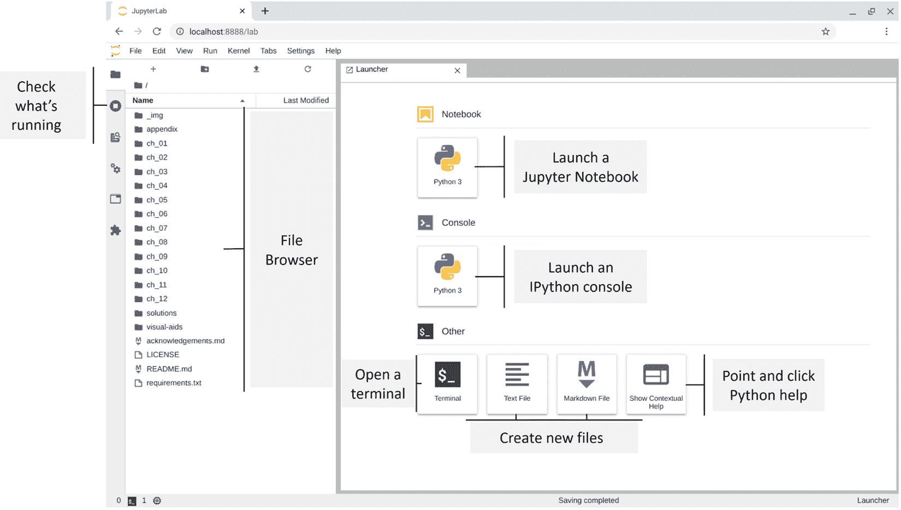

图 1.18 – 启动 JupyterLab

使用**文件浏览器**面板，在**ch_01**文件夹中双击，其中包含我们用来验证设置的 Jupyter Notebook。

### 验证虚拟环境设置

打开`checking_your_setup.ipynb`笔记本，位于**ch_01**文件夹中，如下截图所示：

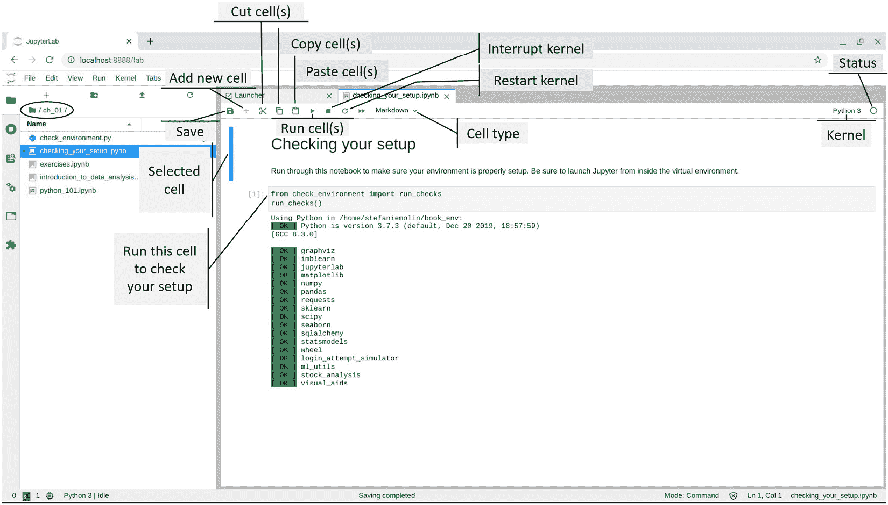

图 1.19 – 验证虚拟环境设置

重要说明

**内核**是在 Jupyter Notebook 中运行和检查我们代码的进程。请注意，我们不限于运行 Python 代码 —— 我们也可以运行 R、Julia、Scala 和其他语言的内核。默认情况下，我们将使用 IPython 内核来运行 Python。在本书中，我们将更深入地学习 IPython。

点击前面截图中指示的代码单元格，然后通过点击播放（▶）按钮来运行它。如果所有内容都显示为绿色，则环境已经设置好了。但是，如果情况不是这样，请从虚拟环境中运行以下命令，为 Jupyter 创建一个带有 `book_env` 虚拟环境的特殊核心：

```py
(book_env) $ ipython kernel install --user --name=book_env
```

这在 Jupyter Notebook 中的 `book_env` 核心中添加了一个额外的选项：

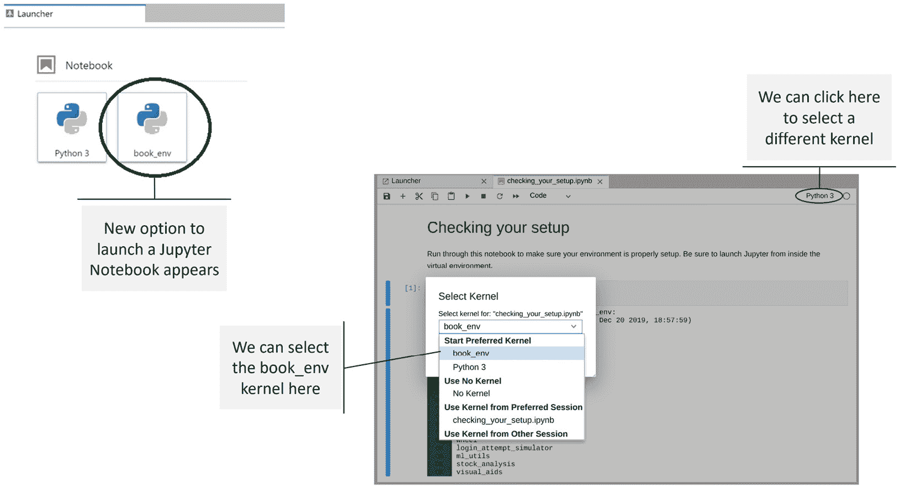

图 1.20 – 选择不同的核心

需要注意的是，当内核运行时，Jupyter Notebooks 将保留我们为变量分配的值，并且在我们保存文件时，**Out[#]** 单元格中的结果也将被保存。关闭文件并不会停止内核，关闭浏览器中的 JupyterLab 标签页也不会停止它。

### 关闭 JupyterLab

关闭浏览器中的 JupyterLab 不会停止 JupyterLab 或正在运行的内核（我们也不会重新获得命令行界面）。要完全关闭 JupyterLab，我们需要在终端中按下 *Ctrl* + *C* 几次（这是一个键盘中断信号，让 JupyterLab 知道我们要关闭它），直到我们重新获得提示符：

```py
...
[I 17:36:53.166 LabApp] Interrupted...
[I 17:36:53.168 LabApp] Shutting down 1 kernel
[I 17:36:53.770 LabApp] Kernel shutdown: a38e1[...]b44f
(book_env) $
```

欲了解更多关于 Jupyter 的信息，包括教程，请访问 [`jupyter.org/`](http://jupyter.org/)。在 [`jupyterlab.readthedocs.io/en/stable/`](https://jupyterlab.readthedocs.io/en/stable/) 上了解更多关于 JupyterLab 的信息。

# 总结

在本章中，我们了解了数据分析的主要过程：数据收集、数据整理、探索性数据分析（EDA）和得出结论。接着我们概述了描述性统计，并学习了如何描述数据的中心趋势和分布；如何用五数总结、箱线图、直方图和核密度估计来数值和视觉上总结数据；如何缩放我们的数据；以及如何量化数据集中变量之间的关系。

我们初步介绍了预测和时间序列分析。然后，我们简要概述了推断统计学的一些核心主题，这些主题可以在掌握本书内容后进一步探索。请注意，本章中的所有示例都是关于一个或两个变量的，而现实生活中的数据往往是高维的。*第十章*，*做出更好的预测 – 优化模型*，将涉及一些解决这个问题的方法。最后，我们为本书建立了虚拟环境，并学习了如何使用 Jupyter Notebooks。

现在我们已经打下了坚实的基础，下一章我们将开始在 Python 中处理数据。

# 练习

运行 `introduction_to_data_analysis.ipynb` 笔记本来复习本章内容，再复习 `python_101.ipynb` 笔记本（如果需要），然后完成以下练习，练习在 JupyterLab 中处理数据和计算汇总统计信息：

1.  探索 JupyterLab 界面，了解一些可用的快捷键。现在不用担心记住它们（最终，它们会变成第二天性，节省你很多时间）——只要熟悉使用 Jupyter Notebooks。

1.  所有数据都是正态分布的吗？请解释为什么或为什么不。

1.  在什么情况下使用中位数而不是均值作为中心度量更有意义？

1.  运行`exercises.ipynb`笔记本中第一个单元格的代码。它将给你一个包含 100 个值的列表，你将在本章的其他练习中使用这些值。确保将这些值视为总体的样本。

1.  使用*练习 4*中的数据，在不导入任何`statistics`模块（标准库中的[`docs.python.org/3/library/statistics.html`](https://docs.python.org/3/library/statistics.html)）的情况下计算以下统计数据，然后确认你的结果与使用`statistics`模块时得到的结果是否一致（在可能的情况下）：

    a) 平均值

    b) 中位数

    c) 众数（提示：查看标准库中`collections`模块的`Counter`类，[`docs.python.org/3/library/collections.html#collections.Counter`](https://docs.python.org/3/library/collections.html#collections.Counter)）

    d) 样本方差

    e) 样本标准差

1.  使用*练习 4*中的数据，适当使用`statistics`模块中的函数计算以下统计数据：

    a) 范围

    b) 变异系数

    c) 四分位数间距

    d) 四分位差系数

1.  使用以下策略对*练习 4*中创建的数据进行缩放：

    a) 最小-最大缩放（归一化）

    b) 标准化

1.  使用*练习 7*中的缩放数据，计算以下内容：

    a) 标准化和归一化数据之间的协方差

    b) 标准化和归一化数据之间的皮尔逊相关系数（这实际上是 1，但由于过程中四舍五入，结果会稍微小一点）

# 进一步阅读

以下是一些资源，可以帮助你更熟悉 Jupyter：

+   *Jupyter Notebook 基础*: [`nbviewer.jupyter.org/github/jupyter/notebook/blob/master/docs/source/examples/Notebook/Notebook%20Basics.ipynb`](https://nbviewer.jupyter.org/github/jupyter/notebook/blob/master/docs/source/examples/Notebook/Notebook%20Basics.ipynb)

+   *JupyterLab 简介*: [`blog.jupyter.org/jupyterlab-is-ready-for-users-5a6f039b8906`](https://blog.jupyter.org/jupyterlab-is-ready-for-users-5a6f039b8906)

+   *学习 Markdown，使你的 Jupyter Notebooks 准备好演示*: [`medium.com/ibm-data-science-experience/markdown-for-jupyter-notebooks-cheatsheet-386c05aeebed`](https://medium.com/ibm-data-science-experience/markdown-for-jupyter-notebooks-cheatsheet-386c05aeebed)

+   *28 个 Jupyter Notebook 技巧、窍门和快捷键*: [`www.dataquest.io/blog/jupyter-notebook-tips-tricks-shortcuts/`](https://www.dataquest.io/blog/jupyter-notebook-tips-tricks-shortcuts/)

一些资源用于学习更多高级统计概念（我们这里不会涉及），并且仔细应用这些概念，如下所示：

+   *Python 中的正态性检验温和入门*：[`machinelearningmastery.com/a-gentle-introduction-to-normality-tests-in-python/`](https://machinelearningmastery.com/a-gentle-introduction-to-normality-tests-in-python/)

+   *假设检验的工作原理：置信区间和置信水平*：[`statisticsbyjim.com/hypothesis-testing/hypothesis-tests-confidence-intervals-levels/`](https://statisticsbyjim.com/hypothesis-testing/hypothesis-tests-confidence-intervals-levels/)

+   *Udacity 的推断统计学入门（用数据进行预测）*：[`www.udacity.com/course/intro-to-inferential-statistics--ud201`](https://www.udacity.com/course/intro-to-inferential-statistics--ud201)

+   *第 4 课：置信区间（宾州州立大学初级统计学）*：[`online.stat.psu.edu/stat200/lesson/4`](https://online.stat.psu.edu/stat200/lesson/4)

+   *理论透视：概率与统计的视觉化介绍*：[`seeing-theory.brown.edu/index.html`](https://seeing-theory.brown.edu/index.html)

+   *统计学误区：亚历克斯·赖因哈特的完整指南*：[`www.statisticsdonewrong.com/`](https://www.statisticsdonewrong.com/)

+   *调查抽样方法*：[`stattrek.com/survey-research/sampling-methods.aspx`](https://stattrek.com/survey-research/sampling-methods.aspx)
