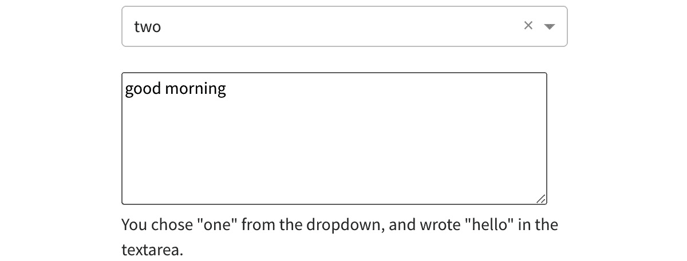
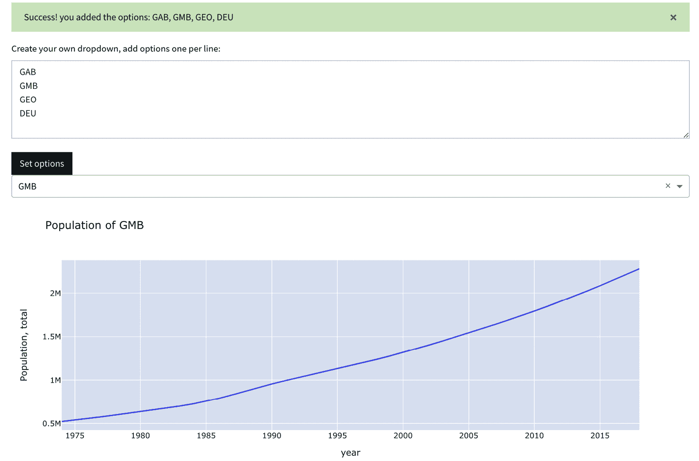
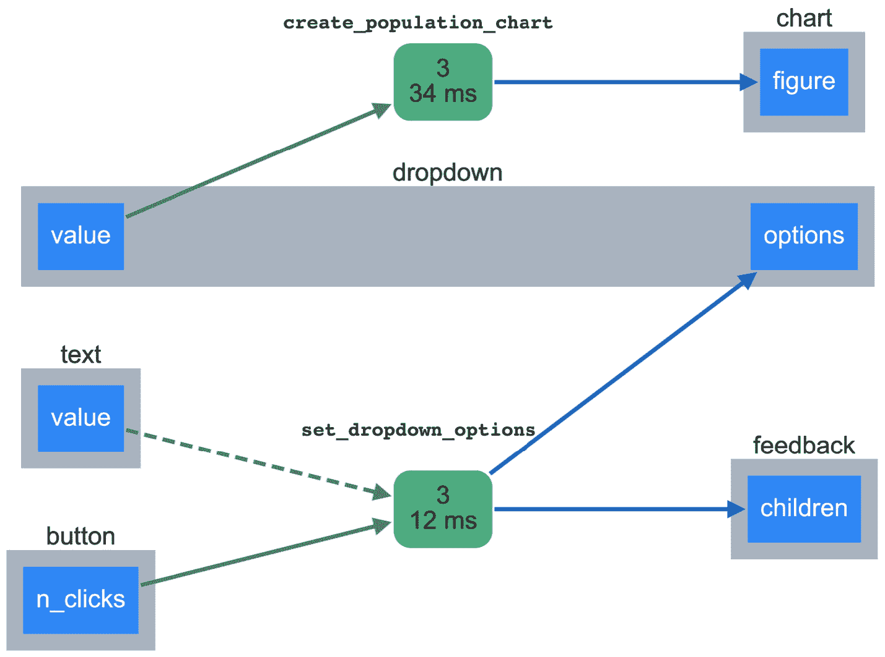
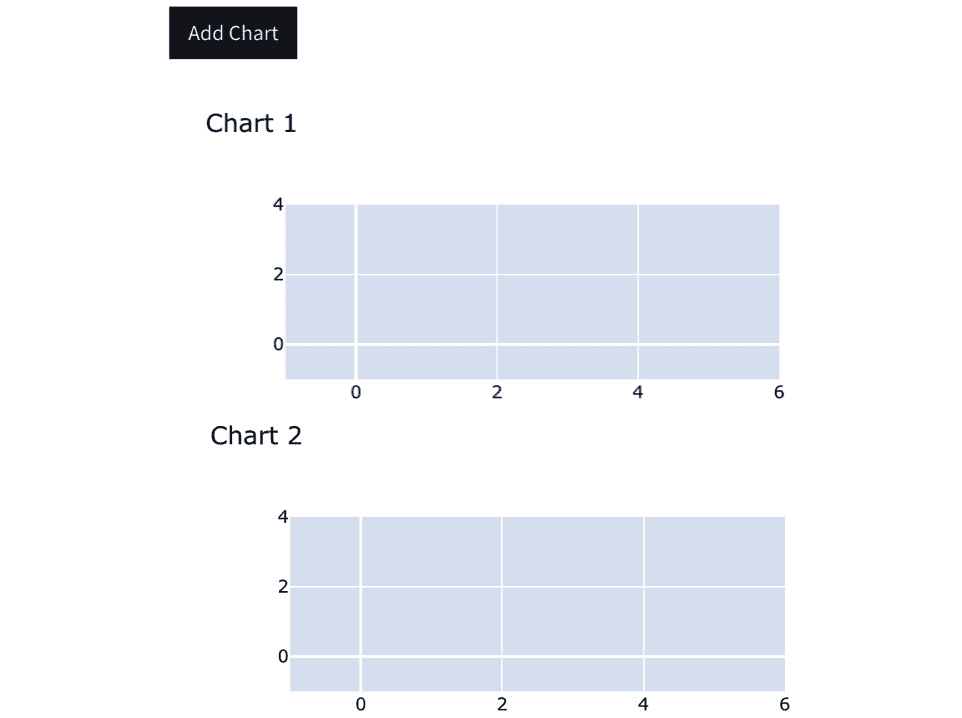
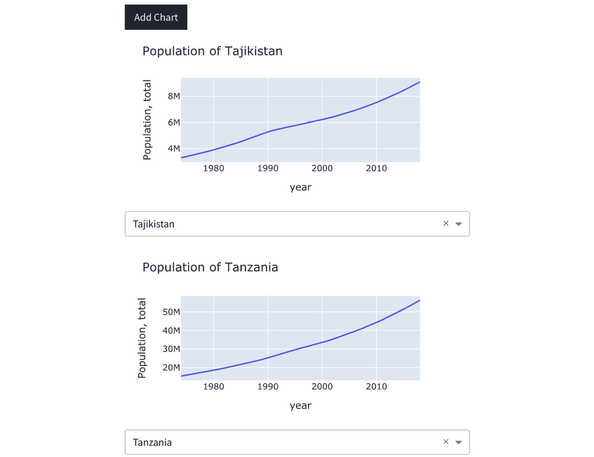

# *第十章*：通过高级回调为应用程序加速

我们现在通过引入回调的新选项，将我们的应用程序提升到一个新的抽象层次和强大功能。我们遵循的基本模式是为用户提供一个可以交互的组件。基于该组件提供的选项集，用户可以影响某些动作，例如生成图表。我们将探索其他选项，例如推迟回调的执行，直到某个事件发生，例如点击“提交”按钮。我们还将看看如何允许用户修改应用程序的布局，允许他们向应用程序添加新的动态组件。我们将利用这些知识对在*第九章*中引入的聚类功能进行一些小但重要的改进，*让数据为自己发声，使用机器学习*。

我们将首先介绍回调中的可选**State**参数。到目前为止，我们的所有回调都在用户对任何输入进行更改时立即触发。在许多情况下，我们希望用户设置一些选项，然后点击“提交”按钮才会触发回调函数。当我们有多个输入项时，如果输出在用户仍在更改时就发生变化，这可能会令人烦恼或不方便。在其他情况下，这些回调可能需要较长时间执行和/或需要消耗大量资源。因此，在这种情况下，我们希望在用户决定触发回调之前阻止其执行。

一旦`State`的概念被建立，我们将探索一种新的动态回调类型，允许用户通过例如添加新图表来更改应用程序。到目前为止，我们允许用户仅仅修改交互组件中的输入值。通过引入基于用户交互生成的动态组件，我们可以将这一功能提升到新的层次。

最后，我们将概述**模式匹配回调**，它允许我们以简化的方式将动态创建和交互式组件连接起来。

以下是本章将要涵盖的主要内容：

+   理解`State`

+   创建控制其他组件的组件

+   允许用户向应用程序添加动态组件

+   引入模式匹配回调

# 技术要求

我们将使用到与前几章相同的基本工具，主要集中在回调函数中的一些新特性。我们将使用 Dash、Dash HTML 组件、Dash 核心组件和 Dash Bootstrap 组件来构建我们的应用程序。数据操作方面，我们将使用 pandas。图表和可视化方面，我们将使用 Plotly 和 Plotly Express，最后，我们将使用 JupyterLab 进行交互式探索，并独立创建新功能，最后将其整合到应用程序中。

本章的代码文件可以在 GitHub 上找到，链接地址是：[`github.com/PacktPublishing/Interactive-Dashboards-and-Data-Apps-with-Plotly-and-Dash/tree/master/chapter_10`](https://github.com/PacktPublishing/Interactive-Dashboards-and-Data-Apps-with-Plotly-and-Dash/tree/master/chapter_10)。

请查看以下视频，观看代码的实际运行：[`bit.ly/3v6ZYJw`](https://bit.ly/3v6ZYJw)。

让我们从熟悉`State`开始。

# 理解 State

到目前为止，我们使用的典型回调函数结构包含一个或多个`Output`元素和一个或多个`Input`元素。如引言中所述，当用户修改`Input`元素时，回调会立即触发。我们希望稍微放宽这个选项。我们将从一个简单的示例开始，展示为什么以及如何使用`State`，这是一个可选参数，可以传递给我们的回调函数。

为了更清楚地说明我们试图解决的问题，请看一下*图 10.1*：



图 10.1 – 一个交互式应用，其输出与输入值未正确同步

如你所见，输出显示的是错误的值。原因是为了模拟你在应用程序中可能遇到的实际情况，我们故意引入了等待时间，这使得应用变得非常慢。实际上，输出并不是错误的；只是更新需要较长时间，因此当输入发生变化时，输出区域没有立即反映变化。在这种情况下尤为重要的是，因为有两个输入项控制输出。修改第一个和第二个输出之间的间隔可能导致这种混淆。

另一个更重要的问题是，这些选项可能会消耗更多的时间，并在计算能力和/或分析人员时间的损失上花费大量成本。我们的数据集非常小，所进行的计算也很简单，因此性能并不是问题。在实际情况中，你更可能处理更大的数据集，并进行需要大量时间的计算。例如，修改集群的数量以更新我们的模型，所需时间非常短。实际上，这可能需要几秒钟、几分钟，甚至更长时间。我们将通过添加一个“提交”按钮并在回调函数中引入`State`来解决这个问题。

按钮是 Dash HTML 组件包中的 HTML 组件。它们也可以通过 Dash Bootstrap 组件使用。使用后者有两个优点。首先，它们与所使用的主题很好地集成，确保了视觉上的一致性。其次，这一点可能更为重要的是，它们很容易显示出一种有意义的颜色，以便传达“成功”、“警告”、“危险”或其他任何可用的颜色/消息。

按钮可以通过`dcc.Button`或`dbc.Button`来实现。让我们看看它们如何控制应用程序的行为。

我们首先需要澄清回调函数中`Input`和`State`的区别。

## 理解`Input`和`State`之间的区别

首先，请记住，`Input`是触发函数的因素，而`State`只是应用程序所处的条件集。我们需要决定哪些组件作为`State`，哪些作为`Input`。

让我们更新回调函数的指导方针，以澄清刚刚引入的区别：

+   回调函数的参数顺序必须始终是`Output`、`Input`和可选的`State`，按照这个顺序。如果我们有多个相同类型的元素，它们必须依次排列。

+   `State`是可选的。

+   `Input`元素是触发回调执行的因素。改变应用中的任何或所有`State`并不会导致回调的执行。

+   一旦`Input`元素被修改，回调将会触发，并且自上次触发以来，所有变化的`State`也会被传入回调。

现在让我们看看如何生成显示在*图 10.1*中的应用程序代码，然后根据所需的行为进行修改。当前的回调函数看起来是这样的：

```py
@app.callback(Output('output', 'children'),
              Input('dropdown', 'value'),
              Input('textarea', 'value'))
def display_values(dropdown_val, textarea_val):
    return f'You chose "{dropdown_val}" from the dropdown, and wrote "{textarea_val}" in the textarea.'
```

这就是我们至今管理所有回调函数的方式。请注意，回调会在两个输入中的任何一个被修改时运行。我们要引入的更改将需要两步操作：

1.  向页面添加一个按钮组件，放置在`Textarea`组件下方：

    ```py
    import dash_bootstrap_components as dbc
    dbc.Button("Submit", id="button")
    # OR
    import dash_html_components as html
    html.Button("Submit", id="button")
    ```

1.  将按钮作为`Input`参数添加到回调函数中。现在我们引入了一个我们还没有见过的新属性，即`n_clicks`。顾名思义，它对应于用户会话期间在某个组件上点击的次数。每次点击，数字就会增加一次，我们可以使用这个变量来检查和控制回调的行为。注意，我们也可以给它一个默认的起始值，通常为零，但如果我们愿意，也可以设置为其他数字：

    ```py
    Input("button", "n_clicks")
    ```

1.  现在，我们已经将按钮设定为`Input`，我们希望保留`Dropdown`和`Textarea`，但将它们作为`State`参数，如下所示：

    ```py
    @app.callback(Output('output', 'children'),
                  Input('button', 'n_clicks'),
                  State('dropdown', 'value'),
                  State('textarea', 'value'))
    ```

1.  通过这些更改，回调现在等待`Input`的变化。用户可以多次更改`Dropdown`和/或`Textarea`，而不会被中断，等他们准备好时，可以点击“提交”按钮来获得所需的结果。

1.  当应用程序首次加载时，`n_clicks`属性的默认值为`None`。此外，`Textarea`组件中没有任何内容，且下拉菜单尚未选择任何选项。所以，我们按常规操作：如果没有`n_clicks`的值，我们就使用`raise PreventUpdate`。为了更新我们所引入的函数，我们可以简单地对函数的签名进行如下更改。注意新增了相应的`n_clicks`参数，以及它的相对顺序：

    ```py
    def display_values(n_clicks, dropdown_val, textarea_val):
        if not n_clicks:
            raise PreventUpdate
        return … 
    ```

如果我们更新代码，可以看到事情会按预期工作，用户将对流程有更多的控制权。*图 10.2* 显示了更新后的功能：


图 10.2 – 一个互动应用，输出现在正确显示预期的输入值

我们可以通过提供视觉提示来进一步改善此体验，提示用户某些处理正在进行中。

牢记这些新知识后，我们可以利用它来修改我们在本章开头讨论的聚类功能的行为。*图 10.3* 显示了我们希望实现的预期结果：


图 10.3 – 带有提交按钮和视觉进度指示器的聚类功能

如你所见，我们引入了两个新特性。第一个是我们已经讨论并在独立小应用中实现的按钮。第二个是 Dash 核心组件 `Loading` 组件。该组件负责显示一个符号，这个符号在预期输出出现的地方移动或有时旋转。使用它非常简单，但在这种情况下非常关键。向用户确认他们的选择（或任何其他交互）已被识别并正在处理中总是件好事。事实上，我认为在所有输出中使用 `Loading` 组件给用户这种确认是非常好的。它非常容易实现，以下是如何更新应用以反映这一功能：

```py
import dash_core_components as dcc
dcc.Loading([
    dcc.Graph(id='clustered_map_chart')
])
```

`Graph` 组件已经存在于我们的应用中；我们只需要将它作为 `children` 参数添加到 `Loading` 组件中，正如你在之前的代码中看到的。这将导致动画符号保持动画状态，直到底层对象出现在其位置。

现在，让我们修改回调函数以进行所需的更改：

```py
@app.callback(Output('clustered_map_chart', 'figure'),
              Input('clustering_submit_button', 'n_clicks'),
              State('year_cluster_slider', 'value'),
              State('ncluster_cluster_slider', 'value'),
              State('cluster_indicator_dropdown', 'value'))
def clustered_map(n_clicks, year, n_clusters, indicators):
```

我们基本上做了两项更改。首先，我们引入了 `clustering_submit_button` 作为 `Input` 元素，并将其他每个参数从 `Input` 重命名为 `State`。另一个更改是将 `n_clicks` 作为第一个参数传递给函数签名。请记住，参数的名称可以是任何名称，重要的是它们的顺序。我们为它们起了清晰的名称，以便我们在函数体内轻松引用和管理它们。

你现在已经修改了聚类功能，给用户提供了更多的控制权，并通过 `Loading` 组件使其更加直观清晰。你可以随意在应用的任何地方添加它。

现在我们可以将回调函数提升到另一个有趣的层次。

# 创建控制其他组件的组件

如何在页面上提供一个交互组件，其值（由用户设置）作为另一个函数的输入，后者负责最终的输出？*图 10.4* 展示了结果的样子，随后是关于细节和实现的讨论：



图 10.4 – 一个包含动态决定另一个组件值的应用

让我们逐一了解这个应用布局中的视觉元素：

1.  **成功消息**：绿色条带在应用加载时不会出现。它仅在用户将选项添加到下拉菜单并点击**设置选项**按钮后才会显示。请注意，有一个动态消息显示用户所添加的值。另外，请注意，警告消息是“可关闭”的。右侧有**x**符号，允许用户移除此消息。

1.  `Textarea` 组件，用于传递给其下方 `Dropdown` 组件的 `options` 属性。在此时，`Dropdown` 为空，且没有可以选择的选项，`Graph` 组件也显示一个空的图表。

1.  当点击 `Textarea` 并点击此按钮时，这些行将成为 `Dropdown` 中的选项。

1.  `Dropdown` 组件。之后，选择特定的国家代码会通过获取与用户选择相等的国家代码行来过滤数据集。然后，它使用结果的 DataFrame 创建最终的图表。

这样的应用没有太大的实际价值，因为直接提供 `Dropdown` 组件中的选项并生成图表会更简单。我们只是用它来展示我们可以利用的新选项，并且使用我们熟悉的数据集。同时也存在很大的错误潜力。假如用户不知道某个国家的代码呢？如果他们输入错误怎么办？再次强调，这仅仅是为了演示目的。

这个应用大约需要 30 行代码，它为我们提供了两层选项，其中一层依赖于另一层。一个选项集“等待”并依赖于其他选项，以相应地生成其输出。

现在我们编写应用的布局代码，然后创建两个使其具有交互性的回调函数：

1.  运行必要的导入：

    ```py
    from jupyter_dash import JupyterDash
    import dash_core_components as dcc
    import dash_html_components as html
    import dash_bootstrap_components as dbc
    import pandas as pd
    poverty = pd.read_csv('data/poverty.csv')
    ```

1.  创建应用及其布局。以下所有元素都将放入应用的布局中：

    ```py
    app = JupyterDash(__name__,
                      external_stylesheets=[dbc.themes.COSMO])
    app.layout = html.Div([
        component_1,
        component_2
        …
    ])
    ```

1.  创建一个空的 div，用于容纳成功消息：

    ```py
    html.Div(id='feedback')
    ```

1.  创建一个 `Label` 组件，告诉用户如何与应用交互：

    ```py
    dbc.Label("Create your own dropdown, add options one per line:")
    ```

1.  创建一个空的 `Textarea` 组件。请注意，它也可用，并且与 Dash Core Components 中的同名组件类似：

    ```py
    dbc.Textarea(id='text', cols=40, rows=5)
    ```

1.  为生成下拉菜单及其选项添加一个按钮：

    ```py
    dbc.Button("Set options", id='button')
    ```

1.  创建一个空的 `Dropdown`：

    ```py
    dcc.Dropdown(id='dropdown')
    ```

1.  创建一个空的 `Graph` 组件：

    ```py
    dcc.Graph(id=chart')
    ```

这应该足以满足我们应用的视觉元素。接下来，我们需要两个函数来创建所需的交互性：

1.  `set_dropdown_options`：这个函数将从`Textarea`中获取行作为输入，并返回一个选项列表供`Dropdown`组件使用。

1.  `create_population_chart`：这个函数从`Dropdown`组件获取输入，并在其下方生成一个人口图表。

现在我们从第一个开始：

1.  创建具有适当`Output`、`Input`和`State`参数的回调函数。这个函数会影响两个输出，第一个是`Dropdown`组件的`options`属性，第二个是包含成功消息的 div。对于我们的`Input`，我们会有一个按钮，而`State`将是`Textarea`组件：

    ```py
    @app.callback(Output('dropdown', 'options'),
                  Output('feedback', 'children'),
                  Input('button', 'n_clicks'),
                  State('text', 'value'))
    ```

1.  创建带有适当参数名称的函数签名：

    ```py
    def set_dropdown_options(n_clicks, options):
    ```

1.  创建一个变量，保存作为列表提供的文本。我们通过分割`Textarea`中传入的文本来实现这一点。我们还确保检查没有点击的情况，并在这种情况下使用`raise PreventUpdate`：

    ```py
    if not n_clicks:
        raise PreventUpdate
    text = options.split()
    ```

1.  创建成功消息作为一个`Alert`组件，这是 Dash Bootstrap Components 中的一部分。注意，我们还给它上了一个叫做“success”的颜色。自然，你还可以考虑额外的功能来检查有效的输入，如果没有有效输入，消息的颜色可能会是“warning”或“danger”。注意，文本还会动态地添加用户提供的逗号分隔选项。我们还设置了`dismissable=True`，允许用户在需要时将其从页面移除：

    ```py
    message = dbc.Alert(f"Success! you added the options: {', '.join(text)}",
                        color='success',
                        dismissable=True)
    ```

1.  创建选项列表，用来设置当前空的`Dropdown`组件的`options`属性。我们使用`text`变量来实现：

    ```py
    options = [{'label': t, 'value': t} for t in text]
    ```

1.  返回`options`和`message`的元组：

    ```py
    return options, message
    ```

现在让我们转到另一个函数，它将获取所选的国家代码，并利用它生成图表：

1.  创建具有所需`Output`和`Input`的回调函数：

    ```py
    @app.callback(Output('chart', 'figure'),
                  Input('dropdown', 'value'))
    ```

1.  创建函数签名以及检查`Dropdown`中值是否可用：

    ```py
    def create_population_chart(country_code):
        if not country_code:
            raise PreventUpdate
    ```

1.  根据输入值创建所需的 DataFrame 子集：

    ```py
    df = poverty[poverty['Country Code']==country_code]
    ```

1.  返回一个包含适当值的图表：

    ```py
    return px.line(df,
                   x='year',
                   y='Population, total',
                   title=f"Population of {country_code}")
    ```

现在我们可以运行前面的代码并创建所需的应用程序。

为了更好地理解应用程序的结构，并熟悉如何检查回调链，我们可以通过运行`app.run_server(debug=True)`在调试模式下运行应用程序，并查看输入和输出如何相互关联，如*图 10.5*所示：



图 10.5 – 应用回调图

你可以轻松地看到代码中指定的组件名称及其 ID。你可以很容易地跟踪事件的顺序，从图表的左下角开始，沿着箭头走到右上角。

我们看到如何在某些组件中创建动态选项，这些选项依赖于其他组件的值。Dash 整洁地处理了组件的行为，并在输入可用时正确地触发了相应的函数。

让我们将事情提升到一个更抽象和强大的层次。现在，让我们允许用户通过点击按钮添加完整的组件。

# 允许用户向应用程序添加动态组件

用户不仅能够向应用程序的布局中添加组件，而且这些组件的内容也将动态生成。看看*图 10.6*，它展示了我们将要开始的最简单示例：



图 10.6 – 一个允许用户向应用程序布局中添加组件的应用程序

尽管这个应用程序非常简单，但其中的图表有不同的动态名称，如你在图表标题中看到的。这是基于`n_clicks`的动态值，它在每次点击时都会变化。

生成这个所需的代码量与任何简单应用程序类似；其中没有太多复杂性。我们只需要以新的视角来看待它。让我们从编写布局代码开始，布局将由两个简单的组件组成：

1.  创建一个按钮，用于触发添加新图表：

    ```py
    dbc.Button("Add Chart", id='button')
    ```

1.  创建一个空的 div，并将其`children`属性设置为空列表。这个空列表是我们将要操作的关键元素：

    ```py
    html.Div(id='output', children=[])
    ```

当此应用程序第一次加载时，用户只会看到一个按钮，他们可以使用这个按钮来添加一个图表。每次点击按钮时，按钮下方的区域将填充一个新的图表。

现在让我们为这个应用程序创建回调函数：

1.  像往常一样创建`Output`、`Input`和`State`参数。这里需要注意的有趣部分是，空 div 的`children`属性既充当`Output`又充当`State`。我们通常会获取某个组件的值，并用它来影响或改变应用程序中另一个组件的状态。谁说我们不能获取一个组件，改变它，然后将其以新状态返回原处呢？这正是我们将要做的：

    ```py
    @app.callback(Output('output', 'children'),
                  Input('button', 'n_clicks'),
                  State('output', 'children'))
    ```

1.  创建函数签名并检查`n_clicks`。请注意，在这种情况下，`children`充当`State`：

    ```py
    def add_new_chart(n_clicks, children):
        if not n_clicks:
            raise PreventUpdate
    ```

1.  创建一个带有动态标题的空条形图，使用`n_clicks`属性：

    ```py
    new_chart = dcc.Graph(figure=px.bar(title=f"Chart {n_clicks}"))
    ```

1.  将新图表附加到`children`组件中。如果你记得，我们将空 div 中`children`的初始值设置为空列表。接下来的这一行将取出这个列表，并将`new_chart`添加到其中。这没有什么特别的；我们只是简单地使用 Python 的`list.append`方法：

    ```py
    children.append(new_chart)
    ```

1.  现在我们的`children`列表已经通过向其中添加新项而被修改，我们只需返回它。请记住，回调函数的返回值将传递到 div 中，因此它现在充当输出：

    ```py
    return children
    ```

请注意，这个功能是通过应用简单原则创建的。我们并没有使用任何新功能。第一个技巧是将`children`传递给我们的回调，并从另一端接收它。第二个技巧是使用`n_clicks`属性来动态设置图表的标题。

*图 10.7* 中的图示显示了我们创建的元素之间的关系：


图 10.7 – 一个回调函数图，其中一个函数返回它接收到并变更的组件

这个图表在应用中添加多少个图表并不会改变。这意味着你无需担心管理与点击次数相同的回调函数。

如果你准备好进一步扩展，我们可以在每个图表下方再添加一个组件，例如一个`Dropdown`组件。我们可以让下拉框选择的值生成图表。每个下拉框的值将独立于其他值（如果是用户添加的），并且只会修改它所属的图表。好消息是，所有这些也将通过一个额外的回调函数，利用模式匹配回调来管理。

# 引入模式匹配回调

掌握这个功能（我们现在正在处理一个真正的新功能）将使你能够将应用提升到一个新的交互性和功能性水平。这个功能的最重要特点是，它允许我们处理那些以前不存在的组件的交互性。正如我们之前所做的，当我们允许用户通过点击按钮创建新的图表时，这些组件在应用中之前并不存在。更有趣的是，处理这些组件的回调函数与任何其他从下拉框获取值并生成图表的回调函数一样简单。诀窍在于稍微改变我们组件的`id`属性。

到目前为止，我们一直将`id`属性设置为字符串，唯一的要求是它们必须是唯一的。现在我们将介绍一种新的创建该属性的方法，即使用字典。让我们首先看看最终目标，然后修改布局、回调函数，最后讨论新的`id`属性处理方法。*图 10.8*展示了我们的应用将会是什么样子：



图 10.8 – 一个允许用户向应用布局中添加交互式组件的应用

在之前的应用程序中，我们能够让用户实时生成新组件，并且这些组件的内容也可以是动态的。我们通过图表标题演示了这一点，使用`n_clicks`属性动态设置标题。但是，在添加这些图表后，用户无法与它们进行互动。换句话说，它们是动态生成的，可能具有动态内容，但一旦生成，它们就变成了静态的，我们无法与它们互动。

我们现在引入的改进是，我们使得这些图表具有交互性（使用下拉框），并将每个图表与一个单独的组件（在此情况下为下拉框）关联。如*图 10.8*所示，每个图表都有自己的下拉框，用户可以在图表上独立生成多个图表并进行对比。之后，用户还可以通过选择不同的国家，查看不同图表的数据。当然，你可以想象一个更复杂的应用集合，用户可以在其中进行更多操作。

创建这个新功能的新增内容将分为三个步骤：

1.  修改`add_new_chart`函数：这将只是简单地在每个图表下添加一个下拉框，并附加两个组件，而不是一个。请注意，布局完全相同。我们只是在它下面有一个按钮和一个空的 div。

1.  创建一个新的回调函数：这将把新生成的图表和下拉框对连接起来，以确定它们的行为。

1.  修改应用中的`id`属性：这是我们引入新功能的地方，也是主要功能，它允许我们通过一个回调函数管理多个附加组件及其交互性。

我们首先开始修改`add_new_chart`回调函数：

1.  我们在函数中定义了`new_chart`，这一部分保持不变。在它下面，我们要添加`new_dropdown`，以供用户选择他们想要可视化的国家：

    ```py
    new_chart = dcc.Graph(figure=px.bar(title=f"Chart {n_clicks}"))
    countries = poverty[poverty['is_country']]['Country Name'].drop_duplicates().sort_values()
    new_dropdown = dcc.Dropdown(options=[{'label': c, 'value': c}
                                for c in countries])
    ```

1.  添加新组件。在第一个示例中，我们附加了`new_chart`，但这次我们想要附加两个项目。唯一需要修改的地方是将这两个新组件放入一个新的 div 中，并附加这个新 div。这样，我们实际上是在附加一个包含两个元素的 div 元素：

    ```py
    children.append(html.Div([
        new_chart,
        new_dropdown
    ]))
    ```

这足以让按钮每次点击时添加两个项目。如你所见，变动非常简单。然而，稍后我们会设置这些组件的`id`属性，以使它们能够动态交互。

现在每次点击按钮时，我们都添加一对组件。其中一个必须是`Output`元素（图表），另一个必须是`Input`元素（下拉框）。与其他交互功能一样，它们需要通过回调函数进行关联。我们现在就创建这个回调函数，之后我们会看看如何将这些动态 ID 连接在一起，并管理这两个回调函数的交互。这个函数和我们之前创建的任何回调一样简单。下面是代码，但没有装饰器，我们稍后会讨论装饰器：

```py
def create_population_chart(country):
    if not country:
        raise PreventUpdate
    df = poverty[poverty['Country Name']==country]
    fig = px.line(df, 
                  x='year', y='Population, total',
                  title=f'Population of {country}')
    return fig
```

*图 10.9*包含一个展示我们模式匹配回调函数的图示：


图 10.9 – 模式匹配回调的回调图

*图 10.9*中的顶部图表与*图 10.7*中的完全相同。它用于简单的功能，通过将新的图表附加到空 div 的子元素中来添加图表。请注意，`id`属性位于每个表示组件的框上方。这里它们是**button**和**output**。

第二个回调函数`create_population_chart`的图表显示了类似的结构，但其中的 ID 是字典类型，而不是字符串。

模式匹配回调使用这些字典来将不同的元素匹配在一起。让我们来拆解这些字典，然后看看它们如何与回调函数配合。

第一个是`{"index": MATCH, "type": "dropdown"}`。我相信**type**键是明确的。我们使用它来方便识别其他“类型”为“dropdown”的组件。需要注意的是，这些名称可以是任何内容，但显然我们会希望使用有意义且有帮助的名称。另一个字典的**type**键是**chart**。同样，这也是灵活的，但我认为在这里我们清楚地知道是指哪些元素。

现在，我们希望为每对组件提供独立的功能。换句话说，我们希望用户能够修改第二个下拉框，生成他们想要的任何图表，而不影响应用中的其他组件。我们怎么实现这一点呢？我们只需要告诉 Dash 使用`MATCH`来进行匹配。这个功能属于一个任意命名的键，`MATCH`是一个通配符对象，位于`dash.dependencies`模块中。还有`ALL`和`ALLSMALLER`，它们的工作方式相似，但有些细微差别，我们将主要关注`MATCH`。现在让我们来看一下，如何指定更新后的函数来适应这些 ID。好消息是，我们只需要修改相关组件的`id`属性，并将其传递给相应的回调函数参数。

现在，我们准备好添加适当的`id`属性，以完成模式匹配回调。第一个函数`add_new_chart`接受新字典`id`属性，用于表示允许用户添加到应用中的内部组件。请注意，这里的“index”键的值是`n_clicks`。正如我们之前多次看到的，它是动态的，每次用户点击按钮时都会发生变化。这意味着每次用户点击按钮时，我们都会得到一个新的唯一 ID，用来标识这个组件：

```py
def add_new_chart(n_clicks, children):
    new_chart = dcc.Graph(id={'type': 'chart',
                              'index': n_clicks},
                          figure=px.bar())
    new_dropdown = dcc.Dropdown(id={'type': 'dropdown',
                                    'index': n_clicks},
                                options=[option_1, option_2, …])
```

现在，我们需要在负责管理这些组件交互性的第二个函数中正确地映射这些 ID。"`type`"键将用于将"`chart`"映射到"`chart`"和将"`dropdown`"映射到"`dropdown`"。至于`n_clicks`，由于它是动态的，我们使用`MATCH`进行匹配：

```py
@app.callback(Output({'type': 'chart', 'index': MATCH}, 'figure'),
              Input({'type': 'dropdown', 'index': MATCH}, 'value'))
def create_population_chart(country):
    …
```

这里是两者函数的完整代码，作为参考，帮助你全面了解：

```py
from dash.dependencies import Output, Input, State, MATCH
@app.callback(Output('output', 'children'),
              Input('button', 'n_clicks'),
              State('output', 'children'))
def add_new_chart(n_clicks, children):
    if not n_clicks:
        raise PreventUpdate
    new_chart = dcc.Graph(id={'type': 'chart',
                              'index': n_clicks},
                          figure=px.bar(title=f"Chart {n_clicks}"))
    countries = poverty[poverty['is_country']]['Country Name'].drop_duplicates().sort_values()
    new_dropdown = dcc.Dropdown(id={'type': 'dropdown',
                                    'index': n_clicks},
                                options=[{'label': c, 'value': c}
                                         for c in countries])
    children.append(html.Div([
        new_chart, new_dropdown
    ]))
    return children
@app.callback(Output({'type': 'chart', 
                      'index': MATCH}, 'figure'),
              Input({'type': 'dropdown',
                     'index': MATCH}, 'value'))
def create_population_chart(country):
    if not country:
        raise PreventUpdate
    df = poverty[poverty['Country Name']==country]
    fig = px.line(df,
                  x='year',
                  y='Population, total',
                  title=f'Population of {country}')
    return fig
```

你可以很容易想象，拥有这样的功能后，我们的应用将变得多么灵活和可扩展，更不用提回调管理的便利性了。然而，这些功能并不直接，可能需要一些时间去适应，我相信这是值得的。

我们介绍了许多关于回调的新概念，利用了一些技巧，并引入了新的功能。那么，接下来让我们回顾一下这一章中讲解的内容。

# 总结

我们首先介绍了回调函数装饰器中的可选`State`参数。我们展示了如何将其与`Input`结合使用，从而延迟执行函数，直到用户决定执行它们。我们还运行了几个示例，添加了按钮来触发执行。然后，我们创建了一个简单的应用，其中用户对某个组件的输入用于动态填充另一个“等待”组件的选项。这些新选项反过来又被用于创建另一个组件。

另一个有趣的应用是允许用户添加具有动态内容的新组件。

我们最终介绍了最强大和最灵活的功能——模式匹配回调。我们创建了一个应用，用户可以添加任意多的图表，而且这些图表相互独立，用户可以定制自己的仪表盘。

这涵盖了很多内容，接下来我们将讨论另一个功能，它允许我们扩展和扩展我们的应用。页面上的组件数量是有限的，超过一定数量就会变得杂乱无章。在许多情况下，为了实现不同的功能，创建单独的页面/URL 是有意义的，这也是下一章的主题。
