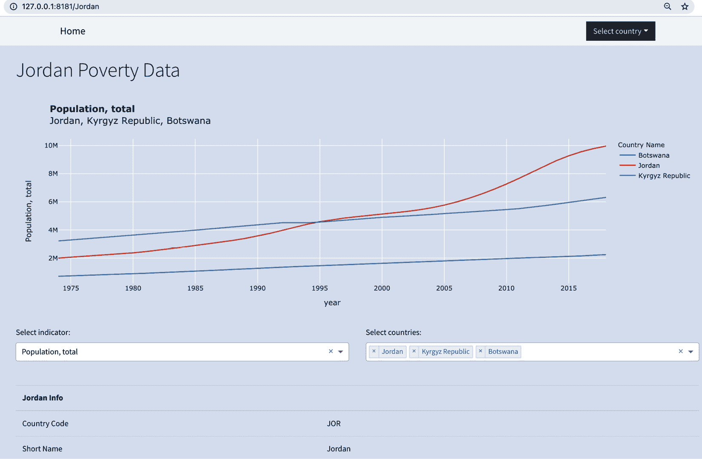
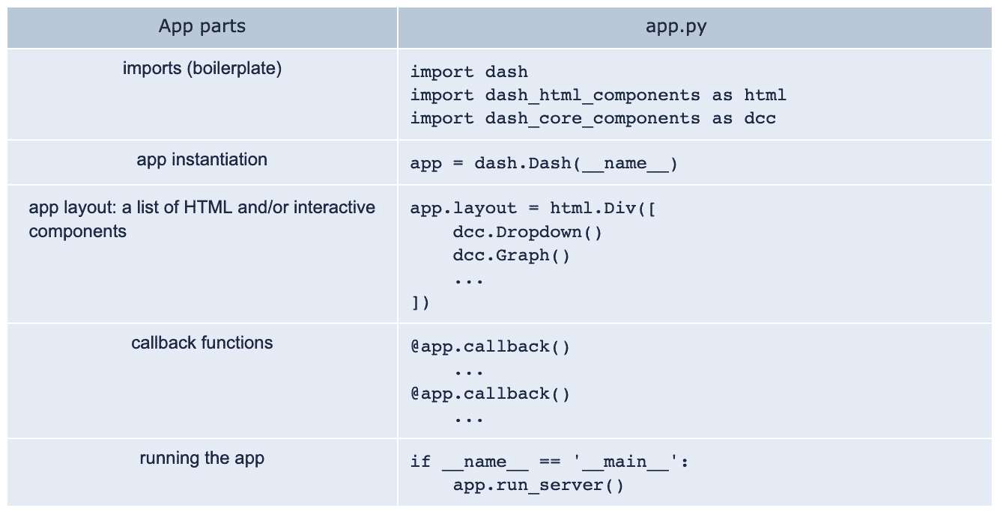
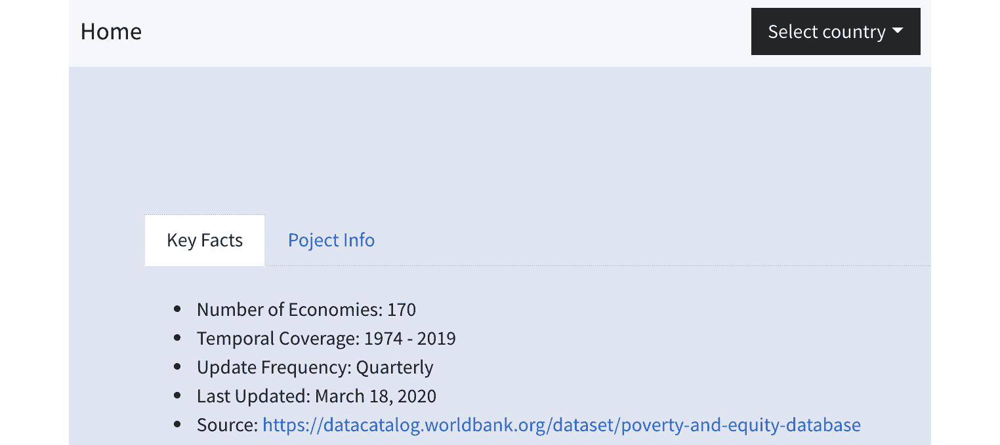
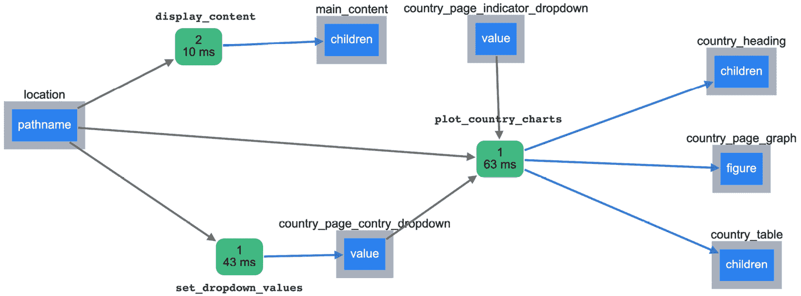

# *第十一章*：URL 和多页面应用

到目前为止，我们一直在一个页面上构建所有内容。我们不断将新的图表和交互组件添加到一个 div 中，并根据需要将其整合。添加新的 URL 有助于节省空间，以免在一个页面上放置过多的组件。URL 还可以作为分类内容和提供上下文的工具，让用户知道他们“在哪里”，以及他们在做什么。

更有趣的是，能够通过编程生成应用程序的许多附加页面，只需根据 URL（或其任何部分）显示内容。这正是我们在本章中要做的。

一旦我们了解了 **Location** 和 **Link** 组件的工作原理，我们将对应用程序的结构进行一些小的改动，创建并隔离新的布局。这样，我们就能清楚地看到，制作一个多页面应用是多么简单。我们将有一个通用布局，中间有一个空白区域，使用一个简单的规则，内容将根据 URL 显示。

我们构建的所有功能主要基于指标。我们为这些指标创建了许多图表，展示了它们在时间和各国之间的变化。我们的用户也可能对面向特定国家的报告感兴趣。因此，我们将为每个国家创建一个页面，用户可以查看感兴趣国家的任何指标，并可以选择与其他国家进行比较。通过一些简单的更改，我们将为应用程序添加 169 个新页面。

本章将涵盖以下主题：

+   了解 `Location` 和 `Link` 组件

+   提取和使用 URL 的属性

+   解析 URL 并使用其组件来修改应用程序的部分内容

+   重新构建应用程序以适应多个布局

+   将动态生成的 URL 添加到应用程序中

+   将新的 URL 交互功能融入到应用程序中

# 技术要求

对于我们将引入的新组件，我们仍然会使用相同的工具。Dash、Dash Core Components、Dash HTML Components 和 Dash Bootstrap Components 将用于构建我们的新功能并将其添加到我们的应用程序中。我们还将使用 pandas 进行数据处理，使用 JupyterLab 和 `jupyter_dash` 来尝试隔离功能，并使用 Plotly 和 Plotly Express 进行数据可视化。

本章的主要内容将是操作 URL 的各个部分，并将其作为输入来修改其他组件。这与使用我们应用程序的任何其他元素来创建我们所需的功能是一样的。让我们从了解这两个使其成为可能的组件开始。

本章的代码文件可以在 GitHub 上找到：[`github.com/PacktPublishing/Interactive-Dashboards-and-Data-Apps-with-Plotly-and-Dash/tree/master/chapter_11`](https://github.com/PacktPublishing/Interactive-Dashboards-and-Data-Apps-with-Plotly-and-Dash/tree/master/chapter_11)。

请查看以下视频，查看代码的实际应用：[`bit.ly/3eks3GI`](https://bit.ly/3eks3GI)。

# 了解`Location`和`Link`组件：

这些组件是 Dash Core Components 的一部分，它们的名称已经非常清晰地表明了它们的功能。`Location`组件指的是浏览器的位置栏，也称为地址栏或 URL 栏。我们通常在应用中放置一个`Location`组件，它本身不会产生任何可见的内容。我们主要用它来发现我们在应用中的位置，基于这个信息，我们可以引入一些功能。让我们创建一个简单的示例，看看它如何在最简单的形式下使用：

1.  创建一个简单的应用：

    ```py
    import dash_html_components as html
    import dash_core_components as dcc
    from jupyter_dash import JupyterDash
    from dash.dependencies import Output, Input
    app = JupyterDash(__name__)
    ```

1.  创建一个简单的布局，其中包含一个`Location`组件，并在其下方放置一个空的`div`：

    ```py
    app.layout = html.Div([
        dcc.Location(id='location'),
     html.Div(id='output')
    ])
    ```

1.  创建一个回调函数，获取`Location`组件的`href`属性，并将其打印到空的`div`中：

    ```py
    @app.callback(Output('output', 'children'), Input('location', 'href'))
    def display_href(href):
        return f"You are at: {href}."
    ```

1.  运行应用并观察其输出：

    ```py
    app.run_server(mode='inline')
    You are at: http://127.0.0.1:8050/.
    ```

这非常直接明了。我们只需请求`Location`组件告诉我们当前位置，并将其显示在空的`div`中。在这个例子中，我们请求了`href`属性，获得了当前页面的完整 URL。出于各种原因，我们可能对其他属性感兴趣，以实现更细致的功能。让我们再构建一个简单的应用，提取`Location`组件的其他可用属性，并了解如何使用`Link`组件。

## 了解`Link`组件：

顾名思义，这个组件用于生成链接。另一种创建链接的方式是使用 HTML 的`<a>`标签，这个标签在 Dash HTML Components 包中可用。虽然`<a>`标签更适合外部链接，但`Link`组件更适合内部链接。一个很好的优点是它仅仅改变`pathname`属性，而且是在不刷新页面的情况下进行的。所以它快速且响应迅速，就像在其他交互式组件中更改值一样。

在我们更新的简单应用中，我们将添加一个`<a>`链接，以及几个`Link`组件链接，这样你就可以体验刷新时的不同效果，并了解两种链接的不同。我们的`Location`组件现在将获取当前页面的位置，同时我们还将用它来提取所有可用的属性，并讨论它们可能的使用方式。让我们创建一些元素来构建我们应用的布局：

1.  添加一个`Location`组件：

    ```py
    dcc.Location(id='location')
    ```

1.  通过 Dash HTML Components 添加一个`<a>`组件，指向一个使用相对路径的内部页面：

    ```py
    html.A(href='/path',
           children='Go to a directory path'),
    ```

1.  添加一个指向带有查询参数（search attribute）的页面的`Link`组件：

    ```py
    dcc.Link(href='/path/search?one=1&two=2',
             children='Go to search page')
    ```

1.  添加另一个指向带有哈希值的页面的`Link`组件，也叫做片段：

    ```py
    dcc.Link(href='path/?hello=HELLO#hash_string',   children='Go to a page with a hash')
    ```

1.  添加一个空的`div`来显示输出：

    ```py
    html.Div(id='output')
    ```

这与之前的应用类似，正如你所看到的；我们只添加了几个链接。它们将作为普通的链接显示在页面上。接下来，我们将提取并显示我们感兴趣的部分，使用一个新的回调函数：

1.  创建函数的装饰器，为 `Location` 组件的每个属性添加一个单独的 `Input` 元素。正如你将看到的，位置是完整的 URL，但根据我们指定的内容，每个部分都会自动提取：

    ```py
    @app.callback(Output('output', 'children'),
                  Input('location', 'pathname'),
                 Input('location', 'search'),
                 Input('location', 'href'),
                  Input('location', 'hash'))
    ```

1.  创建回调函数的签名，将每个 `Location` 组件的属性作为 `Input` 元素传递。请注意，我们在 `hash` 参数后加上下划线，以明确表示我们没有使用同名的内置 Python 函数：

    ```py
    def show_url_parts(pathname, search, href, hash_)
    ```

1.  在空 div 中返回我们所在的 URL 的不同属性：

    ```py
    return html.Div([
        f"href: {href}",
        f"path: {pathname}",
        f"search: {search}",
        f"hash: {hash_}"
    ])
    ```

运行前面的代码并点击我们创建的链接，可以在 div 中显示不同的 URL 属性，如*图 11.1*所示：


图 11.1 – Location 组件显示不同 URL 的各个部分

如你所见，我们使用 `Link` 组件来更改 URL，并使用 `Location` 提取我们想要的属性。你可以很容易地看到，这在其他类型的回调函数中如何使用，这些回调函数不仅仅是显示这些属性。让我们看看如何使用 Python 的 `parse_qs`（解析查询字符串）函数来解析和提取查询参数及其值：

```py
from urllib.parse import parse_qs
parse_qs('1=one&2=two&20=twenty')
{'1': ['one'], '2': ['two'], '20': ['twenty']}
```

现在，我们可以随意处理这些值。一个更实际的应用，以我们的数据集为例，是你可以创建特定的可共享 URL，用户可以通过提供 URL 来共享特定的图表及其选项：

```py
parse_qs('country_code=CAN&year=2020&inidcator=SI.DST.02ND.20')
{'country_code': ['CAN'], 'year': ['2020'], 'inidcator': ['SI.DST.02ND.20']}
```

一旦你得到国家名称、年份和指标，你可以轻松地将其作为输入传递给回调函数，并根据这些选择生成所需的图表。你还可以想象，简化用户操作，使得他们在交互式组件中的选择会改变 `Location` 组件，从而轻松分享这些 URL。正如已经提到的，最棒的是，这个过程在不刷新页面的情况下工作，因此不会拖慢流程。

让我们看看这个在实际应用中如何工作，使用我们的数据集。

# 解析 URL 并使用其组件来修改应用的部分内容

在建立了关于 `Location` 和 `Link` 组件如何工作的基础知识后，我们希望在应用中使用它。计划是通过三个回调函数添加 169 个新页面，并添加一些新的布局元素。用户将有一个可以选择的国家下拉菜单。选择一个国家后，URL 会发生变化，从而渲染该国家的布局。该布局将包括一个标题、一个图表和一个关于该国家的表格。

*图 11.2* 展示了我们将构建的一个国家页面的示例：



图 11.2 – 一个展示包括其他国家的图表的示例国家页面

如您所见，我们现在有了一个国家页面的模板。之所以触发此模板，是因为 URL 中包含了数据集中可用的某个国家。如果没有，它将显示包含我们迄今为止创建的所有组件的主应用程序。用户还可以点击 **Home** 链接返回主页。

让我们先看看如何重新构建我们的应用。

# 为了适应多种布局，重构您的应用

在此阶段，我们还没有脱离我们在*第一章*中讨论的基本结构，*Dash 生态系统概述*，并且作为提醒，*图 11.3* 展示了当前结构的简化表示：



图 11.3 – Dash 应用的结构

除了布局部分之外，其他都将保持不变。目前，我们只有一个布局属性，所有内容都被添加到了主 div 中。在某些情况下，我们使用了标签页来高效地利用空间，并且从 Dash Bootstrap 组件中使用了 `Row` 和 `Col` 组件，以灵活地管理组件的显示方式。为了创建新的布局结构，我们需要创建一个主布局，它将作为我们应用的骨架。在这个布局中，我们将有一个空 div，根据当前的 URL，适当的内容将被填充进来。*图 11.4* 展示了这个骨架的可能样子。这里只是为了让大家更容易可视化；它永远不会显示一个这样的空白页面。请注意，我们还添加了一个导航栏，可以在其中添加多个其他元素，这可以被视为我们应用的另一项新增功能：



图 11.4 – 应用的新骨架布局，显示一个空的主内容区域

提示

如您在带有空主体的骨架页面上看到的，您可以使用 Dash 进行非常快速的原型设计和应用设计。在开始编码之前，您可以快速构建您想要的布局，与其他利益相关者分享，获取反馈，然后再开始编写交互性代码。

就像我们在同一图示中所做的，您还可以隔离或删除某些元素，以便让您的受众更容易理解您正在构建的应用结构。

现在让我们编写代码，升级我们的应用，添加国家 URL 和导航栏。首先我们创建几个独立的布局：

1.  `NavbarSimple` 组件，并在接下来的章节中详细讨论其细节。我们的布局还将包含脚部，其中有我们之前创建的标签页。这个布局的主体，就像本章开头的简单应用一样，将包含一个 `Location` 组件，并且还有一个空 div 用于显示所需的布局：

    ```py
    main_layout = html.Div([
                      dbc.NavbarSimple([                      …
                      ]),
                      dcc.Location(id='location'),
                      html.Div(id='main_content'),
                      dbc.Tabs([
                      …
                      ])
    ])
    ```

1.  当满足正确条件时（如果 URL 不包含国家名称），`main_content` div 将被填充：

    ```py
    indicators_dashboard = html.Div([
        # all components we built so far
    ])
    ```

1.  **国家仪表盘**：这也将被保存为一个变量，并在满足条件时显示，即当 URL 中有国家名称时。此布局的内容（图表和表格）将针对 URL 中的国家：

    ```py
    country_dashboard = html.Div([
        html.H1(id='country_heading'),
        dcc.Graph(id='country_page_graph'),
        dcc.Dropdown(id='country_page_indicator_dropdown'),
        dcc.Dropdown(id='country_page_contry_dropdown'),
        html.Div(id='country_table')
    ])
    ```

1.  `validation_layout` 属性为我们解决了这个问题。这也是一个很好的、简单的方式，帮助我们了解并管理应用程序的整体布局。对于更复杂的应用程序，有更多的布局时，这会很有用。你可以把它当作应用程序的目录：

    ```py
    app.validation_layout = html.Div([
        main_layout,
        indicators_dashboard,
        country_dashboard,
    ])
    ```

我们仍然需要指定应用程序的 `layout` 属性，这样 Dash 才知道使用哪个作为默认布局。这非常简单：

```py
app.layout = main_layout
```

现在让我们看看如何管理将在 `main_layout` 部分显示的内容。

## 基于 URL 显示内容

一旦我们的布局按照之前的方式设置好，我们需要一个非常简单的函数来管理内容。

该函数检查 `Location` 组件的路径名属性是否是可用国家之一。如果是，它将返回 `country_dashboard` 布局。否则，它将返回 `indicators_layout`。注意，第二个条件包括除可用国家之外的任何内容。由于我们在这个应用中没有其他功能，为了捕捉任何 URL 错误，最好将其他所有内容引导到主页。不过，在更复杂的应用中，创建错误页面可能更为合适。

我们需要注意两个简单的要点。首先，pathname 属性返回包含 `"/<country_name>"` 的路径，因此我们需要提取除了第一个字符之外的所有内容。其次，当我们更改 URL 时，如果它包含特殊字符，如空格，它们会被自动 URL 编码。可以使用 `unquote` 函数轻松处理：

```py
from urllib.parse import unquote
unquote('Bosnia%20and%20Herzegovina')
 'Bosnia and Herzegovina'
```

选择带有空格的国家（如本例所示）时，会将空格转换为其 URL 编码的等效形式 `%20`，因此我们需要使用 `unquote` 来处理名称，使其能够作为普通文本处理。

以下是创建 `countries` 列表的代码，包含所有可用的国家，以及根据 URL 管理内容显示的简单回调：

```py
countries = countries = poverty[poverty['is_country']]['Country Name'].drop_duplicates().sort_values().tolist()
@app.callback(Output('main_content', 'children'),
              Input('location', 'pathname'))
 def display_content(pathname):
    if unquote(pathname[1:]) in countries:
        return country_dashboard
    else:
        return indicators_dashboard
```

我们刚刚概述了应用程序的新布局和结构的高层次描述，现在我们需要填补一些空白，并讨论如何创建导航栏、下拉菜单及其链接的细节。

# 向应用程序中添加动态生成的 URL

我们现在想要通过添加一个导航栏、主页链接以及一个国家下拉菜单来完成我们的主要布局。为此，我们引入了 Dash Bootstrap 组件中的 `NavbarSimple` 组件，来看我们如何使用它。

`NavbarSimple` 组件将包含一些元素，以创建我们想要的结构，具体如下：

1.  我们首先创建导航栏，并为其提供 `brand` 和 `brand_href` 参数，以指示名称以及它将链接到的位置：

    ```py
    import dash_bootstrap_components as dbc
    dbc.NavbarSimple([
        …
    ], brand="Home", brand_href="/")
    ```

1.  对于它的 `children` 参数，我们将添加一个 `dbc.DropdownMenu` 组件。我们还将为它提供一个 `label` 值，以便用户点击菜单时知道会发生什么。在下一步中，我们将填充它的 `children` 参数：

    ```py
    dbc.DropdownMenu(children=[
        menu_item_1,
        menu_item_2,
        …
    ], label="Select country")
    ```

1.  我们现在需要为下拉菜单提供一系列 `dbc.DropdownMenuItem` 组件。每个项目将获得 `children` 和 `href` 参数。两个参数都会对应我们在上一节创建的国家列表中的一个国家：

    ```py
    dbc.DropdownMenu([
        dbc.DropdownMenuItem(country, href=country)
        for country in countries
    ])
    ```

将完整的`NavbarSimple`组件代码整理在一起，你可以在这里看到它：

```py
dbc.NavbarSimple([
    dbc.DropdownMenu([
        dbc.DropdownMenuItem(country, href=country)
        for country in countries
    ], label='Select country')
], brand='Home',brand_href='/')
```

到此为止，我们已经实现了导航栏，我们还可以将 `Tabs` 组件添加到相同的布局中，这是我们在 *第一章* 中实现的，*Dash 生态系统概述*。现在，修改或添加任何导航元素变得非常简单，无论何时你想要，它都会对整个网站生效。

请注意，导航栏中的子项包含与`Link`组件相同功能的链接，因此在需要时，我们也可以使用此选项。

随着整个应用程序的完整布局已经准备好，并且根据 URL 加载了正确的布局，我们现在准备实现最后两个回调函数，它们将为我们生成 `country_dashboard` 布局。

但情况是这样的。我，你以前的同事，编写了代码并创建了功能。我在没有任何解释的情况下离开了公司，你无法与我取得联系。你需要自己弄清楚结构，并且你想对我的代码做一些修改。

这是你可能会遇到的典型情况，接下来我们看看如何解决它。

# 将新的 URL 交互性整合到应用程序中

创建了一个下拉菜单，自动根据所选的值更改 URL，我们已经允许用户根据自己的需求在页面间切换。现在，我们需要根据选定的国家/地区来管理正确内容的显示。

由于代码已经编写完成，你可以做的事情之一是以调试模式运行应用程序，并获取所有可用组件的可视化表示，查看它们如何通过回调函数连接。

*图 11.5* 显示了已经创建的回调函数图。让我们用它来理解这个功能是如何实现的：



图 11.5 – 管理 URL 功能的各种组件和回调函数

让我们从左到右浏览这张图，看看这里发生了什么。你可以参考 *图 11.2* 来查看这张图如何与应用程序中的可见组件对应：

+   一切从组件的 **pathname** 属性开始，该组件的 ID 为 **location**。这可以通过用户选择下拉菜单中的一个国家、直接输入包含国家名称的完整 URL，或点击网页中的链接来触发。

+   URL（它的 pathname 属性）会影响三个组件，如你所见。最重要的是，它决定了哪些内容会显示在 `country_dashboard` 布局中，使用 **display_content** 回调来显示。这将展示某些组件，使得另外两个回调变得相关。

+   假设已选择一个国家，我们的第二个回调 **set_dropdown_values** 将使用该国家的值来填充下拉框，以便在此页面上选择要绘制的国家。

+   `<h1>` 组件显示 `"<country name> 贫困数据"`。`dbc.Table` 组件展示关于该国家的各种详细信息，这些信息从包含数据的国家 CSV 文件中提取，该文件包含数据集中的每个国家。

之后，你从代码库中获取代码，查看这是如何实现的，你会看到两个回调，你想要审查并最终修改它们：

```py
@app.callback(Output('country_page_contry_dropdown', 'value'),
              Input('location', 'pathname'))
 def set_dropdown_values(pathname):
    if unquote(pathname[1:]) in countries:
        country = unquote(pathname[1:])
        return [country]
@app.callback(Output('country_heading', 'children'),
              Output('country_page_graph', 'figure'),
              Output('country_table', 'children'),
              Input('location', 'pathname'),
              Input('country_page_contry_dropdown', 'value'),
              Input('country_page_indicator_dropdown', 'value'))
 def plot_country_charts(pathname, countries, indicator):
    if (not countries) or (not indicator):
        raise PreventUpdate
    if unquote(pathname[1:]) in countries:
        country = unquote(pathname[1:])    df = poverty[poverty['is_country'] & poverty['Country Name'].isin(countries)]
    fig = px.line(df,
                  x='year',
                  y=indicator,
                  title='<b>' + indicator + '</b><br>' + ', '.join(countries),
                  color='Country Name')
    fig.layout.paper_bgcolor = '#E5ECF6'
    table = country_df[country_df['Short Name'] == countries[0]].T.reset_index()
    if table.shape[1] == 2:
        table.columns = [countries[0] + ' Info', '']
        table = dbc.Table.from_dataframe(table)
    else:
        table = html.Div()
    return country + ' Poverty Data', fig, table
```

到现在为止，你应该能轻松地弄懂如何阅读新的代码，即使是包含你从未见过的组件的代码。应用程序的一般结构已经讲解和修改了很多次，涉及了很多组件，我相信你现在能自己搞清楚这些内容了。

这是书中的最后一个编码练习，也是我们将要添加的最后一个功能。这并不意味着应用已经完成。相反，还有许多可以修改和添加的地方。你可能考虑做的一件事是为每个指标实现一个特殊的 URL，并为其设置一个专门的页面，就像我们对国家做的那样。不同之处在于，这可能不像国家那样直接。我们有些指标是百分比，而另一些则是简单的数字。一些指标应该作为一个组一起考虑，比如显示不同收入分位数的那些。你可以在修改和添加时发挥创意，尝试不同的方式。

现在，让我们回顾一下这一章中涵盖的内容。

# 总结

我们首先了解了两个主要的组件，它们负责修改、读取和解析 URL，即 **Location** 和 **Link** 组件。我们创建了两个简单的应用，看到如何提取我们感兴趣的 URL 部分，并尝试了几种可以使用它们的方式。

我们接着学习了如何通过解析的 URL 获取值并修改应用的部分内容。有了这些知识，我们能够重新构建我们的应用。我们创建了一个骨架布局，并使用一个空的 div，在其中根据 URL 显示右侧的内容。

然后，我们将新功能整合进了我们的应用。接着，我们进行了一项最终的练习，这个练习你可以预见在实际工作中会遇到，那就是同事交给你一些代码，要求你自己搞明白并进行修改。

既然我们已经探索了许多选项、布局、组件和功能，下一步自然就是将我们的应用部署到公共服务器上，这样我们就能与世界分享它了。

这将是下一章的主题。
