# 1

# 启航 Tableau

Tableau 是一个非常棒的平台，用于查看、理解并基于数据做出关键决策！使用它，你将能够进行令人惊叹的数据发现、分析和讲故事。你将通过一个为自然且无缝的思维与工作流程设计的界面，以可视化方式完成这些任务和目标。

你无需编写复杂的脚本或查询就能利用 Tableau 的强大功能。相反，你将在一个视觉化环境中与数据交互，所有拖放的内容都会被转化为必要的查询，并随后以可视化方式展示。你将实时工作，因此你可以立即看到结果，快速获得答案，并能够通过多种方式迭代可视化数据，找到关键的见解或讲述故事的一部分。

本章介绍了 Tableau 的基本原理。我们将通过一系列示例，带你了解如何连接数据、通过可视化探索和分析数据，并最终将所有内容整合到一个完全互动的仪表板中。这些概念将在后续章节中得到更深入的阐述。然而，*不要跳过本章*，因为它介绍了包括以下内容在内的关键术语和概念：

+   连接数据

+   构建可视化的基础

+   创建条形图

+   创建折线图

+   创建地理数据可视化

+   使用“Show Me”功能

+   将所有内容整合到仪表板中

让我们从如何将 Tableau 连接到数据开始。

# 连接数据

Tableau 能够连接到存储在各种文件和数据库中的数据。这包括平面文件，如 Excel 文档、空间文件和文本文件；关系型数据库，如 SQL Server 和 Oracle；基于云的数据源，如 Snowflake 和 Amazon Redshift；以及**在线分析处理**（**OLAP**）数据源，如 Microsoft SQL Server 分析服务。除了极少数例外，无论使用哪种数据源，分析过程和创建可视化的步骤基本相同。

本书将更详细地介绍数据连接及相关主题。例如，我们将涵盖以下内容：

+   在*第二章*，*在 Tableau 中连接数据*，连接多种不同类型的数据源。

+   在*第十三章*，*理解 Tableau 数据模型、连接与混合*中，使用连接、混合和对象模型连接。

+   理解适用的数据结构以及如何在*第十四章*，*使混乱数据在 Tableau 中有效工作*中处理杂乱数据。

+   利用 Tableau Prep 的强大功能和灵活性来清洗和整理数据，以便在*第十五章*，*使用 Tableau Prep 整理数据*中进行更深入的分析。

在本章中，我们将连接到一个文本文件，该文件来自 Tableau 附带的示例数据集之一：`Superstore.csv`。**Superstore**是一个虚构的零售连锁店，向美国各地的客户销售各种产品，文件包含每个订单的每个项目的记录，详细信息包括客户、地点、商品、销售额和收入。

请使用提供的`Superstore.csv`数据文件，而不是 Tableau 的示例数据，因为它们之间的差异会导致结果发生变化。

`第一章`工作簿已与代码文件包一同提供，并已与文件建立了连接；然而，在本示例中，我们将逐步演示如何在新工作簿中创建连接：

1.  打开 Tableau。您应该看到主页，左侧是连接选项列表，如果适用，中心显示最近编辑的工作簿的缩略图，底部是示例工作簿。

1.  在**连接**和**到文件**下，点击**文本文件**。

1.  在**打开**对话框中，导航到` \Learning Tableau\Chapter 01`目录并选择`Superstore.csv`文件。

现在，您将看到数据连接屏幕，该屏幕允许您以可视化方式创建与数据源的连接。我们将在第二章的*连接数据*部分详细介绍该屏幕的功能，标题为*Tableau 中的数据连接*。现在，Tableau 已经添加并预览了文件以进行连接：

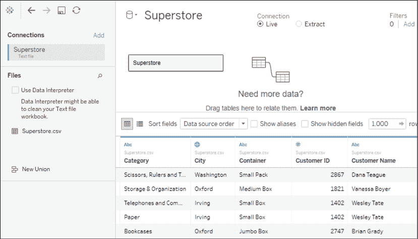

图 1.1：数据连接屏幕允许您建立与数据的连接

对于此连接，不需要其他配置，因此只需点击底部的**Sheet 1**标签，开始可视化数据！现在，您应该能看到 Tableau 的主要工作区，它看起来像这样：

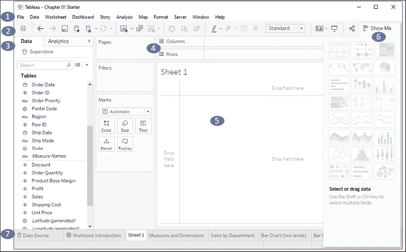

图 1.2：Tableau 主要界面的元素，按下面的描述编号

我们将在全书中使用特定术语来引用界面元素，所以请花点时间熟悉前面截图中编号的各个组件所使用的术语：

1.  **菜单**包含各种菜单项，用于执行广泛的功能。

1.  **工具栏**提供常见功能，如撤销、重做、保存、添加数据源等。

1.  **数据**窗格在选中**数据**标签时处于活动状态，并列出所选数据源的所有表和字段。**分析**窗格在选中**分析**标签时处于活动状态，提供可视化分析的补充选项。

1.  各种货架，如**页面**、**列**、**行**和**筛选器**，用于将字段从数据窗格拖放到这些区域。**Marks**卡片包含其他货架，如**颜色**、**大小**、**文本**、**详细信息**和**工具提示**。Tableau 将根据您拖放到货架上的字段来可视化数据。

    **数据**窗格中的数据字段可以添加到视图中。已被拖到架子上的字段称为*视图中的字段*或*活动字段*，因为它们在 Tableau 绘制可视化时起着积极作用。

1.  **画布**或**视图**是 Tableau 绘制数据可视化的地方。除了将字段拖到架子上，您还可以将字段直接拖到视图上。**标题**位于画布顶部。默认情况下，标题显示工作表的名称，但可以编辑或隐藏。

1.  **Show Me**是一个功能，允许您根据感兴趣的数据字段快速浏览各种类型的可视化。我们将在本章的最后部分查看**Show Me**。

1.  窗口底部的标签为您提供了编辑数据源的选项，并可以在不同的工作表、仪表板或故事之间导航和添加任意数量的项。通常，任何标签（无论是工作表、仪表板还是故事）都被泛称为**工作表**。

Tableau 工作簿是由数据源、工作表、仪表板和故事集合组成的。所有这些内容都会保存为一个单一的 Tableau 工作簿文件（`.twb`或`.twbx`）。工作簿组织为多种类型的标签集合：

+   工作表是一个单一的数据可视化，如条形图或折线图。由于“工作表”也是任何标签的通用术语，我们通常将工作表称为**视图**，因为它只是数据的一个视图。

+   **仪表板**是任何数量的相关视图和其他元素（如文本或图像）组合在一起，作为一个整体呈现，以向观众传达信息。仪表板通常设计为互动式。

+   **故事**是由仪表板或单一视图组成的集合，它们已被安排成以数据讲述一个叙事。故事也可能是互动式的。

在屏幕底部，您会注意到一些其他项。当您工作时，左下角的**状态栏**将显示关于视图、选择和用户的重要信息和详细信息。右下角的各种控件允许您在工作表、仪表板和故事之间导航，并通过**显示影片条**查看标签，或切换到工作簿中所有工作表的交互式缩略图显示。

现在您已连接到文本文件中的数据，我们将探索一些为数据可视化打基础的示例，并进一步构建一些基础的可视化类型。为此，请执行以下操作：

1.  从菜单中选择**文件** | **退出**。

1.  当系统提示保存更改时，选择**否**。

1.  从`\learning Tableau\Chapter 01`目录中，打开文件`Chapter 01 Starter.twbx`。此文件包含一个与`Superstore`数据文件的连接，并旨在帮助您完成本章的示例。

每章的文件包含一个`Starter`工作簿，允许你根据本书中的示例进行操作。如果你希望查看完整示例，可以打开该章的`Complete`工作簿。

连接到数据后，你已经准备好开始可视化和分析数据。随着你开始这样做，你将扮演零售连锁店分析师的角色。你将向数据提问，构建可视化来回答这些问题，并最终设计一个仪表板来分享结果。让我们从为理解 Tableau 如何可视化数据奠定基础开始。

# 构建可视化的基础

当你首次连接到如 `Superstore` 文件这样的数据源时，Tableau 会显示数据连接和**数据**窗格中的字段。你可以将字段从数据窗格拖到画布区域，或者拖到各个货架上，例如**行**、**列**、**颜色**或**大小**。正如我们将看到的，字段的放置将导致数据的不同编码，这取决于字段的类型。

## 度量和维度

数据源中的字段在**数据**窗格中可见，并且分为**度量**和**维度**。在旧版本的 Tableau 中，它们是**数据**窗格中的两个独立部分。在新版本中，每个表将会有通过一条线分隔的**度量**和**维度**：

图 1.3：每个表（该数据源仅有一个）上方列出了维度，线下列出了度量

**度量**和**维度**之间的区别是使用 Tableau 时需要理解的一个基本概念：

+   **度量**是需要聚合的值。例如，它们可以是求和、平均、计数，或者是最小值或最大值。

+   **维度**是决定度量聚合详细程度的值。你可以将它们看作是将度量切分或将度量归类的工具。视图中使用的维度组合定义了视图的基本细节层次。

作为一个示例（你可以在`Chapter 01 Starter`工作簿的**度量和维度**表中查看），考虑使用来自 `Superstore` 连接的 `Region` 和 `Sales` 字段创建的视图：

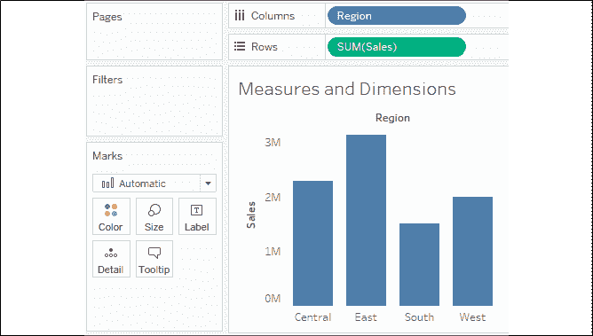

图 1.4：一个条形图，展示了度量和维度的使用

`Sales`字段在此视图中作为度量使用。具体来说，它是按总和进行聚合的。当你在视图中使用字段作为度量时，聚合类型（例如，`SUM`、`MIN`、`MAX` 和 `AVG`）将显示在活动字段上。注意，在上述示例中，**行**上的活动字段清楚地表示了`Sales`的总和聚合：`SUM(Sales)`。

`Region`字段是一个维度，每条数据记录都有四个值之一：**中部**，**东部**，**南部**或**西部**。当该字段作为视图中的一个维度使用时，它会切分度量。因此，视图显示了每个区域销售总额，而不是整体销售总额。

## 离散和连续字段

另一个重要的区别是字段是被用作**离散**还是**连续**。字段是离散还是连续决定了 Tableau 如何根据其在视图中的使用位置对其进行可视化。Tableau 将为字段的默认值（**数据**窗格中图标的颜色）和在视图中的使用方式（架子上活动字段的颜色）提供视觉指示。离散字段，如前面示例中的`Region`，是蓝色的。连续字段，如`Sales`，是绿色的。

在本书印刷版的屏幕截图中，您应该能够区分**离散**（蓝色）和**连续**（绿色）字段之间的轻微色差，但请在使用 Tableau 时特别注意界面。您还可以从 Packt Publishing 下载颜色图像包，网址为`https://static.packt-cdn.com/downloads/9781800200364_ColorImages.pdf`。

### 离散字段

离散（蓝色）字段的值显示为彼此明显且分开。离散值可以重新排序，仍然有意义。例如，您可以轻松地重新排列`Region`的值为`东部`，`南部`，`西部`和`中部`，而不是*图 1.4*中的默认顺序。

当在**行**或**列**架子上使用离散字段时，该字段定义了标题。在这里，离散字段`Region`定义了列标题：

图 1.5：列上的离散字段定义了列标题

在这里，它定义了行标题：

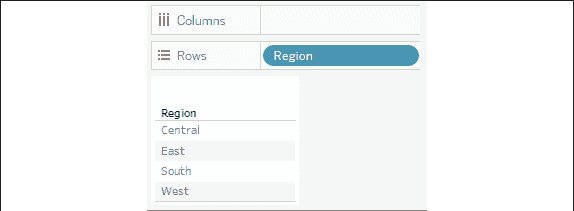

图 1.6：行上的离散字段定义了行标题

当用于**颜色**时，离散字段定义了一个离散的颜色调色板，其中每种颜色与字段的一个不同值对齐：

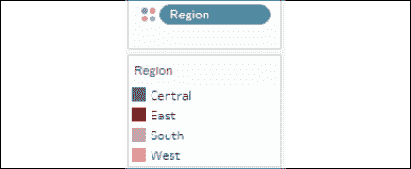

图 1.7：颜色上的离散字段定义了一个离散的颜色调色板

### 连续字段

连续（绿色）字段的值从第一个到最后一个连续流动。数字和日期字段通常（尽管不总是）在视图中用作连续字段。这些字段的值具有一种顺序，改变它们几乎没有意义。

当在**行**或**列**上使用时，连续字段定义了一个轴：

图 1.8：列（或行）上的连续字段定义了一个轴

当用于**颜色**时，连续字段定义了一个渐变：

图 1.9：颜色上的连续字段定义了一个渐变颜色调色板

非常重要的一点是，连续和离散是与度量和维度不同的概念。虽然大多数维度默认是离散的，大多数度量默认是连续的，但在视图中，也可以将任何度量作为离散字段，某些维度作为连续字段，如下所示：

图 1.10：度量和维度可以是离散的或连续的

要更改字段的默认设置，请右键单击**数据**窗格中的字段，然后选择**转换为离散**或**转换为连续**。

要更改字段在视图中的使用方式，请右键单击视图中的字段，然后选择**离散**或**连续**。另外，你可以在**数据**窗格中将字段从**维度**和**度量**之间拖放。

一般来说，你可以将不同类型字段之间的差异理解为：

+   选择维度和度量之间的区别告诉 Tableau *如何切分或聚合* 数据。

+   选择离散和连续之间的区别告诉 Tableau *如何展示* 数据，通过标题或轴，并定义单独的颜色或渐变。

在本书中的示例操作过程中，注意你在创建可视化时使用的字段，无论是维度还是度量，或者它们是离散的还是连续的。尝试将视图中的字段从连续转换为离散，反之亦然，以便理解在可视化中这些差异。我们将在将注意力转向数据可视化时，将这种理解付诸实践。

# 数据可视化

与数据源建立新的连接是探索和发现的邀请！有时，你可能会带着非常明确的问题和对你期望发现的内容有清晰的预期来面对数据。其他时候，你可能带着一般性的问题，几乎不知道自己会发现什么。Tableau 的可视化分析功能使你能够快速且反复地探索数据，提出新的问题，并进行新的发现。

以下可视化示例展示了一些最基础的可视化类型。当你进行这些示例时，请记住，目标不仅仅是学习如何创建某个特定的图表。实际上，这些示例旨在帮助你思考如何向数据提问，并通过反复的可视化过程获得答案。Tableau 旨在让这一过程直观、快速且透明。

比记住创建特定图表类型的步骤更重要的是理解如何以及为什么使用 Tableau 创建图表，并能够在提出新问题时调整你的可视化以获得新的见解。

## 条形图

**条形图**以视觉方式表示数据，使得跨不同类别比较值变得容易。条形的长度是你理解数据的主要方式。你还可以通过颜色、大小、堆叠和顺序来传达额外的属性和值。

在 Tableau 中创建条形图非常简单。只需将你希望查看的度量值拖放到**行**或**列**架上，并将定义类别的维度拖放到对面的**行**或**列**架上。

作为**Superstore**的分析师，你已经准备好开始一个以销售（特别是销售额）为重点的发现过程。在跟随示例的过程中，逐步操作`Chapter 01 Starter`工作簿中的工作表。`Chapter 01 Complete`工作簿包含完整的示例，随时可以对照你的结果：

1.  点击**按部门销售**标签页查看该工作表。

1.  将**数据**窗格中**度量值**下的`Sales`字段拖放到**列**架上。现在，你将得到一个条形图，表示数据源中所有数据的销售总额。

1.  将**数据**窗格中**维度**下的`Department`字段拖放到**行**架上。这会对数据进行切片，生成三条条形图，每条条形图的长度对应于各个部门的销售总额：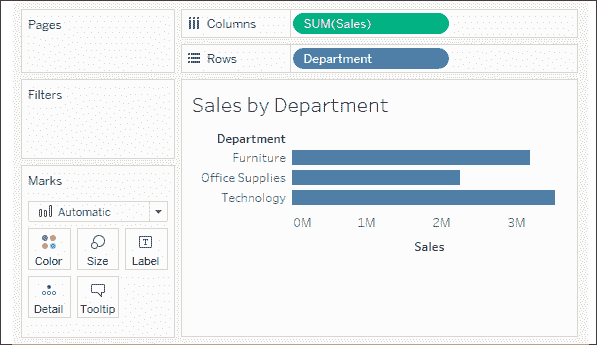

    图 1.11：完成前述步骤后，按部门销售的视图应如下所示

现在你有了一个横向条形图。这使得比较各个部门的销售额变得简单。**标记类型**下拉菜单在**标记**卡上设置为**自动**，表示 Tableau 已判断条形图是基于你所放置字段的最佳可视化方式。作为维度，`Department`对数据进行切片。由于它是离散的，它为数据中的每个部门定义了行标题。作为度量，`Sales`字段被聚合。由于它是连续的，它定义了一个坐标轴。条形图的标记类型使得每个部门的条形从`0`绘制到该部门销售总额的值。

通常，Tableau 会为视图中每一组维度值的组合绘制一个标记（例如条形图、圆形或方形）。在这个简单的情况下，Tableau 为每个`Department`的维度值（`Furniture`、`Office Supplies`和`Technology`）绘制一个单独的条形图。标记的类型可以通过**标记**卡上的下拉菜单进行查看和更改。在视图的左下角状态栏中，可以看到绘制的标记数量。

Tableau 使用不同的方式绘制不同的标记；例如，柱状图从 0（或者如果是堆叠柱状图，则从前一个柱子的末端）沿着轴绘制。圆圈和其他形状则根据定义轴的字段值的位置绘制。花点时间从 **标记** 卡片的下拉菜单中选择不同的标记类型进行实验。深入理解 Tableau 如何绘制不同标记类型将有助于你掌握这个工具。

### 深入分析的柱状图迭代

使用前面的柱状图，你可以轻松看到 **技术** 部门的总销售额比 **家具** 或 **办公用品** 部门都要多。如果你想进一步了解各部门在不同地区的销售金额，可以按照这两个步骤进行操作：

1.  转到 **二级柱状图** 工作表，你会发现一个与你之前创建的视图完全相同的初始视图。

1.  将 `Region` 字段从 **数据** 面板中的 **维度** 拖到 **行** 货架，并将其放置在已显示的 `Department` 字段左侧。

现在，你应该看到一个看起来像这样的视图：

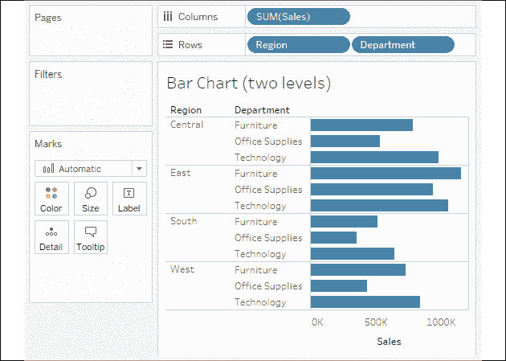

图 1.12：当你完成前面的步骤时，二级柱状图视图应该是这样的

你仍然有一个水平柱状图，但现在你已经将 `Region` 引入作为另一个维度，它改变了视图中的细节级别，并进一步切割了销售总和。通过将 `Region` 放在 `Department` 之前，你可以轻松比较给定地区内每个部门的销售额。

现在你开始有了一些发现。例如，**技术** 部门在每个地区的销售量都是最多的，除了 **东部**，在那里 **家具** 的销售量更高。**办公用品** 在任何地区的销售量都不是最高的。

考虑使用相同字段但排列方式不同的另一种视图：

1.  转到 **堆叠柱状图** 工作表，你会发现一个与你原始柱状图相同的视图。

1.  将 `Region` 字段从 **行** 货架拖到 **颜色** 货架上：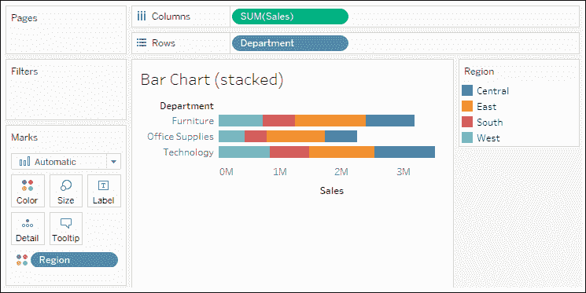

    图 1.13：堆叠柱状图的视图应该是这样的

现在，你有了一个 **堆叠柱状图**，而不是一个 **并排柱状图**。每个柱段根据 `Region` 字段的颜色编码。此外，颜色图例已添加到工作区。你没有改变视图中的细节级别，因此销售额仍然是按每个 `Region` 和 `Department` 的组合汇总的：

**视图详细级别**是使用 Tableau 时的一个关键概念。在大多数基本可视化中，视图中所有维度值的组合定义了该视图的最低详细级别。所有度量值将根据最低详细级别进行汇总或切片。在大多数简单视图中，标记的数量（在左下角状态栏中显示）对应于维度值的唯一组合数量。也就是说，每一个维度值组合都会对应一个标记。

+   如果`Department`是唯一用作维度的字段，你将获得部门级别的视图，视图中的所有度量值将按部门进行汇总。

+   如果`Region`是唯一用作维度的字段，你将获得地区级别的视图，视图中的所有度量值将按地区进行汇总。

+   如果在视图中同时使用`Department`和`Region`作为维度，你将获得部门和地区级别的视图。所有度量值将根据部门和地区的唯一组合进行汇总，并且每个部门和地区的组合都会有一个标记。

堆叠条形图在你想理解部分与整体关系时非常有用。现在可以更容易地看到每个部门在各个地区的销售额占总销售额的比例。然而，对于大多数地区，跨部门比较销售额非常困难。例如，你能轻松看出哪个部门在**东部**地区的销售额最高吗？这很困难，因为除了**西部**地区之外，条形图的每个部分都有不同的起始位置。

现在花些时间在条形图上进行实验，看看你能创建哪些变化：

1.  导航到**条形图（实验）**工作表。

1.  尝试将`Region`字段从**颜色**拖动到**标记**卡上的其他不同货架，例如**大小**、**标签**和**细节**。观察到，在每种情况下，条形图仍然保持堆叠，但会根据`Region`字段定义的视觉编码重新绘制。

1.  使用工具栏上的**交换**按钮来交换**行**和**列**的字段。这样，你可以非常轻松地将横向条形图转换为纵向条形图（反之亦然）：

    图 1.14：交换行和列按钮

1.  将**数据**面板中的**度量**部分的`Sales`字段拖动到**标记**卡上的`Region`字段上以替换它。如果需要，将`Sales`字段拖动到**颜色**，并注意颜色图例是连续字段的渐变。

1.  通过将其他字段拖动到不同的货架上进一步实验。注意你每一步操作时 Tableau 的表现。

1.  从**文件**菜单中，选择**保存**。

如果你的操作系统、机器或 Tableau 意外停止，那么**自动保存**功能应该可以保护你的工作。下次打开 Tableau 时，你将被提示恢复任何未手动保存的先前打开的工作簿。不过，你仍然应该养成经常保存工作的习惯，并且保持适当的备份。

随着你继续探索各种迭代，你将对可视化数据的灵活性产生信心。

## 折线图

**折线图**将可视化中相关的标记连接起来，以显示这些标记之间的移动或关系。标记的位置以及连接它们的线条是传达数据的主要方式。此外，你还可以使用大小和颜色来传达更多信息。

最常见的折线图类型是**时间序列**。时间序列显示了值随时间的变化。在 Tableau 中创建一个时间序列只需要一个日期和一个度量。

使用你刚保存的`Chapter 01 Starter`工作簿继续分析 Superstore 销售：

1.  导航到**按时间销售**工作表。

1.  将`Sales`字段从**度量**拖动到**行**。这会给你一个单一的垂直条，表示数据源中所有销售的总和。

1.  要将其转化为时间序列，你必须引入一个日期。将`订单日期`字段从左侧**数据**面板中的**维度**拖动并放入**列**。Tableau 有一个内置的日期层级，默认的`年份`层级已经为你创建了一个连接四年的折线图。你可以清楚地看到销售额逐年增长：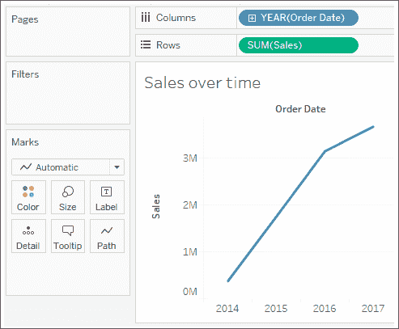

    图 1.15：创建最终折线图的一个中间步骤；显示了按年份的销售总和

1.  在**列**上的`YEAR(订单日期)`字段使用下拉菜单（或右键单击该字段），将日期字段更改为**季度**。你可能会注意到下拉菜单中列出了两次**季度**。我们将在*第三章：超越基础可视化*的*日期与时间可视化*部分中探讨日期部分、值和层级的各种选项。现在，选择第二个选项：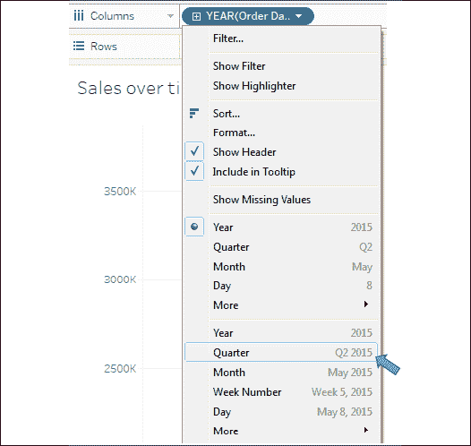

    图 1.16：在下拉菜单中选择第二个季度选项。

请注意，当查看按季度销售时，周期性模式非常明显：

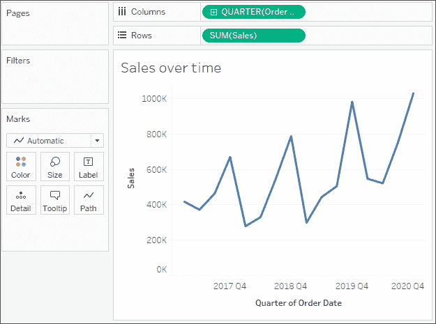

图 1.17：你的最终视图显示了过去几年每个季度的销售情况。

让我们考虑一些折线图的变体，它们可以让你提出和解答更深入的问题。

### 深入分析的折线图迭代

现在，你正在查看整体的时间销售情况。让我们进行一些稍微深入的分析：

1.  导航到**按时间销售（重叠的线条）**工作表，在这里你将看到与刚刚创建的视图相同的视图。

1.  将`区域`字段从**维度**区域拖到**颜色**区域。现在每个地区都有一条折线，每条线的颜色不同，并且图例显示了每个颜色代表哪个地区。与条形图类似，向**颜色**区域添加维度会将标记分开。然而，与条形图中的分段堆叠不同，折线图的线条并没有堆叠。相反，这些线条按照每个地区和季度的销售总和的确切值绘制。这使得比较变得既简单又准确。有趣的是，可以观察到每个地区的周期性模式：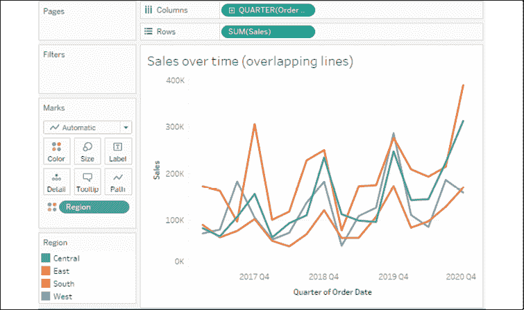

    图 1.18：此折线图展示了按季度的销售总额，不同地区使用不同颜色的线条。

只有四个地区时，保持线条区分相对容易。但是，如果维度有更多的不同值怎么办？让我们在以下示例中考虑这种情况：

1.  转到**按时间销售（多行）**工作表，你会发现一个与刚才创建的视图完全相同的视图。

1.  将`类别`字段从**维度**区域拖动并直接放到**标记**卡上的`区域`字段上。这会用`类别`替代`区域`字段。现在你有了 17 条重叠的线条。通常，你会希望避免超过两到三条重叠线条。但是，你也可以考虑使用颜色或大小来展示一个在其他线条背景下重要的线条。同时，请注意，点击**颜色**图例中的一个项目将突出显示视图中关联的线条。高亮显示是突出单个项目并将其与其他项目进行比较的有效方法。

1.  将`类别`字段从**颜色**区域拖动到**行**区域。现在你会看到每个类别的折线图。你现在可以在不出现过多重叠的情况下比较每个产品的趋势，同时仍然能够比较不同时间段的趋势和模式。这是一个火花线可视化的开始，更多内容将在*第十章*，*高级可视化*中详细展开：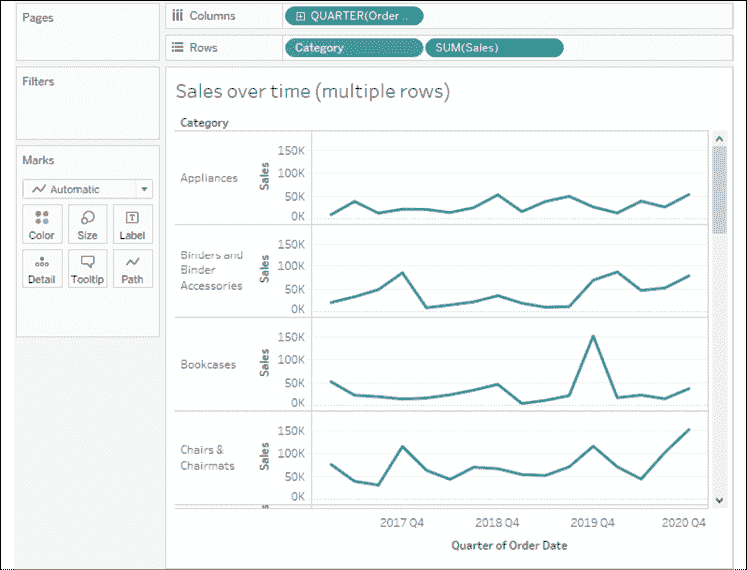

    图 1.19：你的最终视图应该是每个类别的折线图系列。

    每个`类别`的线条变化使你能够注意到趋势的变化、极值和变化率。

## 地理可视化

在 Tableau 中，内置的地理数据库会识别诸如`国家`、`州`、`城市`、`机场`、`国会选区`或`邮政编码`等字段的地理角色。即使你的数据不包含纬度和经度值，你也可以仅使用地理字段在地图上绘制位置。如果你的数据确实包含纬度和经度字段，你也可以使用这些字段，而不是生成的值。

Tableau 会根据字段名称和数据中的部分值自动分配地理角色给某些字段。你可以通过右键点击**数据**窗格中的字段，并使用**地理角色**选项来分配或重新分配地理角色。这也是查看可用的内置地理角色的好方法。

地理可视化在你需要了解事件发生的地点以及数据中是否存在空间关系时非常有价值。Tableau 提供了几种类型的地理可视化：

+   填充地图

+   符号地图

+   密度地图

此外，Tableau 可以读取来自某些数据库的空间文件和几何形状，并呈现空间对象、多边形等。我们将在*第十二章*，*探索地图和高级地理空间功能*中详细了解这些及其他地理空间功能。现在，我们将考虑一些地理可视化的基础原则。

### 填充地图

填充地图用于填充区域，例如国家、州或邮政编码，以显示位置。填充区域的颜色可以用来传达诸如平均销售额或人口等指标，以及诸如地区等维度。这些地图也被称为**分区地图**。

假设你想了解超市的销售情况，并查看是否存在任何地理模式。

注意：如果你的区域设置不是美国，你可能需要使用**编辑位置**选项将国家设置为**美国**。

你可以采用如下方法：

1.  转到**按州销售**工作表。

1.  双击**数据**窗格中的`州`字段。Tableau 会自动使用`纬度（生成）`、`经度（生成）`和`州`字段创建地理可视化。

1.  从**数据**窗格中拖动`销售`字段并将其放置到**标记**卡上的**颜色**架上。根据你使用的字段和架子，Tableau 已将自动标记类型更改为**地图**：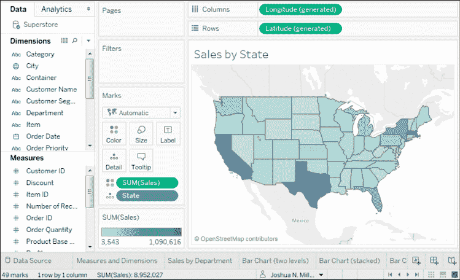

    图 1.20：显示每个州销售总额的填充地图

填充地图将每个州填充为一种颜色，以表示该州销售总额的相对大小。现在在视图中可见的颜色图例显示了值的范围，并指出销售最少的州的总销售额为**3,543**，而销售最多的州的总销售额为**1,090,616**。

当你查看底部状态栏中显示的标记数量时，你会看到它是**49**。仔细检查后会发现，这些标记包括了 48 个州和华盛顿特区；夏威夷和阿拉斯加没有显示。Tableau 只有在数据中存在并且没有被过滤器排除的情况下，才会绘制地理标记，例如填充州。

请注意，地图确实显示了加拿大、墨西哥和其他不包含在数据中的位置。这些位置是从在线地图服务中检索的背景图像的一部分。然后，州的标记会绘制在背景图像之上。我们将在*第十二章*的*映射技术*部分中查看如何自定义地图，甚至使用其他地图服务。

填充地图在互动仪表板中效果很好，并且具有相当的美学价值。然而，某些类型的分析在填充地图上非常困难。与其他可视化类型不同，后者可以使用大小来传达数据的各个方面，填充地理区域的大小仅与地理面积有关，这可能使比较变得困难。例如，哪个州的销售额最高？你可能会认为是德克萨斯州或加利福尼亚州，因为较大的区域会影响你的感知，但你是否会猜到马萨诸塞州呢？一些地点可能足够小，以至于和更大的区域相比，它们甚至不会显示出来。使用填充地图时要小心，并考虑在仪表板上与其他可视化结合使用，以便更清晰地传达信息。

### 符号地图

在符号地图中，地图上的标记不是作为填充区域绘制的；而是作为形状或符号放置在特定的地理位置。大小、颜色和形状也可以用来编码额外的维度和度量。

按照以下步骤继续分析超级商店的销售数据：

1.  转到**邮政编码销售**表。

1.  双击**维度**下的`Postal Code`。Tableau 会自动将`Postal Code`添加到**标记**卡的**详细信息**中，并将`Longitude (generated)`和`Latitude (generated)`添加到**列**和**行**中。默认情况下，标记类型设置为圆形，每个邮政编码会在正确的经纬度上绘制一个圆形标记。

1.  将`Sales`从**度量**拖到**标记**卡上的**大小**架上。这将根据每个邮政编码的销售总额来调整每个圆形的大小。

1.  将`Profit`从**度量**拖到**标记**卡上的**颜色**架上。这将根据利润的总和为标记着色。现在，你可以同时看到利润和销售的地理位置。这非常有用，因为你将看到一些销售额高但利润低的位置，这可能需要采取措施。

在进行一些精细调整大小和颜色后，最终视图应该是这样的：

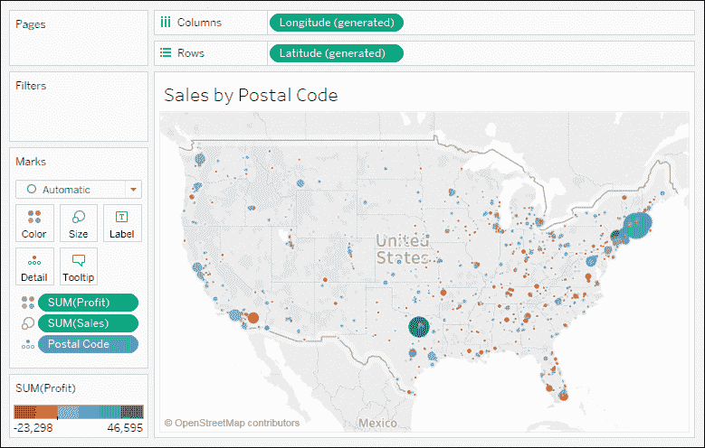

图 1.21：一张符号地图，显示每个邮政编码的利润总和（用颜色编码）和销售总额（用大小编码）。

有时候，你可能需要调整符号地图上的标记，使其更加可见。以下是一些选项：

+   如果标记重叠，请点击**颜色**货架，并将透明度设置为**50%**到**75%**之间。此外，添加一个深色边框。这会使标记更突出，你通常可以更好地分辨重叠的标记。

+   如果标记太小，请点击**大小**货架并调整滑块。你还可以双击**大小**图例并编辑 Tableau 如何分配大小的详细信息。

+   如果标记过于模糊，双击**颜色**图例并编辑 Tableau 如何分配颜色的详细信息。尤其当你使用定义颜色渐变的连续字段时，这非常有用。

调整大小并使用**阶梯颜色**和**使用完整的颜色范围**的组合，如此处所示，产生了此示例的结果：

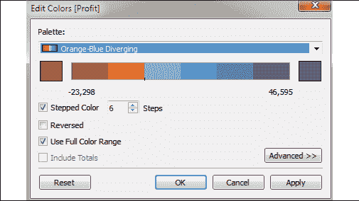

图 1.22：编辑颜色对话框包含更改步骤数、反转、使用完整颜色范围、包括总计以及调整范围和中心点的高级选项

与填充地图不同，符号地图允许你使用大小来可视化编码数据的某些方面。符号地图还允许更高的精度。实际上，如果你的数据中有经纬度信息，你可以非常精确地将标记绘制到街道地址级别的详细信息。这种可视化类型还允许你映射没有明确边界的地点。

有时，当你手动在**标记**卡片下拉菜单中选择**地图**时，会收到一条错误信息，指示在当前视图的详细程度下不支持填充地图。在这种情况下，Tableau 正在渲染一个没有内置形状的地理位置。

除了填充地图不可用的情况外，你需要决定哪种类型最能满足你的需求。在后续章节中，我们还将考虑将填充地图和符号地图结合在一个视图中的可能性。

### 密度图

密度图显示了地理区域内数值的分布和集中度。标记不再是单独的点或符号，而是融合在一起，显示出高密度区域的强度。你可以控制**颜色**、**大小**和**强度**。

假设你想了解订单的地理分布。你可以按照以下步骤创建一个密度图：

1.  导航到**订单密度**工作表。

1.  双击**数据**窗格中的`邮政编码`字段。与之前一样，Tableau 会自动使用`纬度（生成）`、`经度（生成）`和`州`字段创建符号地图地理可视化。

1.  使用**标记**卡片上的下拉菜单，将标记类型更改为**密度**。单独的圆点现在会融合在一起，显示出浓度：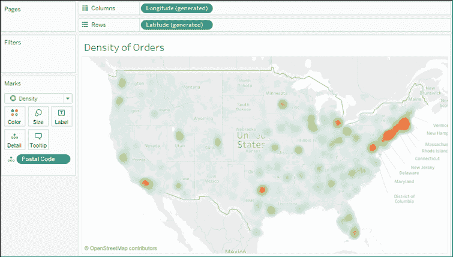

    图 1.23：显示按邮政编码聚集的密度图

尝试使用**颜色**和**大小**选项进行实验。例如，点击**颜色**时，会显示一些特定于**密度**标记类型的选项：

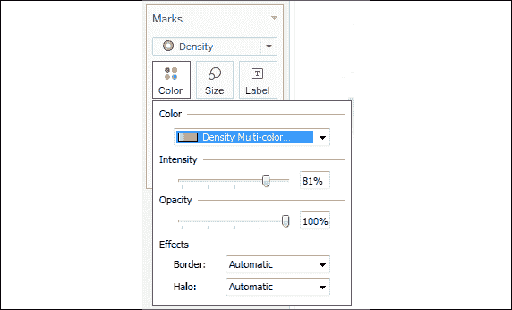

图 1.24：调整颜色、强度、不透明度和效果选项以显示密度标记

有几种颜色调色板可供选择，这些调色板非常适合密度标记（默认的颜色调色板适用于浅色背景，但也有其他调色板适用于深色背景）。**强度**滑块允许你根据密度来调整标记的强度。**不透明度**滑块让你决定标记的透明度。

这个密度地图显示了东海岸订单的高密度集中。你有时会看到仅反映人口密度的模式。在这种情况下，分析可能不会特别有意义。在这种情况下，东海岸的集中度与西海岸的低密度形成鲜明对比，令人感兴趣。

## 使用**Show Me**

**Show Me**是 Tableau 的一个强大组件，它将选定和激活的字段安排到所需的可视化类型中。**Show Me**工具栏显示不同类型可视化的小缩略图，允许你通过单击创建可视化。根据你在**数据**面板中选择的字段以及已显示的字段，**Show Me**将启用可能的可视化并突出显示推荐的可视化类型。

通过执行以下步骤来探索**Show Me**的功能：

1.  导航到**Show Me**工作表。

1.  如果**Show Me**面板没有展开，请点击工具栏右上角的**Show Me**按钮以展开面板。

1.  按住*Ctrl*键，同时点击**数据**面板中的`邮政编码`、`州`和`利润`字段以选择这些字段。选中这些字段后，**Show Me**应如下所示：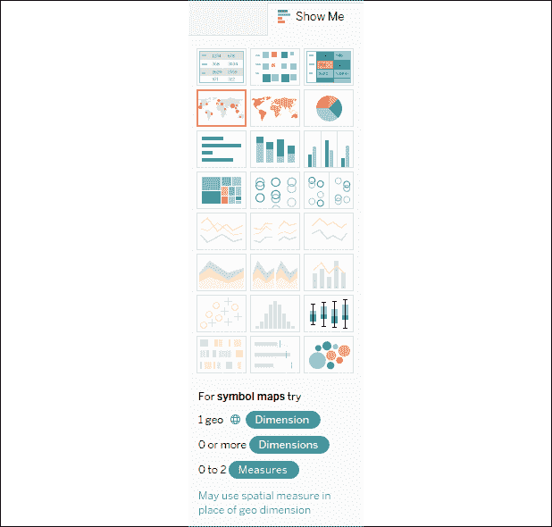

    图 1.25：**Show Me**界面

注意到**Show Me**窗口启用了某些可视化类型，如**文本表**、**热力图**、**符号地图**、**填充地图**和**条形图**。这些是根据视图中已显示的字段以及在**数据**面板中选择的字段可能生成的可视化类型。**Show Me**会突出显示推荐的可视化类型，并在你悬停在每个可视化类型上时，提供所需字段的描述。例如，符号地图需要一个地理维度和 0 到 2 个度量。

其他可视化类型被灰显，如**折线图**、**区域图**和**直方图**。如果当前视图中选择的字段无法生成这些类型的可视化，**Show Me**将不允许创建它们。将鼠标悬停在灰显的折线图选项上，它会显示折线图需要一个或多个度量（你已选择），但还需要一个日期字段（你没有选择）。

Tableau 会绘制带有日期以外字段的折线图。Show Me 为你提供了通常被认为是可视化的良好实践选项。然而，也可能有时候你知道使用折线图会更好地展示你的数据。理解 Tableau 是如何根据字段和架构渲染可视化，而不是总是依赖 Show Me，将让你在可视化上有更大的灵活性，并且当 Show Me 无法提供你想要的确切结果时，你可以重新排列数据。与此同时，你需要培养对良好可视化实践的意识。

Show Me 可以作为一个强大的工具，让你快速在不同的可视化类型之间迭代，以便从数据中寻找洞察。但作为数据探索者、分析师和讲述者，你应该将 Show Me 看作一个提供建议的有用指南。你可能知道，某种可视化类型能比 Show Me 提供的建议更有效地回答你的问题。你也可能已经有了一个可视化类型的计划，这个类型会作为仪表板的一部分工作，但 Show Me 中并没有包括它。

当你能有效地使用 Show Me 但同样能够舒适地在没有它的情况下构建可视化时，你就已经在学习和掌握 Tableau 的道路上迈出了坚实的一步。Show Me 是快速迭代可视化的强大工具，当你在寻找洞察和提出新问题时，它非常有用。它也适合从一个标准可视化开始，再进行进一步定制。它是一个出色的教学和学习工具。

然而，要小心不要将其当作一种依赖工具，而不了解可视化是如何从数据中构建出来的。花时间评估为什么某些可视化是可行的，而某些则不可行。在选择某种可视化类型时，暂停一下，查看使用了哪些字段和架构。

通过点击各种可视化类型，尝试使用 Show Me 结束这个示例，寻找根据可视化类型可能显得更为明显或不太明显的数据洞察。**圆形视图**和**箱线图**展示了每个州邮政编码的分布情况。条形图则很容易揭示多个具有负利润的邮政编码。

现在你已经熟悉了如何创建数据的单个视图，我们来将注意力集中到将它们整合到一个仪表板中。

# 将所有内容整合到一个仪表板中

通常，你需要多个可视化来传达数据的完整故事。在这些情况下，Tableau 使得你可以轻松地将多个可视化组合在一个仪表板上。在 Tableau 中，**仪表板**是由视图、筛选器、参数、图片和其他对象组成的集合，这些元素共同作用，以传达数据故事。仪表板通常是互动式的，允许最终用户探索数据的不同方面。

仪表板服务于多种目的，可以根据不同的受众进行定制。考虑以下可能的仪表板：

+   一个利润和销售的概览视图，让高管可以快速了解公司的当前状态

+   一个交互式仪表板，允许销售经理深入销售区域以识别威胁或机会

+   一个仪表板，允许医生跟踪患者的再入院情况、诊断和手术，从而做出更好的患者护理决策

+   一个仪表板，允许房地产公司高管识别趋势并为各种公寓综合体做出决策

+   一个交互式仪表板，供贷款官员根据按信用评级和地理位置细分的投资组合做出贷款决策

针对不同受众和高级技术的注意事项将在*第八章*，*通过仪表板讲述数据故事*中详细介绍。

## 仪表板界面

当你创建一个新的仪表板时，界面与设计单一视图时略有不同。我们将在简要浏览界面后开始设计你的第一个仪表板。你可以导航到**Superstore Sales**工作表并快速查看。

仪表板窗口由多个关键组件组成。使用这些对象的技巧将在*第八章*，*通过仪表板讲述数据故事*中详细介绍。现在，先集中熟悉可用的选项。你会注意到，左侧的侧边栏已被仪表板特定的内容替代：

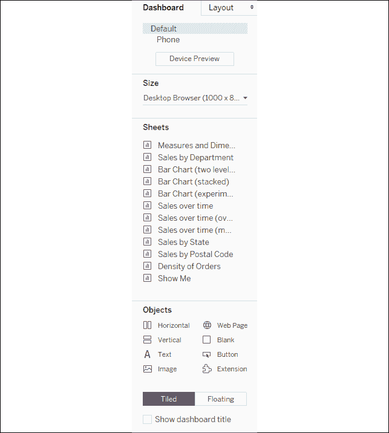

图 1.26：仪表板的侧边栏

左侧的侧边栏包含两个标签：

+   一个**仪表板**标签，用于调整尺寸选项并向仪表板添加工作表和对象。

+   一个**布局**标签，用于调整仪表板上各种对象的布局。

**仪表板**窗格包含基于目标设备的预览选项，并有多个部分：

+   一个**尺寸**部分，用于仪表板的尺寸选项。

+   一个**工作表**部分，包含所有可以放置在仪表板上的工作表（视图）。

+   一个**对象**部分，包含可以添加到仪表板的额外对象。

你可以通过拖放方式向仪表板添加工作表和对象。当你拖动视图时，轻灰色的阴影将显示工作表被放置在仪表板中的位置。你也可以双击任何工作表，它将被自动添加。

除了添加工作表外，还可以向仪表板添加以下对象：

+   **水平**和**垂直**布局容器将让你对布局进行更精细的控制。

+   **文本**允许你添加文本标签和标题。

+   可以添加**图像**甚至嵌入**网页**内容。

+   一个**空白**对象允许你在仪表板中保留空白空间，或者可以作为占位符，直到设计更多内容。

+   一个**导航**对象允许用户在仪表板之间进行导航。

+   一个**导出**按钮允许最终用户将仪表板导出为 PowerPoint、PDF 或图片。

+   **扩展**功能让你能够添加你或第三方开发的控件和对象，用于与仪表板交互并提供扩展功能。

使用切换按钮，你可以选择是否将新对象添加为**平铺**或**浮动**。**平铺**对象会紧贴其他平铺对象或布局容器，按平铺布局排列。**浮动**对象则会浮动在仪表板上，层叠显示。

当工作表首次添加到仪表板时，工作表视图中可见的任何图例、筛选器或参数将会添加到仪表板中。如果你希望稍后再添加它们，选择仪表板中的工作表，然后点击右上角的小下拉箭头。几乎每个对象都有下拉箭头，提供了许多选项来微调对象的外观和控制行为。

注意仪表板上选定对象的各种控件：

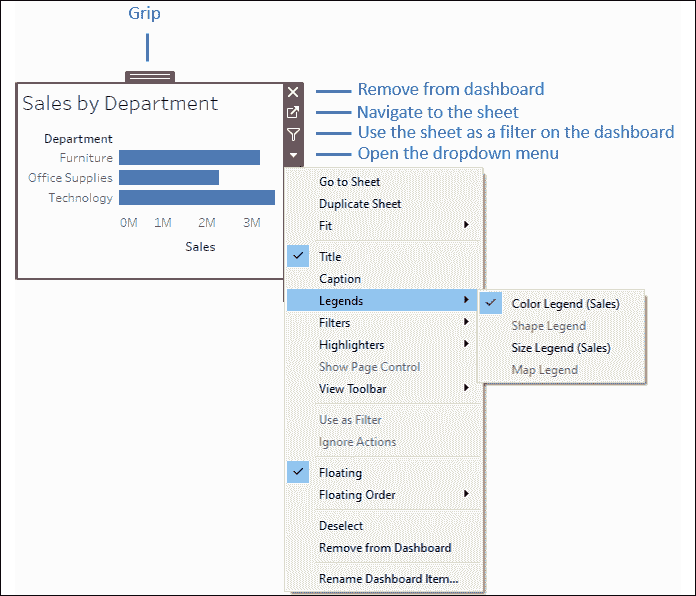

图 1.27：选择仪表板上的对象时，各种控件和 UI 元素将变得可见。

你可以使用边框调整仪表板上对象的大小。**抓取器**（标注在*图 1.27*中）允许你在对象放置后移动它。我们将在后续考虑其他选项。

## 构建你的仪表板

了解了界面概览后，你现在可以按照以下步骤开始构建仪表板：

1.  导航到**超级商店销售**表格。你应该能看到一个空白的仪表板。

1.  依次双击左侧**仪表板**部分列出的每个表格：**按部门销售**、**按时间销售**、和**按邮政编码销售**。注意，双击对象会将其添加到仪表板布局中。

1.  通过在侧边栏左下角勾选**显示仪表板标题**来为仪表板添加标题。

1.  在仪表板中选择**按部门销售**表格，并点击下拉箭头显示菜单。

1.  选择**适应** | **整个视图**。**适应**选项描述了可视化应如何填充任何可用空间。

    使用各种适应选项时请小心。如果你使用的是大小未固定的仪表板，或者你的视图根据交互动态改变显示项的数量，那么曾经看起来不错的布局可能就不再那么适配视图了。

1.  点击选择**销售**大小图例。使用**X**选项将该图例从仪表板中移除：

    图 1.28：点击图例选择它，然后点击 X 将其从仪表板中移除。

1.  点击选择**利润**颜色图例。使用**抓取器**将其拖动并放置到地图下方。

1.  对于每个视图（**按部门销售**、**按邮政编码销售**和**按时间销售**），通过点击视图中的空白区域来选择该视图。然后，点击**用作筛选器**选项，将该视图设置为仪表盘的交互式筛选器：

    图 1.29：点击“用作筛选器”按钮，将视图用作仪表盘中的筛选器

    你的仪表盘应该是这样的：

    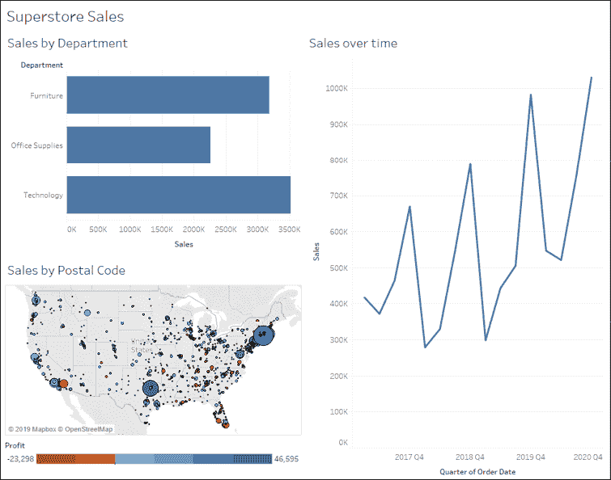

    图 1.30：由三个视图组成的最终仪表盘

1.  花点时间与仪表盘互动。点击各种标记，例如条形、州和折线的点。注意，每次选择都会筛选仪表盘中的其余内容。点击已选标记将取消选择并清除筛选器。另外，注意在多个视图中选择标记会使筛选器一起工作。例如，在**按部门销售**中选择**家具**的条形图，并在**按时间销售**中选择**2019 年第四季度**，你将能看到所有在 2019 年第四季度有家具销售的邮政编码。

恭喜你！你现在已经创建了一个允许你进行交互式分析的仪表盘！

作为超级商店连锁的分析师，你的可视化帮助你探索和分析数据。你创建的仪表盘可以与管理层成员共享，并可以作为帮助他们看到和理解数据、做出更好决策的工具。当经理选择家具部门时，立刻可以明显看出，某些地区的销售额很高，但利润却很低。这可能会导致决策，例如改变营销策略或为该地区重新聚焦销售目标。很可能，这需要进一步分析，以确定最佳的行动方案。在这种情况下，Tableau 将帮助你继续发现、分析和讲述数据的循环。

# 总结

Tableau 的可视化环境允许快速和迭代的过程，帮助你通过视觉方式探索和分析数据。你已经迈出了了解如何使用平台的第一步。你连接了数据，并通过一些关键的可视化类型，如条形图、折线图和地理可视化，来探索和分析数据。在这个过程中，你专注于学习技巧，并理解了关键概念，如度量和维度、离散和连续字段之间的区别。最后，你将所有元素整合在一起，创建了一个完整的仪表盘，使最终用户能够理解你的分析并做出自己的发现。

在下一章中，我们将探索 Tableau 如何与数据互动。你将接触到基本概念和如何连接各种数据源的实际示例。结合你刚刚学到的构建可视化的关键概念，你将为进一步深入的可视化、分析和讲述完全交互式的数据故事做好充分准备。
