# 4

# 从计算和参数开始一次冒险

我们已经看到，通过简单地连接数据并拖放字段，在 Tableau 中可以进行令人惊叹的发现、分析和数据故事讲述。现在，我们将开始一次计算的冒险之旅。

计算极大地扩展了 Tableau 中分析、设计和交互性的可能性。在本章中，我们将看到计算如何在各种方式中得到应用。我们将看到计算如何用来解决数据中的常见问题，如何通过添加新的维度和度量来扩展数据，以及如何在交互性方面提供更多灵活性。

同时，虽然计算提供了难以置信的力量和灵活性，但它们也带来了复杂性和精细度。在你阅读本章时，尽量理解 Tableau 中计算工作原理背后的关键概念。像往常一样，跟随示例操作，但也可以自由探索和实验。目标不仅仅是得到一份可以复制的计算列表，而是理解如何利用计算来解决问题，并为你的可视化和仪表板添加创意功能。

本章的前半部分重点是打下基础，而后半部分则提供了相当多的实用示例。我们将在这里学习的主题如下：

+   四种主要计算类型概述

+   创建和编辑计算

+   行级计算示例

+   聚合计算示例

+   参数

+   实用示例

+   性能考虑

我们将从介绍 Tableau 中计算的类型开始，然后深入一些示例。

# 计算介绍

计算通常在 Tableau 中被称为**计算字段**，因为在大多数情况下，当你创建一个计算时，它会显示为数据面板中的新度量或维度。计算由包含函数、操作以及对其他字段、参数、常量、分组或集合的引用的代码组成。这个代码会返回一个值。有时，这个结果是按数据行级别计算的，有时则是在聚合级别上完成。接下来，我们将讨论 Tableau 的主要计算类型之间的区别。

## 四种主要计算类型

理解 Tableau 中计算的最基本方式是将其分为四种主要类型：

+   **行级计算**：这些计算是针对每一行底层数据执行的。

+   **聚合计算**：这些计算是在聚合级别上执行的，聚合级别通常由视图中使用的维度定义。

+   **细节级别计算**：这些特殊的计算是按指定的细节级别进行的聚合，结果可在行级别上获得。

+   **表计算**：这些计算是在由数据源返回到 Tableau 的聚合数据表上执行的。

理解并识别四种主要的计算类型将使你能够充分利用 Tableau 中计算的强大功能和潜力。

在本章中，我们将详细了解 Tableau 中四种主要计算类型中的两种：行级计算和聚合计算。剩下的两种类型将在*第五章*，*利用细节级别计算*，以及*第六章*，*深入探讨表格计算*中讨论。

在思考如何使用计算解决问题时，始终考虑你可能需要的计算类型。在本章及接下来的两章中，会有一些提示帮助你思考*为什么*使用某种类型的计算。

现在我们已经了解了 Tableau 中主要的计算类型，接下来我们将看到如何创建和编辑这些计算。

## 创建和编辑计算

在 Tableau 中创建计算字段有多种方法：

1.  从菜单中选择**分析** | **创建计算字段...**。

1.  使用**数据**面板中**维度**旁边的下拉菜单：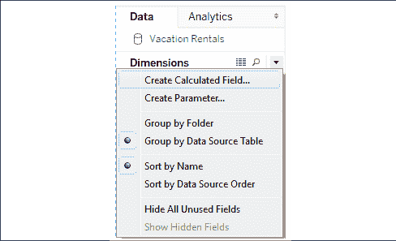

    图 4.1：创建计算字段… 选项

1.  右键单击**数据**面板中的空白区域，选择**创建计算字段...**。

1.  使用数据面板中的字段、集合或参数的下拉菜单，选择**创建** | **计算字段...**。计算将以你选择的字段为参考开始。

1.  双击**行**、**列**或**度量值**架上的空白区域，或在**标记**卡上的空白区域创建临时计算（尽管这不会显示完整的计算编辑器）。

1.  当你创建计算字段时，它将成为当前选中的数据源的一部分。你可以通过使用下拉菜单选择**编辑...**来编辑数据面板中现有的计算字段。

创建和编辑计算的界面如下所示：


图 4.2：创建和编辑计算界面

此窗口有几个关键特性：

+   **计算字段名称**：在此处输入计算字段的名称。创建后，计算字段将作为数据面板中的一个字段显示，字段名称为你在此文本框中输入的名称。

+   **代码编辑器**：在此文本区域输入代码以执行计算。编辑器包括自动完成已识别的字段和函数功能。此外，你可以将字段和文本片段拖放到代码编辑器和数据面板之间。

+   编辑器底部的**指示器**将提醒你代码中的错误。此外，如果计算被用于视图或其他计算字段，你将看到一个下拉指示器，允许你查看依赖关系。点击**应用**按钮以将更改应用到整个工作簿，同时保持计算编辑器打开。**确定**按钮将保存代码更改并关闭编辑器。如果你希望放弃所做的更改，点击右上角的**X**按钮取消更改。

+   **函数列表**包含了你在代码中可以使用的所有函数。许多函数将在本章的示例中使用或讨论。Tableau 按照函数的总体用途将其分组：

    +   **数字**：数学函数，例如四舍五入、绝对值、三角函数、平方根和指数。

    +   **字符串**：用于字符串操作的函数，例如获取子字符串、在字符串中查找匹配项、替换字符串中的部分内容，以及将字符串值转换为大写或小写。

    +   **日期**：用于处理日期的函数，例如查找两个日期之间的差异、向日期添加间隔、获取当前日期以及将非标准格式的字符串转换为日期。

    +   **类型转换**：用于将字段从一种类型转换为另一种类型的函数，例如将字符串转换为整数，将整数转换为浮动小数，或将字符串转换为日期。我们将在下一部分介绍主要的 Tableau 数据类型。

    +   **逻辑**：决策函数，例如`if` `then` `else` 逻辑或`case` 语句。

    +   **聚合**：用于聚合的函数，例如求和、获取最小值或最大值，或计算标准差或方差。

    +   **透传**（仅在与某些数据库（如 SQL Server）建立实时连接时可用）：这些函数允许你将原始 SQL 代码传递给底层数据库，并以行级或聚合级别检索返回的值。

    +   **用户**：用于获取用户名并检查当前用户是否为某个组成员的函数。这些函数通常与逻辑函数结合使用，用于定制用户体验或在发布到 Tableau Server 或 Tableau Online 时实施基于用户的安全性。

    +   **表计算**：这些函数与其他函数不同，它们在从数据源返回聚合数据并渲染视图之前进行操作，*操作的是返回后的数据*。

    +   **空间**：这些函数允许你使用空间数据进行计算。

+   在列表中选择一个函数或点击字段、参数或代码中的函数时，右侧会显示关于选择的详细信息。这在你需要嵌套其他计算字段、查看特定计算字段的代码，或者想理解某个函数的语法时非常有用。

在对界面有较好理解的基础上，接下来我们简要看一下计算的基础概念。

## 数据类型

计算概念的基础是**数据类型**，它们描述了字段、参数存储的或函数返回的数据信息类型。Tableau 区分了六种数据类型：

+   **数字（小数）**：这些是包含小数点后位数的数值。例如`0.02`、`100.377`或`3.14159`都是小数值。

+   **数字（整数）**：这些是没有小数部分的整数或整数值。例如`5`、`157`和`1,455,982`都是整数。

+   **日期和时间**：这些是带有时间的日期。例如`1980 年 11 月 8 日 12:04:33 PM`是日期和时间类型。

+   **日期**：这些是没有时间的日期。例如`1979 年 7 月 17 日`是日期类型。

+   **字符串**：这些是字符的序列。字符串可以由字母字符、数字字符、符号或特殊字符组成，甚至可以是空的（空字符串）。例如`Hello World`、`password123`和`%$@*!`都是字符串。在代码中，字符串将被单引号或双引号包围。

+   **布尔值**：这是一个真假值。`TRUE`、`FALSE`以及表达式`1=1`（结果为真）和`1=2`（结果为假）都属于布尔类型。

+   **空间**：描述位置、线条或形状与空间区域相关的复杂值。

Tableau 中的每个字段都有这些数据类型之一，Tableau 中的每个函数都会返回这些数据类型之一。有些函数需要输入匹配某些数据类型，如果你尝试传入错误的类型，会收到错误提示。

一些类型可以转换为其他类型。例如，使用上面提到的一些类型转换函数，你可以将字符串`"2.81"`转换为小数值`2.81`。你也可以将这个小数值转换为整数，但在这种情况下，你会丢失小数点后面的位数，转换后的整数会变成`2`。

数据类型不同于显示的格式。例如，你可以选择将小数格式化为百分比（例如，`0.2`可以显示为`20%`）、货币格式（例如，`144.56`可以格式化为`$144.56`），甚至可以格式化为没有小数的数字（例如，`2.81`会被四舍五入为`3`）。

在我们继续之前，请注意字段和函数的数据类型。

## 额外的函数和运算符

Tableau 支持众多函数和操作符。除了计算屏幕上列出的函数外，Tableau 还支持以下操作符、关键字和语法约定：

| **操作符 / 关键字** | **描述** |
| --- | --- |
| AND | 逻辑*与*，用于判断两个布尔值（`true/false`）或语句之间的关系 |
| OR | 逻辑*或*，用于判断两个布尔值或语句之间的关系 |
| NOT | 逻辑*非*，用于否定布尔值或语句 |
| = 或 == | 逻辑*等于*，用于测试两个语句或值的相等性（在 Tableau 的语法中，单等号或双等号等效） |
| + | 数值或日期值的加法，或字符串的连接 |
| - | 数值或日期值的减法 |
| * | 数值的乘法 |
| / | 数值除法 |
| ^ | 对数值进行幂运算 |
| ( ) | 用括号定义运算顺序或括起函数参数 |
| [ ] | 方括号用于括起字段名称 |
| { } | 大括号用于括起详细程度计算 |
| // | 双斜杠表示开始注释 |

在进行计算时，单词形式的字段名称可以选择性地用括号括起来。包含空格、特殊字符或来自二级数据源的字段名称必须用括号括起来。

你将在接下来的几章中看到这些操作符和函数，因此要熟悉它们的用法。现在，让我们考虑将引导我们完成一些实际示例的数据。

## 示例数据

在开始一些示例之前，让我们考虑一个示例数据集，该数据集将在本章的示例中使用。它简单且小巧，意味着我们可以轻松看到计算是如何进行的。

该数据集作为 `Vacation Rentals.csv` 包含在本书资源的 `\Learning Tableau\Chapter 04` 目录中，并且也作为名为 `Vacation Rentals` 的数据源包含在 `Chapter 4` 工作簿中：

| **出租物业** | **名字** | **姓氏** | **开始日期** | **结束日期** | **折扣** | **租金** | **每晚税费** |
| --- | --- | --- | --- | --- | --- | --- | --- |
| 112-阿斯伯里环礁 | 玛丽 | 斯莱索尔 | 12 月 2 日 | 12 月 9 日 | 150 | 1,500 | 15 |
| 112-阿斯伯里环礁 | 艾米 | 卡迈克尔 | 12 月 9 日 | 12 月 15 日 | 0 | 1,500 | 15 |
| 155-海滩微风 | 查尔斯 | 瑞里 | 12 月 2 日 | 12 月 9 日 | 260 | 1,300 | 10 |
| 155-海滩微风 | 德怀特 | 彭特科斯特 | 12 月 16 日 | 12 月 23 日 | 280 | 1,400 | 10 |
| 207-海滩微风 | 路易斯 | 查弗 | 12 月 9 日 | 12 月 23 日 | 280 | 2,800 | 10 |
| 207-海滩微风 | 约翰 | 瓦尔沃德 | 12 月 2 日 | 12 月 9 日 | 60 | 1,500 | 10 |

该数据集描述了几处度假租赁物业、租客、租赁期的开始和结束日期、折扣、租金和每晚税费。我们将在本章的后续部分中使用它，展示一些计算的示例。让我们从行级计算开始。

# 行级计算

在本节中，我们将通过几个行级计算示例。你可以在`Complete`工作簿中找到完成的计算，但你可能更喜欢从`Starter`工作簿开始。我们不一定会为每个示例创建可视化，但在完成这些示例时，可以尝试自己构建一些可视化。

## 简单示例

我们将从一个非常简单的示例开始，然后逐步增加复杂性。在`第四章`工作簿中，创建一个名为`全名`的新计算字段，代码如下：

```py
[First] + " " + [Last] 
```

这段代码将`First`和`Last`字符串连接，中间用一个空格。你的计算编辑器应该看起来像下面这样：

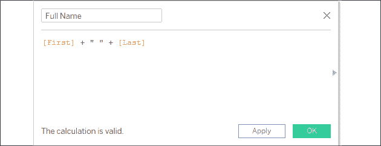

图 4.3：在编辑器中创建全名计算

点击**确定**后，你应该会注意到数据面板中出现一个新的**全名**字段。该字段的值是按数据行计算的。也就是说，每行数据包含租户的全名。

## 更复杂的示例

请注意，`租赁物业`字段包含诸如`112-Asbury Atoll`或`207-Beach Breeze`之类的值。假设假期租赁数据中的租赁单元命名规范为通过破折号分隔房间编号和建筑物名称。例如，名为`207-Beach Breeze`的单元是 Beach Breeze 建筑的 207 号房间。

用以下代码命名第一个`房间`：

```py
SPLIT([Rental Property], "-", 1) 
```

然后，创建另一个名为`建筑物`的计算字段，代码如下：

```py
SPLIT([Rental Property], "-", 2) 
```

这两个函数都使用了`Split()`函数，它将一个字符串拆分成多个值并保留其中一个值。该函数需要三个参数：**字符串**、**分隔符**（一个字符或一组字符，用于分隔值），以及**标记编号**（拆分后要保留的值，即第一个、第二个、第三个，以此类推）。使用`-`（破折号）作为分隔符，`房间`是第一个值，`建筑物`是第二个值。

使用这两个计算字段，创建一个**每栋楼及每个房间的租金**柱状图，如下所示：

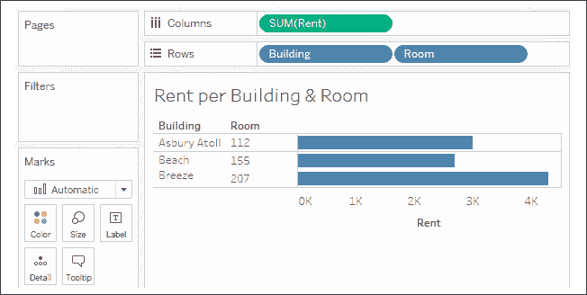

图 4.4：使用你的计算字段构建视图

**建筑物**和**房间**字段在数据面板中显示为维度。计算出的维度可以像其他任何维度一样使用。它们可以切片数据，定义详细级别，并对度量值进行分组。

行级计算在行级别计算，但你可以选择对结果进行聚合。例如，你可以聚合结果，找到最高的**房间**编号`(MAX)`，或者统计不同的**建筑物**数量`(COUNTD)`。事实上，如果行级计算的结果是数字类型，Tableau 通常会默认将结果字段作为度量值。但正如我们所看到的，你可以将行级字段作为维度或度量值在视图中使用。

注意，Tableau 在数据面板中为字段图标添加了一个小等号，表示它们是计算字段：

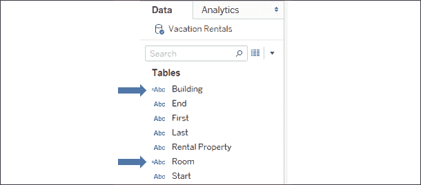

图 4.5：小等号（=）表示该字段是一个计算字段

两个计算字段的代码会对每一行数据执行，并返回行级别的值。我们可以通过检查源数据来验证代码是否按行级别操作。只需点击维度旁边的**查看数据**图标，就可以看到行级别的详细信息（它位于前面截图中的放大镜图标旁边）。在这里，可以清楚地看到**建筑**和**单元**的新字段及其行级别的值：

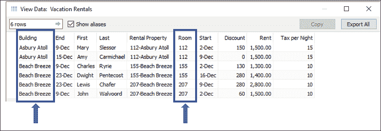

图 4.6：查看底层数据，显示计算是按数据行进行的

Tableau 提供了拆分字段的快捷方式。您可以在数据窗格中的字段上使用下拉菜单，选择**转换** | **拆分**或**转换** | **自定义拆分**（如果您有非标准分隔符）。结果是类似于您之前创建的计算字段，但在确定数据类型时加入了一些额外的逻辑。转换功能，如拆分，也可用于**数据**源屏幕上的**预览**或**元数据**视图中的字段。

## 扩展示例

我们将进一步扩展这个例子，并假设您知道房间的楼层由其编号表示。房间号 100 到 199 在第一层，200 到 299 在第二层。您希望将这些信息用于分析。

我们有可能将此属性添加到源数据中，但有时这可能不是一个选项，或者不可行。您可能没有权限更改源数据，或者源数据可能是每天自动生成的电子表格，任何更改都会被覆盖。

相反，您可以在 Tableau 中创建一个行级别的计算来扩展数据。为此，创建一个名为 `Floor` 的计算字段，使用以下代码：

```py
IF LEFT([Room], 1) = "1"
THEN "First Floor" 
ELSEIF LEFT([Room], 1) = "2" 
THEN "Second Floor" 
END 
```

这段代码使用了 `LEFT()` 函数来返回房间号的最左侧字符。因此，`112` 返回的结果是 `1`；`207` 返回的结果是 `2`。`IF THEN END` 逻辑允许我们根据哪个情况为真来分配结果（`第一层` 或 `第二层`）。请注意，您在计算中使用了 `Room` 字段，而该字段本身是另一个计算字段。

在另一个计算中引用已计算字段，称为**嵌套**。使用其他已计算字段的计算被称为**嵌套计算**。理论上，您可以使用任意多级的嵌套，但如果使用过多的嵌套层级，可能会让逻辑变得难以理清。

## 为数据变动做好规划

在编写计算时，请考虑您的计算是否涵盖了当前数据中未出现的变动。

在 Tableau 中编写计算时，您可以问自己一些很好的问题：*如果数据发生变化，会发生什么？* *该计算能处理意外或无效的值吗？* *我考虑到了所有的情况吗？*

例如，前面的楼层计算只适用于所有房间都是 100 级或 200 级房间的情况。如果存在一个位于三楼的房间 306，或者一个位于八楼的房间 822，该怎么办？

为了考虑更多情况，我们可以将计算简化为以下内容：

```py
LEFT([Room], 1) 
```

这段代码仅返回房间号的最左侧字符。对于`306`，我们得到`3`；对于`822`，我们得到`8`。但是，如果房间号为十楼的 1056，或者十六楼的 1617 呢？我们需要考虑其他选项，例如：

```py
MID([Room], 0, LEN([Room]) - 2) 
```

尽管这更为复杂，字符串函数会返回一个子字符串，该子字符串从字符串的开头开始，并在倒数第二个字符之前结束。这将为`1025`返回`10`，为`1856`返回`18`。

我们现在已经考虑了一些行级计算的例子。接下来，让我们讨论 Tableau 中的另一个主要计算类型：汇总级别计算。

# 汇总计算

我们已经在 Tableau 中考虑了如`sum`、`min`和`max`等聚合方法。通常，你会将字段作为简单的聚合添加到视图中。但有时，你需要在更复杂的计算中使用聚合方法。

例如，你可能会好奇探索租金折扣的百分比。在数据中没有这样一个字段。因为该值会根据视图中的详细程度变化（例如，单个单元的折扣百分比会与每层楼或每栋建筑的折扣百分比不同），所以它不能真正存储在源数据中。相反，它必须作为汇总计算，并随着详细程度的变化而重新计算。

让我们创建一个名为`Discount %`的计算，并使用以下代码：

```py
SUM([Discount]) / SUM([Rent]) 
```

这段代码表示`Discount`的总和应该除以`Rent`的总和。这意味着所有的`Discount`值将被加总，所有的`Rent`值也将被加总。只有在计算完总和后，才会进行除法运算。

一旦你创建了计算，你会注意到 Tableau 在数据窗格中将新字段视为**度量值**。默认情况下，Tableau 会将任何具有数字结果的计算视为度量值，但如果需要，你也可以将*行级计算*转换为维度。不过，在这种情况下，你甚至无法将新字段重新定义为维度。原因是 Tableau 会将每个*汇总计算*视为度量值，无论返回的数据类型是什么。这是因为汇总计算依赖于维度来定义执行计算时的详细级别。因此，汇总计算本身不能是维度。

由于你的计算值是百分比，你可能还希望将格式定义为百分比。为此，右键单击`Discount %`字段，选择**默认属性** | **数字格式**，然后选择**百分比**。如果需要，你可以调整显示的小数位数。

现在，创建几个视图，看看计算如何根据视图的细节层级返回不同的结果。首先，我们将创建一个视图来查看每个单独的租赁周期：

1.  将**建筑**、**房间**、**全名**、**开始**和**结束**放置在**行**上。

1.  在数据窗格中，在**度量值**下，双击以下每个字段：**租金**、**折扣**和**折扣百分比**。Tableau 会使用**度量名称**和**度量值**将这些度量值放入视图中。

1.  调整**度量值**架上的字段顺序，使其顺序为**租金**、**折扣**和**折扣百分比**：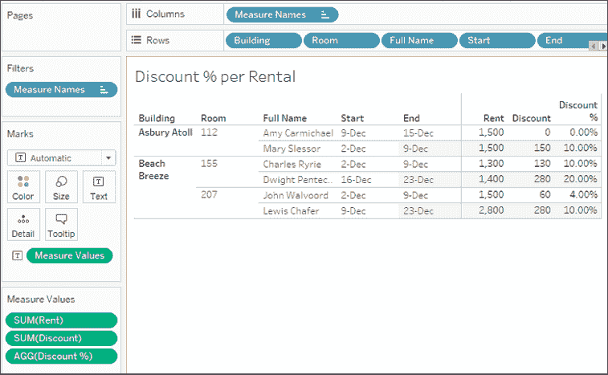

    图 4.7：展示了在建筑、房间、全名、开始和结束层级上计算的折扣百分比

你可以看到每个租赁周期的折扣百分比。然而，注意当你删除所有字段，只保留**建筑**和**房间**时，值会发生变化：

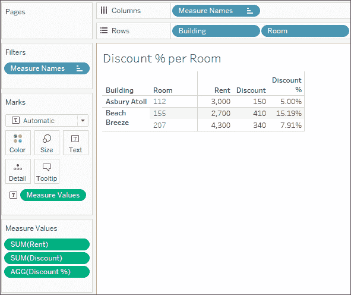

图 4.8：展示了在建筑和房间层级上计算的折扣百分比

为什么值会发生变化？因为聚合依赖于定义视图细节层级的维度。在第一个案例中，**建筑**和**房间**、**全名**、**开始**和**结束**定义了视图的细节层级。因此，计算将每个租赁周期的租金总和与每个租赁周期的折扣总和相加，然后进行除法运算。在第二个案例中，**建筑**和**房间**重新定义了细节层级。因此，计算将每个建筑和房间的所有价格以及每个建筑和房间的所有折扣加起来，然后进行除法运算。

你可能已经注意到，当你双击每个度量时，它以特殊的方式添加到视图窗格中。**度量名称**和**度量值**是每个数据连接中都会出现的特殊字段（位于**数据**窗格的底部）。它们作为占位符，用于在视图中共享相同空间的多个度量值。

在你刚创建的视图中，例如，三个度量值都共享视图窗格的空间。**度量值**在**文本**上显示，表示在**度量值**架上所有度量值的值都应作为文本显示。**度量名称**字段在**列**上为每个度量创建了一列，每列的值为该度量的名称。

注意，如果你查看整个数据集而不按任何维度切片，值会再次发生变化，正如预期的那样：


图 4.9：展示了在最高可能层级（整个数据集）上计算的折扣百分比

要让 Tableau 实现**度量名称** / **度量值**的一个简单方法是记住，当您希望在视图中使用*两个或更多度量值*时，它们会被使用。因此，如果您想在窗格中使用两个或更多度量值，请先拖动第一个到窗格，然后再拖动第二个。如果您想在同一轴上使用两个或更多度量值，请先将第一个拖动到轴上，然后在同一位置拖放第二个。

现在您对行级和聚合计算有了基本理解，让我们考虑为什么这种区别很重要。

## 为什么行级与聚合差异很重要

假设您创建了以下代码的`Discount % (row level)`计算：

```py
[Discount]/[Rent] 
```

代码与您之前创建的聚合计算不同，该计算具有以下代码：

```py
SUM([Discount])/SUM([Rent]) 
```

这里展示了结果上的戏剧性差异：

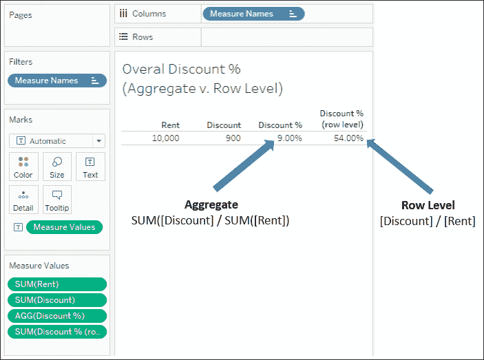

图 4.10：展示了按行级值和聚合计算的折扣%。

结果有这样的差异是为什么？这是计算执行方式的结果。

请注意，`Discount % (row level)`显示在**度量值**架上为`SUM`。这是因为计算是行级计算，因此它会逐行计算，然后在确定所有行级值后作为度量聚合。您看到的`54.00%`值实际上是在底层数据的每条记录中计算的百分比之和。

实际上，行级计算和最终聚合是这样执行的：

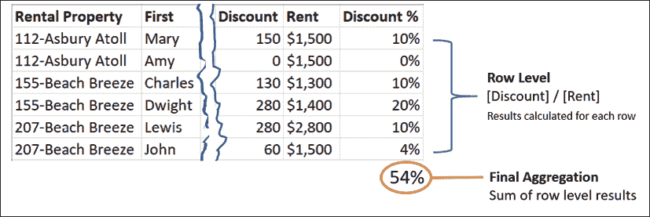

图 4.11：如果每个折扣%结果首先在行级计算，然后聚合，结果就是错误的。

对比聚合计算的执行方式。请注意，在视图中**度量值**架上列出的聚合在活动字段中为`AGG`，而不是`SUM`。这表明您已在计算中定义了聚合。Tableau 不会进一步聚合结果。聚合计算的执行方式如下：


图 4.12：如果分子和分母首先进行聚合，那么折扣%计算是正确的。

理解行级和聚合计算之间的差异非常重要，以确保您得到预期和所需的结果。通常情况下，当您确定要将值用作维度，或者行级值的聚合将有意义时，请使用行级计算。如果必须在其他操作之前执行聚合，请使用聚合计算。

在编写 Tableau 计算时遇到的最常见错误消息之一是*Cannot mix aggregate and non-aggregate arguments with this function*。当您遇到此消息时，请检查您的代码，确保您没有不正确地混合使用行级字段和计算与聚合字段和计算。例如，您不能像`[Discount] / SUM([Rent])`这样组合使用。

这种行级值（`折扣`）和聚合（`租金`的`SUM`）的混合是无效的。

在行级计算和聚合计算之间的区别已经明确之后，让我们稍作休息，讨论一下参数，然后再继续构建其他示例。

# 参数

在继续处理一些行级计算和聚合计算的其他示例之前，我们稍微偏离一下，检查一下参数，因为它们可以在计算中以惊人的方式使用。

Tableau 中的**参数**是一个占位符，用于表示单个全局值，如数字、日期或字符串。参数可以显示为控件（例如滑块、下拉列表或文本框）供仪表板或视图的最终用户使用，让他们能够更改参数的当前值。你甚至可以通过操作来改变参数值，正如你将在*第八章*“使用仪表板讲述数据故事”中看到的那样。

参数的值是全局的，因此如果值发生变化，工作簿中所有引用该参数的视图和计算都会使用新值。参数提供了另一种向仪表板和可视化的最终用户提供丰富交互性的方法。

参数可以用来允许与视图或仪表板交互的任何人动态地做很多事情，包括以下操作：

+   更改计算结果

+   更改箱子的大小

+   更改 top *n* 过滤器或 top *n* 集合中顶部或底部项目的数量

+   设置参考线或带状区域的值

+   更改箱子的大小

+   将值传递给用于数据源中的自定义 SQL 语句

其中一些选项我们将在后续章节中讨论。

由于参数可以用于计算，并且计算字段可以用来定义可视化的任何方面（从过滤器到颜色再到行和列），因此参数值的变化可能会带来显著的结果。我们将在接下来的章节中看到一些例子。

## 创建参数

创建参数类似于创建计算字段。

在 Tableau 中有多种方法来创建参数：

+   使用数据面板中**维度**旁边的下拉菜单并选择**创建参数**。

+   右键单击数据面板中的空白区域并选择**创建参数**。

+   使用数据面板中已有字段、集合或参数的下拉菜单，并选择**创建** | **参数...**。

在最后一种情况下，Tableau 将根据字段的**域**（不同的值）创建一个具有潜在值列表的参数。对于数据面板中默认**离散**（蓝色）的字段，Tableau 会创建一个包含与字段离散值匹配的值列表的参数。对于数据面板中默认**连续**（绿色）的字段，Tableau 会创建一个参数，其中的范围设置为数据中字段的最小值和最大值。

当你首次创建参数（或后续编辑现有参数）时，Tableau 会显示一个类似这样的界面：

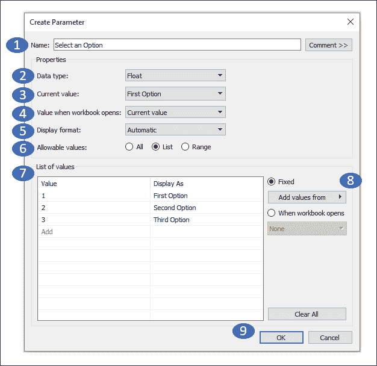

图 4.13：创建参数界面，下面是对应的描述

该界面包含以下功能：

1.  **名称**将作为参数控件的默认标题显示，并且也将是计算中的参考。您还可以添加**注释**来描述参数的用途。

1.  **数据类型**定义了参数值允许的数据类型。选项包括整数、浮动点数（浮动小数）、字符串、布尔值、日期或带时间的日期。

1.  **当前值**定义了参数的初始默认值。更改此屏幕上的值或在显示参数控件的仪表板或可视化中更改此值将更改当前值。

1.  **工作簿打开时的值**允许您根据计算结果在工作簿打开时更改参数的默认值。

1.  **显示格式**定义了值将如何显示。例如，您可能希望将整数值显示为金额，将小数显示为百分比，或以特定格式显示日期。

1.  **允许的值**选项使我们能够限制允许的值的范围。**允许的值**有三种选项：

    +   **全部**允许用户输入与参数的数据类型匹配的任何内容。

    +   **列表**允许我们定义一个值的列表，用户必须从中选择一个选项。该列表可以手动输入、从剪贴板粘贴或从相同数据类型的维度加载。

    +   **范围**允许我们定义可能的值范围，包括可选的上限和下限，以及步长。此设置也可以从字段或另一个参数中获取。

1.  在前面截图的示例中，由于我们选择了**列表**作为**允许的值**，我们可以输入可能的值列表。在此示例中，已输入了三个项目的列表。请注意，值必须与数据类型匹配，但显示值可以是任何字符串值。您可以拖放列表中的值以重新排序列表。如果选择了**范围**，屏幕将显示设置**最小值**、**最大值**和**步长**的选项。

1.  特别针对**列表**，有几个附加选项用于填充列表：

    +   **固定**：您可以手动输入值、从剪贴板粘贴，或从数据中的现有字段值中设置它们。无论如何，列表将是静态的，即使数据更新，列表也不会更改。

    +   **当工作簿打开时**允许您指定一个字段，该字段将根据工作簿首次打开时该字段的可用值动态更新列表。

单击**确定**以保存参数的更改，或单击**取消**以还原。

创建参数时，它会出现在数据面板的**参数**部分。参数的下拉菜单会显示一个选项，**显示参数控件**，该选项将参数控件添加到视图中。参数控件右上角的小下拉箭头会显示一个菜单，用于自定义参数控件的外观和行为。下面是我们之前创建的参数，作为单一值列表的参数控件：


图 4.14：作为单选按钮列表显示的参数控件

该控件可以在任何工作表或仪表板上显示，允许最终用户选择一个单一值。当值更改时，任何使用该参数的计算、过滤器、集合或分箱都会重新评估，所有受影响的视图也会被重新绘制。

接下来，我们将考虑一些在计算中使用参数的实际示例。

# 计算和参数的实际示例

让我们关注一些关于行级和聚合计算的实际示例。目标是学习并理解一些计算所能实现的功能。在你开始分析和可视化之旅时，你可以在这些示例的基础上继续深入。

查找计算帮助和建议的好地方是 Tableau 官方论坛，[`community.tableau.com/s/explore-forums`](https://community.tableau.com/s/explore-forums)。

## 修复数据问题

通常，数据并不完全干净。也就是说，它存在一些问题，必须在进行有意义的分析之前加以修正。例如，日期可能格式不正确，或者字段中可能包含需要分离成多个字段的数字值和字符代码的混合。计算字段通常可以用来修复这些问题。

我们将考虑使用 Tableau Prep——一个旨在整理和清理数据的工具——在*第十四章*，*将混乱的数据结构化以便在 Tableau 中良好工作*。Tableau Prep 的计算语法几乎相同，因此本章中的许多示例也可以应用于此上下文。在 Tableau Desktop 或 Tableau Prep 中处理数据问题的能力，将对你大有帮助。

我们将继续使用 `Vacation Rentals` 数据。你可能还记得，开始和结束日期类似于以下内容：

| **开始** | **结束** |
| --- | --- |
| 12 月 2 日 | 12 月 9 日 |
| 12 月 9 日 | 12 月 15 日 |
| 12 月 16 日 | 12 月 23 日 |

如果没有年份，Tableau 不会将 `Start` 或 `End` 字段识别为*日期*。相反，Tableau 会将它们识别为*字符串*。你可能会尝试使用数据面板中字段的下拉菜单将数据类型更改为日期，但没有年份，Tableau 几乎肯定会解析错误，或者至少会不完全解析。这是我们需要使用计算来修复问题的情况。

假设在这种情况下，你确定年份应始终为 2020，你可能会创建名为 `Start Date` 和 `End Date` 的计算字段。

以下是获取开始日期的代码：

```py
DATE([Start] + ", 2020") 
```

这是获取结束日期的代码：

```py
DATE([End] + ", 2020") 
```

这些计算字段的作用是将月份和日期与年份拼接起来，然后使用 `DATE()` 函数将字符串转换为日期值。实际上，Tableau 将识别结果字段为日期（具备日期字段的所有功能，比如内置层次结构）。在 Tableau 中快速检查，可以看到预期的结果：

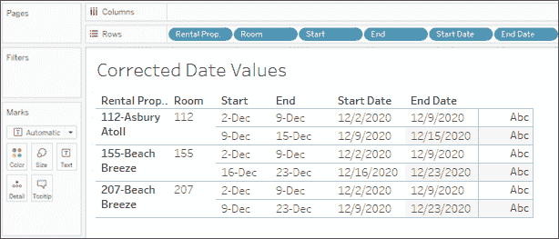

图 4.15：修正后的日期显示在字符串版本旁边。所有字段都是行上的离散维度（这些日期是精确日期）。

我们不仅能够修复数据中的问题，还能通过计算扩展数据和分析。接下来，我们将讨论这个问题。

## 扩展数据

通常，数据中会有一些你希望包含的维度或度量，但它们在源数据中并不存在。很多时候，你可以通过计算字段扩展数据集。我们已经讨论过一个示例，即创建一个字段来表示客人的全名，而我们原本只有名字和姓氏字段。

另一项可能解锁真正有趣分析的数据是每次租赁的时长。我们有开始和结束日期，但没有这两者之间的时间长度。幸运的是，这个计算非常简单。

创建一个名为 `Nights Rented` 的计算字段，使用以下代码：

```py
DATEDIFF('day', [Start Date], [End Date]) 
```

Tableau 采用智能代码补全功能。当你在代码编辑器中输入时，它会提供函数和字段名称的建议。按下 `Tab` 键会根据当前的建议自动完成你正在输入的内容。

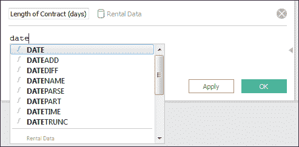图 4.16：智能代码补全功能将在你输入时建议可能的字段名称和函数。

`DATEDIFF()` 函数接受一个日期部分描述、一个开始日期和一个结束日期，并返回两个日期之间差异的数值。现在我们有了一个新的度量值，这是之前没有的。我们可以在可视化中使用这个新的度量值，例如以下租赁的甘特图：


图 4.17：计算字段使我们能够创建甘特图

在继续使用 Tableau 的过程中，你将会发现有很多方法可以通过计算扩展数据。这将使你能够进行一些令人惊叹的分析和可视化。接下来，我们将考虑一些示例。

## 提升用户体验、分析和可视化效果

计算和参数可以大大提升用户体验、分析效果以及可视化效果。

假设我们希望给度假公寓经理提供一些假设分析的能力。每年，她在 12 月提供一个免费夜晚。她希望能够看到哪些租客会收到免费夜晚，这取决于她选择哪个夜晚。

要实现这一点，请按照以下步骤操作：

1.  如果你还没有做，创建一个与之前显示的类似的甘特图（按照截图中的字段放置）。

1.  创建一个名为**免费夜晚**的参数，数据类型为**日期**，起始值为`12/12/2020`。这将允许经理设置和调整促销月的起始日期。通过从数据窗格中的**免费夜晚**参数的下拉菜单中选择**显示参数控制**来显示参数控制。

1.  现在，向视图中添加一条参考线以显示免费夜晚。方法是切换到左侧边栏中的**分析**标签，拖动**参考线**到视图中，并将其放置在**表格**上：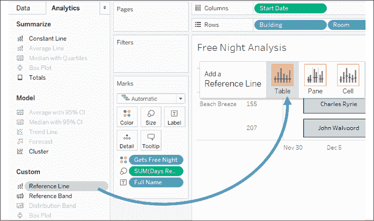

    图 4.18：通过切换到分析窗格并将参考线拖到画布上来添加参考线

1.  在结果对话框中，将**线**值设置为**免费夜晚**。你可能希望将**标签**设置为**无**，或者选择**自定义**并显示`免费夜晚`的文本。你也可以调整线条的格式：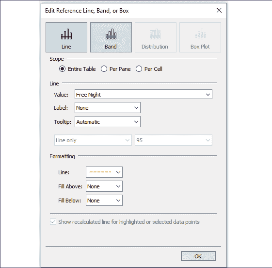

    图 4.19：使用编辑参考线对话框调整格式、标签和工具提示

1.  创建一个名为**获取免费夜晚**的计算字段，该字段返回`true`或`false`值，取决于免费夜晚是否在租赁期内：

    ```py
    [Free Night] >= [Start Date]
    AND
    [Free Night] <= [End Date] 
    ```

1.  将此新计算字段放置在**颜色**货架上。

我们现在有一个视图，允许公寓经理更改日期并查看动态变化的视图，这使得哪个租户会落在给定的促销期内变得非常明显。通过更改**免费夜晚**参数的值来进行实验，看看视图如何更新：

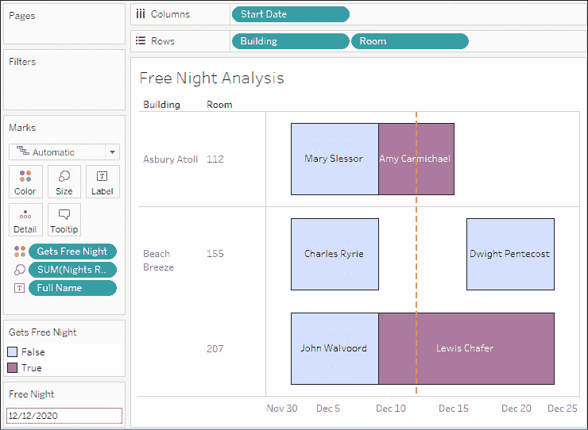

图 4.20：参考线将会移动，每次更改“免费夜晚”参数值时，受影响的个体会重新计算。

上述视图显示了提议的免费夜晚（以虚线表示），并突出了哪些租赁期会获得免费夜晚。随着公寓经理调整**免费夜晚**参数的值，线条和颜色会发生变化。

除了扩展分析、可视化和用户体验外，您还可以使用计算来添加所需的业务逻辑。接下来我们将考虑这一点。

## 满足业务需求

有时，数据与您的组织需求不完全匹配。例如，数据中的度量可能不是做出关键业务决策所需的确切指标，或者维度值可能需要根据某些规则进行分组。虽然这种业务逻辑通常会在与 Tableau 连接之前对数据进行转换或建模时应用，但你可能会遇到需要即时实现业务逻辑的情况。

在这个例子中，假设度量`租金`只是基本租金，不包括折扣或税费。这些是数据中的单独字段。如果你需要分析总`收入`，你需要进行计算。这个计算可能类似于这样：

```py
[Rent] - [Discount] + ([Tax per Night] * [Nights Rented]) 
```

这个公式取基础的`Rent`，减去`Discount`，然后加上`每晚税`乘以`租赁夜数`。括号有助于提高可读性，但并不是必需的，因为乘法运算符`*`的优先级高于加法运算符`+`，因此会先进行计算。

到目前为止，我们创建了扩展数据源的计算字段。有时你只需要一个快速的计算来帮助单个视图。我们将以这些快速的临时计算作为结尾。

## 临时计算

临时计算允许你在单个视图中将计算字段添加到架上，而无需将字段添加到数据面板。

假设你有一个简单的视图，显示**每位客人的收入**，像这样：

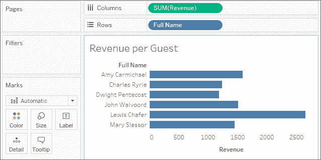

图 4.21：每个个人住宿所产生的收入

如果你想快速突出显示支付少于$1,500 的租户呢？一种选择是创建一个临时计算。为此，只需双击**列**、**行**或**度量值**卡片的空白区域，或**标记**架上的空白区域，然后开始输入计算的代码。在这个例子中，我们在**标记**架的空白区域双击了：


图 4.22：在标记卡上创建临时计算

在这里，我们输入了一个代码，如果`Rent`的总和小于$1,500，则返回`True`，否则返回`False`。按*Enter*键或点击文本框外部，将显示一个新的临时字段，可以将其拖放到视图中的任何位置。在这里，我们将其移动到**颜色**架上：

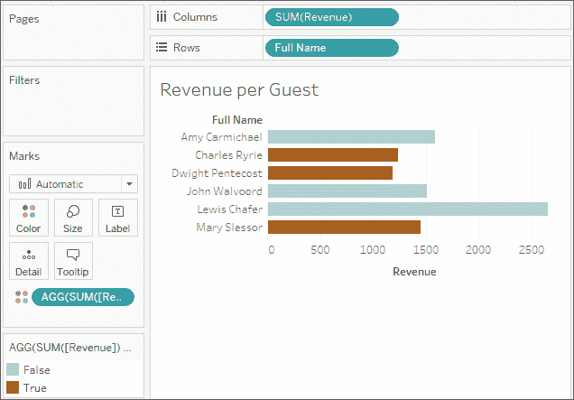

图 4.23：在颜色上使用临时计算

临时字段仅在视图中可用，不会出现在数据面板中。你可以双击该字段来编辑代码。

将临时字段拖放到数据面板中，会将其转变为常规的计算字段，这些字段将可用于使用该数据源的其他视图。

经过一些实际示例的展示后，最后我们考虑一些确保在使用计算时保持良好性能的方法。

# 性能考虑

当你处理一个小数据集和高效的数据库时，你通常不会注意到计算效率低下。在更大的数据集上，计算效率可能会开始影响视图渲染的速度。

这里有一些提示，可以帮助你使计算尽可能高效：

+   布尔和数字计算比字符串计算要快得多。如果可能，避免字符串操作，使用别名或格式化来提供用户友好的标签。例如，别写如下代码：`IF [value] == 1` `THEN "Yes" ELSE "No" END`。相反，只需写`[value] == 1`，然后编辑字段的别名，将`True`设置为`Yes`，将`False`设置为`No`。

+   寻找提高计算效率的方法。如果你发现自己在编写一个包含大量条件的长`IF ELSEIF`语句，看看是否有一两个条件可以先检查，以排除其他所有条件的检查。例如，考虑简化以下代码：

    ```py
    //This is potentially less efficient...
    IF [Type] = "Dog" AND [Age] < 1 THEN "Puppy" 
    ELSEIF [Type] = "Cat" AND [Age] < 1 THEN "Kitten" 
    END
    //...than this code:
    IF [Age] < 1 THEN
        IF [Type] = "Dog" THEN "Puppy"
        ELSEIF [Type] = "Cat" THEN "Kitten"
        END
    END 
    ```

    注意，在年龄小于`1`的记录中，不需要对类型进行检查。这可能是数据集中非常大的一部分记录。

+   行级计算必须对每一行数据进行执行。尽量减少行级计算的复杂性。然而，如果无法做到这一点或无法解决性能问题，可以考虑最终的选项。

+   当你创建数据提取时，某些行级计算会被物化。这意味着在创建提取时，计算会执行一次，结果会存储在提取中。这样，数据引擎就不必反复执行计算。相反，值将直接从提取中读取。使用任何用户函数、参数或`TODAY()`或`NOW()`的计算将不会在提取中物化，因为其值会根据当前用户、参数选择和系统时间发生变化。Tableau 的优化器还会判断某些计算是否更有效地在内存中执行，而不是读取存储的值。

当你使用提取物来物化行级计算时，只有在提取时创建的计算会被物化。如果你在创建提取之后编辑了计算字段或创建了新的计算字段，你将需要优化提取（使用数据源上的下拉菜单，或从**数据**菜单中选择并点击**提取** | **优化**或**提取** | **立即计算计算字段**）。

在继续进行计算时，特别注意那些出现性能问题的情况，并考虑是否可以优化计算以获得更好的结果。

# 总结

计算在 Tableau 中开启了令人惊叹的可能性。你不再局限于源数据中的字段。通过计算，你可以通过添加新的维度和度量来扩展数据，修复错误或格式不正确的数据，并通过参数让用户输入数据，提升可视化效果。

使用计算字段的关键在于理解 Tableau 中四种主要的计算类型。行级计算对每一行源数据执行。这些计算字段可以作为维度使用，也可以作为度量进行聚合。聚合计算在视图中定义的维度的详细级别上执行。当你必须首先聚合计算的组成部分，然后再执行其他操作时，这些计算尤其有用，甚至是必需的。

在下一章中，我们将探讨四种主要计算类型中的第三种：**细节层次计算**。这将极大地提升你处理数据和解决各种有趣问题的能力。
