# 6

# 深入探讨表格计算

**表格计算**是 Tableau 中最强大的功能之一。它们能实现那些通过其他方式无法完成的解决方案（除非编写自定义应用程序或复杂的自定义 SQL 脚本！）。这些功能包括以下内容：

+   它们使得即使数据结构不佳，依然能快速得出结果，而无需等待有人修复数据源中的数据。

+   它们使得可以在结果表的各行之间比较并对聚合值进行计算。

+   它们为分析、创造性地解决问题、突出洞察或改善用户体验打开了令人难以置信的可能性。

表格计算的复杂度各异，从非常容易创建（只需几次点击）到极其复杂（例如，需要理解**定位**、**分区**和**数据密集化**等概念）。在本章中，我们将从简单的开始，逐步深入复杂的内容。目标是为创建和使用表格计算奠定坚实的基础，理解它们的工作原理，并查看一些使用示例。我们将探讨以下内容：

+   表格计算概览

+   快速表格计算

+   范围和方向

+   定位和分区

+   自定义表格计算

+   实际示例

本章中的示例将使用我们在第一章中使用的 `Superstore` 示例数据。要跟随示例操作，请使用 `Chapter 06 Starter.twbx` 工作簿。

# 表格计算概览

**表格计算**与 Tableau 中的所有其他计算不同。行级、聚合计算和 LOD 表达式（我们在前几章中探讨过）是在查询数据源的过程中执行的。如果你检查 Tableau 发送到数据源的查询，你会发现计算的代码已转换为数据源使用的任何 SQL 实现。

另一方面，表格计算是在初始查询后执行的。这里有一个图表，展示了在 Tableau 缓存中如何存储聚合结果：

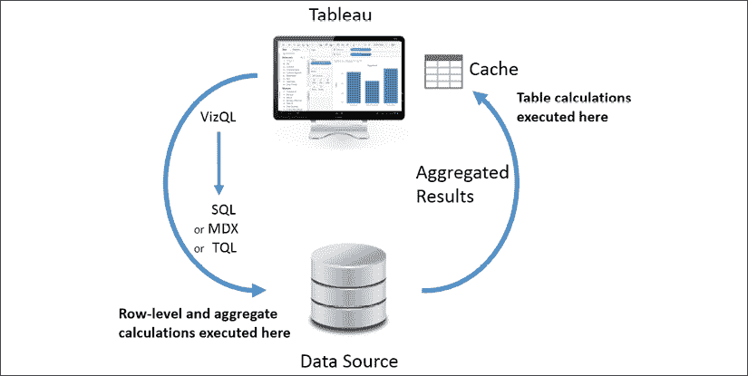

图 6.1：表格计算在 Tableau 的聚合数据缓存中计算

表格计算是在 Tableau 缓存中的聚合数据表上执行的，数据可视化渲染之前进行。如我们所见，这对于多个原因很重要，包括以下几点：

+   **聚合**：表格计算作用于聚合数据。在表格计算中，无法引用字段而不将其作为聚合字段来引用。

+   **筛选**：常规筛选器将在表格计算之前应用。这意味着表格计算仅会应用于从数据源返回到缓存的数据。你需要避免筛选掉任何对表格计算至关重要的数据。

+   **表格计算过滤**（有时称为**延迟过滤**）：作为过滤器使用的表格计算将在数据源返回聚合结果后应用。顺序很重要：行级和聚合级过滤器首先应用，聚合数据返回到缓存中，然后应用表格计算作为过滤器，从而有效地将数据从视图中隐藏。这允许一些创造性的方式来解决某些类型的问题，我们将在本章后面的示例中讨论这些问题。

+   **性能**：如果你正在使用与企业数据库服务器的实时连接，则行级和聚合级计算将利用企业级硬件。表格计算是在缓存中执行的，这意味着它们将在运行 Tableau 的机器上执行。如果你的表格计算是在十几行甚至数百行的聚合数据上运行，或者你预计会发布到强大的 Tableau 服务器上，那么你可能不需要担心性能问题。然而，如果你在本地机器上返回数十万行的聚合数据，那么你需要考虑表格计算的性能。同时，也有一些情况，表格计算可以用来避免在数据源处执行昂贵的过滤或计算。

了解了表格计算的概述后，我们来看看一些创建表格计算的选项。

## 创建和编辑表格计算

在 Tableau 中，有几种创建表格计算的方法，包括：

+   在视图中，使用任何作为数值聚合的活动字段，选择**快速表格计算**，然后选择所需的计算类型。

+   在视图中，使用任何作为数值聚合的活动字段，选择**添加表格计算**，然后选择计算类型，并调整任何所需的设置。

+   创建一个计算字段，并使用一个或多个表格计算函数来编写你自己的自定义表格计算。

前两个选项创建一个快速表格计算，可以通过字段上的下拉菜单编辑或删除，选择**编辑表格计算...** 或 **清除表格计算**。第三个选项创建一个计算字段，可以像编辑或删除其他计算字段一样进行编辑或删除。

在视图中的架子上使用表格计算的字段，或者使用表格计算函数的计算字段，将会显示增量符号图标（），如下所示。

```py
 without a table calculation:
```


图 6.2：未应用表格计算的活动字段

以下是应用了表格计算的活动字段：


图 6.3：应用了表格计算的活动字段包括增量符号

本章中的大多数示例将使用文本表/交叉制表报告，因为这些最接近缓存中的实际聚合表。这样可以更容易地看到表格计算的工作方式。

表格计算可用于任何类型的可视化。然而，在构建使用表格计算的视图时，特别是更复杂的视图时，请尝试在**行**架上使用具有所有维度的表格，然后在维度的右侧作为离散值添加表格计算。一旦您的所有表格计算按预期工作，您可以重新排列视图中的字段，以获得适当的可视化效果。

现在我们将从创建表格计算的概念转移到一些示例。

# 快速表格计算

**快速表格计算**是预定义的可应用于视图中用作度量的字段的表格计算。这些计算包括常见且有用的计算，如**Running Total**、**Difference**、**Percent Difference**、**Percent of Total**、**Rank**、**Percentile**、**Moving Average**、**YTD Total**（年度总计）、**Compound Growth Rate**、**Year over Year Growth**和**YTD Growth**。您可以在视图中用作度量的字段的下拉列表中找到适用的选项，如下图所示：

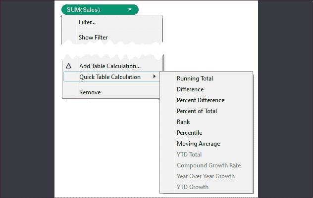

图 6.4：使用下拉菜单，您可以从视图中的聚合字段快速创建表格计算。

考虑以下使用示例`Superstore Sales`数据的示例：

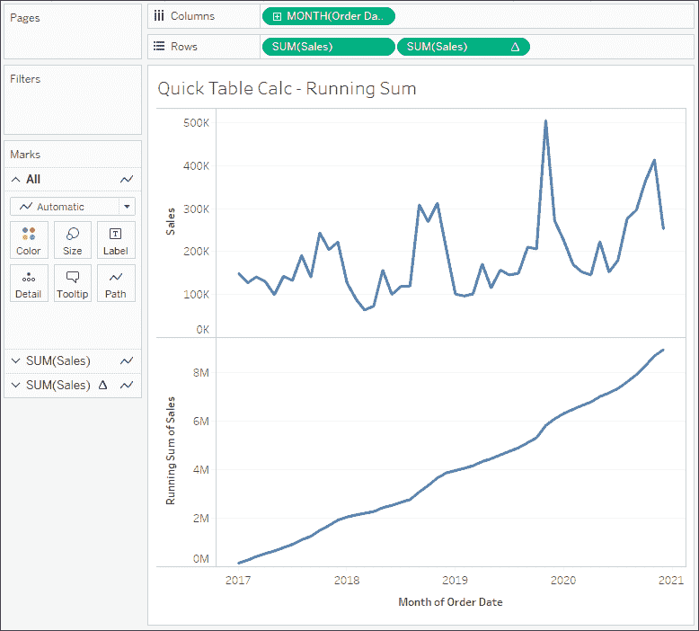

图 6.5：第一个 SUM(Sales)字段是普通聚合。第二个已应用了 Running Total 快速表格计算的 SUM(Sales)字段。

在此处，显示了随时间变化的销售额。销售额已放置在**行**架上两次，并且第二个**SUM(Sales)**字段已应用了**running total**快速表格计算。使用快速表格计算意味着不需要编写任何代码。

您可以通过双击视图中的表格计算字段来查看快速表格计算使用的代码。这将其转换为临时计算。您还可以将应用了快速表格计算的活动字段拖动到数据窗格中，这将其转换为可以在其他视图中重复使用的计算字段。

以下表格演示了一些快速表格计算：

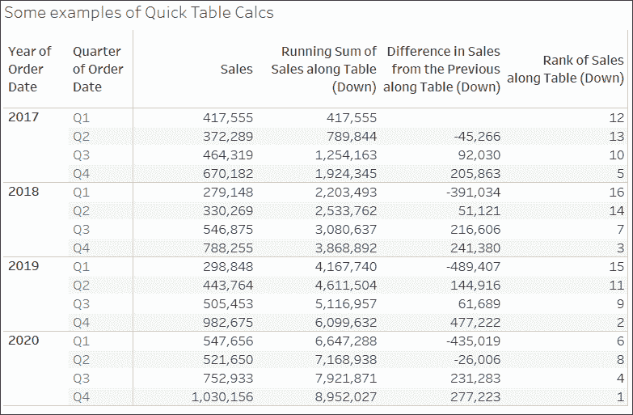

图 6.6：第一列中的销售额简单是 SUM(Sales)。另外三列显示应用的各种表格计算（Running Sum、Difference、Rank）。

尽管创建快速表格计算非常容易，但理解一些基本概念是至关重要的。接下来我们将详细查看这些概念，首先从相对和固定表格计算之间的区别开始。

# 相对与固定

不久我们将详细查看细节，但首先重要的是理解表格计算可能以以下两种方式之一计算：

+   **相对**：表计算将相对于表的布局进行计算。它们可能在表格中横向或纵向移动。重新排列维度以改变表格的方式会改变表计算的结果。正如我们将看到的，相对表计算的关键是**范围**和**方向**。当你设置表计算为使用相对计算时，即使重新排列视图，它也会继续使用相同的相对范围和方向。（这里的术语与 UI 中某些快速表计算中出现的**相对于**不同。）

+   **固定**：表计算将使用一个或多个维度进行计算。重新排列视图中的这些维度不会改变表计算的结果。在这种情况下，范围和方向保持固定于一个或多个维度，无论它们在视图中如何移动。当我们讨论固定表计算时，我们将重点讨论**分区**和**地址**的概念。

你可以在用户界面中看到这些概念。以下是**表计算**编辑器，当你从表计算字段的菜单中选择**编辑表计算**时会出现：

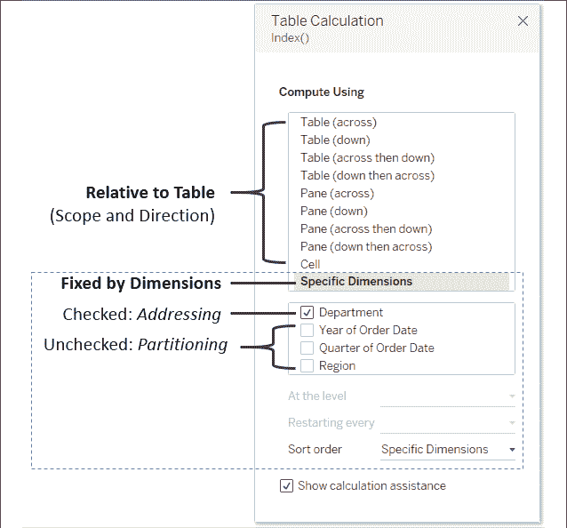

图 6.7：编辑表计算 UI 展示了相对和固定表计算之间的差异

我们将更详细地探讨这些选项和术语，但现在请注意，相关选项用于指定相对于行和列计算的表计算，以及固定计算到视图中某些维度的表计算选项。

接下来，我们将讨论**范围**和**方向**，这描述了相对表计算的操作方式。

## 范围和方向

**范围**和**方向**是描述表计算如何相对于表格计算的术语。具体来说，范围和方向指以下内容：

+   **范围**：范围定义了给定表计算可以引用其他值的边界。

+   **方向**：方向定义了表计算在范围内的移动方式。

你已经看过表计算的计算方式**表格（横向）**（*图 6.5*中的销售额随时间的累计总和）和**表格（纵向）**（*图 6.6*中）。在这些情况下，范围是整个表格，方向是横向或纵向。例如，运行总和计算横向遍历整个表格，逐步加上从左到右的后续值。

要为表计算定义范围和方向，使用视图中字段的下拉菜单并选择**计算方式**。你将获得一个选项列表，具体取决于维度在视图中的位置，这些选项会略有不同。列表中的第一个选项允许你相对于表格定义范围和方向。在单元格选项之后，你将看到视图中存在的维度列表。我们将在下一节中查看这些维度。

相对于表格的作用域和方向选项如下：

+   **作用域选项**：表格，窗格，单元格

+   **方向选项**：纵向，横向，先纵向后横向，先横向后纵向

为了理解这些选项，请参考以下示例：

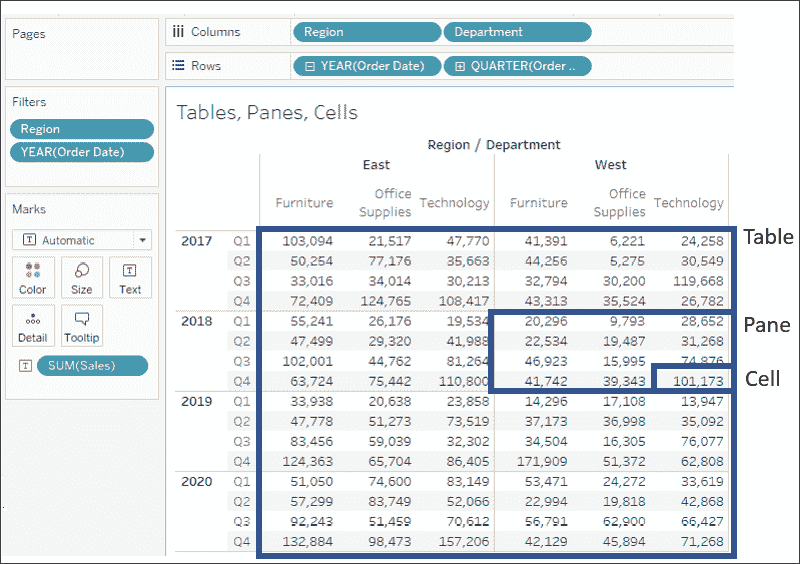

图 6.8：视图中表格、窗格和单元格的区别

在表格计算的作用域方面，Tableau 做出了以下区分：

+   **表格**是整个汇总数据集。

+   **窗格**是整个表格的一个较小部分。严格来说，它由表格的倒数第二级定义；也就是说，**行**和/或**列**架上的倒数第二个维度定义了窗格。在前面的图像中，可以看到**年份**在行和**区域**在列的交点定义了窗格（视图中高亮显示了八个窗格中的一个）。

+   **单元格**由表格的最低级别定义。在这个视图中，一个**区域**内的一个**部门**与一个**年份**内的一个**季度**交点形成一个单元格（视图中高亮显示了 96 个单元格中的一个）。

前面截图中被界定的区域由作用域定义。作用域（以及我们将看到的，分区）定义了数据中的窗口，这些窗口包含了各种表格计算。窗口函数，特别是`WINDOW_SUM()`，在这些窗口的作用域内工作。

### 使用作用域和方向

为了了解作用域和方向是如何协同工作的，让我们通过一些例子来演示。我们将从创建自定义表格计算开始。创建一个名为`Index`的新计算字段，代码为`Index()`。

`Index()`是一个表格计算函数，它从`1`开始，并在给定的方向和作用域内递增。`Index()`有许多实际应用，但我们在这里使用它，因为很容易看到它在给定作用域和方向下的移动。

创建如*图 6.8*所示的表格，**年份（订单日期）**和**季度（订单日期）**放在**行**上，**区域**和**部门**放在**列**上。不要将**销售额**放入视图中，而是将新创建的**Index**字段添加到**文本**架上。然后，使用**Index**字段上的下拉菜单，选择**计算方式**，以切换不同的作用域和方向组合。在以下示例中，我们只保留了**东部**和**西部**区域以及**2015**年和**2016**年：

+   **表格（横向）**：这是 Tableau 在表格中有列时的默认设置。请注意，以下内容中**Index**是如何在整个表格中横向递增的：

    图 6.9：表格（横向）

+   **表格（纵向）**：使用`table (down)`时，**Index**在整个表格中按纵向递增：

    图 6.10：表格（纵向）

+   **表格（先横向后纵向）**：这使得**Index**先横向递增，然后向下递增，再继续横向递增，整个表格都按此方式重复：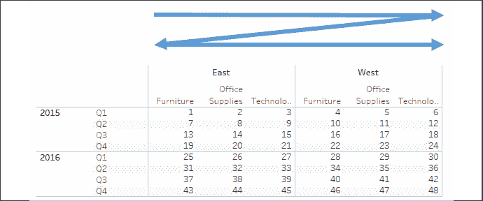

    图 6.11：表（先横向再纵向）

+   **面板（横向）**：这定义了**索引**的边界，并使其横向递增，直到到达面板边界，此时索引会重新开始：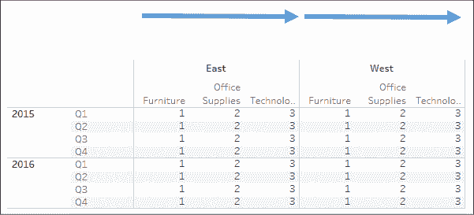

    图 6.12：面板（横向）

+   **面板（纵向）**：这定义了**索引**的边界，并使其纵向递增，直到到达面板边界，此时索引会重新开始：

    图 6.13：面板（纵向）

+   **面板（先横向再纵向）**：这使得**索引**在面板内横向递增，并继续纵向递增。面板在这里定义了边界：

    图 6.14：面板（先横向再纵向）

你可以将作用域和方向与任何表计算一起使用。考虑一下如何使用相同的移动和边界计算运行总计或百分比差异。继续尝试不同的选项，直到你熟悉作用域和方向的工作原理。

作用域和方向相对于表格操作，因此你可以重新排列字段，计算仍然会在你定义的相同作用域和方向下进行。例如，你可以将**订单日期年份**与**部门**交换，仍然可以根据你定义的作用域和方向查看**索引**的计算结果。

接下来，我们将查看与固定在某些维度上的表计算对应的概念。

## 寻址和分区

**寻址**和**分区**与作用域和方向非常相似，但通常用来描述如何根据视图中某些字段的绝对引用计算表计算。使用寻址和分区时，你定义视图中哪些维度用于寻址（方向），而其他维度则用于分区（作用域）。

使用寻址和分区可以提供更精细的控制，因为你的表计算不再依赖于表格布局，你有更多的选项来微调计算的作用域、方向和顺序。

要开始理解这个是如何工作的，我们先来看一个简单的例子。在前面的视图中，从**索引**字段的下拉菜单中选择**编辑表计算**。在弹出的对话框中，在**特定维度**下勾选**部门**。

选择**部门**的结果如下：

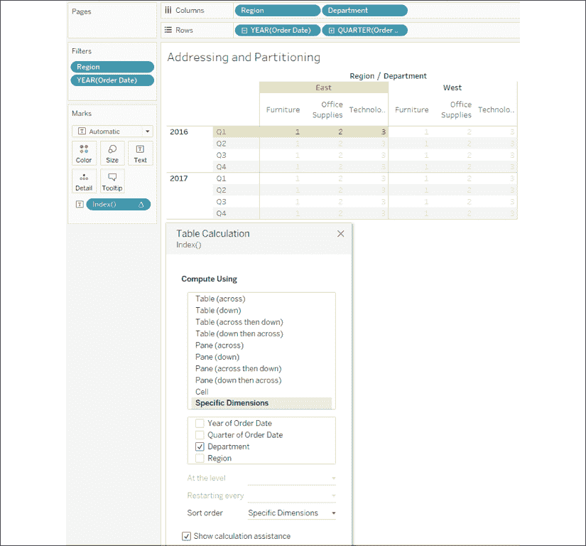

图 6.15：设置表计算为使用特定维度进行计算，使用了寻址和分区

你会注意到，Tableau 正在沿着（在）选中的维度**部门**计算**索引**。换句话说，你已使用**部门**进行寻址，因此每个新的部门都会增加索引。视图中所有其他未选中的维度隐式用于分区；也就是说，它们定义了索引功能必须重新开始的作用域或边界。正如我们在作用域中看到的，这些边界有时被称为窗口。

上述视图看起来与如果你将**索引**设置为基于**面板（横向）**进行计算时相同。但是，它们有一个重大区别。当你使用**面板（横向）**时，**索引**总是沿着面板计算，即使你重新排列视图中的维度，移除某些维度或添加新的维度，**索引**仍然会按面板进行计算。

但是，当你使用某一维度进行地址计算时，表格计算将始终基于该维度进行计算。移除该维度将导致表格计算无法正常工作（字段会变成红色并显示感叹号），此时你需要通过下拉菜单编辑表格计算以调整设置。如果你在视图中重新排列维度，**索引**将继续沿着**部门**维度进行计算。

例如，点击工具栏中的**交换行和列**按钮后的结果如下：

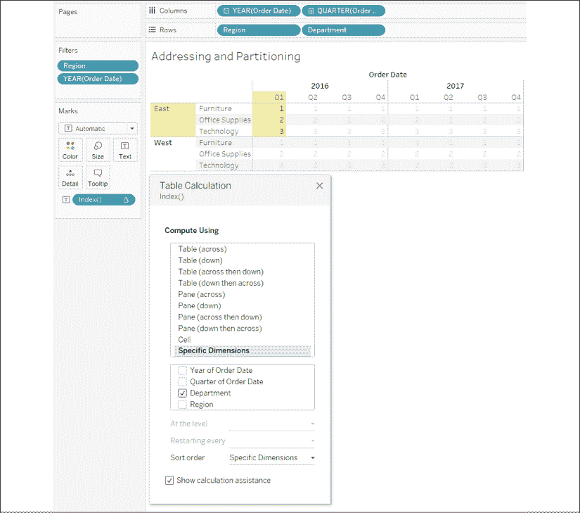

图 6.16：交换行和列不会改变该表格计算的计算方式，因为它是固定在维度上的，而不是表格布局上

请注意，尽管表格的整体方向发生了变化，**索引**仍然继续沿着**部门**进行计算。为了完成接下来的示例，我们将撤销行和列的交换，恢复表格的原始方向。

### 使用地址和分区

让我们再看几个添加额外维度后会发生的例子。例如，如果你勾选了**订单日期的季度**，你将看到 Tableau 突出显示一个由**地区**和**订单日期的年份**定义的分区，**索引**将按**订单日期的季度**和**部门**的地址字段递增：

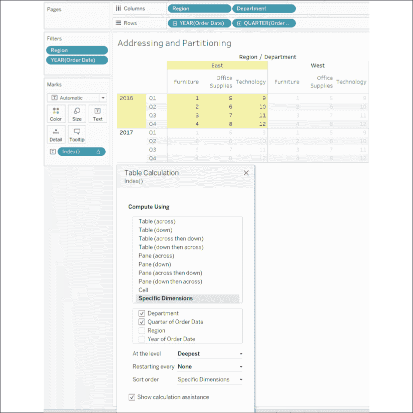

图 6.17：添加维度改变了表格计算的行为。一个结果分区被突出显示

如果你选择**部门**和**订单日期的年份**作为**索引**的地址，你将看到一个由**地区**和**季度**定义的单一分区，如下所示：

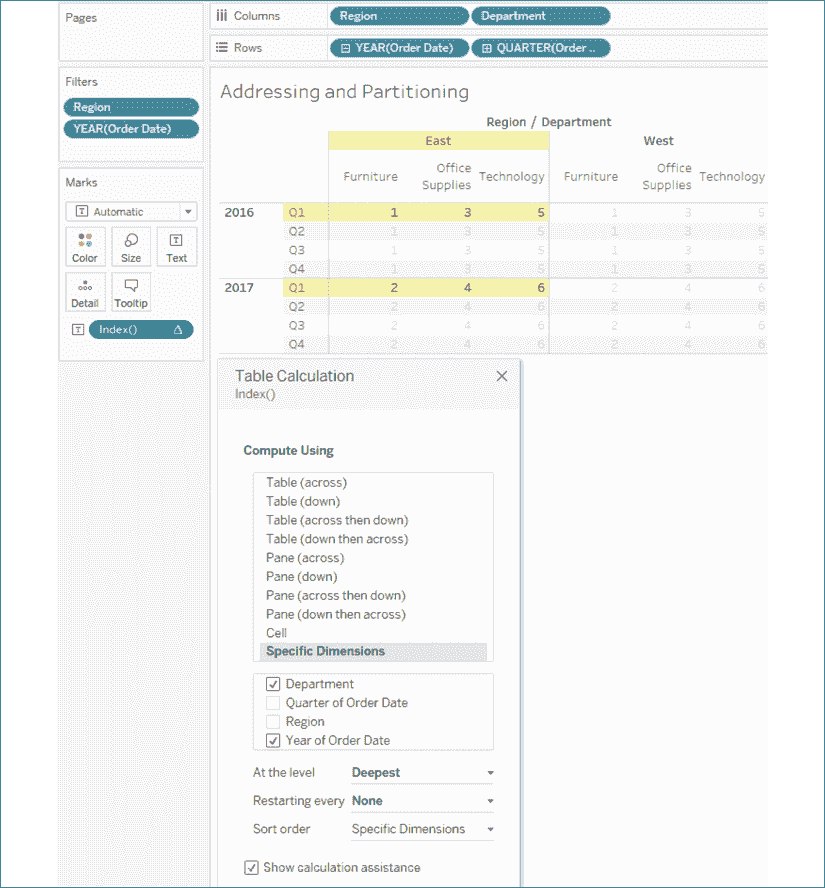

图 6.18：更改已选维度改变了表格计算的行为。一个结果分区被突出显示

你会注意到，在此视图中，**索引**会根据**季度**和**地区**分区内的**年份**和**部门**的每种组合递增。

以下是在使用地址和分区时需要考虑的其他事项：

+   你可以指定排序顺序。例如，如果你希望**索引**根据销售总额的值递增，你可以使用表格计算编辑器底部的下拉列表来定义自定义排序。

+   在编辑表格计算对话框中的**在级别**选项允许您指定执行表格计算的级别。大多数情况下，您将将其保持在**最深层**（这与将其设置为最底层维度相同），但偶尔，如果需要避免某些维度定义分区，但需要在更高层次应用表格计算，您可能希望将其设置为不同的级别。您还可以通过在**特定维度**的复选框列表中拖放来重新排序维度。

+   **每次重启...** 选项实际上会使选定字段以及该选定字段上方所有维度成为分区的一部分，但允许您保持对排序的微调。

+   维度是唯一可以用于寻址的字段类型；然而，离散（蓝色）度量可以用于划分表格计算。要启用此功能，请使用字段上的下拉菜单并取消选中**在表格计算中忽略**。

花些时间实验各种选项，并熟悉寻址和分区的工作方式。接下来，我们将看看如何编写我们自己的自定义表格计算。

# 自定义表格计算

在我们开始一些实际示例之前，先简要讨论一下如何编写自己的表格计算，而不是使用快速表格计算。您可以通过创建一个新计算，并在**函数**下拉列表中选择**表格计算**来查看可用的表格计算函数列表。

对于每个示例，我们将设置**计算方式** | **类别**。这意味着**部门**将作为分区。

您可以将表格计算分解为几个类别。以下表格计算可以像其他函数一样组合甚至嵌套。

## 元表格函数

这些是提供有关分区和寻址信息的函数。这些函数还包括**索引**、**第一个**、**最后**和**大小**：

+   **索引**给出在分区内寻址时的增量。

+   **第一个**给出分区中第一行的偏移量，因此每个分区中的第一行为**0**，下一行为**-1**，接下来是**-2**，以此类推。

+   **最后**给出分区中最后一行的偏移量，因此每个分区中的最后一行为**0**，倒数第二行为**1**，接下来是**2**，以此类推。

+   **大小**给出分区的大小。

以下图片展示了各种函数：


图 6.19：元表格计算

**索引**、**第一个**和**最后**都受到范围/分区和方向/寻址的影响，而**大小**将在分区的每个地址上给出相同的结果，无论指定了什么方向。

## 查找和前一个值

这两个函数中的第一个允许你引用其他行中的值，而第二个允许你将值向前传递。从以下截图可以看出，方向对这两个函数非常重要：


图 6.20：查找和 Previous_Value 函数（尽管 Previous_Value 包含下面描述的额外逻辑）

这两种计算都是通过**类别**来定位的（因此**部门**是分区）。

这里，我们使用了代码 `Lookup(ATTR([Category]), -1)`，它查找当前行上偏移 `-1` 的类别值。每个分区中的第一行会得到 `NULL` 结果（因为它之前没有行）。

对于 `Previous_Value`，我们使用了以下代码：

```py
Previous_Value("") + "," + ATTR([Category]) 
```

请注意，在每个分区的第一行中，没有前一个值，因此 `Previous_Value()` 仅返回我们指定的默认值：空字符串。然后它与逗号和该行的类别拼接，得到值 **书柜**。

在第二行中，**书柜**是前一个值，它与逗号及该行的类别一起拼接，得出值 **书柜, 椅子与椅垫**，然后这个值成为下一行的前一个值。这个模式在整个分区中继续进行，然后在由部门 **办公用品** 定义的分区中重新开始。

## 运行函数

这些函数沿方向/定位运行，包括 `Running_Avg()`、`Running_Count()`、`Running_Sum()`、`Running_Min()` 和 `Running_Max()`，如下所示：

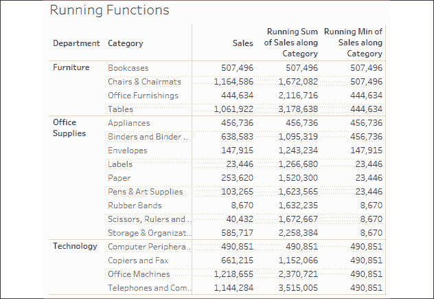

图 6.21：运行函数

请注意，`Running_Sum(SUM[Sales]))` 会继续将销售总和加到每个分区行的累计总和中。`Running_Min(SUM[Sales]))` 在遍历分区中的各行时，会保持遇到的最小销售总和。

## 窗口函数

这些函数一次性操作整个分区的所有行，基本上是对聚合结果进行聚合。它们包括 `Window_Sum`、`Window_Avg`、`Window_Max` 和 `Window_Min` 等，如下截图所示：

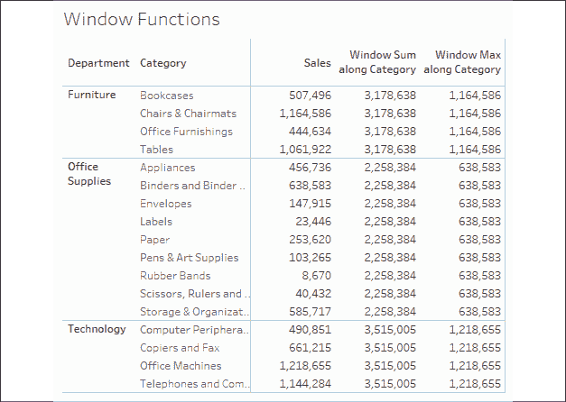

图 6.22：窗口函数示例

`Window_Sum(SUM([Sales])` 对整个窗口内的销售额求和（在此情况下，为部门内所有类别的销售额）。`Window_Max(SUM([Sales])` 返回窗口内销售额的最大总和。

你可以向窗口函数传递可选参数，以进一步限制窗口的范围。窗口始终最多限制在分区内。

## 排名函数

这些函数提供了基于聚合值的多种排名方式。排名有多种变体，允许你决定如何处理并列项以及排名的密集程度，如下截图所示：

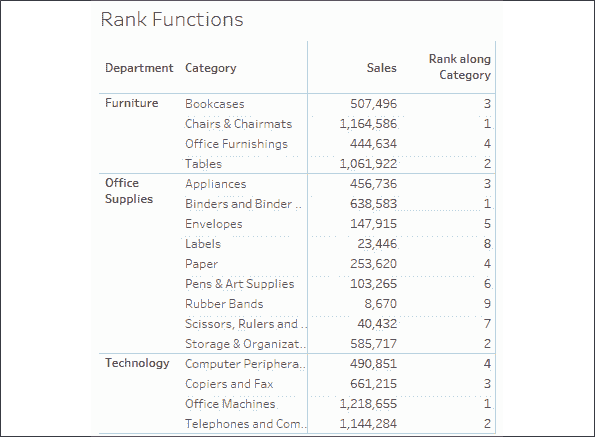

图 6.23：排名函数示例

`Rank(SUM([Sales]))`计算返回部门内各类别销售额总和的排名。

## 脚本函数

这些函数允许与 R 分析平台或 Python 集成，任一平台都可以包含从高级统计到预测建模的简单或复杂脚本。深入探讨所有可能的功能超出了本书的范围，但文档和示例可以在 Tableau 的官网和 Tableau 社区的各种成员处轻松获取。

比如，Bora Beran 有一篇很棒的帖子：[`www.tableau.com/about/blog/2016/11/leverage-power-python-tableau-tabpy-62077`](https://www.tableau.com/about/blog/2016/11/leverage-power-python-tableau-tabpy-62077)

## Total 函数

`Total`函数值得单独列出，因为它的功能与其他函数略有不同。与在缓存中的聚合表上工作的其他函数不同，`Total`会重新查询构成给定分区的所有源数据行。在大多数情况下，这将产生与窗口函数相同的结果。

例如，`Total(SUM([Sales]))`给出的结果与`Window_Sum(SUM([Sales]))`相同，但`Total(AVG([Sales]))`可能会与`Window_AVG(SUM([Sales]))`给出的结果不同，因为`Total`给出的是真实的底层行的平均值，而`Window`函数给出的则是各个和的平均值。

在本节中，我们已经了解了许多表计算函数。这些函数将为你提供解决各种实际问题和回答许多问题的构建模块。从排名到年度比较，你现在已经有了成功的基础。接下来，我们将进入一些实际示例。

# 实际例子

在了解了表计算的一些基本概念之后，我们来看一些实际的例子。我们将举几个例子，尽管表计算的实际应用几乎是无穷无尽的。你可以做从累计和分析年度增长到查看各类别之间的百分比差异等等。

## 年度增长

你可能经常需要比较年度数据。我们的客户基础在过去一年增长了多少？每个季度的销售额与去年同季度的销售额相比如何？这些问题可以通过**同比增长**来回答。

Tableau 将**同比增长**作为快速表计算的一个选项。举个例子，这是一个展示按**季度**划分的**销售额**视图，并展示与去年同季度销售额的百分比差异：


图 6.24：销售的同比增长

第二个 **Sum(Sales)** 字段应用了 **年度增长** 快速表格计算（并且 **标记** 类型已更改为条形图）。您会注意到右下角有 **>4 个空值** 的指示符，这提醒您至少有四个空值（因为没有 2016 年可以与 2017 年的季度进行比较，所以这很合理）。

如果您过滤掉了 2017 年，空值将出现在 2018 年，因为表格计算只能在缓存中存在的汇总数据上操作。任何应用于数据的常规过滤器都在源头上应用，排除的数据永远不会进入缓存。

尽管像这个示例一样构建视图非常简单，但请小心，因为 Tableau 假设视图中的每一年都有相同数量的季度。例如，如果 2017 年的 **Q1** 数据不存在或被过滤掉，那么结果视图可能不会完全符合您的预期。例如，考虑以下情况：

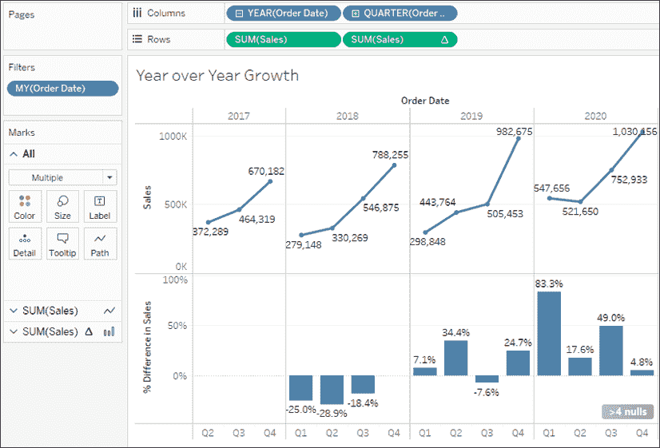

图 6.25：年度销售增长——但如果第一年缺少 Q1，则无法正常工作

这里的问题是，Tableau 使用 **年份** 和 **季度** 作为寻址，并且在 **订单日期年份** 的 *At the Level* 值上计算快速表格计算。这在假设所有季度都存在的情况下有效。然而，在这里，**2018** 年的第一季度被匹配到了 **2017** 年的第一季度，而实际是 **Q2**。为了解决这个问题，您需要编辑表格计算，仅使用 **年份** 作为寻址。然后，**季度** 成为分区，比较将会在正确的季度之间进行。

另一个需要考虑的问题是：如果您不想在视图中显示 2017 年该怎么办？将其过滤掉会导致 2018 年出现问题。在这种情况下，我们将在本节后面介绍 **表格计算过滤** 或 **延迟过滤**。另一种删除 2017 年但仍然保留其数据值的方法是右键点击视图中的 2017 年标题，并选择 **隐藏**。

隐藏是一个特殊命令，它可以防止 Tableau 渲染数据，即使数据存在于缓存中。如果您在隐藏之后决定重新显示 2017 年，可以使用 **订单日期年份** 字段的菜单，选择 **显示隐藏数据**。或者，您可以使用菜单选择 **分析** | **显示隐藏数据**。

您可能还希望在视图中隐藏空值指示符。您可以通过右键点击指示符并选择 **隐藏指示符** 来实现。点击指示符后，将显示过滤数据或将其作为默认值（通常为 0）的选项。

年度增长（或任何周期与另一个周期的比较）是一个常见的分析问题，表格计算可以帮助您回答这个问题。接下来，我们来看一个表格计算实际应用的例子。

## 动态标题与总计

你可能已经注意到每个视图中显示的标题。还有一些标题说明，除非你特别打开它们，否则是不会显示的（要打开这些标题说明，请从菜单中选择**工作表** | **显示标题说明**）。

默认情况下，标题显示的是工作表名称，标题说明被隐藏，但你可以显示并修改它们。有时，你可能希望显示一些总计，以帮助最终用户理解广泛的背景或立即掌握数据的规模。

例如，下面是一个视图，允许用户选择一个或多个**Region**，然后查看每个**Region**中各州的**Sales**：

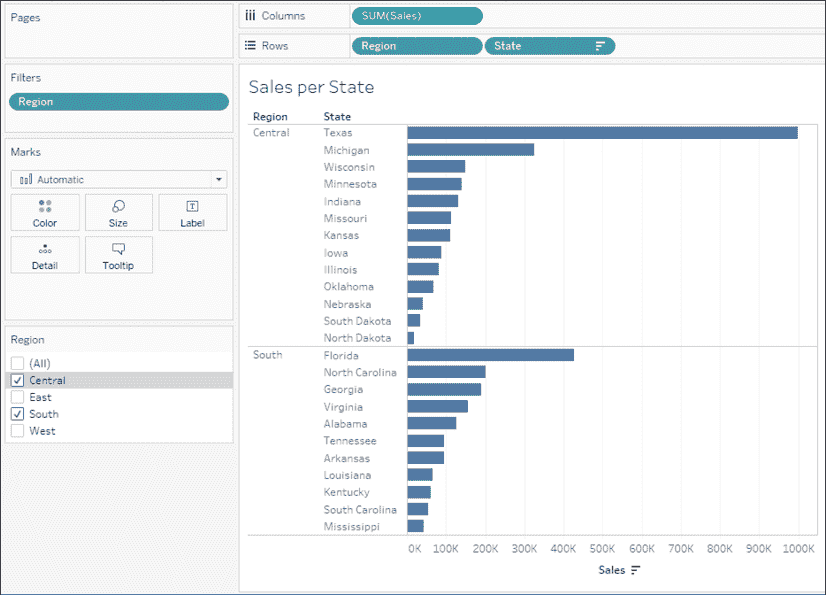

图 6.26：两个区域的各州销售情况

显示随着用户选择不同区域而变化的状态数可能会很有用。你可能首先想到对**State**进行聚合，比如使用`Count Distinct`。然而，如果你尝试在标题中显示这个聚合值，你会始终看到值为`1`。为什么？因为视图的详细级别是**State**，每个州的独立状态数是`1`！

但是，有些表格计算选项可以让你进一步聚合聚合值。或者，你可能会考虑根据窗口的大小来确定表格中的值的数量。实际上，这里有几种可能性：

+   获取总的不同计数：`TOTAL(COUNTD([State]))`

+   获取窗口内的总和：`WINDOW_SUM(SUM(1))`

+   获取窗口大小：`SIZE()`

你可能记得，窗口是由范围或分区确定的边界所定义的。无论我们选择哪种方式，我们都希望将窗口定义为整个表格。使用`Table (down)`的相对计算或使用所有维度的固定计算都可以实现这一目标。这里是一个展示动态标题和标题说明中三种选项的视图：

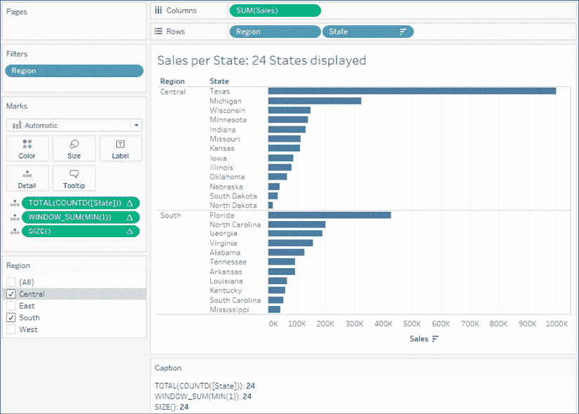

图 6.27：可以使用各种表格计算来实现标题中的总计

这个示例说明了你如何使用各种表格计算在更高的细节层次上工作，特别是计数视图中所有的状态。这项技术将帮助你在使用 Tableau 时解决各种分析问题。现在，让我们转向另一种可以解决许多问题的技术。

## 表格计算过滤（延迟过滤）

假设你构建了一个视图，允许你查看每个部门的总销售额百分比。你已经对**Sales**字段使用了快速表格计算，得到了总销售额的百分比。你还使用了**Department**作为过滤器。但这会带来一个问题。

由于表格计算是在聚合数据返回到缓存后执行的，因此部门的过滤器已经在数据源中进行了评估，聚合行不包括任何被过滤器排除的部门。因此，总百分比始终会加起来为 100%；也就是说，这是过滤后总数的百分比，如下截图所示：

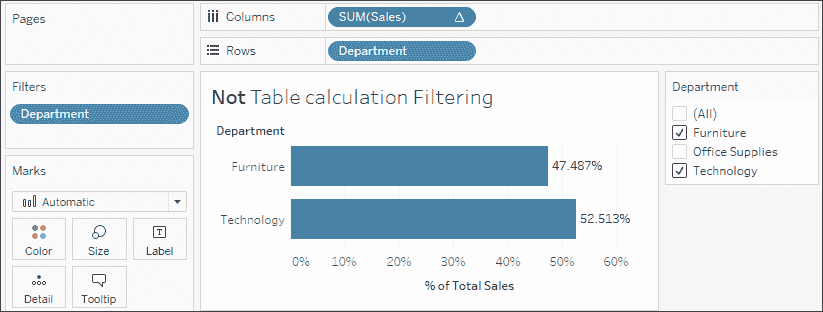

图 6.28：当“办公用品”被过滤掉时，百分比表格计算将其余部门的百分比加总为 100%

如果你想看到所有部门的总销售百分比，即使你想排除某些部门的显示，怎么办？一种选择是使用表格计算作为过滤器。

你可能会创建一个名为`部门（表格计算过滤器）`的计算字段，代码为`LOOKUP(ATTR([Department]), 0)`。`Lookup()`函数使其成为表格计算，而`ATTR()`将**部门**视为聚合（本节末尾将提供更多解释）。第二个参数`0`告诉查找函数不要向前或向后查找。因此，计算返回所有**部门**的值，但作为表格计算结果。

当你将表格计算放置在**过滤器**架上，而不是**部门**维度时，过滤器不会在源头上应用。相反，所有的汇总数据仍然保存在缓存中，而表格计算过滤器仅仅是*隐藏*了视图中的数据。其他表格计算，例如**总计百分比**，仍然会在缓存中的所有数据上进行操作。在这种情况下，即使表格计算过滤器隐藏了一个或多个数据，如下图所示，仍然允许计算所有部门的总百分比：


图 6.29：当使用表格计算过滤器时，缓存中所有的汇总数据都可用于计算所有部门的总销售百分比

你可能注意到了`ATTR`函数的使用。记住，表格计算需要聚合的参数。`ATTR`（即属性的缩写）是一种特殊的聚合，当某个字段在给定的详细级别上只有一个值时，它返回该字段的值，如果该字段有多个值，则返回`*`。

为了理解这一点，可以尝试在视图中同时使用**部门**和**类别**作为行。在视图中激活字段的下拉菜单，将**类别**更改为**属性**。由于每个部门都有多个类别，它将显示为`*`。然后，撤销操作并将**部门**更改为**属性**。由于每个类别只有一个部门，它将显示部门名称。

在这个例子中，我们已经看到如何有效地使用表格计算作为过滤器，当我们需要其他表格计算在缓存中的所有数据上操作时。

# 总结

在本章中，我们已经覆盖了许多与表格计算相关的概念。你现在已经具备了使用简单快速表格计算的基础，并能够利用高级表格计算的强大功能。我们讨论了作用域和方向的概念，这些概念适用于相对于视图的行列布局操作的表格计算。我们还考虑了与地址和分区相关的概念，这些概念适用于计算固定在某些维度上的表格计算。

我们所讨论的实际例子仅仅触及了可能实现的一部分，但应该能让你对可以达成的目标有所了解。能够解决的问题种类以及能够回答的问题的多样性几乎是无穷无尽的。

在接下来的几章中，我们将转向一些较轻松的话题，讨论格式化和设计，但在结束之前，我们肯定还会看到一两个表格计算的例子！
