# 13

# 理解 Tableau 数据模型、连接和混合

在本章中，我们将深入了解如何使用 Tableau 建模和构建数据。我们在之前的章节中已经看到过**数据源**界面，并简要了解了如何通过拖放表格来建立关系。现在，我们将探索一些 Tableau 的复杂功能，以便深入了解 Tableau 如何允许你以逻辑或物理方式将多个表格关联在一起。

我们将首先对 Tableau 的新数据模型进行广泛的概述，然后详细研究不同类型的连接和混合。数据模型和混合主要适用于 Tableau Desktop（和 Server），但请特别注意连接的讨论，因为对连接类型的良好理解将对我们在*第十五章*《使用 Tableau Prep 整理数据》中的 Tableau 准备工作有很大帮助。

数据模型仅在 Tableau 2020.2 及更高版本中可用。如果你使用的是旧版本，连接和混合的解释将直接适用，而数据模型的解释将为你提供升级的灵感！

在本章中，我们将涵盖以下主题：

+   本章使用的示例数据解释

+   探索 Tableau 数据模型

+   使用连接

+   使用混合

+   何时使用数据模型、连接或混合

我们将首先了解本章工作簿中包含的示例数据集。这是为了让你在进行示例操作之前，建立一个良好的知识基础。

# 本章使用的示例数据解释

本章中，我们将使用一个包含患者就诊记录的示例数据集。数据本身存储在`Hospital Visits.xlsx`的 Excel 文件中，该文件位于`Learning Tableau\Chapter 13`目录下。Excel 文件中的标签代表数据表，就像你在任何关系型数据库中可能会看到的多个文件一样，或者仅仅是 Excel 文件中的标签！这些表格之间的关系在这里进行了说明：

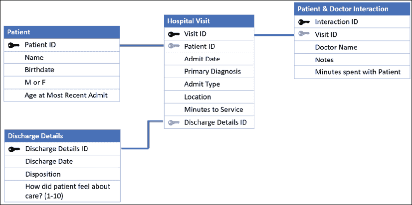

图 13.1：Excel 文件的四个标签以四个具有关系的表格形式展示

Excel 并没有明确定义表之间的关系，但这里展示了它们可能在关系型数据库中通过外键查找的形式存在。下面是对这些表及其关系的简要说明：

+   **医院就诊**：这是记录单个患者在一次就诊中入院和诊断信息的主表。它包含诸如**入院类型**、**地点**等属性，以及**服务等待时间（分钟）**的度量。

+   **患者**：此表包含单个患者的附加信息，如**姓名**、**出生日期**以及其**最近入院时的年龄**的度量。

+   **出院详情**：此表提供了有关患者出院的额外信息，如 **出院日期** 和 **处置**（患者出院条件及离开医院后的去向）。它还包含一个度量 **患者对护理感受如何？（1-10）**，其中 1 表示最低，10 表示最高。

+   **患者与医生互动**：此表定义了患者在就诊期间与医生之间的互动。它包括 **医生姓名**、**备注** 和衡量医生与患者共度时间的度量（**与患者共度时间（分钟）**）。

这些表以不同的方式相互关联。以下是一些详细信息：

+   **住院就诊** 到 **患者**：每次就诊都有一个单独的患者，因此 **住院就诊** 将始终有一个指向 **患者** 表中单个记录的 **患者 ID** 字段。我们也会在 **患者** 表中找到其他没有记录就诊的患者。也许它们是来自遗留系统的历史记录，或者患者与医院的互动方式并非通过就诊。

+   **住院就诊** 到 **出院详情**：每次就诊可能只有一个出院记录，但某些患者可能仍然在医院内。在良好设计的数据结构中，我们应该能够依靠 **出院详情** 表中的记录来指示“仍在医院”。然而，在我们的 Excel 数据中，可能会有或没有 **出院详情 ID**，这意味着并不总是会有一个匹配的 **出院详情** 记录与每次 **住院就诊** 相对应。

+   **患者与医生互动** 到 **住院就诊**：在患者的就诊过程中，可能会有一个或多个医生与患者互动。也可能没有医生记录任何互动。因此，在 **患者与医生互动** 中，我们有时会找到多条记录参考单个 **就诊 ID**，有时只有一条记录，有时在 **住院就诊** 表中存在就诊但没有任何记录。

掌握了示例数据源后，让我们转向如何在 Tableau 中构建数据模型。

# 探索 Tableau 数据模型

在 Tableau 2020.2 及更高版本中，您将会发现数据模型作为一个新功能。每个数据源都将使用数据模型。在之前的版本中创建的数据源将会被更新为数据模型，但它们将被包含在一个单一的对象中，因此在功能上，它们将与之前的版本相同地运行。

Tableau 的早期版本允许您利用连接表和混合数据源，我们将在本章末尾考虑这些选项。现在，我们将专注于创建数据模型并理解这种范式。

## 创建数据模型

我们在*第二章*中简要查看了**数据源**屏幕，*在 Tableau 中连接数据*。现在，我们将深入探讨界面背后的概念。你可以随时跟随 `Chapter 13 Starter.twb` 工作簿中的示例，或者查看 `Chapter 13 Complete.twbx` 中的最终结果。

我们将首先创建与`Hospital Visits.xlsx`文件的连接，该文件位于`Chapter 13`目录中。首次连接到文件时，**数据源**屏幕将如下所示：

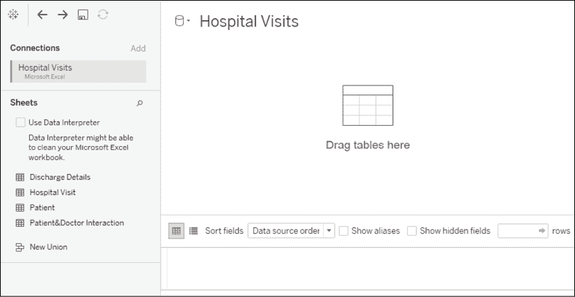

图 13.2：数据源屏幕列出了 Excel 工作簿中的标签，并邀请你开始构建数据模型。

我们将通过拖放表格到画布上来构建数据模型。我们将添加所有四个表。Tableau 会根据任何匹配的字段名称和类型为每个新添加的表建议关系。对于我们的表，我们将接受默认设置，因为指示正确关系的`ID`字段具有相同的名称和类型。

第一个添加的表是根表，构成数据模型的起点。在这个例子中，添加表格的顺序并不重要，尽管你可能会注意到，取决于你从哪个表开始，显示效果会略有不同。在以下截图中，我们从**住院就诊**（这是主要表，因此作为根表是合理的）开始，然后添加了其他所有表：

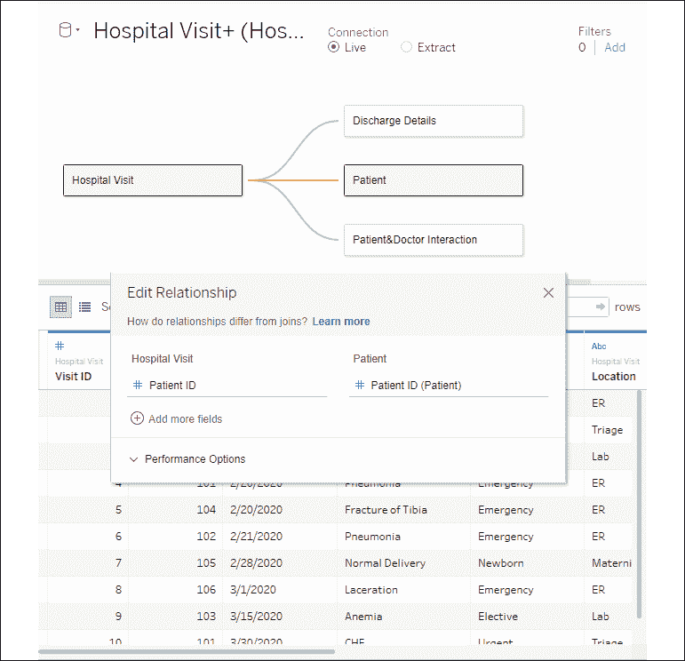

图 13.3：所有表格都已添加到数据模型中。

你会注意到**编辑关系**对话框已打开，用于**住院就诊**和**患者**之间的关系。Tableau 自动创建了我们的关系，因为两个表中的 ID 字段具有相同的名称和类型。如果需要，你可以手动编辑这些关系，改变哪些字段定义了关系。

**关系**仅定义了连接表格的字段，而没有定义表格之间的具体关系。我们将在本章后面讨论连接类型的概念（例如，左连接或内连接），但关系不限于某种连接类型。相反，Tableau 会根据你在视图中使用的字段，选择合适的连接类型以及正确的聚合方式。在大多数情况下，你无需关心 Tableau 在背后做了什么，但我们将在下一节探讨一些独特的行为。

在 2020.2 版本中，无法编写计算来定义关系，但在 2020.3 版本中这是一个功能。

此外，请注意关系编辑器中的**性能选项**下拉菜单，如下所示：

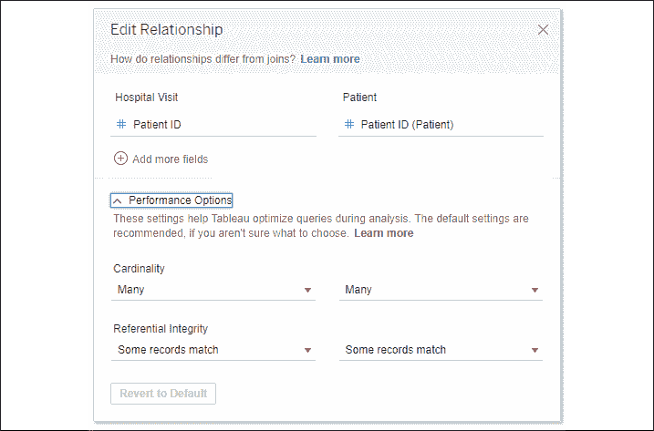

图 13.4：编辑关系对话框包含提高性能的选项。

这些性能选项允许 Tableau 在已知关系性质的情况下生成更高效的查询。如果你不知道关系的确切性质，最好保持默认设置，因为不正确的设置可能导致错误的结果。

性能选项涉及的两个基本概念：

+   **基数**：这个术语指示一个表中的多少记录可能与另一个表中的记录相关。例如，我们知道一次就诊只对应一个患者。然而，我们也知道在一次就诊中，可能有许多医生会与患者互动。

+   **参照完整性**：这个术语指示我们是否期望所有记录都能找到匹配项，或者是否某些记录可能无法匹配。例如，我们知道（根据前面的描述）**患者**表中有些患者在**住院记录**表中没有匹配项。我们还知道有些患者可能没有出院记录，因为他们仍然在医院里。

如果 Tableau 能够从关系型数据库中确定约束条件，它将使用这些约束。否则，Tableau 会将默认设置为**多对多**和**某些记录匹配**。对于本章中的示例，我们确实知道关系的确切性质（它们在前一节中已描述），但由于数据集足够小，修改这些设置不会带来明显的性能提升，因此我们将接受默认的性能设置。

在创建了初始数据模型后，花点时间探索数据模型范式的两层结构。

## 数据模型的层次

数据模型由两层组成：

+   **逻辑层**：由相关的逻辑表或对象组成的语义层。每个逻辑表可能由一个或多个物理表组成。

+   **物理层**：由来自底层数据源的物理表组成的层。这些表可以通过常规的连接或联合操作连接或联合在一起，或通过自定义 SQL 语句创建。

请查看以下包含我们四个表的画布截图：

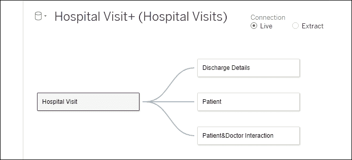

图 13.5：数据模型的逻辑层

这个初始画布定义了数据模型的**逻辑表**。逻辑表是定义单一结构或对象的数据集合，这些结构或对象与其他逻辑数据结构相关。双击画布上的**住院记录**表，你将看到逻辑层下方的另一个层次：

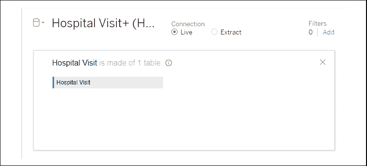

图 13.6：构成住院记录的物理表的物理层

这是逻辑**医院访问**表的物理层。这个物理层由数据的物理表组成——可能是联合或连接在一起的。在这种情况下，我们知道**医院访问由 1 个表组成**。所以，在这种情况下，**医院访问**的逻辑层与下面的物理层是相同的。在本章的*使用连接*部分，我们将探讨如何通过多个表来扩展物理层的复杂性，同时仍将这些表的集合视为一个单一对象。

现在请点击右上角的**X**图标，关闭**医院访问**的物理层。然后转到本章工作簿的**分析**标签，我们将探索数据模型如何在实践中工作。

## 使用数据模型

大部分情况下，使用数据模型将会相对直观。如果你曾使用过之前版本的 Tableau，你会注意到一些细微的界面变化，并且有些数据模型的行为需要你去习惯。一旦你熟悉了这些，你的分析将超出预期！

### 新的数据面板界面

你可能会注意到**数据**面板的不同之处，它看起来大致是这样的：

图 13.7：数据面板按逻辑表格组织，并显示每个表格中的维度和度量的分隔

你会注意到，**数据**面板按照逻辑表格组织，每个表格中包含的字段都被列出。度量和维度通过一条细线进行分隔，而不像以前那样出现在不同的部分。这使得查找与分析相关的字段变得更加容易，也有助于你理解数据模型的预期行为。与之前的版本不同的是，每个逻辑表都有一个`记录数量`字段，字段名遵循**表名 (Count)**的命名规则。你还可以在字段列表的底部找到可以添加的计算以及**度量名称**/**度量值**。

在概览了 UI 的一些变化后，让我们来看一下你可以预期的数据模型行为。

### 数据模型行为

在`Starter`工作簿的**分析**标签中，尝试创建不同的可视化效果。特别注意维度、显示的值以及度量的聚合方式。我们将通过几个示例进行讲解（你可以在`Starter`工作簿中复制这些示例，或者在`Complete`工作簿中查看）。

首先，注意到将**姓名**从**病人**表拖到**行**中，会显示 10 个病人。结果发现，并不是所有病人都有住院记录，但当我们使用来自同一逻辑表的一个或多个维度时，我们会看到 Tableau 中的完整值域。也就是说，我们会看到所有病人，无论他们是否有过住院记录。我们可以通过添加**住院记录（数量）**字段来验证每个病人的就诊次数，得到以下视图：

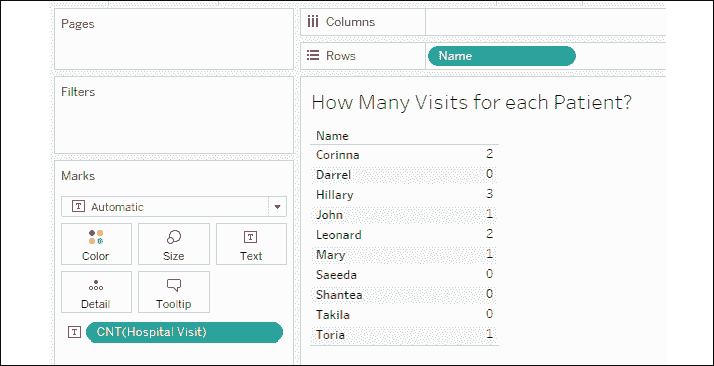

图 13.8：所有病人都被显示出来，甚至是那些没有就诊的病人

但是如果我们在表格中加入**初步诊断**，注意到只有 10 个病人中的 6 个被显示出来：

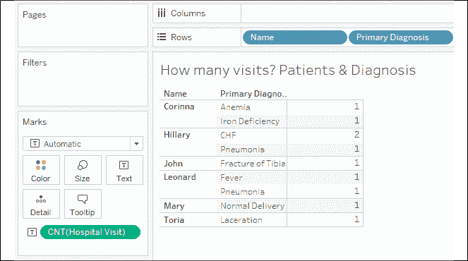

图 13.9：只显示有就诊记录的病人；大多数病人只有一次就诊记录且诊断相同，但有一位病人做了两次同样的诊断

这突显了另一个行为：当你从两个或更多表格中包含维度时，只有匹配的值才会显示。本质上，当你添加**姓名**和**初步诊断**时，Tableau 会展示那些同时存在于**病人**和**住院记录**表中的病人。如果你只想关注曾经去过医院的病人，这是很有用的。

那么如果你真的想看到所有病人以及适用的诊断呢？为了实现这一点，只需从表格中添加你想查看完整领域的字段的度量。在这个例子中，我们可以添加**最近一次住院年龄**或**病人（数量）**度量，因为它们都来自**病人**表。这样做会得到如下视图：

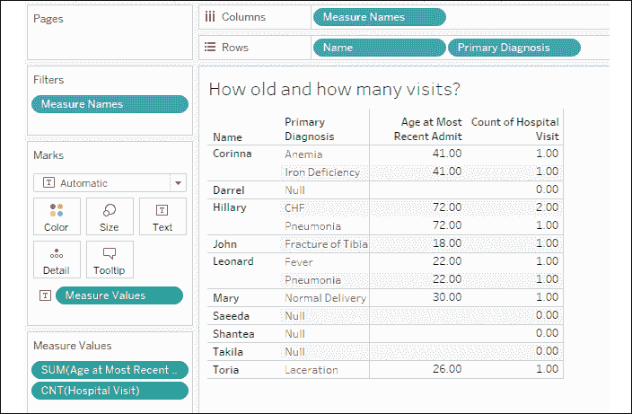

图 13.10：所有病人再次显示出来

尽管**最近一次住院年龄**对那些从未住院的病人来说是`NULL`，但只需将该度量添加到视图中，Tableau 就会显示所有病人。这展示了第三个行为：从与维度相同的表格中包含度量将迫使 Tableau 展示该维度的完整值域。

这里还展示了数据模型行为的另一个基本原则。请注意，**最近一次住院年龄**显示了每个病人和每个诊断的值。然而，Tableau 不会错误地在总计或小计中重复显示该值。如果你为每个病人在**最近一次住院年龄**和**住院记录数量**列中添加小计，正如以下视图所示，你会看到 Tableau 已经计算出了正确的值：

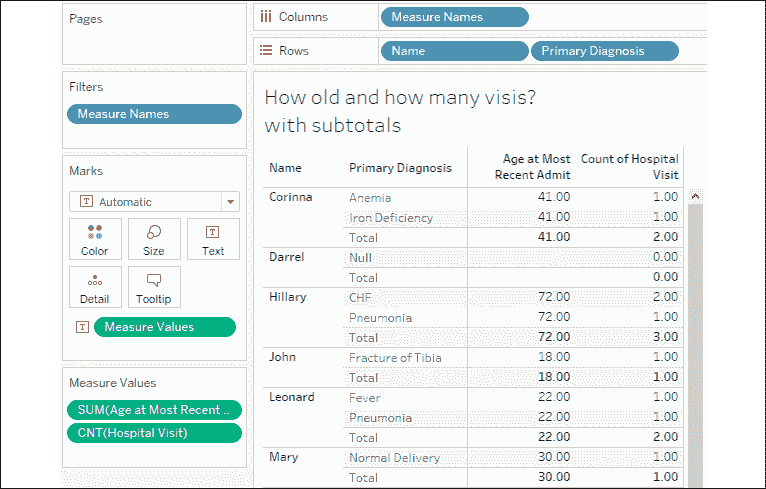

图 13.11：即使传统的连接行为会重复显示值，Tableau 也会正确计算小计

数据模型的最终行为可以表述为：聚合是根据度量的逻辑表定义的细节层次来计算的。这类似于你使用**细节级别**（**LOD**）表达式来避免 LOD 重复的方式，但你无需编写表达式或中断思路来解决问题。Tableau 数据模型为你完成了繁重的工作！

花一些额外的时间，利用你创建的数据模型构建视图和可视化。然后复习以下行为，以便了解预期效果以及如何控制你想执行的分析：

+   当你使用来自同一逻辑表的一个或多个维度时，你将在 Tableau 中看到该维度的完整值域。

+   当你从两个或更多逻辑表中包含维度时，只有匹配的值会被显示。

+   如果将度量与同一逻辑表中的维度一起使用，Tableau 将强制显示该维度的完整值域（即使之前的行为已生效）。

+   聚合是根据度量的逻辑表定义的细节层次来计算的。

只需稍加练习，你会发现这些行为变得很自然，尤其会欣赏 Tableau 在正确的细节层次上执行聚合。

当你首次创建新数据模型时，进行几个类似前面示例的快速检查是很有帮助的。这将帮助你熟悉数据模型，并验证关系是否按预期工作。

现在，我们将重点学习如何使用连接在物理层中关联数据。

# 使用连接

在物理层中的**连接**是表之间按行逐行匹配数据的过程。我们将看看几种不同类型的连接，然后考虑如何在数据模型的物理层中利用它们。

## 连接类型

在物理层中，你可以指定以下几种连接类型：

+   **内连接**：只有在左右两表中都满足连接条件的记录才会保留。在下面的示例中，只有三行匹配的记录被保留在结果中：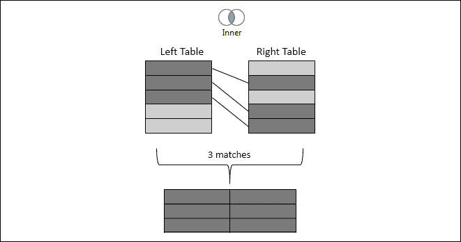

    图 13.12：内连接

+   **左连接**：左表中的所有记录都会被保留。来自右表的匹配记录会在结果表中显示其值，而不匹配的记录则会在右表的所有字段中显示`NULL`值。以下示例中，左表的五行记录被保留，对于右表中未匹配的任何值显示为`NULL`：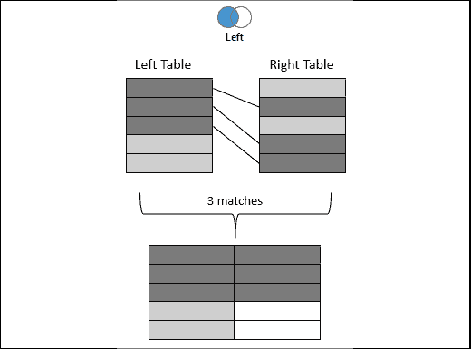

    图 13.13：左连接

+   **右连接**：右表中的所有记录都会被保留。左表中匹配的记录会生成值，而未匹配的记录会在左表中显示所有字段的`NULL`值。并非所有数据源都支持右连接。如果不支持，该选项将被禁用。在以下示例中，右表中的五行记录被保留，未匹配的左表字段显示`NULL`值：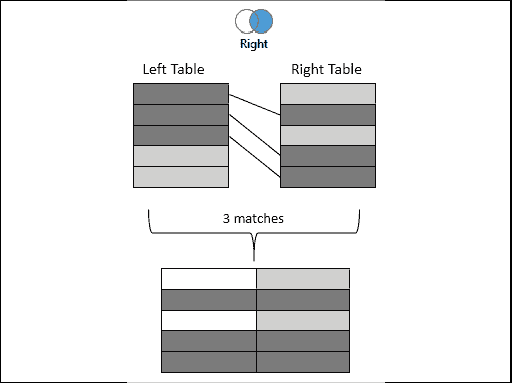

    图 13.14：右连接

+   **全外连接**：两边表中的所有记录都会被保留。匹配的记录将具有来自左边和右边的值。没有匹配的记录将会在左边或右边的匹配记录未找到的地方显示`NULL`值。并非所有数据源都支持全外连接。如果不支持，该选项将被禁用。在以下示例中，来自两边的所有行都被保留，未找到匹配的地方显示`NULL`值：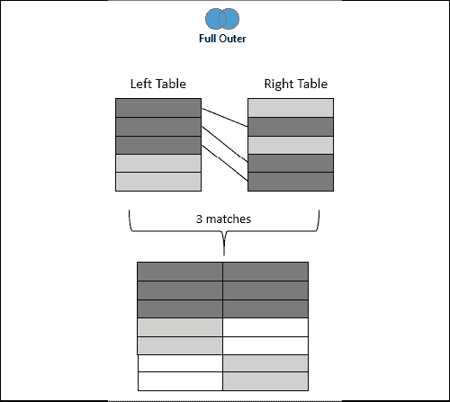

    图 13.15：全外连接

+   **空间**：这会根据空间对象的**交集**（重叠）将匹配的记录连接在一起（我们在*第十二章*“*探索地图和高级地理空间功能*”中讨论了 Tableau 的空间功能）。例如，一个基于经纬度的点可能位于由 Shapefile 定义的复杂形状内部。只要一个表中的空间对象与另一个表中指定的空间对象重叠，相关记录就会被保留：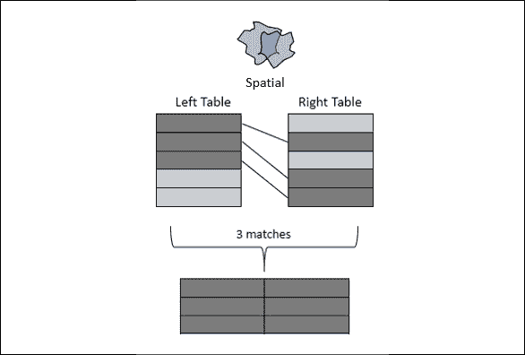

    图 13.16：空间连接

当你从左表和右表中选择空间对象时，你需要指定**交集**作为字段之间的操作符，以实现空间连接，如*图 13.17*所示：

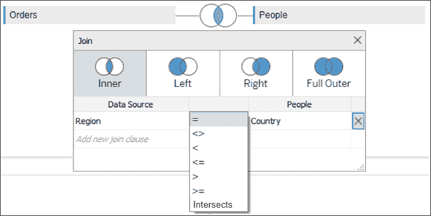

图 13.17：假设选中的两个字段代表空间对象，"交集"选项将可用

在深入理解连接类型之后，我们来考虑如何在 Tableau 的数据模型物理层中使用它们。

## 连接数据表

大多数数据库有多个数据表，这些表之间以某种方式相关。此外，你还可以通过各种数据连接将不同数据源中的数据表联合起来。

对于这里的示例，我们再次考虑医院数据库中的表，并进行一些简化：

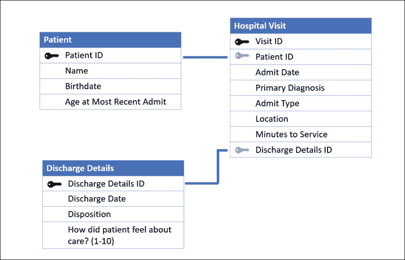

图 13.18：主医院访问表，包含患者和出院详细信息，可能存在于关系型数据库中

让我们来考虑如何在物理层中使用一些连接来构建数据源。要跟随示例，请在`Chapter 13 Starter.twbx`工作簿中创建一个新的 Excel 数据源，引用`Chapter 13`目录中的`Hospital Visits (Joins).xlsx`文件。你也可以在`Chapter 13 Complete.twbx`工作簿中查看连接。

正如我们之前所做的那样，我们将首先将**住院记录**表格拖到数据源画布上，以便在逻辑层中创建一个**住院记录**对象，像这样：

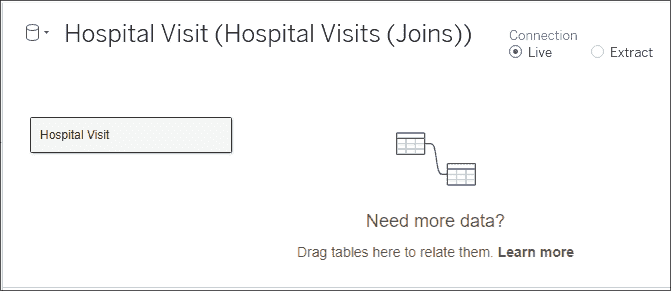

图 13.19：将表格拖到画布上后，逻辑层中创建了住院记录对象

此时，逻辑层对象仅包含一个物理表格。但接下来我们将扩展它。双击**住院记录**对象以展开物理层。它将看起来像这样：

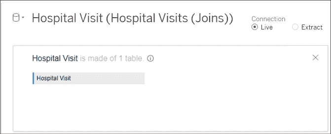

图 13.20：当前仅包含一个物理表格的物理层

你可以通过添加额外的表格来扩展物理模型。我们将在这里进行扩展，添加**出院详情**和**病人**。在添加时，Tableau 会弹出对话框提示你调整连接的详细信息。它将看起来像这样：

图 13.21：在物理层中将出院详情与住院记录连接

**连接**对话框允许你指定连接类型（**内连接**、**左连接**、**右连接**或**完全外连接**），并指定一个或多个字段进行连接。在这些字段之间，你可以选择哪种类型的运算符来连接字段。默认是相等（**=**；字段必须相等），但你也可以选择不等（`<>`；字段必须不相等）、小于（`<`）、小于等于（`<=`）、大于（`>`）或大于等于（`>=`）。连接的类型和定义连接的字段关系将决定从连接中返回多少记录。我们将在下一节详细查看这些细节。

通常，你会希望首先将主表拖到物理层画布上。在这个例子中，**住院记录**包含连接额外表格的键。其他表格应在主表之后被拖放。

此时，接受 Tableau 自动检测到的在表格之间共享的字段（**出院详情 ID** 对应 **出院详情**，**病人 ID** 对应 **病人**）。将**出院详情**的连接改为左连接。这意味着所有住院记录都将被包括在内，即使尚未发生出院。将**病人**保持为内连接。这将仅返回在两个表格之间共享的记录，因此只保留有住院记录的病人。

最终，**住院记录**的物理层将看起来像这样：

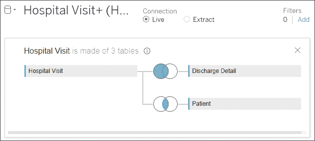

图 13.22：物理层由三个连接在一起的表格组成

当你关闭物理层后，你将再次看到逻辑层，其中包含一个单一对象：**住院记录**。该对象现在包含一个连接图标，表示它是由多个物理表格连接而成。但它仍然是数据模型逻辑层中的一个单一对象，像这样：

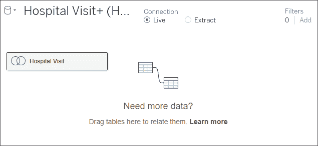

图 13.23：逻辑层包含一个由三个物理表格组成的单一对象

所有连接会创建你可能认为的一个平面表，它可以与数据模型中的其他对象关联。这些对象反过来可能由单个物理表或多个物理表连接组成。

如果你正在跟随示例操作，请将此数据源重命名为**医院就诊（连接）**。我们将在本章结束时再次利用这个数据源进行一个示例。在此期间，让我们考虑一些与连接相关的其他细节。

## 其他连接注意事项

我们在本节的结尾总结了利用连接的进一步可能性，并提醒可能会出现的问题。

### 连接计算

在前面的示例中，我们提到 Tableau 基于数据中的字段逐行**连接**。你可能会遇到需要基于数据中没有但可以从现有数据中派生的值进行连接的情况。例如，假设有一个**患者档案**表，它能为你的数据集增加显著的价值。然而，它缺少**患者 ID**，只包含**名字**和**姓氏**字段。

要将其连接到我们的**患者**表，我们可以使用**连接计算**。这是一种仅用于连接表的计算。要创建连接计算，请在**连接**对话框中的字段下拉列表中选择最后一个选项，**创建连接计算**：

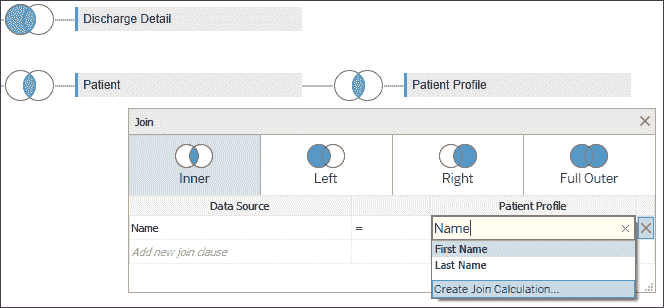

图 13.24：你可以创建一个连接计算，帮助形成正确的连接

选择此选项允许你编写可以在连接中使用的行级计算。例如，我们的连接计算可能会像 `[First Name] + " " + [Last Name]` 这样的代码，用于返回与**姓名**字段匹配的值。

尽量避免在文本字段上进行连接，尤其是在较大的数据集上，这样做会影响性能。基于整数进行连接效率更高。而且，两个不同的人可能会共享相同的名字和姓氏，因此如果一个实际数据集遵循本示例中的结构，可能会发生错误匹配和数据错误。

你还可以利用*第十二章*中提到的地理空间函数，*探索映射和高级地理空间功能*，即使其中一个或两个数据源缺少用于连接的特定空间对象，也能创建空间连接。例如，如果你有`纬度`和`经度`，你可以创建一个连接计算，使用 `MAKEPOINT([Latitude], [Longitude])` 的代码，找到与另一个表中的空间对象的交集。

当你缺少用于连接的字段时，连接计算也能提供帮助。如果你想要连接的数据完全位于另一个数据库或文件中呢？在这种情况下，我们会考虑跨数据库连接。

### 跨数据库连接

使用 Tableau，你可以在行级别进行多个不同数据连接的连接。不同数据连接之间的连接被称为**跨数据库连接**。例如，你可以将 SQL Server 表与文本文件或 Excel 文件连接，或将一个数据库中的表与另一个数据库中的表连接，即使它们在不同的服务器上。这为补充数据或分析来自不同来源的数据提供了各种可能性。

考虑医院数据。尽管它不属于`第十三章`文件集的一部分，但账单数据通常与病人护理数据存在于不同的系统中并不罕见。假设你有一个病人账单文件，其中包含你希望包括在医院就诊分析中的数据。你可以通过将文本文件作为数据连接添加，然后将其与现有的表格进行连接，如下所示：

图 13.25：基于不同数据连接的表或文件连接

你会注意到，在**数据源**界面上有一个**添加**链接，允许你向数据源添加数据连接。点击每个连接后，你可以将该连接中的表拖放到**数据源**设计器中，并按需指定连接。每个数据连接都会有颜色编码，以便你可以立即识别设计器中各种表格的来源。

你也可以在逻辑层使用多个数据源。

连接时的另一个考虑因素是无意的错误，我们接下来会讨论这个问题。

### 数据的无意重复

最后，我们以关于连接的警告作为结尾——如果不小心，你可能会得到多几行或是比预期多很多倍的记录数。我们考虑一个理论上的例子：

假设你有一个像这样的`Visit`表：

| **Visit ID** | **Patient Name** | **Doctor ID** |
| --- | --- | --- |
| 1 | Kirk | 1 |
| 2 | Picard | 2 |
| 3 | Sisko | 3 |

以及像这样的`Doctor`表：

| **Doctor ID** | **Doctor Name** |
| --- | --- |
| 1 | McCoy |
| 2 | Crusher |
| 3 | Bashir |
| 2 | Pulaski |

请注意，`Doctor ID`的值`2`在`Doctor`表中出现了两次。在`Doctor ID`值相等的情况下进行连接将会导致重复记录，无论使用何种连接类型。这样的连接将会得到以下数据集：

| **Visit ID** | **Patient Name** | **Doctor ID** | **Doctor Name** |
| --- | --- | --- | --- |
| 1 | Kirk | 1 | McCoy |
| 2 | Picard | 2 | Crusher |
| 3 | Sisko | 3 | Bashir |
| 2 | Picard | 2 | Pulaski |

这将大大影响你的分析。例如，如果你在计算行数来确定发生了多少次病人就诊，你会重复计数。有时候你可能故意创建重复记录以帮助分析，但通常，这会表现为无意的错误。

除了不小心重复数据并导致额外行的风险外，还有可能会丢失一些行，因为预期匹配的值没有完全匹配。养成验证使用连接的任何数据源行数的习惯。

深入理解连接不仅能帮助你在使用 Tableau Desktop 和 Tableau Server 时更得心应手，还能为我们接下来在*第十五章*，*使用 Tableau Prep 整理数据*中学习 Tableau Prep 打下坚实的基础。现在，让我们通过简要了解数据混合来结束这一章。

# 使用数据混合

**数据混合**使你能够在同一视图中使用来自多个数据源的数据。这些数据源通常可能是不同类型的。例如，你可以将来自 Oracle 的数据与 Excel 的数据混合，将 Google Analytics 的数据与空间文件混合。数据混合还允许你在不同的细节级别上比较数据。让我们了解一些基础知识并看一个简单的例子。

数据混合是在汇总级别进行的，并且涉及向每个数据源发送不同的查询，不同于连接，它是在行级别进行的（从概念上讲）并且涉及向单个数据源发出单一查询。一个简单的数据混合过程包含几个步骤，如下图所示：

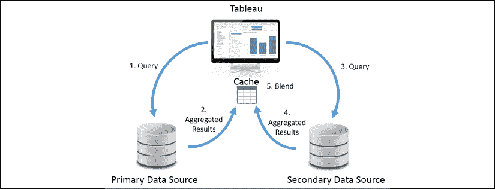

图 13.26：Tableau 如何实现数据混合

从上述图示中，我们可以看到以下内容：

1.  Tableau 向主数据源发出查询。

1.  底层数据引擎返回汇总结果。

1.  Tableau 向辅助数据源发出另一个查询。这个查询是基于来自主数据源的维度值集合进行过滤，这些维度将两个数据源连接起来。

1.  底层数据引擎从辅助数据源返回汇总结果。

1.  主数据源的汇总结果和辅助数据源的汇总结果将在缓存中混合在一起。

需要注意的是，数据混合不同于连接。连接是在单个查询中完成的，结果逐行匹配。数据混合是通过发出两个独立的查询，然后将汇总结果混合在一起实现的。

只能有一个主数据源，但可以有任意数量的辅助数据源。*步骤 3*和*4*将为每个辅助数据源重复执行。当所有汇总结果返回后，Tableau 会根据链接字段匹配汇总行。

当你的 Tableau 工作簿中有多个数据源时，首先在视图中使用的源将成为该视图的主数据源。

数据混合是特定于视图的。在一个视图中，你可以将一个数据源作为主数据源，而在另一个视图中，将相同的数据源作为辅助数据源。任何数据源都可以用于数据混合，但像 SQL Server Analysis Services 中的 OLAP 立方体，必须作为主数据源使用。

在许多方面，数据混合类似于创建一个包含两个或更多对象的数据模型。在许多情况下，数据模型会提供您所需的所有内容，而无需使用数据混合。然而，使用数据混合您会有更多灵活性，因为您可以在视图级别而不是对象级别更改哪些字段是相关的。

**关联字段**是用于匹配主数据源和次数据源之间的数据混合的维度。关联字段定义了次级数据源的详细级别。如果数据源之间的字段名称和类型匹配，则会自动分配关联字段。

否则，您可以通过从菜单中选择**数据** | **编辑数据关系**手动分配字段之间的关系，如下所示：

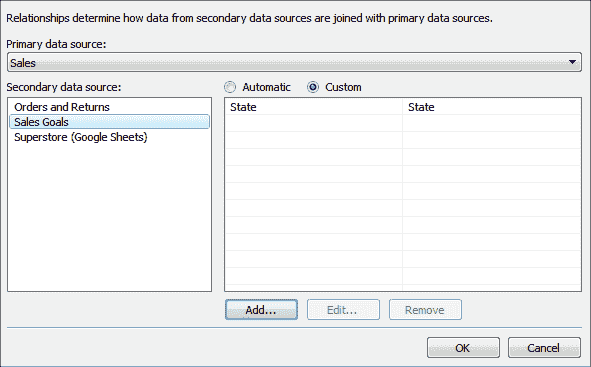

图 13.27：定义数据源之间的混合关系

**关系**窗口将显示不同数据源之间识别的关系。您可以从**自动**切换到**自定义**，以定义您自己的关联字段。

关联字段可以在视图中启用或禁用。视图中使用的关联字段通常默认是激活的，而其他字段则不是。然而，您可以通过点击数据窗格中关联字段旁的链接图标来更改关联字段的激活状态。

此外，使用**编辑数据关系**屏幕定义将用于**跨数据源筛选器**的字段。当您在视图中的**筛选器**字段的下拉菜单中使用并选择**应用于工作表** | **所有使用相关数据源**时，筛选器将在数据源之间生效。

让我们通过一个例子将其从概念转化为实际操作。

## 数据混合示例

让我们快速看一个数据混合的示例。假设您有以下表格，表示医院中各个位置在为病人服务时的服务目标：

| **位置** | **平均服务时间目标（分钟）** |
| --- | --- |
| 住院手术 | 30 |
| 门诊手术 | 40 |
| ICU | 30 |
| 产科 | 25 |
| 实验室 | 120 |

这些数据包含在一个简单的文本文件中，名为`Location Goals.txt`，位于`第十三章`目录下。起始工作簿和完整工作簿中已经定义了该文件的数据源。

我们将首先创建一个简单的条形图，来自您之前创建的**医院就诊（连接）**数据源，显示如下的**按位置计算的平均服务时间（分钟）**：

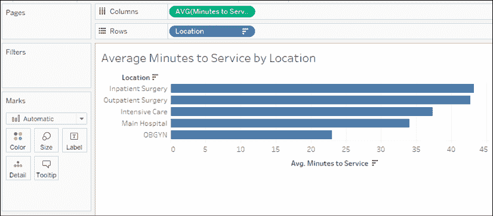

图 13.28：按位置计算的平均服务时间（分钟）

然后，在**数据**窗格中，我们将选择**位置目标**数据源。请观察此处显示的**数据**窗格：

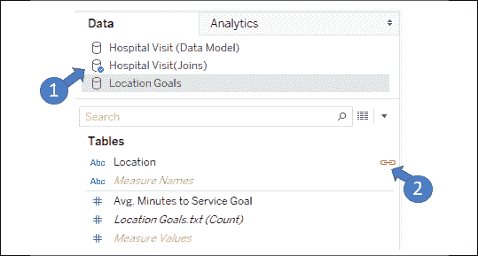

图 13.29：医院就诊（连接）显示为主数据源，而位置目标数据源中的位置被指示为关联字段

**医院访问（连接）**数据源上的蓝色勾选标记（在*图 13.29*中标记为**1**）表示该数据源是主数据源。Tableau 将**位置**识别为连接字段，并通过一个连接图标（在*图 13.29*中标记为**2**）指示该字段为活动状态。它之所以为活动状态，是因为你在当前视图中使用了来自主数据源的**位置**。如果你没有使用，Tableau 仍然会显示链接，但默认情况下它不会处于活动状态。你可以点击该链接图标，在活动和非活动状态之间切换，进而控制在次级数据源中进行汇总时的详细级别。

现在，点击数据窗格中的**服务目标的平均分钟数**，然后从**Show Me**中选择**子弹图**，如图所示：

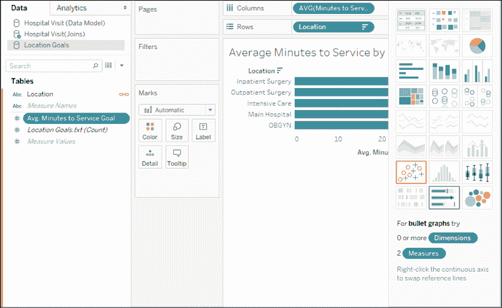

图 13.30：你可以将次级数据源的字段拖放到视图中，或者使用 Show Me

你可能需要右键单击视图中的**服务的平均分钟数**轴，然后选择**交换参考线**字段，以确保目标是参考线，条形图是实际指标。现在你的视图应该是这样的：

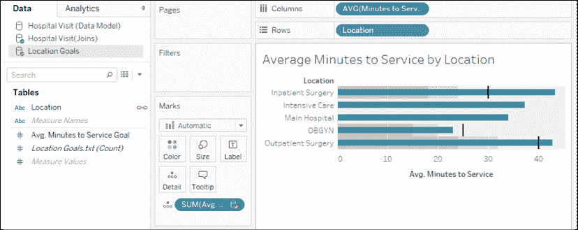

图 13.31：由主数据源和次级数据源创建的视图

请注意，**医院访问（连接）**数据源和**位置目标**数据源都在此视图中使用。**医院访问（连接）**是主数据源（由蓝色勾选标记指示），而**位置目标**是次级数据源（由橙色勾选标记指示）。**服务目标的平均分钟数**字段在**Marks**卡片中的**Detail**上是次级数据源的，并且也由橙色勾选标记的图标指示。

你可能还会注意到**主医院**和**重症监护**在视图中没有显示目标值。回想一下，主数据源用于确定视图中显示的完整值列表。**主医院**在主数据源中存在，但在次级数据源中没有匹配项。它会显示在视图中，但没有次级数据源的值。

**重症监护**也没有次级数据源的值。这是因为次级数据源中的相应值是**ICU**。主数据源和次级数据源中的值必须完全匹配，数据融合才能找到匹配项。不过，数据融合也会考虑别名的情况。

**别名**是维度值的替代值，将用于显示和数据融合。你可以通过右键单击行标题或使用视图或数据窗格中的字段菜单，并选择**别名**选项来更改维度的别名。

我们可以通过右键单击视图中的行标题并使用**编辑别名…**选项来更改字段的别名，如下所示：

图 13.32：使用编辑别名...选项

如果我们将别名更改为**ICU**，在次级数据源中找到匹配项，视图中显示的是次级数据源的值：

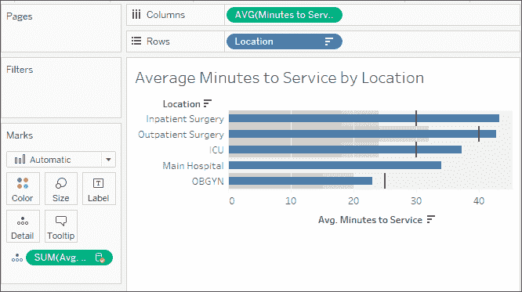

图 13.33：ICU 现在可以在次级数据源中找到匹配项。

**位置**、**实验室**的最终值仅出现在`Location Goals.txt`源中，因此在此视图中不显示。如果我们创建一个新视图并使用**Location Goals**作为主数据源，它将会显示。

本章中我们已经讨论了许多关于如何关联数据的选项。让我们花点时间考虑一下何时使用这些不同的技术。

# 何时使用数据模型、连接或混合。

从某种意义上讲，使用最新版本的 Tableau 创建的每个数据源都将使用数据模型。即使是使用一个物理表的数据源，也会在数据模型的逻辑层中有一个对应的对象。但在何时应通过数据模型关联表，何时应在物理层将其连接在一起，何时应使用混合呢？

大多数情况下，没有单一的正确或错误答案。然而，这里有一些通用的指导原则，可以帮助你思考何时适合使用某种方法。

一般来说，使用**数据模型**来关联表：

+   当连接会使正确的聚合变得不可能，或者需要复杂的 LOD 表达式来获得准确结果时。

+   当连接会导致数据重复时。

+   当你需要灵活性来展示维度的完整域，或仅展示在关系中匹配的值时。

+   当你对数据源不确定，且不知道使用哪种类型的连接时。

一般来说，在物理层面使用**连接**：

+   当你必须使用除了字段之间的等式以外的操作符时。

+   当你需要进行空间连接时。

+   当你想要特定地控制分析中使用的连接类型时。

+   当数据模型的性能比使用连接时效率低时。

一般来说，在以下情况下使用**混合**：

+   你需要关联无法通过数据模型连接或关联的数据源（例如 OLAP 立方体）。

+   你需要灵活性来通过别名“修复”匹配。

+   你需要灵活性来调整哪些字段在不同视图中定义关系的方式。

随着你在使用每种方法时的信心增长，你将能够更好地判断在特定情况下哪种方法更合适。

# 总结

当你需要将数据表关联在一起时，你现在有几种技术可以选择。数据模型是 Tableau 最新版本中的一项新功能，它为关联逻辑数据表提供了一种新的范式。它在显示维度值的完整和部分域时引入了一些新的行为，但通过考虑聚合的自然细节级别，它也大大简化了聚合。在物理层面，你可以选择将物理表连接在一起。

我们介绍了各种类型的连接，并讨论了使用连接计算和跨数据库连接的可能性，以实现最终的灵活性。我们简要讨论了数据混合的工作原理，并展示了一个实际的例子。最后，您回顾了每种方法的使用时机。现在，您已经拥有了广泛的工具集，能够处理不同表格中的数据，甚至是不同数据库或文件中的数据。

在下一章中，我们将进一步扩展这一工具集，着眼于 Tableau Prep Builder。Tableau Prep 为您提供了强大的功能和高度的复杂性，让您能够将来自各种来源的数据汇聚在一起，清洗数据，并以您喜欢的任何方式进行结构化！
