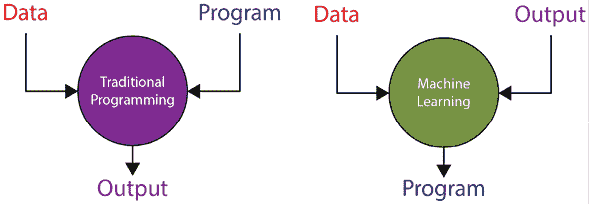
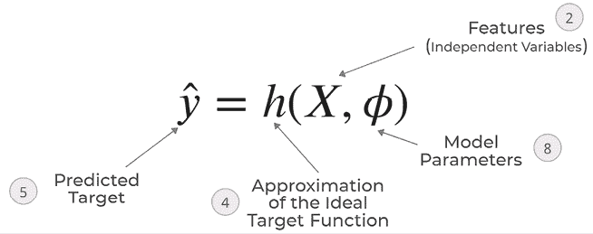
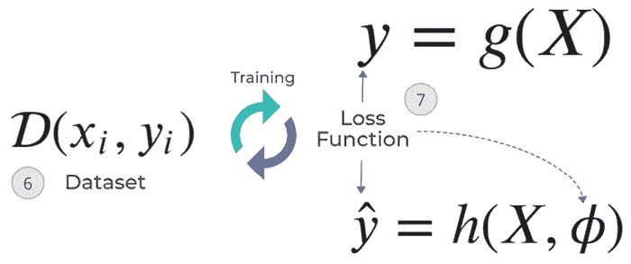
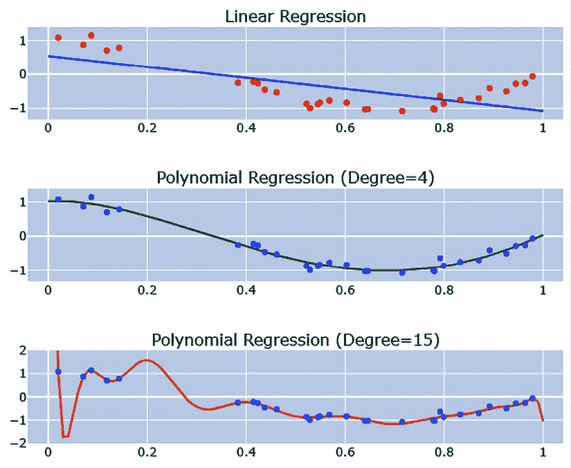
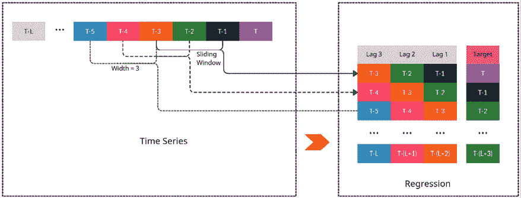

# 5

# 将时间序列预测作为回归问题

在本书的前一部分中，我们对时间序列有了基本的理解，并装备了分析和可视化时间序列的工具和技术，甚至生成了我们第一个基线预测。到目前为止，我们主要介绍了经典和统计技术。现在，让我们深入了解现代**机器学习**，并学习如何利用这个相对较新的领域来进行**时间序列预测**。机器学习是近年来迅速发展的一个领域，能够利用这些新技术进行时间序列预测，将在今天的世界中成为一项无价的技能。

在本章中，我们将讨论以下主要主题：

+   了解机器学习的基础

+   将时间序列预测作为回归问题

+   局部模型与全局模型

# 了解机器学习的基础

我们希望使用机器学习进行时间序列预测。但在开始之前，让我们花一些时间来了解什么是机器学习，并建立一个框架来展示它的功能（如果你已经对机器学习非常熟悉，可以跳到下一节“*将时间序列预测作为回归问题*”，或者继续跟我们一起复习这些概念）。1959 年，Arthur Samuel 将机器学习定义为“*一种使计算机能够在没有明确编程的情况下学习的研究领域*。”传统上，编程是一种我们知道一套规则/逻辑来执行某个动作，并且在给定的数据上执行该动作以获得我们想要的输出的范式。而机器学习则颠覆了这一点。

在机器学习中，我们从数据和输出开始，要求计算机告诉我们通过哪些规则可以从数据中获得期望的输出：

图 5.1：传统编程与机器学习

机器学习中有许多种问题设置，如监督式学习、无监督式学习、自监督学习等，但我们将专注于监督式学习，这是最常见的，也是本书内容最适用的。监督式学习指的是我们在程序、数据和输出的范式转换示例中已经提到的内容。我们使用一个包含输入和预期输出的配对样本的数据集，并要求模型学习它们之间的关系。

让我们从一个小的讨论开始，逐步构建整个示意图，它包含了监督式机器学习问题的主要关键组件：

图 5.2：监督式机器学习示意图，部分 1—理想函数

正如我们已经讨论过的，我们希望机器学习从数据中*学习*并得出一套规则/逻辑。在数学中，与逻辑/规则最接近的类比是函数，它接受一个输入（这里是数据）并提供一个输出。从数学上看，可以写作如下：

*y* = *g*(*X*)

其中，*X* 是特征集合，*g* 是**理想目标函数**（在*图 5.2*中用**1**表示），它将 *X* 输入（在示意图中用**2**表示）映射到目标（理想）输出，*y*（在示意图中用**3**表示）。理想目标函数在很大程度上是一个未知函数，类似于我们在*第一章*《引入时间序列》中看到的**数据生成过程**（**DGP**），它不在我们的控制之下。

图 5.3：监督式机器学习示意图，第二部分—学到的近似值

但我们希望计算机能够*学习*这个理想目标函数。这个理想目标函数的近似值用另一个函数 *h* 表示（在示意图中用**4**表示），它接受相同的特征集 *X*，并输出预测的目标，（在示意图中用**5**表示）。 是 *h* 函数的参数（或模型参数）：

图 5.4：监督式机器学习示意图，第三部分—将所有内容整合

现在，我们如何找到这个近似 *h* 函数及其参数，？通过示例数据集（在示意图中用**6**表示）。监督式机器学习问题的前提是我们能够收集一组包含特征 *X* 和相应目标 *y* 的示例，这些目标在文献中也称为*标签*。计算机就是从这组示例（数据集）中*学习*近似函数 *h* 以及最优模型参数，。在之前的示意图中，唯一真正未知的实体是理想目标函数 *g*。因此，我们可以使用训练数据集 *D* 来为数据集中的每个样本预测目标。我们已经知道所有示例的理想目标。我们需要一种方法来比较理想目标和预测目标，这就是损失函数（在示意图中用**7**表示）发挥作用的地方。损失函数告诉我们，使用近似函数 *h* 时，我们离真实结果有多远。

尽管 *h* 可以是任何函数，但它通常是从一个著名函数类别 *H* 中选择的。*H* 是一个有限的函数集，可以拟合数据。这个函数类别就是我们口语中所说的**模型**。例如，*h* 可以从所有线性函数或所有基于树的函数中选择，等等。从 *H* 中选择一个 *h* 是通过超参数（由模型设计者指定）和模型参数（从数据中学习）来组合完成的。

现在，剩下的就是运行不同的函数，找到最好的近似函数 *h*，它给我们带来最低的损失。这是一个优化过程，我们称之为**训练**。

让我们还看看一些关键概念，这些概念将在接下来的讨论中非常重要。

## 有监督的机器学习任务

机器学习可以用来解决各种任务，如**回归**、**分类**和**推荐**。但由于分类和回归是最常见的两类问题，我们将花一点时间回顾它们是什么。

分类任务和回归任务的区别非常简单。在机器学习框架图（*图 5.2*）中，我们讨论了 *y*，即目标。这个目标可以是一个实数值，或者是一个项的类别。例如，我们可能在预测下周的股价，或者我们只预测股价是上涨还是下跌。在第一种情况下，我们是在预测一个实数值，这叫做**回归**。在另一种情况下，我们预测的是两个类别中的一个（*上涨* 或 *下跌*），这叫做**分类**。

## 过拟合和欠拟合

机器学习系统面临的最大挑战是，我们训练出的模型必须在新的、未见过的数据集上表现良好。一个机器学习模型在这方面的能力被称为**泛化能力**。机器学习中的训练过程类似于数学优化，但有一个微妙的区别。数学优化的目标是到达提供的数据集中的全局最大值。而在机器学习中，目标是通过使用训练误差作为代理，达到较低的测试误差。一个机器学习模型在训练误差和测试误差上的表现与过拟合和欠拟合的概念密切相关。让我们通过一个例子来理解这些术语。

机器学习模型的学习过程与人类学习有很多相似之处。假设三名学生，*A*、*B* 和 *C*，正在为考试做准备。*A* 是个懒汉，前一天晚上去夜店了。*B* 决定死记硬背，把教科书从头到尾都背一遍。*C* 上课时认真听讲，理解了考试的内容。

正如预期的那样，*A* 没有通过考试，*C* 得了最高分，*B* 还行。

*A*因为没有学到足够的内容而挂科。这在机器学习模型中也会发生，当它们没有学到足够的模式时，这被称为**欠拟合**。其特点是训练误差和测试误差都很高。

*B*的成绩没有预期的高；毕竟，他们确实把整篇文章逐字逐句地记住了。但考试中的许多问题并不是直接来自教科书，*B*没有能够正确回答这些问题。换句话说，考试中的问题是*新的和未见过*的。而且，由于*B*记住了所有内容，但没有努力理解基础概念，*B*没有能够将所学知识*推广*到新的问题上。在机器学习中，这种情况被称为**过拟合**。其特点通常是训练误差和测试误差之间的差距很大。通常我们会看到非常低的训练误差和很高的测试误差。

第三个学生，*C*，学得正确并理解了基础概念，因此能够*推广*到*新的和未见过*的问题。这也是机器学习模型的理想状态。这种状态的特点是合理较低的测试误差，以及训练误差和测试误差之间的小差距。

我们刚刚看到了机器学习中的两个最大挑战。现在，让我们也来看一些可以用来应对这些挑战的方法。

模型的**容量**与欠拟合或过拟合之间有着密切的关系。一个模型的容量是指它足够灵活，能够拟合各种不同函数的能力。容量较低的模型可能很难拟合训练数据，导致欠拟合。容量较高的模型可能通过过度记忆训练数据而发生过拟合。为了更好地理解这个容量的概念，我们来看一个例子。当我们从线性回归转向多项式回归时，我们正在增加模型的容量。我们不仅仅拟合直线，而是让模型也能拟合曲线。

当机器学习模型的容量与当前学习问题相匹配时，通常表现良好。

图 5.5：欠拟合与过拟合

*图 5.5* 显示了一个非常常见的例子，用于说明过拟合和欠拟合。我们通过已知函数创建一些随机点，并尝试使用这些数据样本进行学习。我们可以看到，作为最简单模型之一的线性回归，通过在这些点之间画一条直线，未能充分拟合数据。多项式回归是线性回归，但加入了一些更高阶的特征。现在，你可以将从线性回归到多项式回归（增加高阶）的转变，视为增加模型的容量。因此，当我们使用 4 次时，可以看到所学函数很好地拟合了数据，并与我们的理想函数匹配。但是，如果我们继续增加模型的容量，达到 `degree = 15` 时，我们会看到所学的函数仍然通过训练样本，但它已经学到了一个完全不同的函数，导致了对训练数据的过拟合。找到能够学习出具有良好泛化能力的函数的最佳容量，是机器学习中的核心挑战之一。

容量是模型的一个方面，另一个方面是**正则化**。即使在相同容量下，模型也可以从所有函数的假设空间中选择多个函数。通过正则化，我们试图在假设空间中对某些函数给予偏好，而非其他函数。

尽管所有这些函数都是有效的，可以选择的函数，我们会通过某种方式推动优化过程，使其最终趋向我们偏好的某种函数。尽管正则化是一个广泛的术语，用于指代我们在学习过程中施加的任何约束，以减少所学函数的复杂性，但更常见的是将其以权重衰减的形式使用。我们以线性回归为例，线性回归是通过学习与每个特征相关联的权重，将一条直线拟合到输入特征上。

线性回归模型可以用数学公式表示如下：

在这里，*N* 是特征的数量，*c* 是截距，*x*[i] 是第 *i* 个特征，*w*[i] 是与第 *i* 个特征相关的权重。我们通过将这个问题视为优化问题，最小化  与 *y*（真实输出）之间的误差，从而估计出正确的权重 (*L*)。

现在，通过正则化，我们向 *L* 添加了一个额外的项，强制权重变得更小。通常，这是通过使用 *L1* 或 *L2* 正则化器来完成的。*L1* 正则化器是将权重的平方和添加到 *L* 上：

其中， 是正则化系数，决定了我们对权重的惩罚强度。*L2* 正则化器是将权重的平方和加到 *L* 上：

在这两种情况下，我们都在强制要求更小的权重优于更大的权重，因为这样可以避免函数过度依赖于机器学习模型中任何一个特征。正则化是一个独立的话题；如果你想了解更多，请前往*进一步阅读*部分查看一些关于正则化的资源。

另一个有效减少过拟合的方法是简单地使用更多的数据来训练模型。通过使用更大的数据集，模型过拟合的可能性会减少，因为大数据集能够捕获更多的多样性。

现在，我们如何调整参数，以在欠拟合和过拟合之间取得平衡呢？让我们在下一节中详细探讨。

## 超参数和验证集

几乎所有的机器学习模型都有一些超参数。**超参数**是模型的参数，它们不是从数据中学习到的，而是在训练开始之前就已经设置好的。例如，正则化的权重就是一个超参数。大多数超参数要么帮助我们控制模型的容量，要么对模型应用正则化。通过控制容量、正则化或两者，我们可以找到在欠拟合和过拟合模型之间的边界，得到一个恰到好处的模型。

但是，由于这些超参数必须在算法外部设置，我们如何估计最佳的超参数呢？虽然它不是核心的*学习过程*的一部分，但我们也可以从数据中学习超参数。不过，如果我们仅仅使用训练数据来学习超参数，那么它会选择最大的可能模型容量，这会导致过拟合。这就是我们需要**验证集**的原因，验证集是训练过程中无法访问的部分数据。借用之前的类比，验证集就像学生参加的模拟考试，用来检查他们是否已经学得足够好。但当数据集较小（不是成千上万的样本）时，单一验证集上的表现并不能保证公平的评估。在这种情况下，我们依赖于**交叉验证**。常见的做法是对原始数据集的不同子集重复进行训练和评估程序。常见的一种方法叫做**k 折交叉验证**，它将原始数据集分成*k*个相等的、互不重叠且随机的子集，每个子集在训练其他子集后都会被评估。如果你想了解更多关于交叉验证的技术，我们在*进一步阅读*部分提供了相关链接。稍后在本书中，我们也会从时间序列的角度讲解这个话题，它与标准的交叉验证方式略有不同。

**建议阅读**：

尽管本书已经触及了机器学习的皮毛，但还有很多内容，若要更好地理解本书的其余部分，建议更深入地学习机器学习。我们建议从*斯坦福大学的机器学习课程（Andrew Ng）*开始—[`www.coursera.org/learn/machine-learning`](https://www.coursera.org/learn/machine-learning)。如果你时间紧迫，*谷歌的机器学习速成课程*也是一个不错的起点—[`developers.google.com/machine-learning/crash-course/ml-intro`](https://developers.google.com/machine-learning/crash-course/ml-intro)。

近些年，机器学习取得了很大进展，伴随着这些进展，能够从数据中学习复杂模式的强大模型也随之出现。当我们将这些模型与经典的时间序列预测模型进行比较时，我们可以看到这些新型模型有着巨大的潜力。但机器学习与时间序列预测之间仍然存在一些根本的差异。在下一节中，我们将了解如何克服这些差异，并使用机器学习进行时间序列预测。

# 将时间序列预测视为回归

正如我们在*第一章*《*介绍时间序列*》中所看到的，时间序列是按时间顺序采集的一组观察值。通常，时间序列预测是关于尝试预测这些观察值在未来将会是什么样。给定一段任意长度的历史观察序列，我们可以预测未来某个时间点的值。

我们看到回归，或者说机器学习用于预测连续变量，是在一组示例数据集上进行的，每个示例由输入特征和目标组成。我们可以看出，回归任务是基于一组输入来预测单一输出，这与预测任务本质上是不同的，预测任务是基于一组历史值来预测未来值。这种时间序列与机器学习回归模型之间的根本不兼容性，就是我们不能直接使用回归来进行时间序列预测的原因。

此外，时间序列预测从定义上来说是一个外推问题，而回归大多数情况下是一个插值问题。外推通常比插值更难通过数据驱动方法来解决。回归问题中的另一个关键假设是训练所使用的样本是**独立同分布**（**iid**）的。但时间序列破坏了这个假设，因为时间序列中的后续观察值显示出显著的依赖性。

然而，为了利用机器学习的各种技术，我们需要将时间序列预测转化为回归问题。幸运的是，有方法可以将时间序列转换为回归，并通过引入一些特征来为机器学习模型添加记忆，从而克服 IID 假设。让我们看看如何做到这一点。

## 时间延迟嵌入

我们在*第四章*《设定强基准预测》中讨论了 ARIMA 模型，并看到了它是一个自回归模型。我们可以使用相同的概念，将一个时间序列问题转换为回归问题。让我们通过以下图示来明确这一概念：

图 5.6：使用滑动窗口将时间序列转换为回归

假设我们有一个时间序列，包含*L*个时间步长，就像图示中所示。我们有*T*作为最新的观测值，*T - 1*、*T - 2*，依此类推，随着时间倒退，一直到*T - L*。在理想的世界中，每个观测值在进行预测时应该以所有先前的观测值为条件。但这是不切实际的，因为*L*可以非常长。我们通常会限制预测函数，只使用序列中最新的*M*个观测值，其中*M < L*。这些被称为有限记忆模型，或**马尔科夫模型**，而*M*被称为自回归的阶数、记忆大小或感受野。

因此，在时间延迟嵌入中，我们假设一个任意长度的窗口*M < L*，并通过将窗口在时间序列的长度上滑动，提取固定长度的子序列。

在图示中，我们采用了一个记忆大小为**3**的滑动窗口。所以，首先提取的子序列（如果从最新时间点开始，按时间倒序提取）是*T – 3*、*T – 2*、*T - 1*。而*T*是紧接在该子序列之后的观测值。这将成为数据集中的第一个例子（图示中表格的第**1**行）。

现在，我们将窗口向左滑动一个时间步长（即倒退到过去），并提取新的子序列，*T – 4*、*T – 3*、*T - 2*。对应的目标将变为*T - 1*。我们在回到时间序列的开始时重复这一过程，在每一步滑动窗口时，我们都会向数据集中添加一个新的例子。

最终，我们得到了一个对齐的数据集，特征的固定向量大小（即等于窗口大小）和一个单一目标，这就是典型的机器学习数据集的样子。

现在我们有一个包含三个特征的表格，我们也给这三个特征赋予了语义意义。如果我们查看图示中表格的最右列，我们可以看到该列中的时间步长总是比目标落后一个时间步长。我们称之为**滞后 1**。从右数第二列总是比目标滞后两个时间步长，我们称之为**滞后 2**。一般化地说，特征中观测值比目标滞后*n*个时间步长时，我们称之为**滞后 n**。

通过**时间延迟嵌入**将时间序列转换为回归模型，能够以一种标准回归框架能够利用的方式，编码时间序列的自回归结构。我们还可以考虑另一种使用回归进行时间序列预测的方法，那就是对**时间**进行回归。

## 时间嵌入

如果我们依赖自回归模型中的先前观察值，那么我们在时间嵌入模型中则依赖于时间的概念。核心思想是，我们忽略时间序列的自回归特性，并假设时间序列中的任何值仅仅依赖于时间。我们从与时间序列相关的时间戳中提取能够捕捉时间、时间的流逝、时间的周期性等特征，然后使用这些特征通过回归模型来预测目标值。实现这一点的方法有很多，从简单地对齐一个单调且均匀递增的数值列来捕捉时间的流逝，到使用复杂的**傅里叶**项来捕捉时间中的周期性成分。我们将在*第六章*，*时间序列预测的特征工程*中详细讨论这些技术。

在我们结束本章之前，让我们讨论一个在时间序列预测领域逐渐受到关注的关键概念。本书的大部分内容都采纳了这种新的预测范式。

# 全球预测模型——范式转变

传统上，每个时间序列都是孤立地处理的。正因为如此，传统的预测方法总是仅仅基于单一时间序列的历史来拟合预测函数。但近年来，由于在当今以数字为主的世界中，收集数据变得更加容易，许多公司开始收集来自相似来源或相关时间序列的大量数据。

例如，零售商如沃尔玛会收集跨千家商店的数百万种产品的销售数据。像 Uber 和 Lyft 这样的公司会收集城市中所有区域的乘车需求。在能源领域，能源消费数据会跨所有消费者进行收集。所有这些时间序列数据集都有共同的行为，因此被称为**相关时间序列**。

我们可以认为，所有相关时间序列中的时间序列都来自不同的 DGP（数据生成过程），因此可以将它们分别建模。我们称这些为**局部**预测模型。该方法的另一种替代方式是假设所有时间序列都来自同一个 DGP。我们不为每个时间序列单独拟合预测函数，而是为所有相关时间序列拟合一个单一的预测函数。这种方法在文献中被称为**全局**或**跨学习**。大多数现代深度学习模型以及机器学习方法都采用了全局模型的范式。我们将在接下来的章节中详细看到这些内容。

**参考检查**：

*全球*一词由*David Salinas 等人*在*DeepAR*论文（参考文献*1*）中提出，*跨学习*则由*Slawek Smyl*（参考文献*2*）提出。

我们之前看到，拥有更多数据将减少过拟合的可能性，因此可以降低泛化误差（训练误差与测试误差之间的差异）。这是局部方法的一个缺点。传统上，时间序列数据通常不长，且在很多情况下，收集更多数据既困难又耗时。在小数据上拟合机器学习模型（具有强大的表达能力）容易导致过拟合。这也是为什么传统上用于预测此类时间序列的时间序列模型会强制施加强先验的原因。但这些限制传统时间序列模型拟合的强先验，也可能导致一种形式的欠拟合，限制了准确性。

强大且具有表达能力的数据驱动模型，如机器学习模型，需要大量数据来生成能够对新数据进行泛化的模型。时间序列本质上是与时间相关的，有时收集更多数据意味着需要等待数月甚至数年，这是不理想的。因此，如果我们无法增加时间序列数据集的*长度*，我们可以增加时间序列数据集的*宽度*。如果我们将多个时间序列加入数据集，我们就增加了数据集的宽度，从而增加了模型训练时可用的数据量。

*图 5.7* 展示了通过视觉化增加时间序列数据集宽度的概念：

图 5.7：时间序列数据集的长度和宽度

这对机器学习模型有利，因为在拟合预测函数时，机器学习模型具有更高的灵活性，且能够利用更多数据，从而能够学习出比传统时间序列模型更复杂的预测函数，而传统时间序列模型通常是通过与相关时间序列共享的方式进行的，完全基于数据驱动。

局部方法的另一个缺点是可扩展性问题。以我们之前提到的沃尔玛为例，需要预测数百万个时间序列，并且无法对所有这些模型进行人工监督。如果从工程角度考虑，在生产系统中训练和维护数百万个模型对任何工程师来说都是一场噩梦。但在全球方法下，我们只需为所有这些时间序列训练一个模型，这大大减少了我们需要维护的模型数量，同时还能够生成所有所需的预测。

这种新的预测范式已经获得了广泛关注，并且在多个时间序列竞赛中持续证明能够改进局部方法，尤其是在相关时间序列数据集上。在 Kaggle 竞赛中，例如*Rossman 商店销售*（2015 年）、*维基百科网页流量时间序列预测*（2017 年）、*Favorita 公司杂货销售预测*（2018 年）以及*M5 竞赛*（2020 年），获胜的参赛作品都是全球模型——无论是机器学习、深度学习还是二者的结合。*Intermarché预测竞赛*（2021 年）的获胜作品也是全球模型。有关这些竞赛的链接可以在*进一步阅读*部分找到。

尽管我们有许多经验性发现表明，全球模型在相关时间序列预测中优于局部模型，但全球模型仍然是一个相对较新的研究领域。*Montero-Manson 和 Hyndman* (2020) 展示了一些非常有趣的结果，并表明任何局部方法都可以通过具备必要复杂度的全球模型进行逼近，他们提出的最有趣的发现是，即使面对不相关的时间序列，全球模型也能表现得更好。我们将在*第十章*中进一步讨论全球模型及其策略，即*全球预测模型*。

**参考检查**：

*Montero-Manson 和 Hyndman* (2020) 的研究论文在*参考文献*中被引用，参考文献编号为*3*。

# 总结

我们已经开始了超越基准预测方法的探索，并初步涉足机器学习领域。在简要回顾机器学习的基础知识后，我们了解了诸如过拟合、欠拟合、正则化等关键概念，之后我们看到如何将时间序列预测问题转化为机器学习中的回归问题。我们还对不同的嵌入方法，如时间延迟嵌入和时间嵌入，进行了概念性的理解，这些方法可以用于将时间序列问题转化为回归问题。最后，我们还了解了一种新的时间序列预测范式——全球模型，并在概念层面上将其与局部模型进行了对比。在接下来的几章中，我们将开始实践这些概念，学习特征工程技术和全球模型的策略。

# 参考文献

以下是我们在本章中使用的参考文献：

1.  David Salinas, Valentin Flunkert, Jan Gasthaus, Tim Januschowski (2020). *DeepAR: 基于自回归递归网络的概率预测*. 国际预测学杂志. 36-3. 1181–1191: [`doi.org/10.1016/j.ijforecast.2019.07.001`](https://doi.org/10.1016/j.ijforecast.2019.07.001)

1.  Slawek Smyl (2020). *指数平滑与递归神经网络的混合方法用于时间序列预测*. 国际预测学杂志. 36-1: 75–85 [`doi.org/10.1016/j.ijforecast.2019.03.017`](https://doi.org/10.1016/j.ijforecast.2019.03.017)

1.  Pablo Montero-Manso, Rob J Hyndman (2020), *Principles and Algorithms for Forecasting Groups of Time Series: Locality and Globality*. arXiv:2008.00444[cs.LG]： [`arxiv.org/abs/2008.00444`](https://arxiv.org/abs/2008.00444)

# 进一步阅读

你可以查看以下资源以便进一步阅读：

+   *Regularization for Sparsity from Google Machine Learning Crash Course*： [`developers.google.com/machine-learning/crash-course/regularization-for-sparsity/l1-regularization`](https://developers.google.com/machine-learning/crash-course/regularization-for-sparsity/l1-regularization)

+   *L1 & L2 Regularization, Inside Bloomberg*： [`www.youtube.com/watch?v=d6XDOS4btck`](https://www.youtube.com/watch?v=d6XDOS4btck)

+   *Cross-validation: evaluating estimator performance from scikit-learn*： [`scikit-learn.org/stable/modules/cross_validation.html`](https://scikit-learn.org/stable/modules/cross_validation.html)

+   *Rossmann Store Sales*： [`www.kaggle.com/c/rossmann-store-sales`](https://www.kaggle.com/c/rossmann-store-sales)

+   *Web Traffic Time Series Forecasting*： [`www.kaggle.com/c/web-traffic-time-series-forecasting`](https://www.kaggle.com/c/web-traffic-time-series-forecasting)

+   *Corporación Favorita Grocery Sales Forecasting*： [`www.kaggle.com/c/favorita-grocery-sales-forecasting`](https://www.kaggle.com/c/favorita-grocery-sales-forecasting)

+   *M5 Forecasting—Accuracy*： [`www.kaggle.com/c/m5-forecasting-accuracy`](https://www.kaggle.com/c/m5-forecasting-accuracy)

# 加入我们的 Discord 社区

加入我们社区的 Discord 空间，与作者和其他读者进行讨论：

[`packt.link/mts`](https://packt.link/mts)

