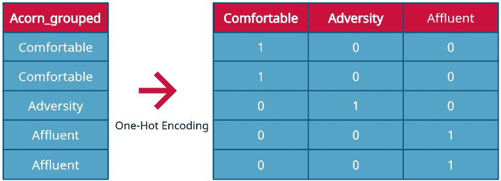
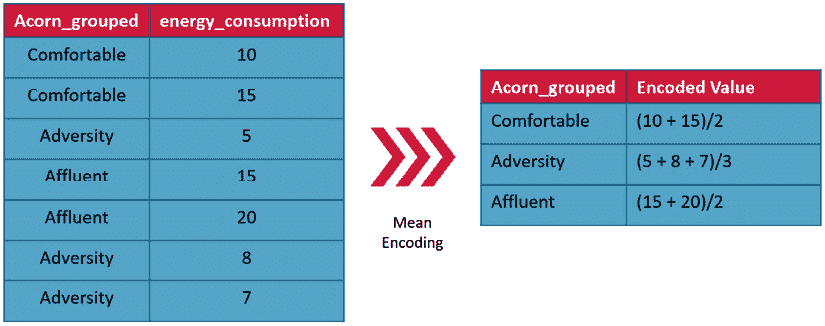
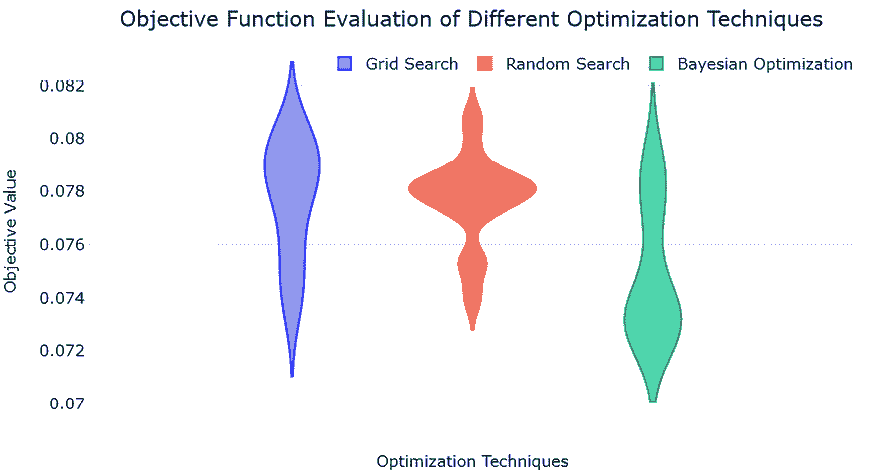
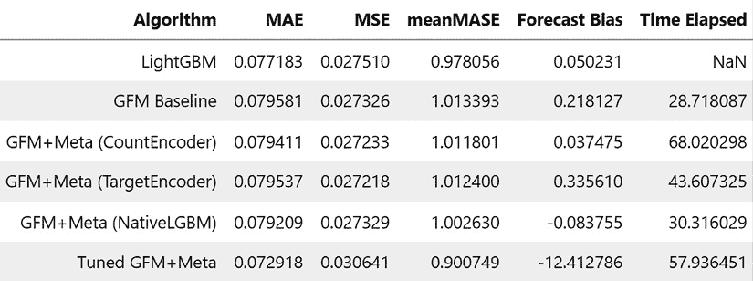
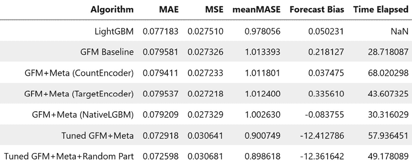
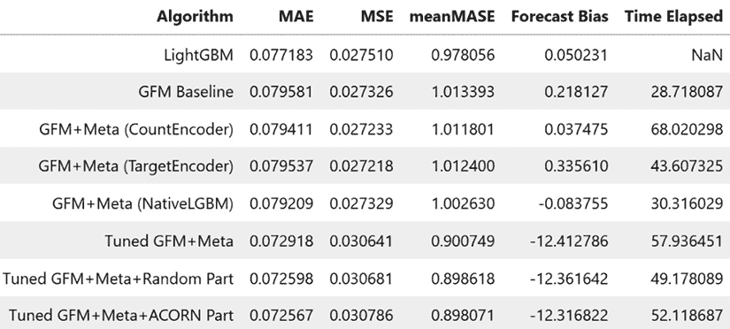
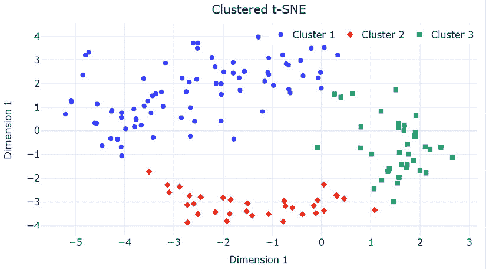
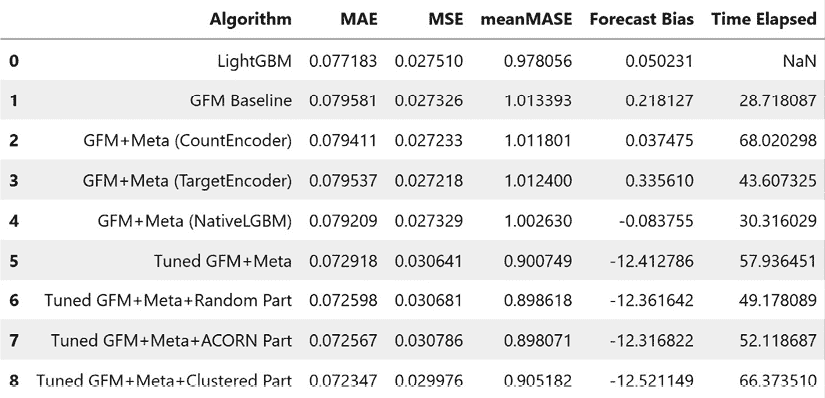
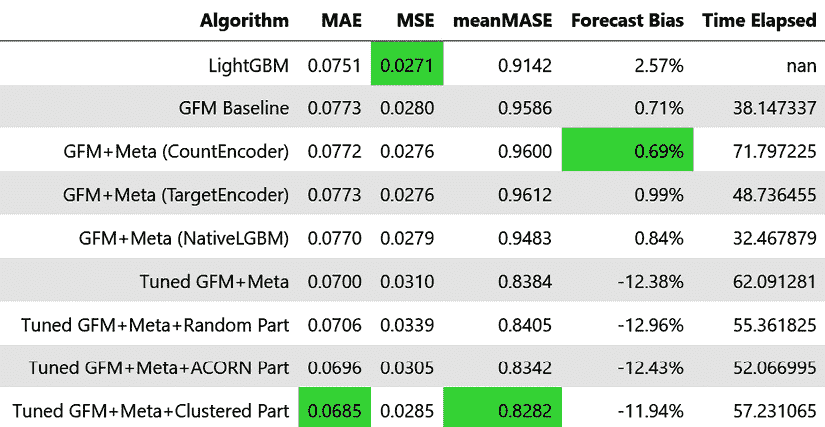

# 10

# 全球预测模型

在前面的章节中，我们已经看到如何使用现代机器学习模型解决时间序列预测问题，本质上是替代了传统的模型，如 ARIMA 或指数平滑。然而，直到现在，我们一直将数据集中的不同时间序列（例如伦敦智能电表数据集中的家庭数据）单独分析，这就像传统模型所做的那样。

然而，现在我们将探讨一种不同的建模范式，其中我们使用单一的机器学习模型一起预测多个时间序列。正如本章所学，这种范式在计算和准确性方面都带来了许多好处。

本章将覆盖以下主要内容：

+   为什么选择全球预测模型？

+   创建全球预测模型（GFMs）

+   改善全球预测模型的策略

+   可解释性

# 技术要求

您需要按照书中*前言*中的说明设置 **Anaconda** 环境，以获得一个包含所有所需库和数据集的工作环境。任何额外的库将在运行笔记本时自动安装。

在使用本章代码之前，您需要运行以下笔记本：

+   `02-Preprocessing_London_Smart_Meter_Dataset.ipynb`（第二章）

+   `01-Setting_up_Experiment_Harness.ipynb`（第四章）

+   来自 `Chapter06` 和 `Chapter07` 文件夹：

    +   `01-Feature_Engineering.ipynb`

    +   `02-Dealing_with_Non-Stationarity.ipynb`

    +   `02a-Dealing_with_Non-Stationarity-Train+Val.ipynb`

+   来自 `Chapter08` 文件夹：

    +   `00-Single_Step_Backtesting_Baselines.ipynb`

    +   `01-Forecasting_with_ML.ipynb`

    +   `01a-Forecasting_with_ML_for_Test_Dataset.ipynb`

    +   `02-Forecasting_with_Target_Transformation.ipynb`

    +   `02a-Forecasting_with_Target_Transformation(Test).ipynb`

本章的相关代码可以在 [`github.com/PacktPublishing/Modern-Time-Series-Forecasting-with-Python-/tree/main/notebooks/Chapter10`](https://github.com/PacktPublishing/Modern-Time-Series-Forecasting-with-Python-/tree/main/notebooks/Chapter10) 找到。

# 为什么选择全球预测模型？

我们在*第五章*中简要讨论了全球模型，*时间序列预测作为回归*，并提到了相关数据集。我们可以想到很多场景，在这些场景中我们会遇到相关的时间序列。例如，我们可能需要预测零售商所有产品的销售量，城市不同地区出租车服务的请求数量，或者某个特定区域所有家庭的能源消耗（这正是伦敦智能电表数据集的用途）。我们称这些为相关时间序列，因为数据集中的所有不同时间序列可能具有许多共同的因素。例如，零售产品可能会出现的年度季节性现象可能会出现在大部分产品上，或者温度等外部因素对能源消耗的影响可能对大量家庭相似。因此，不管是以何种方式，相关时间序列数据集中的不同时间序列之间共享一些特征。

传统上，我们通常认为每个时间序列是独立的时间序列；换句话说，每个时间序列被假设是由不同的数据生成过程生成的。像 ARIMA 和指数平滑等经典模型是针对每个时间序列进行训练的。然而，我们也可以认为数据集中的所有时间序列是由单一的数据生成过程生成的，随之而来的是一种建模方法，即训练一个单一的模型来预测数据集中的所有时间序列。后者就是我们所称的**全球预测模型**（**GFMs**）。**GFMs**是旨在处理多个相关时间序列的模型，允许这些时间序列之间进行共享学习。相比之下，传统方法被称为**局部预测模型**（**LFMs**）。

尽管我们在*第五章*中简要讨论了 LFMs 的缺点，*时间序列预测作为回归*，但我们可以以更具体的方式总结这些缺点，看看为什么 GFMs 有助于克服这些问题。

## 样本大小

在大多数实际应用中（尤其是在商业预测中），我们需要预测的时间序列并不长。采用完全以数据为驱动的建模方法来处理这样一个较短的时间序列是有问题的。使用少量数据点训练一个高度灵活的模型会导致模型记住训练数据，从而出现过拟合。

传统上，这个问题通过在我们用于预测的模型中加入强先验或归纳偏差来克服。归纳偏差大致指的是一组假设或限制，这些假设或限制被内置到模型中，应该帮助模型预测在训练过程中没有遇到的特征组合。例如，双指数平滑法对季节性和趋势有强烈的假设。该模型不允许从数据中学习任何其他更复杂的模式。因此，使用这些强假设，我们将模型的搜索范围限制在假设空间的一个小部分。虽然在数据较少的情况下这有助于提高准确性，但其反面是这些假设可能限制了模型的准确性。

最近在机器学习领域的进展无疑向我们展示了，使用数据驱动的方法（假设或先验较少）在大规模训练集上能训练出更好的模型。然而，传统的统计学观点告诉我们，数据点的数量需要至少是我们尝试从这些数据点中学习的参数数量的 10 到 100 倍。

因此，如果我们坚持使用 LFMs（局部因果模型），完全数据驱动的方法能被采纳的场景将非常少见。这正是 GFMs 的优势所在。GFM 能够利用数据集中*所有*时间序列的历史数据来训练模型，并学习一组适用于数据集中所有时间序列的参数。借用在*第五章*《时间序列预测作为回归》中引入的术语，我们增加了数据集的*宽度*，而保持*长度*不变（参见*图 5.2*）。这种为单一模型提供的大量历史信息让我们可以对时间序列数据集采用完全数据驱动的技术。

## 跨领域学习

GFMs（广义因果模型）从设计上促进了数据集中不同时间序列之间的跨领域学习。假设我们有一个相对较新的时间序列，且其历史数据不足以有效地训练模型——例如，新推出的零售产品的销售数据或某地区新家庭的电力消费数据。如果我们将这些时间序列单独考虑，可能需要一段时间才能从我们训练的模型中得到合理的预测，但 GFMs 通过跨领域学习使得这个过程变得更加简单。GFMs 具有不同时间序列之间的隐性相似性，它们能够利用在历史数据丰富的类似时间序列中观察到的模式，来为新的时间序列生成预测。

交叉学习的另一种帮助方式是，在估算共同参数（如季节性）时，它起到一种正则化作用。例如，在零售场景中，类似产品所表现出的季节性最好在汇总层面进行估算，因为每个单独的时间序列都可能会有一些噪声，这些噪声可能会影响季节性提取。通过在多个产品之间强制统一季节性，我们实际上是在正则化季节性估算，并且在这个过程中，使季节性估算更加稳健。GFMs 的优点在于，它们采用数据驱动的方法来定义哪些产品的季节性应该一起估算，哪些产品有不同的季节性模式。如果不同产品之间有不同的季节性模式，GFM 可能难以将它们一起建模。然而，当提供足够的区分不同产品的信息时，GFM 也能学会这种差异。

## 多任务学习

GFMs 可以视为多任务学习范式，其中一个模型被训练用来学习多个任务（因为预测每个时间序列是一个独立的任务）。多任务学习是一个活跃的研究领域，使用多任务模型有许多好处：

+   当模型从嘈杂的高维数据中学习时，模型区分有用特征和无用特征的难度加大。当我们在多任务框架下训练模型时，模型可以通过观察对其他任务也有用的特征，理解有用特征，从而为模型提供额外的视角来识别有用特征。

+   有时候，像季节性这样的特征可能很难从特别嘈杂的时间序列中学习。然而，在多任务框架下，模型可以利用数据集中的其他时间序列来学习这些困难的特征。

+   最后，多任务学习引入了一种正则化方法，它迫使模型找到一个在所有任务上都表现良好的模型，从而减少过拟合的风险。

## 工程复杂度

对于大规模数据集，LFMs 也带来了工程上的挑战。如果我们需要预测数千个甚至数百万个时间序列，训练和管理这些 LFMs 的生命周期变得越来越困难。在*第八章*，*使用机器学习模型预测时间序列*中，我们仅对数据集中一部分家庭进行了 LFM 训练。我们花了大约 20 到 30 分钟来训练 150 个家庭的机器学习模型，并且使用的是默认的超参数。在常规的机器学习工作流程中，我们需要训练多个机器学习模型并进行超参数调优，以找到最佳的模型配置。然而，对于数据集中的成千上万的时间序列执行所有这些步骤，变得越来越复杂和耗时。

同样，这就涉及到如何管理这些模型的生命周期。所有这些单独的模型都需要部署到生产环境中，需要监控它们的表现以检查模型和数据的漂移，并且需要在设定的频率下重新训练。随着我们需要预测的时间序列数量越来越多，这变得愈加复杂。

然而，通过转向 GFM 范式，我们大大减少了在模型整个生命周期中训练和管理机器学习模型所需的时间和精力。正如我们将在本章中看到的，在这些 150 个家庭上训练 GFM 的时间只是训练 LFM 所需时间的一小部分。

尽管 GFMs 有许多优点，但它们也并非没有缺点。主要的缺点是我们假设数据集中的所有时间序列都是由单一的**数据生成过程**（**DGP**）生成的。这可能并不是一个有效的假设，这可能导致 GFM 无法拟合数据集中某些特定类型的时间序列模式，这些模式在数据集中出现得较少。

另一个未解的问题是，GFM 是否适用于处理无关的任务或时间序列。这个问题仍在争论中，但 Montero-Manso 等人证明了使用 GFM 对无关时间序列建模也可以带来收益。Oreshkin 等人从另一个角度提出了相同的发现，他们在 M4 数据集（一个无关的数据集）上训练了一个全局模型，并取得了最先进的表现。他们将这一成果归因于模型的元学习能力。

话虽如此，相关性确实有助于 GFM，因为这样学习任务变得更简单。我们将在本章的后续部分看到这一点的实际应用。

从更大的角度来看，我们从 GFM 范式中获得的好处远大于其缺点。在大多数任务中，GFMs 的表现与局部模型相当，甚至更好。Montero-Manso 等人也从理论上证明了，在最坏的情况下，GFM 学到的函数与局部模型相同。我们将在接下来的部分中清楚地看到这一点。最后，随着你转向 GFM 范式，训练时间和工程复杂性都会大幅降低。

现在我们已经解释了为什么 GFM 是一个值得采用的范式，让我们看看如何训练一个 GFM。

# 创建 GFMs

训练 GFM 非常简单。在*第八章*《使用机器学习模型进行时间序列预测》中，我们训练 LFM 时，是在伦敦智能电表数据集中循环处理不同家庭，并为每个家庭训练一个模型。然而，如果我们将所有家庭的数据放入一个单一的数据框（我们的数据集本来就是这样的），并在其上训练一个单一的模型，我们就得到了一个 GFM。需要记住的一点是，确保数据集中的所有时间序列具有相同的频率。换句话说，如果我们在训练这些模型时将日常时间序列与每周时间序列混合，性能下降是显而易见的——尤其是在使用时间变化特征和其他基于时间的信息时。对于纯自回归模型来说，以这种方式混合时间序列问题要小得多。

**笔记本提醒：**

要跟随完整的代码，请使用`Chapter10`文件夹中的`01-Global_Forecasting_Models-ML.ipynb`笔记本。

我们在*第八章*《使用机器学习模型进行时间序列预测》中开发的标准框架足够通用，也适用于 GFM。因此，正如我们在该章节中所做的，我们在`01-Global_Forecasting_Models-ML.ipynb`笔记本中定义了`FeatureConfig`和`MissingValueConfig`。我们还稍微调整了 Python 函数，用于训练和评估机器学习模型，使其适用于所有家庭。详细信息和确切的函数可以在该笔记本中找到。

现在，代替循环处理不同的家庭，我们将整个训练数据集输入到`get_X_y`函数中：

```py
# Define the ModelConfig
from lightgbm import LGBMRegressor
model_config = ModelConfig(
    model=LGBMRegressor(random_state=42),
    name="Global LightGBM Baseline",
    # LGBM is not sensitive to normalized data
    normalize=False,
    # LGBM can handle missing values
    fill_missing=False,
)
# Get train and test data
train_features, train_target, train_original_target = feat_config.get_X_y(
    train_df, categorical=True, exogenous=False
)
test_features, test_target, test_original_target = feat_config.get_X_y(
    test_df, categorical=True, exogenous=False
) 
```

现在我们已经有了数据，接下来需要训练模型。训练模型也和我们在*第八章*《使用机器学习模型进行时间序列预测》中看到的一模一样。我们只需选择 LightGBM，这是表现最佳的 LFM 模型，并使用之前定义的函数来训练模型并评估结果：

```py
y_pred, feat_df = train_model(
        model_config,
        _feat_config,
        missing_value_config,
        train_features,
        train_target,
        test_features,
    )
agg_metrics, eval_metrics_df = evaluate_forecast(
    y_pred, test_target, train_target, model_config
) 
```

现在，在`y_pred`中，我们将获得所有家庭的预测值，而`feat_df`将包含特征重要性。`agg_metrics`将包含所有选定家庭的汇总指标。

让我们来看一下我们的 GFM 模型表现如何：


图 10.1：基准 GFM 的汇总指标

就指标而言，我们的表现不如最佳的 LFM（第一行）。然而，有一点我们应该注意的是训练模型所花费的时间——大约 30 秒。所有选定家庭的 LFM 训练时间大约需要 30 分钟。这个时间的大幅减少为我们提供了更多的灵活性，可以更快速地迭代不同的特征和技术。

话虽如此，让我们现在看看一些可以提高 GFM 准确性的技术。

# 改善 GFM 的策略

GFMs 在许多 Kaggle 和其他预测竞赛中被使用。它们已经经过实证检验，尽管很少有研究从理论角度探讨它们为何表现如此出色。Montero-Manso 和 Hyndman（2020）有一篇工作论文，题为《时间序列分组预测的原理与算法：局部性与全局性》，该论文对 GFMs 以及数据科学社区集体开发的许多技术进行了深入的理论和实证研究。在本节中，我们将尝试提出改进 GFMs 的策略，并尽可能地给出理论依据，解释为何这些策略有效。

**参考检查：**

Montero-Manso 和 Hyndman（2020）的研究论文在*参考文献*中作为参考文献*1*被引用。

在论文中，Montero-Manso 和 Hyndman 利用机器学习中关于泛化误差的基本结果进行理论分析，值得花些时间理解这个概念，至少在高层次上是这样。`泛化误差`，我们知道，是样本外误差与样本内误差之间的差异。Yaser S Abu-Mostafa 有一个免费的在线**大规模开放在线课程**（**MOOC**）和一本相关的书（两者都可以在*进一步阅读*部分找到）。这是一个关于机器学习的简短课程，我推荐给任何希望在机器学习领域建立更强理论和概念基础的人。课程和书籍提出的一个重要概念是使用概率理论中的 Hoeffding 不等式来推导学习问题的界限。让我们快速看一下这个结果，以加深理解：


它的概率至少为 1**-.**

*E*[in]是样本内平均误差，*E*[out]是预期的样本外误差。*N*是我们从中学习的数据集的总样本数，*H*是模型的假设类。它是一个有限的函数集合，可能适配数据。*H*的大小，记作|*H*|，表示*H*的复杂度。虽然这个界限的公式看起来让人害怕，但让我们简化一下它的表达方式，以便发展我们对它的必要理解。

我们希望*E*[out]尽可能接近*E*[in]，为此，我们需要使平方根中的项尽可能小。平方根下有两个项在我们的*控制*之中，可以这么说——*N*和|*H*|。因此，为了使泛化误差（*E*[in] - *E*[out]）尽可能小，我们要么需要增加*N*（拥有更多数据），要么需要减小|*H*|（采用更简单的模型）。这是一个适用于所有机器学习的结果，但 Montero-Manso 和 Hyndman 在一些假设条件下，将这一结果也适用于时间序列模型。他们使用这一结果为他们工作论文中的论点提供了理论支持。

Montero-Manso 和 Hyndman 将 Hoeffding 不等式应用于 LFM 和 GFM 进行比较。我们可以在这里看到结果（有关完整的数学和统计理解，请参见*参考文献*中的原始论文）：


 和 **** 分别是使用局部方法和全局方法时所有时间序列的平均样本内误差。**** 和 **** 分别是局部方法和全局方法下的样本外期望值。*H*[i] 是第 *i* 个时间序列的假设类，*J* 是全局方法的假设类（全局方法只拟合一个函数，因此只有一个假设类）。

其中一个有趣的结果是，LFM 的复杂性项（）会随着数据集大小的增长而增加。数据集中时间序列的数量越多，复杂性越高，泛化误差越大；而对于 GFM，复杂性项（*log*(|*J*|)）保持不变。因此，对于中等大小的数据集，LFM（如指数平滑法）的整体复杂性可能远高于单一的 GFM，无论 GFM 如何复杂。作为一个推论，我们还可以认为，在可用数据集（*NK*）的情况下，我们可以训练一个具有更高复杂度的模型，而不仅仅是 LFM 的模型。增加模型复杂度有很多方法，我们将在下一节中看到。

现在，让我们回到我们正在训练的 GFM。我们看到，当我们将训练的 GFM 与最好的 LFM（LightGBM）进行比较时，GFM 的性能未达到预期，但它比基准和我们尝试的其他模型更好，因此，我们一开始就知道我们训练的 GFM 还不算差。现在，让我们来看一些提高模型性能的方法。

## 增加记忆

正如我们在*第五章*《*时间序列预测作为回归*》中讨论的那样，本书讨论的机器学习模型是有限记忆模型或马尔可夫模型。像指数平滑法这样的模型在预测时会考虑时间序列的整个历史，而我们讨论的任何机器学习模型仅使用有限的记忆来进行预测。在有限记忆模型中，允许模型访问的记忆量被称为记忆大小（*M*）或自回归阶数（经济计量学中的概念）。

为模型提供更大的记忆量会增加模型的复杂性。因此，提高 GFM 性能的一个方法是增加模型可访问的记忆量。增加记忆量有很多方式。

### 增加更多的滞后特征

如果你之前接触过 ARIMA 模型，你会知道**自回归**（**AR**）项通常使用得很少。我们通常看到的 AR 模型滞后项为个位数。虽然没有什么可以阻止我们使用更大的滞后项来运行 ARIMA 模型，但由于我们是在 LFM 范式下运行 ARIMA，模型必须使用有限的数据来学习所有滞后项的参数，因此，在实践中，实践者通常选择较小的滞后项。然而，当我们转向 GFM 时，我们可以承受使用更大的滞后项。Montero-Manso 和 Hyndman 经验性地展示了将更多滞后项添加到 GFM 中的好处。对于高度季节性的时间序列，观察到了一种特殊现象：随着滞后项的增加，准确性提高，但在滞后项等于季节周期时准确性突然饱和并变差。当滞后项超过季节周期时，准确性则有了巨大的提升。这可能是因为季节性引发的过拟合现象。由于季节性，模型容易偏向季节性滞后项，因为它在样本中表现很好，因此最好在季节周期的加号一侧再增加一些滞后项。

### 添加滚动特征

增加模型记忆的另一种方法是将滚动平均值作为特征。滚动平均值通过描述性统计（如均值或最大值）对来自较大记忆窗口的信息进行编码。这是一种有效的包含记忆的方式，因为我们可以采用非常大的窗口来进行记忆，并将这些信息作为单一特征包含在模型中。

### 添加 EWMA 特征

**指数加权移动平均**（**EWMA**）是一种在有限记忆模型中引入无限记忆的方法。EWMA 本质上计算整个历史的平均值，但根据我们设置的加权。因此，通过不同的值，我们可以获得不同种类的记忆，这些记忆又被编码为单一特征。包括不同的 EWMA 特征也在经验上证明是有益的。

我们已经在特征工程中包含了这些类型的特征（*第六章*，*时间序列预测的特征工程*），它们也是我们训练的基线 GFM 的一部分，因此让我们继续进行下一种提高 GFM 准确性的策略。

## 使用时间序列元特征

我们在*创建全球预测模型（GFM）*部分中训练的基线 GFM 模型包含滞后特征、滚动特征和 EWMA 特征，但我们并没有提供任何帮助模型区分数据集中不同时间序列的特征。基线 GFM 模型学到的是一个通用的函数，该函数在给定特征的情况下生成预测。对于所有时间序列非常相似的同质数据集，这可能工作得足够好，但对于异质数据集，模型能够区分每个时间序列的信息就变得非常有用。

因此，关于时间序列本身的信息就是我们所说的元特征。在零售环境中，这些元特征可以是产品 ID、产品类别、商店编号等。在我们的数据集中，我们有像`stdorToU`、`Acorn`、`Acorn_grouped`和`LCLid`这样的特征，它们提供了一些关于时间序列本身的信息。将这些元特征包含在 GFM 中将提高模型的性能。

然而，有一个问题——往往这些元特征是类别型的。当特征中的值只能取离散的值时，该特征就是类别型的。例如，`Acorn_grouped`只能有三个值之一——`Affluent`、`Comfortable`或`Adversity`。大多数机器学习模型处理类别型特征的效果不好。Python 生态系统中最流行的机器学习库 scikit-learn 中的所有模型都完全不支持类别型特征。为了将类别型特征纳入机器学习模型，我们需要将它们编码成数值形式，并且有许多方法可以编码类别列。让我们回顾几种常见的选项。

### 有序编码和独热编码

编码类别特征的最常见方法是有序编码和独热编码，但它们并不总是最好的选择。让我们快速回顾一下这些技术是什么，以及何时适用它们。

有序编码是其中最简单的一种。我们只需为类别的唯一值分配一个数值代码，然后用数值代码替换类别值。为了编码我们数据集中的`Acorn_grouped`特征，我们所需要做的就是分配代码，比如为`Affluent`分配`1`，为`Comfortable`分配`2`，为`Adversity`分配`3`，然后将所有类别值替换为我们分配的代码。虽然这非常简单，但这种编码方法会引入我们可能并不打算赋予类别值的含义。当我们分配数值代码时，我们隐含地表示，类别值为`2`的特征比类别值为`1`的特征更好。这种编码方式只适用于有序特征（即类别值在意义上有固有排序的特征），并且应该谨慎使用。我们还可以从距离的角度考虑这个问题。当我们进行有序编码时，`Comfortable`与`Affluent`之间的距离可能比`Comfortable`与`Adversity`之间的距离更大，这取决于我们如何编码。

一热编码是一种更好的表示没有顺序意义的类别特征的方法。它本质上将类别特征编码到一个更高维度的空间，将类别值在该空间中等距离地分布。编码类别值所需的维度大小等于类别变量的基数。基数是类别特征中唯一值的数量。让我们看看如何在一热编码方案中编码示例数据：



图 10.2：类别特征的一热编码

我们可以看到，结果编码将为类别特征中的每个唯一值设置一列，且该列中的值用 `1` 表示。例如，第一行是 `舒适`，因此，除 `舒适` 列之外的每一列都会是 `0`，而 `舒适` 列会是 `1`。如果我们计算任何两个类别值之间的欧几里得距离，我们可以看到它们是相同的。

然而，这种编码存在三个主要问题，所有这些问题在高基数类别变量中都会变得更加严重：

+   嵌入本质上是稀疏的，许多机器学习模型（例如基于树的模型和神经网络）在处理稀疏数据时表现不佳（稀疏数据是指数据中大多数值为零）。当基数只有 5 或 10 时，引入的稀疏性可能不是太大问题，但当我们考虑基数为 100 或 500 时，编码变得非常稀疏。

+   另一个问题是问题维度的爆炸。当我们由于一热编码生成大量新特征而增加问题的总特征数量时，问题变得更难以解决。这可以通过维度灾难来解释。*进一步阅读*部分有一个链接，提供了更多关于维度灾难的信息。

+   最后一个问题与实际操作有关。对于一个大型数据集，如果我们对具有数百或数千个唯一值的类别值进行一热编码，生成的数据框将难以使用，因为它将无法适应计算机内存。

还有一种稍微不同的一热编码方法，其中我们会丢弃其中一个维度，这称为**虚拟变量编码**。这样做的额外好处是使得编码线性独立，这反过来带来一些优势，特别是对于普通线性回归。如果你想了解更多内容，*进一步阅读*部分有一个链接。

由于我们必须编码的类别列具有较高的基数（至少其中有几个），我们将不会执行这种编码。相反，让我们看看一些可以更好处理高基数类别变量的编码技术。

### 频率编码

频率编码是一种不增加问题维度的编码方案。它接受一个单一的分类数组，并返回一个单一的数字数组。逻辑非常简单——它用该值在训练数据集中出现的次数来替换分类值。虽然它并不完美，但效果相当好，因为它让模型能够基于类别出现的频率来区分不同的类别。

有一个流行的库，`category_encoders`，它实现了许多不同的编码方案，采用标准的 scikit-learn 样式估算器，我们在实验中也会使用它。我们在*第八章：使用机器学习模型预测时间序列*中开发的标准框架，也有一些我们没有使用的功能——`encode_categorical`和`categorical_encoder`。

所以，让我们现在使用它们并训练我们的模型：

```py
from category_encoders import CountEncoder
from lightgbm import LGBMRegressor
#Define which columns names are categorical features
cat_encoder = CountEncoder(cols=cat_features)
model_config = ModelConfig(
    model=LGBMRegressor(random_state=42),
    name="Global LightGBM with Meta Features (CountEncoder)",
    # LGBM is not sensitive to normalized data
    normalize=False,
    # LGBM can handle missing values
    fill_missing=False,
    # Turn on categorical encoding
    encode_categorical=True,
    # Pass the categorical encoder to be used
    categorical_encoder=cat_encoder
) 
```

剩下的过程与我们在*创建全局预测模型（GFM）*部分看到的相同，我们通过编码后的元特征来获取预测结果：


图 10.3：使用带元特征的 GFM 的聚合指标（频率编码）

我们立刻可以看到，虽然误差减少的幅度很小，但还是有减少。我们也可以看到训练时间几乎翻倍了。这可能是因为现在我们除了训练机器学习模型之外，还增加了对分类特征的编码步骤。

频率编码的主要问题是它不适用于数据集中均匀分布的特征。例如，`LCLid`特征，它是每个家庭的唯一代码，在数据集中是均匀分布的，当我们使用频率编码时，所有的`LCLid`特征几乎会达到相同的频率，因此机器学习模型几乎会认为它们是相同的。

现在，让我们来看一个稍微不同的方法。

### 目标均值编码

目标均值编码，在其最基本的形式下，是一个非常简单的概念。它是一种*监督式*方法，利用训练数据集中的目标来编码分类列。让我们来看一个例子：



图 10.4：目标均值编码

基础的目标均值编码有一些限制。它增加了过拟合训练数据的可能性，因为我们直接使用了均值目标，从而以某种方式将目标信息泄漏到模型中。该方法的另一个问题是，当类别值分布不均时，可能会有一些类别值的样本量非常小，因此均值估计会变得很嘈杂。将这个问题推向极端，我们会遇到测试数据中出现未知的类别值，这在基础版本中也是不支持的。因此，在实践中，这种简单版本几乎不会被使用，而稍微复杂一点的变种广泛应用，并且是编码类别特征的有效策略。

在`category_encoders`中，存在许多这种概念的变种，但这里我们来看看其中两种流行且有效的版本。

在 2001 年，Daniele Micci-Barreca 提出了一种均值编码的变体。如果我们将目标视为一个二进制变量，例如 1 和 0，则均值（即 1 的数量或样本的数量）也可以看作是 1 的概率。基于这个均值的解释，Daniele 提出将先验概率和后验概率融合，作为类别特征的最终编码。

**参考检查：**

Daniele Micci-Barreca 的研究论文在*参考文献*中被引用为参考文献*2*。

先验概率定义如下：


这里，*n*[y]是*target* = 1 的案例数，而*n*[TR]是训练数据中样本的数量。

后验概率对于类别*i*的定义如下：


这里，*n*[iY]是数据集中*category* = *i*且`Y = 1`的样本数量，而*n*[i]是数据集中*category* = *i*的样本数量。

现在，类别*i*的最终编码如下：


这里，是加权因子，它是一个关于*n*[i]的单调递增函数，且其值被限制在 0 和 1 之间。所以，当样本数量增加时，这个函数会给后验概率更大的权重。

将其调整到回归设置中，概率变为期望值，因此公式变为以下形式：


这里，*TR*[i]是所有*category* = 1 的行，而是*TR*[i]中*Y*的总和。是训练数据集中所有行的*Y*的总和。与二进制变量类似，我们混合了*category* = *i*时的*Y*的期望值（*E*[*Y*|*category* = *i*]）和*Y*的期望值（*E*[*Y*]），得到最终的类别编码。

我们可以使用许多函数来处理。Daniele 提到了一种非常常见的函数形式（sigmoid）：


在这里，*n*[i]是数据集中样本数量，其中*category* = *i*，*k*和*f*是可调的超参数。*k*决定了我们完全信任估计值的最小样本量的一半。如果`k = 1`，我们所说的是我们信任来自只有两个样本的类别的后验估计值。*f*决定了 sigmoid 在两个极值之间的过渡速度。当*f*趋近于无穷大时，过渡变成了先验概率和后验概率之间的硬阈值。`category_encoders`中的`TargetEncoder`实现了这一点！[](img/B22389_05_008.png)。*k*参数被称为`min_samples_leaf`，默认值为 1，而*f*参数被称为`smoothing`，默认值为 1。让我们看看这种编码在我们的任务中如何工作。在我们正在使用的框架中，使用不同的编码器只需将不同的`cat_encoder`（已初始化的分类编码器）传递给`ModelConfig`：

```py
from category_encoders import TargetEncoder
cat_encoder = TargetEncoder(cols=cat_features) 
```

其余代码完全相同。我们可以在相应的笔记本中找到完整的代码。让我们看看新编码的效果如何：


图 10.5：使用元特征的 GFM 聚合指标（目标编码）

结果并不是很好，对吧？与机器学习模型一样，**没有免费午餐定理**（**NFLT**）同样适用于分类编码。没有一种编码方案可以始终表现良好。虽然这与主题直接无关，但如果你想了解更多关于 NFLT 的信息，可以前往*进一步阅读*部分。

对于所有这些*有监督*的分类编码技术，如目标均值编码，我们必须非常小心，以避免数据泄露。编码器应使用训练数据来拟合，而不是使用验证或测试数据。另一种非常流行的技术是使用交叉验证生成分类编码，并使用样本外编码来完全避免数据泄露或过拟合。

还有许多其他编码方案，例如`MEstimateEncoder`（它使用加法平滑，如 ），`HashingEncoder`等等，均在`category_encoders`中实现。另一种非常有效的编码分类特征的方法是使用深度学习的嵌入。*进一步阅读*部分提供了一个关于如何进行这种编码的教程链接。

之前，所有这些分类编码是建模之前的一个单独步骤。现在，让我们来看一种将分类特征作为模型训练的原生处理技术。

### LightGBM 对分类特征的本地处理

几种机器学习模型的实现可以原生地处理分类特征，特别是梯度提升模型。CatBoost 和 LightGBM 是最流行的 GBM 实现之一，可以直接处理分类特征。CatBoost 有一种独特的方式将分类特征内部转换为数值特征，类似于加法平滑。*进一步阅读*部分有关于如何进行这种编码的详细信息。`category_encoders` 已经实现了这种逻辑，称为 `CatBoostEncoder`，这样我们也可以为任何机器学习模型使用这种编码方式。

虽然 CatBoost 处理了这种内部转换为数值特征的问题，LightGBM 更本地化地处理分类特征。LightGBM 在生长和分割树时将分类特征视为原样。对于具有 *k* 个唯一值（*k* 的基数）的分类特征，有 2^k^(-1)-1 种可能的分区。这很快变得难以处理，但是对于回归树，Walter D. Fisher 在 1958 年提出了一种技术，使得找到最优分割的复杂性大大降低。该方法的核心是使用每个分类值的平均目标统计数据进行排序，然后在排序后的分类值中找到最优的分割点。

**参考检查：**

Fisher 的研究论文被引用在*参考文献*中，作为第*3*条参考文献。

LightGBM 的 `scikit-learn` API 支持这一功能，可以在 `fit` 过程中传入一个参数 `categorical_feature`，其中包含分类特征的名称列表。我们可以在我们在 *第八章* 中定义的 `MLModel` 的 `fit` 中使用 `fit_kwargs` 参数来传递这个参数。让我们看看如何做到这一点：

```py
from lightgbm import LGBMRegressor
model_config = ModelConfig(
    model=LGBMRegressor(random_state=42),
    name="Global LightGBM with Meta Features (NativeLGBM)",
    # LGBM is not sensitive to normalized data
    normalize=False,
    # LGBM can handle missing values
    fill_missing=False,
    # We are using inbuilt categorical feature handling
    encode_categorical=False,
)
# Training the model and passing in fit_kwargs
y_pred, feat_df = train_model(
    model_config,
    _feat_config,
    missing_value_config,
    train_features,
    train_target,
    test_features,
    fit_kwargs=dict(categorical_feature=cat_features),
) 
```

`y_pred` 包含了预测结果，我们按照惯例进行评估。让我们也看看结果：


图 10.6: 使用 GFM 和元特征的聚合指标（原生 LightGBM）

我们可以观察到在原生处理分类特征时，`MAE` 和 `meanMASE` 有显著的降低。我们还可以看到总体训练时间的缩短，因为不需要单独的步骤来编码分类特征。经验上，原生处理分类特征大多数情况下效果更好。

现在我们已经对分类特征进行了编码，让我们看看另一种提高准确率的方法。

## 调整超参数

超参数是控制机器学习模型如何训练的设置，但不是从数据中学习的。相比之下，模型参数是在训练过程中从数据中学习的。例如，在**梯度提升决策树**（**GBDT**）中，模型参数是*每棵树中的决策阈值*，从数据中学习得出。超参数，如*树的数量*、*学习率*和*树的深度*，在训练前设定，并控制模型的结构及其学习方式。虽然参数是基于数据调整的，但超参数必须外部调优。

尽管超参数调优在机器学习中是常见的做法，但由于在 LFM 范式下我们有大量模型，过去我们无法进行调优。现在，我们有一个可以在 30 秒内完成训练的 GFM，超参数调优变得可行。从理论角度来看，我们还看到，GFM 可以承受更大的复杂度，因此能够评估更多的函数，选择最佳的而不会发生过拟合。

数学优化被定义为根据某些标准从一组可用的备选方案中选择最佳元素。在大多数情况下，这涉及从一组备选方案（**搜索空间**）中找到某个函数（**目标函数**）的最大值或最小值，并满足一些条件（**约束**）。搜索空间可以是离散变量、连续变量，或两者的混合，目标函数可以是可微的或不可微的。针对这些变种，已有大量研究。

你可能会想，为什么我们现在要讨论数学优化？超参数调优是一个数学优化问题。这里的目标函数是不可微的，并返回我们优化的度量——例如，**平均绝对误差**（**MAE**）。

搜索空间包括我们要调优的不同超参数——比如，树的数量或树的深度。它可能是连续变量和离散变量的混合，约束条件是我们对搜索空间施加的任何限制——例如，某个特定的超参数不能为负，或者某些超参数的特定组合不能出现。因此，了解数学优化中使用的术语将有助于我们的讨论。

尽管超参数调优是一个标准的机器学习概念，我们将简要回顾三种主要的技术（除了手动的反复试错法）来进行超参数调优。

### 网格搜索

网格搜索可以被看作是一种暴力方法，在这种方法中，我们定义一个离散的网格覆盖搜索空间，在网格中的每个点上检查目标函数，并选择网格中最优的点。网格是为我们选择调优的每个超参数定义的一组离散点。一旦网格定义完成，所有网格交点都会被评估，以寻找最优的目标值。如果我们要调优 5 个超参数，并且每个参数的网格有 20 个离散值，那么网格搜索的总试验次数将是 3,200,000 次（20⁵）。这意味着要训练模型 3.2 百万次并对其进行评估。这会成为一个相当大的限制，因为大多数现代机器学习模型有许多超参数。例如，LightGBM 有超过 100 个超参数，其中至少 20 个超参数在调优时具有较大的影响力。因此，使用像网格搜索这样的暴力方法迫使我们将搜索空间限制得很小，以便在合理的时间内完成调优。

对于我们的案例，我们通过将搜索空间限制得非常小，定义了一个只有 27 次试验的小网格。让我们看看我们是如何做到的：

```py
from sklearn.model_selection import ParameterGrid
grid_params = {
    "num_leaves": [16, 31, 63],
    "objective": ["regression", "regression_l1", "huber"],
    "random_state": [42],
    "colsample_bytree": [0.5, 0.8, 1.0],
}
parameter_space = list(ParameterGrid(grid_params)) 
```

我们只调优三个超参数（`num_leaves`、`objective` 和 `colsample_bytree`），每个参数只有三个选项。在这种情况下，执行网格搜索就相当于遍历参数空间，并在每个超参数组合下评估模型：

```py
scores = []
for p in tqdm(parameter_space, desc="Performing Grid Search"):
    _model_config = ModelConfig(
        model=LGBMRegressor(**p, verbose=-1),
        name="Global Meta LightGBM Tuning",
        # LGBM is not sensitive to normalized data
        normalize=False,
        # LGBM can handle missing values
        fill_missing=False,
    )
    y_pred, feat_df = train_model(
        _model_config,
        _feat_config,
        missing_value_config,
        train_features,
        train_target,
        test_features,
        fit_kwargs=dict(categorical_feature=cat_features),
    )
    scores.append(ts_utils.mae(
                test_target['energy_consumption'], y_pred
            )) 
```

这个过程大约需要 15 分钟完成，并且给我们带来了最好的 MAE 值 `0.73454`，这相比未调优的 GFM 已经是一个很大的改进。

然而，这使我们想知道是否有一个更好的解决方案，是我们在定义的网格中没有涵盖的。一个选择是扩展网格并再次运行网格搜索。这会指数级增加试验次数，并很快变得不可行。

让我们看看另一种方法，我们可以在相同数量的试验下探索更大的搜索空间。

### 随机搜索

随机搜索采取了稍微不同的路线。在随机搜索中，我们同样定义搜索空间，但不是离散地定义空间中的具体点，而是定义我们希望探索的范围上的概率分布。这些概率分布可以是均匀分布（表示范围内的每个点出现的概率相同），也可以是高斯分布（在中间有一个熟悉的峰值），或者任何其他特殊的分布，如伽马分布或贝塔分布。只要我们能够从分布中抽样，就可以使用它进行随机搜索。一旦我们定义了搜索空间，就可以从分布中抽取点并评估每个点，找到最佳超参数。

对于网格搜索，试验次数是定义搜索空间的函数，而对于随机搜索，试验次数是用户输入的参数，因此我们可以决定用于超参数调优的时间或计算预算，因此我们也可以在更大的搜索空间中进行搜索。

有了这种新的灵活性，让我们为我们的问题定义一个更大的搜索空间，并使用随机搜索：

```py
import scipy
from sklearn.model_selection import ParameterSampler
random_search_params = {
    # A uniform distribution between 10 and 100, but only integers
    "num_leaves": scipy.stats.randint(10,100),
    # A list of categorical string values
    "objective": ["regression", "regression_l1", "huber"],
    "random_state": [42],
    # List of floating point numbers between 0.3 and 1.0 with a resolution of 0.05
    "colsample_bytree": np.arange(0.3,1.0,0.05),
    # List of floating point numbers between 0 and 10 with a resolution of 0.1
    "lambda_l1":np.arange(0,10,0.1),
    # List of floating point numbers between 0 and 10 with a resolution of 0.1
    "lambda_l2":np.arange(0,10,0.1)
}
# Sampling from the search space number of iterations times
parameter_space = list(ParameterSampler(random_search_params, n_iter=27, random_state=42)) 
```

这个过程大约运行了 15 分钟，但我们探索了更大的搜索空间。然而，报告的最佳 MAE 值仅为`0.73752`，低于网格搜索的结果。也许如果我们运行更多次迭代，可能会得到更好的分数，但那只是一个瞎猜。具有讽刺意味的是，这实际上也是随机搜索所做的。它闭上眼睛，随意在飞镖靶上投掷飞镖，希望它能击中靶心。

数学优化中有两个术语，分别是探索（exploration）和利用（exploitation）。探索确保优化算法能够到达搜索空间的不同区域，而利用则确保我们在获得更好结果的区域进行更多的搜索。随机搜索完全是探索性的，它在评估不同的试验时并不关心发生了什么。

让我们看一下最后一种技术，它尝试在探索与利用之间找到平衡。

### 贝叶斯优化

贝叶斯优化与随机搜索有许多相似之处。两者都将搜索空间定义为概率分布，而且在这两种技术中，用户决定需要评估多少次试验，但它们的关键区别是贝叶斯优化的主要优势。随机搜索是从搜索空间中随机采样，而贝叶斯优化则是智能地进行采样。贝叶斯优化知道它的过去试验以及从这些试验中得到的目标值，这样它就可以调整未来的试验，利用那些曾经得到更好目标值的区域。从高层次来看，它是通过构建目标函数的概率模型并利用它来将试验集中在有希望的区域。算法的细节值得了解，我们在*进一步阅读*部分提供了一些资源链接，帮助你深入了解。

现在，让我们使用一个流行的库`optuna`来实现贝叶斯优化，用于我们训练的 GFM 模型的超参数调优。

这个过程非常简单。我们需要定义一个函数，该函数接受一个名为`trial`的参数。在函数内部，我们从`trial`对象中采样我们想调优的不同参数，训练模型，评估预测结果，并返回我们希望优化的度量（MAE）。让我们快速实现一下：

```py
def objective(trial):
    params = {
        # Sample an integer between 10 and 100
        "num_leaves": trial.suggest_int("num_leaves", 10, 100),
        # Sample a categorical value from the list provided
        "objective": trial.suggest_categorical(
            "objective", ["regression", "regression_l1", "huber"]
        ),
        "random_state": [42],
        # Sample from a uniform distribution between 0.3 and 1.0
        "colsample_bytree": trial.suggest_uniform("colsample_bytree", 0.3, 1.0),
        # Sample from a uniform distribution between 0 and 10
        "lambda_l1": trial.suggest_uniform("lambda_l1", 0, 10),
        # Sample from a uniform distribution between 0 and 10
        "lambda_l2": trial.suggest_uniform("lambda_l2", 0, 10),
    }
    _model_config = ModelConfig(
        # Use the sampled params to initialize the model
        model=LGBMRegressor(**params, verbose=-1),
        name="Global Meta LightGBM Tuning",
        # LGBM is not sensitive to normalized data
        normalize=False,
        # LGBM can handle missing values
        fill_missing=False,
    )
    y_pred, feat_df = train_model(
        _model_config,
        _feat_config,
        missing_value_config,
        train_features,
        train_target,
        test_features,
        fit_kwargs=dict(categorical_feature=cat_features),
    )
    # Return the MAE metric as the value
    return ts_utils.mae(test_target["energy_consumption"], y_pred) 
```

一旦定义了目标函数，我们需要初始化一个采样器。`optuna` 提供了多种采样器，如 `GridSampler`、`RandomSampler` 和 `TPESampler`。对于所有标准用例，应该使用 `TPESampler`。`GridSampler` 进行网格搜索，`RandomSampler` 进行随机搜索。在定义 **树形帕尔岑估计器**（**TPE**）采样器时，有两个参数我们需要特别关注：

+   `seed`：设置随机抽样的种子。这使得该过程具有可重复性。

+   `n_startup_trials`：这是完全探索性的试验次数。此操作是为了在开始利用之前理解搜索空间。默认值为 `10`。根据样本空间的大小和计划进行的试验数量，我们可以减少或增加此值。

其余的参数最好保持不变，以适应最常见的使用情况。

现在，我们创建一个研究对象，它负责运行试验并存储所有关于试验的细节：

```py
# Create a study
study = optuna.create_study(direction="minimize", sampler=sampler)
# Start the optimization run
study.optimize(objective, n_trials=27, show_progress_bar=True) 
```

在这里，我们定义了优化方向，并传入了我们之前初始化的采样器。一旦定义了研究对象，我们需要调用 `optimize` 方法，并传入我们定义的目标函数、需要运行的试验次数以及一些其他参数。`optimize` 方法的完整参数列表可以在这里查看—[`optuna.readthedocs.io/en/stable/reference/generated/optuna.study.Study.html#optuna.study.Study.optimize`](https://optuna.readthedocs.io/en/stable/reference/generated/optuna.study.Study.html#optuna.study.Study.optimize)。

这运行时间稍长，可能是因为生成新试验所需的额外计算，但仍然只需要大约 20 分钟来完成 27 次试验。正如预期的那样，这又得到了一个新的超参数组合，其目标值为 `0.72838`（截至目前为止的最低值）。

为了充分说明三者之间的区别，让我们比较一下三种技术如何分配它们的计算预算：



图 10.7：计算工作量的分布（网格搜索 vs 随机搜索 vs 贝叶斯优化）

我们可以看到，贝叶斯优化在较低值处有一个厚尾，表明它将大部分计算预算用于评估和利用搜索空间中的最优区域。

让我们看看在优化过程进行的过程中，这些不同的技术如何表现。

该笔记本中有对三种技术的更详细比较和评论。

最终结论是，如果我们有无限的计算资源，使用定义良好的精细网格进行网格搜索是最佳选择，但如果我们重视计算效率，我们应该选择贝叶斯优化。

让我们看看新参数的效果如何：



图 10.8：使用元特征调整后的 GFM 的聚合指标

我们在`MAE`和`meanMASE`上取得了巨大的改善，主要是因为在超参数调整时我们优化的是 MAE。MAE 和 MSE 的侧重点略有不同，接下来在*第四部分*，*预测的机制*中我们将更多地讨论这一点。运行时间也有所增加，因为新参数为树构建了比默认参数更多的叶子，模型也比默认参数更复杂。

现在，让我们来看一下另一种提高 GFM 性能的策略。

## 分区

在我们迄今为止讨论的所有策略中，这个是最不直观的，特别是如果你来自标准的机器学习或统计学背景。通常，我们会期望模型在更多数据的情况下表现更好，但将数据集分区或拆分为多个几乎相等的部分，已经在经验上被证明能提高模型的准确性。虽然这一点已被经验验证，但其背后的原因仍不完全清楚。一个解释是，GFMs 在训练时面对更简单的任务，当它们训练在相似实体的子集上时，因此能学习到特定实体子集的函数。Montero-Manso 和 Hyndman（参考文献*1*）提出了另一个解释。他们认为，数据分区是增加复杂性的另一种形式，因为我们不再将*log*(|*J*|)作为复杂性项，而是


其中，*P*是分区的数量。按照这个逻辑，LFM 是特例，其中*P*等于数据集中的时间序列数量。

我们可以用多种方式来划分数据集，每种方式的复杂度不同。

### 随机分区

最简单的方法是将数据集随机划分为*P*个相等的分区，并为每个分区训练独立的模型。这个方法忠实地遵循了 Montero-Manso 和 Hyndman 的解释，因为我们是随机划分数据集的，不考虑不同家庭之间的相似性。让我们看看如何操作：

```py
# Define a function which splits a list into n partitions
def partition (list_in, n):
    random.shuffle(list_in)
    return [list_in[i::n] for i in range(n)]
# split the unique LCLids into partitions
partitions = partition(train_df.LCLid.cat.categories.tolist(), 3) 
```

然后，我们只需遍历这些分区，为每个分区训练独立的模型。具体代码可以在笔记本中找到。让我们看看随机分区效果如何：



图 10.9：使用元特征和随机分区调整后的 GFM 的聚合指标

即使是随机分区，我们也能看到`MAE`和`meanMASE`的下降。运行时间也有所减少，因为每个独立的模型处理的数据较少，因此训练速度更快。

现在，我们来看一下另一种分区方法，同时考虑不同时间序列的相似性。

### 判断性分区

判断性分割是指我们使用时间序列的某些属性来划分数据集，这种方法被称为判断性分割，因为通常这取决于正在处理模型的人的判断。实现这一目标的方法有很多种。我们可以使用一些元特征，或者使用时间序列的某些特征（例如，量、变异性、间歇性，或它们的组合）来划分数据集。

让我们使用一个元特征，叫做`Acorn_grouped`，来划分数据集。同样，我们将只遍历`Acorn_grouped`中的唯一值，并为每个值训练一个模型。我们也不会将`Acorn_grouped`作为一个特征。具体代码在笔记本中。让我们看看这种分割方法的效果如何：



图 10.10：使用调优后的 GFM 与元特征和 Acorn_grouped 分割的汇总指标

这种方法比随机分割表现得更好。我们可以假设每个分区（`Affluent`、`Comfortable` 和 `Adversity`）都有某种相似性，这使得学习变得更加容易，因此我们得到了更好的准确性。

现在，让我们看一下另一种划分数据集的方法，同样是基于相似性。

### 算法分割

在判断性分割中，我们选择一些元特征或时间序列特征来划分数据集。我们选择少数几个维度来划分数据集，因为我们是在脑海中进行操作的，而我们的思维能力通常无法处理超过两三个维度，但我们可以将这种分割视为一种无监督的聚类方法，这种方法称为算法分割。

聚类时间序列有两种方法：

+   为每个时间序列提取特征，并使用这些特征形成聚类

+   使用基于**动态时间规整**（**DTW**）距离的时间序列聚类技术

`tslearn`是一个开源 Python 库，已经实现了基于时间序列之间距离的几种时间序列聚类方法。在*进一步阅读*中有一个链接，提供了有关该库以及如何使用它进行时间序列聚类的更多信息。

在我们的示例中，我们将使用第一种方法，即我们提取一些时间序列特征并用于聚类。从统计和时间文献中，有许多特征可以提取，例如自相关、均值、方差、熵和峰值间距等，这些都可以从时间序列中提取。

我们可以使用另一个开源 Python 库，叫做**时间序列特征提取库**（`tsfel`），来简化这个过程。

该库有许多类别的特征——统计、时间、和频谱域——我们可以从中选择，剩下的由库来处理。让我们看看如何生成这些特征并创建一个数据框以执行聚类：

```py
import tsfel
cfg = tsfel.get_features_by_domain("statistical")
cfg = {**cfg, **tsfel.get_features_by_domain("temporal")}
uniq_ids = train_df.LCLid.cat.categories
stat_df = []
for id_ in tqdm(uniq_ids, desc="Calculating features for all households"):
    ts = train_df.loc[train_df.LCLid==id_, "energy_consumption"]
    res = tsfel.time_series_features_extractor(cfg, ts, verbose=False)
    res['LCLid'] = id_
    stat_df.append(res)
stat_df = pd.concat(stat_df).set_index("LCLid") 
```

数据框的样子大概是这样的：


图 10.11：从不同时间序列中提取的特征

现在我们已经有了一个数据框，每一行代表一个具有不同特征的时间序列，理论上我们可以应用任何聚类方法，如 k-means、k-medoids 或 HDBSCAN 来找到聚类。然而，在高维空间中，许多距离度量（包括欧几里得距离）并不像预期的那样工作。有一篇由 Charu C. Agarwal 等人于 2001 年发布的开创性论文，探讨了这个问题。当我们增加空间的维度时，我们的常识（它概念化了三维空间）就不那么适用了，因此常见的距离度量，如欧几里得距离，在高维度中效果并不好。我们已经链接了一篇总结该论文的博客（在*进一步阅读*中）和该论文本身（参考文献*5*），它们使这个概念更加清晰。因此，处理高维聚类的常见方法是先进行降维，然后再使用普通的聚类方法。

**主成分分析** (**PCA**) 是该领域常用的工具，但由于 PCA 在降维时仅捕捉和详细描述线性关系，现在，另一类技术开始变得更受欢迎——流形学习。

**t-分布随机邻居嵌入** (**t-SNE**) 是这一类别中流行的技术，尤其适用于高维可视化。这是一种非常巧妙的技术，我们将点从高维空间投影到低维空间，同时尽可能保持原始空间中的距离分布与低维空间中的距离分布相似。这里有很多内容需要学习，超出了本书的范围。*进一步阅读*部分中有一些链接可以帮助你入门。

长话短说，我们将使用 t-SNE 将数据集的维度减少，然后使用降维后的数据集进行聚类。如果你真的想对时间序列进行聚类并以其他方式使用这些聚类，我不建议使用 t-SNE，因为它不能保持点之间的距离和点的密度。*进一步阅读*中的 distil.pub 文章更详细地阐述了这个问题。但在我们的案例中，我们仅将聚类用作训练另一个模型的分组，因此这个近似方法是可以的。让我们看看我们是如何做到的：

```py
from sklearn.preprocessing import StandardScaler
from sklearn.cluster import KMeans
from src.utils.data_utils import replace_array_in_dataframe
from sklearn.manifold import TSNE #T-Distributed Stochastic Neighbor Embedding
# Standardizing to make distance calculation fair
X_std = replace_array_in_dataframe(stat_df, StandardScaler().fit_transform(stat_df))
#Non-Linear Dimensionality Reduction
tsne = TSNE(n_components=2, perplexity=50, learning_rate="auto", init="pca", random_state=42, metric="cosine", square_distances=True)
X_tsne = tsne.fit_transform(X_std.values)
# Clustering reduced dimensions into 3 clusters
kmeans = KMeans(n_clusters=3, random_state=42).fit(X_tsne)
cluster_df = pd.Series(kmeans.labels_, index=X_std.index) 
```

由于我们将维度降至二维，因此我们还可以可视化形成的聚类：



图 10.12：t-SNE 降维后的聚类时间序列

我们已经形成了三个定义明确的聚类，现在我们将使用这些聚类来训练每个聚类的模型。像往常一样，我们对三个聚类进行循环并训练模型。让我们看看我们是如何做的：



图 10.13：使用元特征和集群分区调优的 GFM 汇总指标

看起来这是我们所有实验中看到的最佳 MAE，但三种分区技术的 MAE 非常相似。仅凭一个保留集，我们无法判断哪一种优于另一种。为了进一步验证，我们可以使用`Chapter08`文件夹中的`01a-Global_Forecasting_Models-ML-test.ipynb`笔记本在测试数据集上运行这些预测。让我们看看测试数据集上的汇总指标：



图 10.14：测试数据上的汇总指标

正如预期的那样，集群分区在这种情况下仍然是表现最好的方法。

在*第八章*，*使用机器学习模型进行时间序列预测*中，我们花了 8 分钟 20 秒训练了一个 LFM 来处理数据集中所有家庭的预测。现在，采用 GFM 范式，我们在 57 秒内完成了模型训练（在最坏情况下）。这比训练时间减少了 777%，同时 MAE 也减少了 8.78%。

我们选择使用 LightGBM 进行这些实验。这并不意味着 LightGBM 或其他任何梯度提升模型是 GFMs 的唯一选择，但它们是一个相当不错的默认选择。一个经过精调的梯度提升树模型是一个非常难以超越的基准，但和机器学习中的所有情况一样，我们应该通过明确的实验来检查什么方法效果最好。

尽管没有硬性规定或界限来确定何时 GFM 比 LFM 更合适，但随着数据集中时间序列的数量增加，从准确性和计算角度来看，GFM 变得更为有利。

尽管我们使用 GFM 取得了良好的结果，但通常在这种范式下表现好的复杂模型是黑盒模型。让我们看看一些打开黑盒、理解和解释模型的方式。

# 可解释性

可解释性可以定义为人类能够理解决策原因的程度。在机器学习和人工智能中，这意味着一个人能够理解一个算法及其预测的“如何”和“为什么”的程度。可解释性有两种看法——透明性和事后解释。

*透明性*是指模型本身简单，能够通过人类认知来模拟或思考。人类应该能够完全理解模型的输入以及模型如何将这些输入转换为输出的过程。这是一个非常严格的条件，几乎没有任何机器学习或深度学习模型能够满足。

这正是*事后解释*技术大显身手的地方。有多种技术可以利用模型的输入和输出，帮助理解模型为何做出它的预测。

有许多流行的技术，如*排列特征重要性*、*夏普利值*和*LIME*。所有这些都是通用的解释技术，可以用于任何机器学习模型，包括我们之前讨论的 GFM。让我们高层次地谈谈其中的一些。

**杂质减少的均值：**

这是我们从基于树的模型中直接获得的常规“特征重要性”。该技术衡量一个特征在用于决策树节点分裂时，减少杂质（例如分类中的基尼杂质或回归中的方差）多少。杂质减少得越多，特征就越重要。然而，它对连续特征或高基数特征有偏见。该方法快速且在像 scikit-learn 这样的库中易于使用，但如果特征具有不同的尺度或多个类别，它可能会给出误导性的结果。

**删除列重要性（Leave One Covariate Out，**LOCO**）：**

该方法通过逐个移除特征并重新训练模型来评估特征的重要性。与基线模型的性能下降表明该特征的重要性。它是模型无关的，并捕获特征之间的交互作用，但由于每次移除特征都需要重新训练模型，因此计算开销较大。如果存在共线性特征，模型可能会补偿已删除的特征，从而导致误导性结果。

**排列重要性：**

排列重要性衡量当一个特征的值被随机打乱，从而破坏它与目标的关系时模型性能的下降。这种技术直观且与模型无关，并且不需要重新训练模型，使其在计算上效率较高。然而，它可能会夸大相关特征的重要性，因为模型可以依赖相关特征来弥补被打乱的特征。

**部分依赖图（PDP）和个体条件期望（ICE）图：**

PDP（部分依赖图）可视化特征对模型预测的平均影响，展示当特征值变化时目标变量如何变化，而 ICE（个体条件期望）图则展示单个实例的特征效果。这些图有助于理解特征与目标之间的关系，但假设特征之间是独立的，这在存在相关变量时可能导致误导性的解释。

**局部可解释模型无关解释（LIME）：**

LIME 是一种模型无关的技术，它通过使用更简单、可解释的模型（如线性回归）在局部近似复杂模型来解释单个预测。它通过生成数据点的扰动并为这些样本拟合一个局部模型来工作。这种方法直观且广泛适用于结构化和非结构化数据（文本和图像），但定义扰动的正确局部性可能会很具挑战性，尤其是对表格数据而言。

**SHapley 加性解释（SHAP）**：

SHAP 将多种解释方法（包括 Shapley 值和 LIME）统一为一个框架，能够以模型无关的方式归因特征重要性。SHAP 提供了局部和全局解释，并通过快速实现支持树基模型（TreeSHAP）。它结合了 Shapley 值的理论优势和实践中的高效性，尽管对于大规模数据集而言，它仍然可能计算密集。

每种技术都有其优点和折衷，但 SHAP 因其强大的理论基础和有效连接局部与全局解释的能力而脱颖而出。关于此类技术的更广泛介绍，我在*进一步阅读*中提供了一些链接。由我本人编写的博客系列和 Christopher Molnar 的免费书籍是非常好的资源，能够帮助你更快掌握相关知识（更多关于可解释性的内容见*第十七章*）。

恭喜你完成了本书的第二部分！这一部分内容相当密集，我们讲解了不少理论和实践课程，希望你现在已经能够熟练运用机器学习进行时间序列预测。

# 总结

为了很好地总结本书的第二部分，我们详细探讨了 GFMs，了解了它们为何重要以及为何它们在时间序列预测中是一个令人兴奋的新方向。我们看到如何利用机器学习模型来使用 GFM，并回顾了许多技术，这些技术大多在竞赛和行业应用中频繁使用。我们还简要回顾了可解释性技术。现在我们已经完成了机器学习部分的内容，接下来将进入本书的下一章，专注于近年来广为人知的一种机器学习类型——**深度学习**。

# 参考文献

以下是我们在本章中引用的来源：

1.  Montero-Manso, P., Hyndman, R.J. (2020)，*预测时间序列群体的原理与算法：局部性与全局性*。arXiv:2008.00444[cs.LG]：[`arxiv.org/abs/2008.00444`](https://arxiv.org/abs/2008.00444)。

1.  Micci-Barreca, D. (2001)，*分类与预测问题中高基数分类属性的预处理方案*。*SIGKDD Explor. Newsl.* 3, 1（2001 年 7 月），27–32：[`doi.org/10.1145/507533.507538`](https://doi.org/10.1145/507533.507538)。

1.  Fisher, W. D. (1958). *群体最大同质性分组研究*。*美国统计学会期刊*，53(284)，789–798：[`doi.org/10.2307/2281952`](https://doi.org/10.2307/2281952)。

1.  Fisher, W.D. (1958)，*分类与预测问题中高基数分类属性的预处理方案*。*SIGKDD Explor. Newsl.* 3, 1（2001 年 7 月），27–32。

1.  Aggarwal, C. C., Hinneburg, A., 和 Keim, D. A. (2001). *高维空间中距离度量的惊人行为*。在*第八届国际数据库理论会议论文集*（ICDT ‘01）中，Springer-Verlag, Berlin, Heidelberg, 420-434：[`dl.acm.org/doi/10.5555/645504.656414`](https://dl.acm.org/doi/10.5555/645504.656414).

1.  Oreshkin, B. N., Carpov D., Chapados N., 和 Bengio Y. (2020). *N-BEATS: 具有可解释性的时间序列预测的神经基础扩展分析*，*第八届国际学习表示大会，ICLR 2020*：[`openreview.net/forum?id=r1ecqn4YwB`](https://openreview.net/forum?id=r1ecqn4YwB).

# 进一步阅读

以下是一些资源，您可以进一步探索以进行详细学习：

+   *数据学习* 由 Yaser Abu-Mostafa 编写：[`work.caltech.edu/lectures.html`](https://work.caltech.edu/lectures.html)

+   *维度灾难*—乔治亚理工学院：[`www.youtube.com/watch?v=OyPcbeiwps8`](https://www.youtube.com/watch?v=OyPcbeiwps8)

+   *虚拟变量陷阱*：[`www.learndatasci.com/glossary/dummy-variable-trap/`](https://www.learndatasci.com/glossary/dummy-variable-trap/)

+   使用深度学习学习类别嵌入：[`pytorch-tabular.readthedocs.io/en/latest/tutorials/03-Neural%20Embedding%20in%20Scikit-Learn%20Workflows/`](https://pytorch-tabular.readthedocs.io/en/latest/tutorials/03-Neural%20Embedding%20in%20Scikit-Learn%20Workflows/)

+   处理类别特征—CatBoost：[`catboost.ai/en/docs/concepts/algorithm-main-stages_cat-to-numberic`](https://catboost.ai/en/docs/concepts/algorithm-main-stages_cat-to-numberic)

+   *探索贝叶斯优化*—来自 Distil.pub：[`distill.pub/2020/bayesian-optimization/`](https://distill.pub/2020/bayesian-optimization/)

+   Frazier, P.I. (2018). *贝叶斯优化教程*。arXiv:1807.02811 [stat.ML]：[`arxiv.org/abs/1807.02811`](https://arxiv.org/abs/1807.02811)

+   使用`tslearn`进行时间序列聚类：[`tslearn.readthedocs.io/en/stable/user_guide/clustering.html`](https://tslearn.readthedocs.io/en/stable/user_guide/clustering.html)

+   *高维空间中距离度量的惊人行为*：[`towardsdatascience.com/the-surprising-behaviour-of-distance-metrics-in-high-dimensions-c2cb72779ea6`](https://towardsdatascience.com/the-surprising-behaviour-of-distance-metrics-in-high-dimensions-c2cb72779ea6)

+   *t-SNE 算法的图解介绍*：[`www.oreilly.com/content/an-illustrated-introduction-to-the-t-sne-algorithm/`](https://www.oreilly.com/content/an-illustrated-introduction-to-the-t-sne-algorithm/)

+   *如何有效使用 t-SNE*—来自 Distil.pub：[`distill.pub/2016/misread-tsne/`](https://distill.pub/2016/misread-tsne/)

+   NFLT：[`en.wikipedia.org/wiki/No_free_lunch_in_search_and_optimization`](https://en.wikipedia.org/wiki/No_free_lunch_in_search_and_optimization)

+   *可解释性：破解黑箱* – 第一、二、三部分，作者 Manu Joseph: [`deep-and-shallow.com/2019/11/13/interpretability-cracking-open-the-black-box-part-i/`](https://deep-and-shallow.com/2019/11/13/interpretability-cracking-open-the-black-box-part-i/)

+   *可解释机器学习：使黑箱模型可解释的指南*，作者 Christoph Molnar: [`christophm.github.io/interpretable-ml-book/`](https://christophm.github.io/interpretable-ml-book/)

+   *全球时间序列预测模型*：[`www.sciencedirect.com/science/article/abs/pii/S0031320321006178`](https://www.sciencedirect.com/science/article/abs/pii/S0031320321006178)

# 加入我们社区的 Discord

加入我们社区的 Discord 空间，与作者和其他读者进行讨论：

[`packt.link/mts`](https://packt.link/mts)


# 留下您的评论！

感谢您购买了本书——我们希望您喜欢它！您的反馈对我们非常重要，能够帮助我们不断改进和成长。阅读完本书后，请花点时间留下亚马逊评论；这只需要一分钟，但对像您这样的读者来说意义重大。

扫描二维码或访问链接，领取您选择的免费电子书。

`packt.link/NzOWQ`


