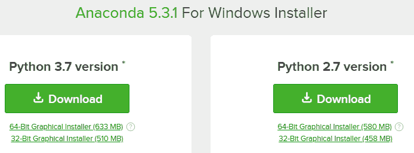
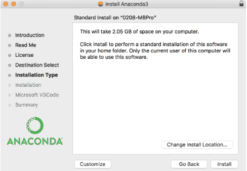
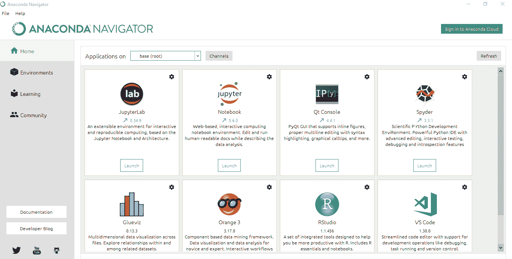
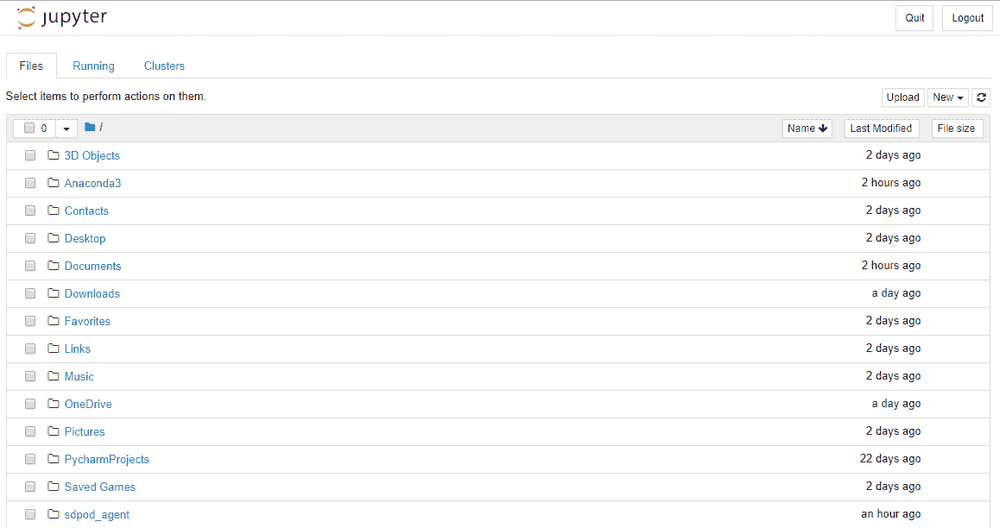
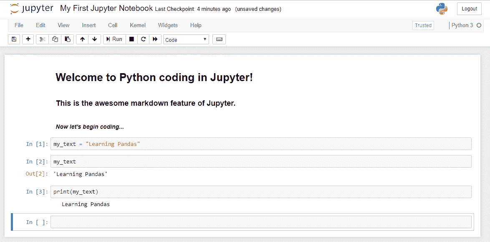
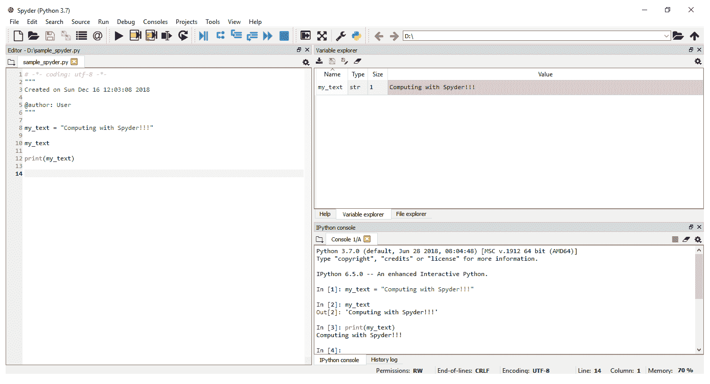
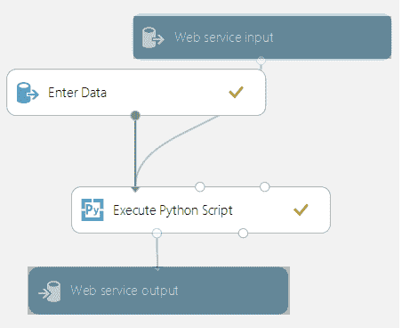
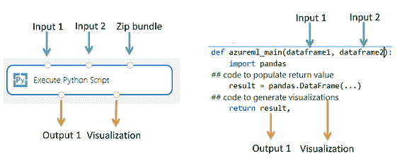
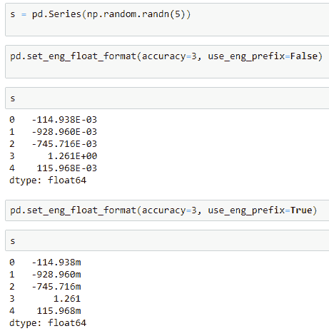

# pandas 和支持软件的安装

在我们开始使用 pandas 进行数据分析之前，我们需要确保软件已安装且环境正常工作。本章涉及 Python（如有必要）、pandas 库及 Windows、macOS/X 和 Linux 平台所需的所有依赖项的安装。我们将讨论的主题包括选择 Python 版本、安装 Python 和安装 pandas 等内容。

以下部分列出的步骤大部分应该是适用的，但根据设置的不同，效果可能有所不同。在不同操作系统版本中，脚本可能并不总是能完美运行，而且系统中已经安装的第三方软件包有时可能会与提供的说明发生冲突。

本章将涵盖以下主题：

+   选择使用的 Python 版本

+   使用 Anaconda 安装 Python 和 pandas

+   pandas 的依赖包

+   查看使用 Anaconda 安装的项目

+   跨工具整合——将 pandas 的强大功能与 R、Julia、H20.ai、Azure ML Studio 命令行技巧结合使用

+   Pandas 的选项和设置

# 选择使用的 Python 版本

这是 Python 开发者之间的经典之争——Python 2.7.x 还是 Python 3.x，哪个更好？直到一年前，Python 2.7.x 一直是排名第一的版本；原因是它是一个稳定的版本。2016 年，超过 70% 的项目使用 Python 2.7。这个比例开始下降，到 2017 年降至 63%。这种趋势的转变是因为宣布从 2018 年 1 月 1 日起，Python 2.7 将不再维护，意味着不会有更多的错误修复或新版本发布。一些在此公告后发布的库仅与 Python 3.x 兼容。许多企业已经开始向 Python 3.x 迁移。因此，从 2018 年开始，Python 3.x 成为首选版本。

如需更多信息，请参见 [`wiki.python.org/moin/Python2orPython3`](https://wiki.python.org/moin/Python2orPython3)。

Python 2.x 和 3.x 之间的主要区别包括 Python 3 更好的 Unicode 支持，`print` 和 `exec` 被更改为函数，以及整数除法。详细信息请参见 *Python 3.0 中的新特性*，网址为 [`docs.python.org/3/whatsnew/3.0.html`](http://docs.python.org/3/whatsnew/3.0.html)。

然而，对于科学、数值或数据分析工作，推荐使用 Python 2.7 而不是 Python 3，原因如下：Python 2.7 是大多数当前发行版的首选版本，而 Python 3.x 在某些库的支持上并不强劲，尽管这个问题正逐渐得到解决。

作为参考，可以查看名为*科学家们会转向 Python 3 吗？*的文档，网址为[`bit.ly/1DOgNuX`](http://bit.ly/1DOgNuX)。因此，本书将在需要时混合使用 Python 2.7 和 3.x 版本。将 Python 2.7 的代码转换为 3.x，或反之并不困难，以下文档可以作为参考：*将 Python 2 代码移植到 Python 3*，网址为[`docs.python.org/2/howto/pyporting.html`](http://docs.python.org/2/howto/pyporting.html)。

然而，还是有一个中间方案，可以兼顾两者的优点。可以使用 Python 中的`virtualenv`包，它允许你在已安装的 Python 环境中创建独立的轻量级虚拟环境。这使得例如你可以在机器上安装 2.7 版本，并通过启动虚拟环境在计算机上访问和运行 3.x 版本的代码。这个虚拟环境只是一个位于不同位置的 Python 独立安装/实例。可以安装与该版本兼容的包，并在运行时引用该版本/安装进行所有计算。你可以创建任意多个虚拟环境。这个包在 Anaconda 发行版中预装。你可以访问以下网站，了解更多关于如何使用`virtualenv`的信息：[`docs.python-guide.org/dev/virtualenvs/`](https://docs.python-guide.org/dev/virtualenvs/)。

pandas 的最新主要版本是 pandas 0.23.4，发布于 2018 年 8 月。以下是一些有趣的功能升级：

+   现在，读取和写入 JSON 的操作变得更加优雅，因为在设置`orient = True`选项时，元数据将被保留。

+   对于 Python 3.6 及以上版本，字典将根据插入实体的顺序分配顺序。这个顺序会被传递到由字典创建的 DataFrame 或系列中。

+   合并和排序现在可以同时使用索引名称和列名称的组合。

+   之前，`DataFrame.apply()`函数使用`axis = 1`时返回的是一个类似列表的对象。最新的 pandas 改进修改了输出，使其具有一致的形状——要么是系列，要么是 DataFrame。

+   现在，可以通过`observed = True`设置，在`groupby`函数中控制没有任何观察值的类别。

+   `DataFrame.all()`和`DataFrame.any()`现在接受`axis=None`，以便在所有轴上汇总为一个标量。

但在我们开始使用 pandas 之前，先花些时间在我们的计算机上安装 Python 吧。

# 独立安装 Python

在这里，我们详细介绍了在多个平台（Linux、Windows 和 macOS/X）上独立安装 Python 的方法。独立安装指的是只安装 IDLE IDE、解释器和一些基本包。另一个选择是从发行版中下载，这是一种更丰富的版本，预安装了许多实用工具。

# Linux

如果你使用的是 Linux，Python 很可能会预装。如果不确定，可以在命令提示符下输入以下命令：

```py
       which python
```

Python 可能会出现在 Linux 系统的以下文件夹之一，具体取决于你的发行版和安装方式：

+   `/usr/bin/python`

+   `/bin/python`

+   `/usr/local/bin/python`

+   `/opt/local/bin/python`

你可以通过在命令提示符下输入以下命令来确定已安装的 Python 版本：

```py
    python --version
```

在极少数情况下，如果 Python 没有预装，你需要弄清楚你使用的是哪种 Linux 版本，然后下载并安装。以下是安装命令以及各种 Linux Python 发行版的链接：

+   Debian/Ubuntu（14.04）：

```py
       sudo apt-get install python2.7
       sudo apt-get install python2.7-devel

```

如需更多信息，请参见 Debian Python 页面：[`wiki.debian.org/Python`](https://wiki.debian.org/Python)。

+   Redhat Fedora/Centos/RHEL：

```py
       sudo yum install python
       sudo yum install python-devel
```

要安装 Fedora 软件，请访问 [`docs.fedoraproject.org/en-US/Fedora/13/html/User_Guide/chap-User_Guide-Managing_software.html`](http://docs.fedoraproject.org/en-US/Fedora/13/html/User_Guide/chap-User_Guide-Managing_software.html)。

+   openSUSE：

```py
       sudo zypper install python
       sudo zypper install python-devel
```

有关安装软件的更多信息，请访问 [`en.opensuse.org/YaST_Software_Management`](http://en.opensuse.org/YaST_Software_Managemen)。

+   **Slackware**：对于这个 Linux 发行版，最好从源代码下载压缩的 tarball 并安装，具体操作请参见以下部分。

# 从压缩 tarball 安装 Python

如果以上方法都无法解决问题，你还可以下载压缩的 tarball（XZ 或 Gzip 格式），然后进行安装。以下是简要的步骤概述：

```py
    #Install dependencies
    sudo apt-get install build-essential
    sudo apt-get install libreadline-gplv2-dev libncursesw5-dev libssl-dev libsqlite3-dev tk-dev libgdbm-dev libc6-dev libbz2-dev 
    #Download the tarball
    mkdir /tmp/downloads
    cd /tmp/downloads
    wget http://python.org/ftp/python/2.7.5/Python-2.7.5.tgz
    tar xvfz Python-2.7.5.tgz
    cd Python-2.7.5 
    # Configure, build and install
    ./configure --prefix=/opt/python2.7 --enable-shared
    make
    make test
    sudo make install
    echo "/opt/python2.7/lib" >> /etc/ld.so.conf.d/opt-python2.7.conf
    ldconfig
    cd ..
    rm -rf /tmp/downloads
```

有关此操作的信息可以在 Python 下载页面找到：[`www.python.org/download/`](http://www.python.org/download/)。

# Windows

与 Linux 和 Mac 发行版不同，Python 在 Windows 上并不预装。

# 核心 Python 安装

标准方法是使用来自 CPython 团队的 Windows 安装程序，这些程序是 MSI 包。可以在此处下载 MSI 包：[`www.python.org/download/releases/2.7.6/`](http://www.python.org/download/releases/2.7.6/)。

根据你的 Windows 系统是 32 位还是 64 位，选择相应的 Windows 包。Python 默认安装到包含版本号的文件夹中，因此在这种情况下，它将被安装到以下位置：`C:\Python27`。

这使得你可以无问题地运行多个版本的 Python。安装后，以下文件夹应该被添加到 `PATH` 环境变量中：`C:\Python27\` 和 `C:\Python27\Tools\Scripts`。

# 安装第三方 Python 和包

有一些 Python 工具需要安装，以便更轻松地安装其他包（如 pandas）。安装 `Setuptools` 和 `pip`。Setuptools 对安装其他 Python 包（如 pandas）非常有用。它增强了标准 Python 分发版中 `distutils` 工具所提供的打包和安装功能。

要安装 Setuptools，请从以下链接下载 `ez_setup.py` 脚本：[`bitbucket.org/pypa/setuptools/raw/bootstrap`](https://bitbucket.org/pypa/setuptools/raw/bootstrap)。

然后，将其保存到 `C:\Python27\Tools\Scripts`。

然后，运行 `ez_setup.py`：`C:\Python27\Tools\Scripts\ez_setup.py`。

`pip` 相关命令为开发者提供了一个易于使用的命令，能快速、轻松地安装 Python 模块。请从以下链接下载 `get-pip` 脚本：[`www.pip-installer.org/en/latest/`](http://www.pip-installer.org/en/latest/)。

然后，从以下位置运行它：`C:\Python27\Tools\Scripts\get-pip.py`。

作为参考，你还可以阅读名为 *在 Windows 上安装 Python* 的文档：[`docs.python-guide.org/en/latest/starting/install/win/`](http://docs.python-guide.org/en/latest/starting/install/win/)。

在 Windows 上，也有一些第三方 Python 提供商，使得安装任务更加简便。它们列举如下：

+   **Enthought**: [`enthought.com/`](https://enthought.com/)

+   **Continuum Analytics**: [`www.continuum.io/`](http://www.continuum.io/)

+   **Active State Python**: [`www.activestate.com/activepython`](http://www.activestate.com/activepython)

# macOS/X

Python 2.7 已预装在当前和近五年的 macOS X 版本中。预装的由 Apple 提供的版本可以在 Mac 的以下文件夹中找到：

+   `/System/Library/Frameworks/Python.framework`

+   `/usr/bin/python`

然而，你也可以从 [`www.python.org/download/`](http://www.python.org/download/) 安装自己的版本。需要注意的是，这样你将有两个 Python 安装版本，你需要小心确保路径和环境的分隔清晰。

# 使用包管理器进行安装

Python 也可以通过包管理器在 Mac 上安装，例如 Macports 或 Homebrew。我将讨论使用 Homebrew 安装的过程，因为它看起来是最用户友好的。作为参考，你可以阅读名为 *在 macOS X 上安装 Python* 的文档：[`docs.python-guide.org/en/latest/starting/install/osx/`](http://docs.python-guide.org/en/latest/starting/install/osx/)。以下是步骤的摘要：

1.  安装 Homebrew 并运行以下命令：

```py
ruby -e "$(curl -fsSL https://raw.github.com/mxcl/homebrew/go)"
```

1.  然后，你需要将 Homebrew 文件夹添加到 `PATH` 环境变量的顶部。

1.  在 Unix 提示符下安装 Python 2.7：

```py
brew install python
```

1.  安装第三方软件 – distribute 和 pip。安装 Homebrew 会自动安装这些包。distribute 和 pip 使你能够轻松下载并安装/卸载 Python 包。

# 使用 Anaconda 安装 Python 和 pandas

在单独安装 Python 后，每个库都必须单独安装。确保新安装的库与相关依赖项的版本兼容会稍显麻烦。这时，像 Anaconda 这样的第三方发行版就派上用场了。Anaconda 是 Python/R 最广泛使用的发行版，专为开发可扩展的数据科学解决方案而设计。

# 什么是 Anaconda？

Anaconda 是一个开源的 Python/R 发行版，旨在无缝管理包、依赖关系和环境。它兼容 Windows、Linux 和 macOS，并需要 3 GB 的磁盘空间。由于需要下载和安装大量 IDE 和超过 720 个包，因此需要这一内存。例如，NumPy 和 pandas 是 Anaconda 中预装的两个包。

下图总结了 Anaconda 发行版的组成部分。每个组件已在列表中总结：

1.  **ANACONDA NAVIGATOR**：一个入口，访问所有 IDE 和工具

1.  **ANACONDA PROJECT**：使用带有文本指南、代码片段及其输出的笔记本保存可重复的实验

1.  **数据科学库**：包括预安装的 IDE、科学计算、可视化和机器学习的包

1.  **CONDA**：一个基于命令行的包管理器，用于安装、卸载和升级包/库：


Anaconda 下的工具

# 为什么选择 Anaconda？

Anaconda 使得程序开发变得更加容易，是初学者的首选工具。Anaconda 提供了一个简单的系统，来设置和管理独立的编程环境，确保不同包在应用程序中保持兼容性。这有助于顺利的协作和部署。在安装或更新包时，Anaconda 会确保依赖关系兼容，并在需要时自动更新依赖项。

# 安装 Anaconda

Anaconda 安装程序分别提供了 32 位操作系统和 64 位操作系统的版本。此外，Python 2.7 和 Python 3.7 也有不同的安装程序。可以从 [`www.anaconda.com/download/`](https://www.anaconda.com/download/) 下载。该网站会显示以下选项，如截图所示：



针对不同平台的 Anaconda 安装程序

下载完成后，按照以下步骤在 Windows 机器上安装 Anaconda。

# Windows 安装

下载 Windows 安装程序（32 位/64 位版本）。

+   下载完成后，启动 `.exe` 文件。

+   按照指示操作并接受许可协议。

+   指定安装目标路径。

这样的对话框应该会引导你完成接下来的步骤。除非你希望自定义目标文件夹或不想安装某些功能，否则选择默认选项：


Windows 版 Anaconda 安装

如果你是 Mac 用户，完成下载后，按照以下步骤在 Windows 机器上安装 Anaconda。

# macOS 安装

下载 macOS 安装程序（32 位/64 位版本）：

+   下载完成后，通过双击`.pkg`文件启动安装。

+   按照指示操作并接受许可协议。

+   推荐将 Anaconda 安装在用户的主目录中。

安装时，应该会出现这样的对话框。只需按照指示操作即可：



macOS 版 Anaconda 安装

按照以下步骤进行 Linux 安装。

# Linux 安装

下载 macOS 安装程序（32 位/64 位版本）：

+   在终端输入以下命令开始安装。

对于 Python 3.7 安装程序，输入以下命令：

```py
bash ~/Downloads/Anaconda3-5.3.0-Linux-x86_64.sh
```

对于 Python 2.7 安装程序，输入以下命令：

```py
bash ~/Downloads/Anaconda2-5.3.0-Linux-x86_64.sh
```

+   输入`Yes`以接受许可协议。

+   接受默认的安装位置或选择一个新位置来完成安装。

# 云端安装

Anaconda 也可以安装在 AWS 和 Azure 等流行云基础设施提供商提供的云机器上。根据你在云账户中选择的实例类型（Linux 或 Windows），可以按照之前描述的类似步骤在云机器上安装 Anaconda。

你可以通过两种方式在云机器上运行 Anaconda：

+   选择一台预先安装了 Anaconda 的机器——AWS 和 Azure 提供许多预装了软件包的机器。你可以选择一台已安装 Anaconda 的机器。以下链接提供了更多详情：[`aws.amazon.com/marketplace/seller-profile?id=29f81979-a535-4f44-9e9f-6800807ad996`](https://aws.amazon.com/marketplace/seller-profile?id=29f81979-a535-4f44-9e9f-6800807ad996)

+   选择一台 Linux/Windows 机器并在其上安装 Anaconda。这是一个更好的、更经济的选项，提供更多的灵活性，只需要稍微的安装工作。一旦启动云机器，安装步骤与之前的步骤类似。以下链接提供了使用云进行安装的完整步骤，[`chrisalbon.com/aws/basics/run_project_jupyter_on_amazon_ec2/`](https://chrisalbon.com/aws/basics/run_project_jupyter_on_amazon_ec2/)。

# 其他以数字和分析为重点的 Python 发行版

以下概述了除了 Anaconda 之外的各种第三方数据分析相关的 Python 发行版。所有以下发行版都包括 pandas：

+   **Enthought Canopy**：这是一个综合性的 Python 数据分析环境。欲了解更多信息，请访问[`www.enthought.com/products/canopy/`](https://www.enthought.com/products/canopy/)。

+   **Python(x,y)**：这是一个免费的、面向科学计算、数据分析和可视化的 Python 发行版，适用于数值计算。它基于 Qt GUI 包和 Spyder 交互式科学开发环境。欲了解更多信息，请参阅 [`python-xy.github.io/`](http://python-xy.github.io/)。

+   **WinPython**：这是一个面向 Windows 平台的免费的开源 Python 发行版，专注于科学计算。欲了解更多信息，请参阅 [`winpython.sourceforge.net/`](http://winpython.sourceforge.net/)。

有关 Python 发行版的更多信息，请访问 [`bit.ly/1yOzB7o`](http://bit.ly/1yOzB7o)。

# pandas 的依赖包

请注意，如果你使用的是 Anaconda 发行版，则无需单独安装 pandas，因此也不需要担心安装依赖项。但了解 pandas 背后使用的依赖包仍然是有益的，有助于更好地理解其功能。

截至撰写时，pandas 的最新稳定版本为 0.23.4 版本。各种依赖包及其相关下载位置如下：

| **Package** | **必需** | **描述** | **下载位置** |
| --- | --- | --- | --- |
| `NumPy : 1.9.0` 或更高版本 | 必需 | 用于数值运算的 NumPy 库 | [`www.numpy.org/`](http://www.numpy.org/) |
| `python-dateutil` 2.5.0 | 必需 | 日期操作和工具库 | [`labix.org/`](http://labix.org/) |
| `Pytz` | 必需 | 时区支持 | [`sourceforge.net/`](http://sourceforge.net/) |
| `Setuptools 24.2.0` | 必需 | 打包 Python 项目 | [`setuptools.readthedocs.io/en/latest/`](https://setuptools.readthedocs.io/en/latest/) |
| `Numexpr` | 可选，推荐 | 加速数值运算 | [`code.google.com/`](https://code.google.com/) |
| `bottleneck` | 可选，推荐 | 性能相关 | [`berkeleyanalytics.com/`](http://berkeleyanalytics.com/) |
| `Cython` | 可选，推荐 | 用于优化的 Python C 扩展 | [`cython.org/`](http://cython.org/) |
| `SciPy` | 可选，推荐 | Python 科学工具集 | [`scipy.org/`](http://scipy.org/) |
| `PyTables` | 可选 | 用于 HDF5 存储的库 | [`pytables.github.io/`](http://pytables.github.io/) |
| `matplotlib` | 可选，推荐 | 类似 Matlab 的 Python 绘图库 | [`sourceforge.net/`](http://sourceforge.net/) |
| `statsmodels` | 可选 | Python 的统计模块 | [`sourceforge.net/`](http://sourceforge.net/) |
| `Openpyxl` | 可选 | 用于读取/写入 Excel 文件的库 | [`www.python.org/`](https://www.python.org/) |
| `xlrd/xlwt` | 可选 | 用于读取/写入 Excel 文件的库 | [`python-excel.org/`](http://python-excel.org/) |
| `Boto` | 可选 | 用于访问 Amazon S3 的库 | [`www.python.org/`](https://www.python.org/) |
| `BeautifulSoup` 和 `html5lib` 或 `lxml` | 可选 | `read_html()` 函数所需的库 | [`www.crummy.com/`](http://www.crummy.com/) |
| `html5lib` | 可选 | 用于解析 HTML 的库 | [`pypi.python.org/pypi/html5lib`](https://pypi.python.org/pypi/html5lib) |
| `Lmxl` | 可选 | 用于处理 XML 和 HTML 的 Python 库 | [`lxml.de/`](http://lxml.de/) |

# Anaconda 安装项回顾

Anaconda 安装了超过 200 个包和多个 IDE。一些广泛使用的包包括：`NumPy`、`pandas`、`scipy`、`scikit-learn`、`matplotlib`、`seaborn`、`beautifulsoup4`、`nltk` 和 `dask`。

通过 Conda（Anaconda 的包管理器）可以手动安装未随 Anaconda 一起安装的包。任何包的升级也可以通过 Conda 进行。Conda 会从 Anaconda 仓库获取包，Anaconda 仓库非常庞大，包含超过 1400 个包。以下命令将通过 `conda` 安装和更新包：

+   安装方法：使用 `conda install pandas`

+   更新方法：使用 `conda update pandas`

以下是 Anaconda 自带的 IDE：

+   JupyterLab

+   Jupyter Notebook

+   QTConsole

+   Spyder

这些 IDE 可以通过 Conda 或 Anaconda Navigator 启动。

Anaconda Navigator 是一个图形用户界面（GUI），可以帮助你管理环境和包，并启动 Jupyter Notebook 和 Spyder 等应用程序。本质上，Navigator 提供了一个无需命令行编码的简易界面，并且适用于 Windows、Linux 和 macOS 系统。

如下图所示，Anaconda 提供了一个一站式平台，可以访问 Python 的 Jupyter/Spyder/IPython IDE 以及 RStudio IDE：



Anaconda Navigator

# JupyterLab

JupyterLab 是一个用于整合笔记本、文档和活动的工具。其一些显著特点如下：

+   它具有拖放功能，可以在笔记本之间重新排列、移动和复制单元格。

+   它可以从文本文件（`.py`、`.R`、`.md`、`.tex` 等）中交互式地运行代码块，支持在 Jupyter Notebook 中运行。

+   它可以将代码控制台链接到笔记本内核，允许交互式地探索代码，而不必在笔记本中堆积临时的草稿工作。

+   它可以支持实时预览并编辑流行的文件格式，如 Markdown、JSON、CSV、Vega、VegaLite 等。

# GlueViz

Glue 是一个有用的 Python 库，用于探索相关数据集之间及其内部的关系。其主要特点包括：

+   **关联统计图形**：Glue 帮助用户从数据中创建散点图、直方图和二维或三维图像。

+   **灵活的数据关联**：Glue 使用逻辑链接来叠加不同数据集之间的不同数据可视化，并跨数据集传递选择。这些链接需要由用户指定，并且可以灵活定义。

+   **完整脚本功能**：Glue 是用 Python 编写的，并基于其标准科学库（即 NumPy、Matplotlib 和 Scipy）构建。对于数据输入、清理和分析，用户可以轻松地结合自己的 Python 代码。

+   **Orange**：Orange 提供开源机器学习、数据可视化和互动数据分析工作流。它的独特卖点是通过基于图形界面的环境进行互动数据可视化和可视化编程。

+   **Visual Studio Code**：VS Code 或 Visual Studio Code 是一个轻量级但功能强大的源代码编辑器，可在桌面上运行，并且适用于 Windows、macOS 和 Linux。它内置支持 JavaScript、TypeScript 和 Node.js，并且拥有丰富的扩展生态系统，支持其他语言（如 C++、C#、Java、Python、PHP 和 Go）及运行时（如 .NET 和 Unity）。

# Jupyter Notebook 和 Spyder 演示

让我们快速了解一下两款广泛使用的 Python IDE——Jupyter Notebook 和 Spyder。

# Jupyter Notebook

Jupyter 在安装 Anaconda 时一起安装。如果没有 Anaconda，您可以在终端执行以下命令来安装 Jupyter：

```py
pip install jupyter
```

可以通过 Anaconda Navigator 打开 Jupyter Notebook，或者点击开始菜单中的图标，或在 Conda 中输入以下命令来打开：

```py
jupyter notebook
```

Jupyter Notebook 在浏览器中打开。启动目录中的所有文件夹都可以从 Jupyter 访问。然而，Jupyter 启动后，主目录是无法更改的。Jupyter 启动时会创建一个本地 Python 服务器：



Jupyter 首页

可以通过点击 **新建** 按钮打开新的笔记本。新笔记本会被创建为 `Untitled.ipynb`，这与其他 Python IDE 不同，在其他 IDE 中脚本是以 `.py` 后缀存储的。在这里，**ipynb** 代表 **IPython Notebook**。`.ipynb` 文件只是一个文本文件，它将所有内容——代码、Markdown 文本以及任何图像或图表——转换为 JSON 格式的元数据：



Jupyter Notebook

Jupyter Notebook 由多个单元组成；单元是存放代码的地方。单元可以用来显示 Markdown 代码或执行代码。在上面的截图中，前三个单元已经转换为 Markdown 单元，而接下来的三个单元是代码单元。可以通过点击 **运行** 按钮或按 *Ctrl* + *Enter* 来运行单元中的代码。

Jupyter Notebook 具有 **保存和检查点** 选项（快捷键：*Ctrl* + *S*）。Jupyter 会每 120 秒自动保存并创建一个检查点。这个检查点有助于恢复未保存的工作，也有助于回退到之前的检查点。

# Spyder

Spyder 可以通过 pip 或 Anaconda 安装，就像 Jupyter 一样。然而，Spyder 的开发者推荐通过 Anaconda 安装。

Spyder 也可以通过与 Jupyter Notebook 类似的方法启动，或者在终端中输入`spyder`来启动：



Spyder

Spyder 具有脚本编辑器和 IPython 控制台。右上角的窗格可以在帮助浏览器、变量资源管理器和文件资源管理器之间切换。编辑器可以分割成多个单元格，更加系统化地编程。IPython 控制台在使用小代码片段时非常有用。变量资源管理器提供了所有 Python 会话中全局对象的摘要。

# 跨工具操作 – 将 pandas 的强大与 R、Julia、H20.ai 和 Azure ML Studio 结合

在数据操作、数据清理或处理时间序列数据等应用中，pandas 可以视为一种“神奇工具”。它非常快速高效，且强大到足以处理小到中等规模的数据集。最棒的是，pandas 的使用不仅仅局限于 Python。通过一些方法，可以在其他框架中利用 pandas 的强大功能，如 R、Julia、Azure ML Studio 和 H20.ai。这种在其他工具中使用优越框架的好处的方法被称为跨工具操作，且在实践中应用非常广泛。其存在的主要原因之一是，几乎不可能有一个工具能具备所有功能。假设某个任务有两个子任务：子任务 1 可以在 R 中完成，而子任务 2 可以在 Python 中完成。可以通过在 R 中完成子任务 1 并通过调用 Python 代码来完成子任务 2，或者在 Python 中完成子任务 2 并通过调用 R 代码来完成子任务 1 来处理。

这个选项使得 pandas 变得更强大。让我们看看 pandas 方法和/或 Python 代码如何与其他工具一起使用。

# 使用 pandas 与 R

R 有一种叫做**DataFrame**的对象类，这与 pandas DataFrame 相同。然而，R 中的 DataFrame 速度比 pandas 慢了好几倍。因此，学习 pandas 也有助于解决 R 中的数据处理问题。不过，在 R 中使用`data.table`数据类型来处理巨大的 DataFrame 是最佳的解决方案。

`reticulate`包帮助在 R 中访问和使用 Python 包。例如，你可以在 R 中运行以下 Python 代码片段：

```py
library(reticulate)

# Installing a python package from R
py_install("pandas")

# Importing pandas
pd &lt;- import("pandas", convert = FALSE)

# Some basic pandas operations in R
pd_df &lt;- pd$read_csv("train.csv")
pd_head &lt;- pd_df$head()
pd_dtypes &lt;- pd_df$dtypes
```

也可以在其他包（如 NumPy）中执行相同的操作：

```py
numpy &lt;- import("numpy")

y &lt;- array(1:4, c(2, 2))
x &lt;- numpy$array(y)
```

如果你已经在 Python 中编写了具体的 pandas 函数，你可以通过 reticulate 包在 R 中使用它。

考虑以下 Python 代码片段：

```py
import pandas
def get_data_head(file):
    data = pandas.read_csv(file)
    data_head = data.head()
    return(data_head)
```

现在，前面的脚本已保存为`titanic.py`。这个脚本可以在 R 中使用，如下所示：

```py
source_python("titanic.py")
titanic_in_r &lt;- get_data_head("titanic.csv")
```

可以使用`repl_python()`从 R 创建一个交互式 Python 会话。

例如，你可以写如下代码：

```py
library(reticulate)
repl_python()
import pandas as pd
[i*i for i in range(10)]
```

它会将结果直接返回到 R shell 中，就像是在 Python IDE 中一样。

在 Python 会话中创建的 Python 对象（列表、字典、DataFrame 和数组）可以通过 R 访问。假设`df`是一个 Python DataFrame，需要通过 R 来获取其摘要。可以按如下方式进行操作：

```py
summary(py$df)
```

# 使用 pandas 与 Azure ML Studio

Azure ML Studio 通过拖放界面提供预测分析解决方案。它具有添加 Python 脚本的能力，脚本可以读取数据集、执行数据操作，然后交付输出数据集。pandas 在 Azure ML Studio 的数据处理模块中可能发挥关键作用：



Azure ML Studio – 流程图

从流程图中可以看出，数据被传入**执行 Python 脚本**模块。该模块可以在三个输入端口中的两个接收数据集，并在两个输出端口中的一个输出 DataFrame。

下图展示了**执行 Python 脚本**模块。此模块只接受 DataFrame 作为输入。它允许在输出端口生成单个 DataFrame 之前进行进一步的数据处理步骤。此处 pandas 及其众多强大功能发挥了作用：



Azure ML Studio 的 Python 执行模块

# pandas 与 Julia

Julia 拥有一个 DataFrame 包，用于处理 DataFrame 的操作。基准测试结果表明，在速度和计算效率方面，pandas 显然是赢家。与 R 类似，Julia 允许我们在脚本中集成 pandas。

安装完成后，pandas 可以直接加载到 Julia 环境中，如下所示：

```py
Pkg.add("Pandas")
using Pandas
# Creating a dataframe object
df = DataFrame(Dict(:score=>[67, 89, 32], :name=>["A", "B", "C"]))

# Any Pandas function or method could be applied on the created dataframe.
head(df)
describe(df)
```

# pandas 与 H2O

H2O 是 H2O.ai 的超强大数据分析产品，封装了多个独立模块，用于处理数据科学模型的各个方面，包括数据操作和模型训练。

H2O 处理数据作为 H2O 框架，并且这些数据完全位于指定的 H2O 集群内。因此，数据不像 pandas DataFrame 那样存储在内存中。

H2O 有一个`as_data_frame()`方法，允许将 H2O 框架转换为 pandas DataFrame。完成转换后，可以对转换后的 DataFrame 执行所有 pandas 操作。

# pandas 的命令行技巧

命令行是 pandas 用户的重要工具。命令行可以作为高效且快速的补充，但由于其操作繁琐，很多数据操作，如将一个大文件拆分成多个部分、清理数据文件中的不支持字符等，可以在命令行中完成，再将数据传递给 pandas 处理。

pandas 的 head 函数非常有用，可以快速评估数据。一个命令行函数使得 head 更具实用性：

```py
# Get the first 10 rows
$ head myData.csv

# Get the first 5 rows
$ head -n 5 myData.csv

# Get 100 bytes of data
$ head -c 100 myData.csv
```

translate（`tr`）函数具有替换字符的能力。以下命令将文本文件中的所有大写字符转换为小写字符：

```py
$ cat upper.txt | tr "[:upper:]" "[:lower:]" >lower.txt
```

阅读巨大的数据文件既繁琐又有时不可行。在这种情况下，需要将大型文件系统地拆分为多个小文件。命令行中的 `split` 函数正是做这件事。它根据每个文件中可以包含的行数将一个文件拆分成多个文件：

```py
$ split -l 100 huge_file.csv small_filename_
```

使用 `split -b` 按指定的字节大小进行拆分，而不是按行数。

`sort` 是另一个有用的类似 pandas 的命令行函数。它可以按字母顺序、数字值或按任何列的逆序进行排序。可以在命令行函数中指定首选的排序顺序和列键。让我们来看一下以下示例：

```py
# Sort the 5th column alphabetically
     $ sort -t, -k5 orderfile.csv

# Sort the 3rd column in reverse numerical order
      $ sort -t,  -k3nr orederfile.csv
```

`-t` 表示文件是以逗号分隔的。

在应用这些方法之前，当前工作目录应更改为存放相关数据文件的目录。

# pandas 的选项和设置

pandas 允许用户修改一些显示和格式化选项。

`get_option()` 和 `set_option()` 命令让用户查看当前设置并进行更改：

```py
pd.get_option("display.max_rows")
Output: 60

pd.set_option("display.max_rows", 120)
pd.get_option("display.max_rows")
Output: 120

pd.reset_option("display.max_rows")
pd.get_option("display.max_rows")
Output: 60
```

上述选项设置和重置了打印 DataFrame 时显示的行数。以下是其他一些有用的显示选项：

+   `max_columns`：设置要显示的列数。

+   `chop_threshold`：小于此限制的浮动值将显示为零。

+   `colheader_justify`：设置列头的对齐方式。

+   `date_dayfirst`：将此设置为 `'True'` 时，显示日期时间值时优先显示日期。

+   `date_yearfirst`：将此设置为 True 时，显示日期时间值时优先显示年份。

+   `precision`：设置显示浮动值的小数精度。

以下是一个数字格式化选项的示例，用于设置精度并决定是否使用前缀：



Pandas 中的数字格式化

我们将在后续章节中详细讨论这一内容。

# 总结

在我们深入探讨 pandas 的强大功能之前，正确安装 Python 和 pandas，选择合适的 IDE，并设置正确的选项是至关重要的。在本章中，我们讨论了这些内容及更多。以下是本章的关键要点总结：

+   Python 3.x 已经可用，但许多用户仍然偏爱使用版本 2.7，因为它更稳定且对科学计算更友好。

+   版本 2.7 的支持和 bug 修复现已停止。

+   从一个版本翻译代码到另一个版本非常简单。还可以使用 `virtualenv` 包同时使用两个版本，该包预装在 Anaconda 中。

+   Anaconda 是一个流行的 Python 发行版，内置 700 多个库/包，并提供多个流行的 IDE，如 Jupyter 和 Spyder。

+   Python 代码可以在其他工具中调用和使用，如 R、Azure ML Studio、H20.ai 和 Julia。

+   一些日常数据操作，如将大文件拆分为更小的块、`读取`几行数据等，也可以在命令行/终端中执行。

+   pandas 的默认设置选项可以通过 `get_option()` 和 `set_option()` 命令查看和更改。一些可以更改的选项包括显示的最大行数和列数、浮动变量的小数位数等。

在下一章中，我们将稍微扩展一下范围，超出 pandas，探索诸如 NumPy 等工具，这些工具丰富了 pandas 在 Python 生态系统中的功能。这将是一个详尽的 NumPy 教程，并结合实际案例研究。

# 进一步阅读

+   [`www.r-bloggers.com/run-python-from-r/`](https://www.r-bloggers.com/run-python-from-r/)

+   [`pandas.pydata.org/pandas-docs/stable/index.html`](https://pandas.pydata.org/pandas-docs/stable/index.html)

+   [`docs.glueviz.org/en/stable/`](http://docs.glueviz.org/en/stable/)

+   [`blog.jupyter.org/jupyterlab-is-ready-for-users-5a6f039b8906`](https://blog.jupyter.org/jupyterlab-is-ready-for-users-5a6f039b8906)

+   [`orange.biolab.si/`](https://orange.biolab.si/)
