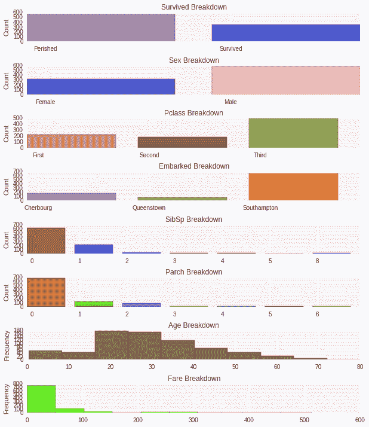
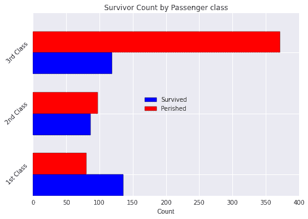
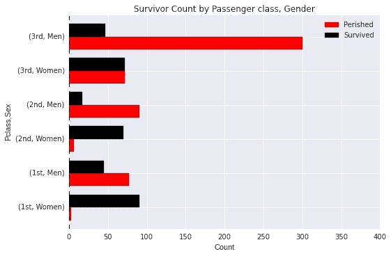
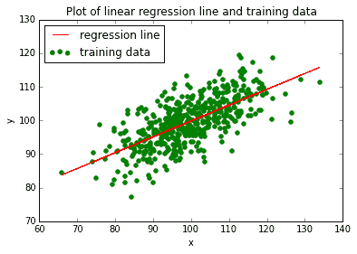
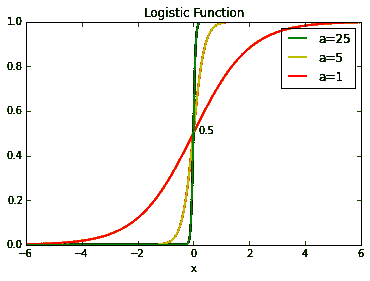
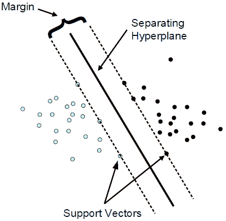
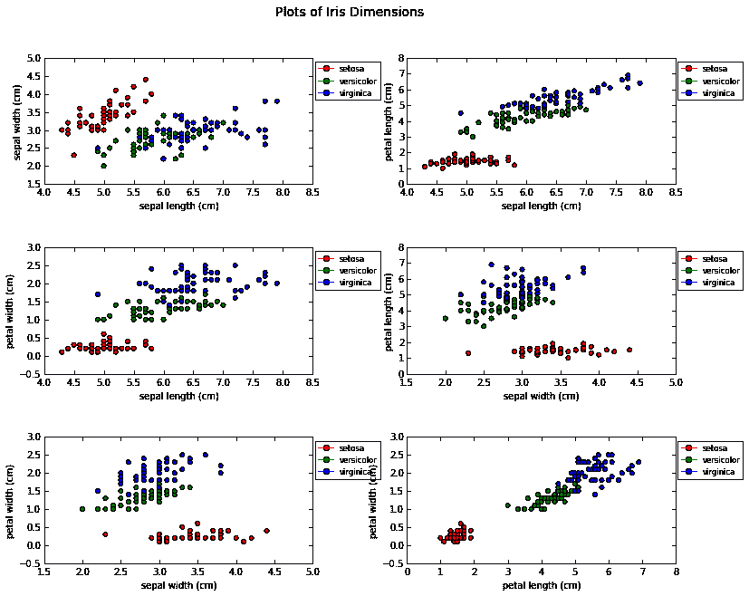
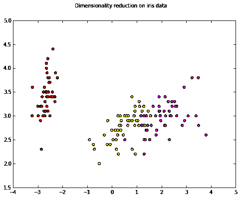
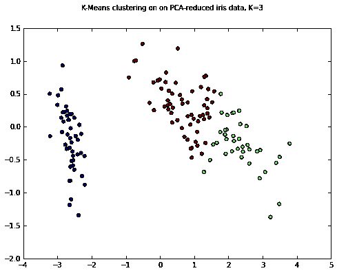
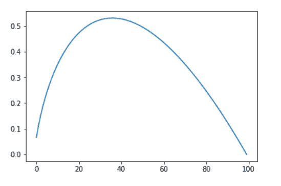

# 机器学习概览

本章将带您快速了解机器学习，重点介绍如何使用`pandas`库作为预处理机器学习程序数据的工具。它还将向您介绍`scikit-learn`库，这是 Python 中最受欢迎的机器学习工具包。

在本章中，我们将通过将机器学习技术应用于一个著名的问题来说明机器学习，即对哪些乘客在世纪之交的 Titanic 灾难中幸存进行分类。本章将讨论的主题包括：

+   pandas 在机器学习中的作用

+   安装`scikit-learn`

+   机器学习概念介绍

+   应用机器学习——Kaggle Titanic 竞赛

+   使用 pandas 进行数据分析和预处理

+   针对 Titanic 问题的朴素方法

+   `scikit-learn`的 ML 分类器接口

+   监督学习算法

+   无监督学习算法

# pandas 在机器学习中的作用

我们将考虑的机器学习库是`scikit-learn`。`scikit-learn` Python 库是一个广泛的机器学习算法库，可用于创建能够从数据输入中学习的自适应程序。

然而，在这些数据可以被`scikit-learn`使用之前，它必须经过一些预处理。这正是 pandas 的作用。pandas 可以在将数据传递给`scikit-learn`实现的算法之前进行预处理和筛选。

在接下来的部分中，我们将看到如何使用`scikit-learn`进行机器学习。所以，第一步，我们将学习如何在我们的机器上安装它。

# `scikit-learn`的安装

如第二章所述，*从第三方供应商安装 Python 和 pandas*，安装 pandas 及其附带库的最简单方法是使用像 Anaconda 这样的第三方分发包，安装完成即可。安装`scikit-learn`应该没有什么不同。我将简要介绍在不同平台和第三方分发包上安装的步骤，首先从 Anaconda 开始。`scikit-learn`库需要以下库：

+   Python 2.6.x 或更高版本

+   NumPy 1.6.1 或更高版本

+   SciPy 0.9 或更高版本

假设您已经按照第二章中描述的内容安装了 pandas，*安装 pandas 和支持软件*，那么这些依赖项应该已经就绪。在接下来的部分中，将讨论在不同平台上安装`scikit-learn`的各种选项。

# 通过 Anaconda 安装

您可以通过运行`conda` Python 包管理器在 Anaconda 上安装`scikit-learn`：

```py
    conda install scikit-learn
```

# 在 Unix（Linux/macOS）上的安装

对于 Unix 系统，最好从源代码安装（需要 C 编译器）。假设 pandas 和 NumPy 已经安装并且所需的依赖库已就绪，您可以通过 Git 运行以下命令来安装`scikit-learn`：

```py
git clone https://github.com/scikit-learn/scikit-learn.git cd scikit-learn python setup.py install  
```

可以通过使用`pip`从`PyPi`在 Unix 上安装 pandas 库：

```py
pip install pandas  
```

# 在 Windows 上安装

要在 Windows 上安装，您可以打开控制台并运行以下命令：

```py
pip install -U scikit-learn  
```

要了解更多关于安装的详细信息，您可以查看官方的`scikit-learn`文档，网址是[`scikit-learn.org/stable/install.html`](http://scikit-learn.org/stable/install.html)。

您还可以查看`scikit-learn` Git 仓库的 README 文件，网址是[`github.com/scikit-learn/scikit-learn/blob/master/README.rst`](https://github.com/scikit-learn/scikit-learn/blob/master/README.rst)。

# 机器学习简介

机器学习是创建从数据中学习的软件程序的艺术。更正式地说，它可以定义为构建自适应程序的实践，这些程序通过可调参数来提高预测性能。它是人工智能的一个子领域。

我们可以根据机器学习程序尝试解决的问题类型来将其分类。这些问题被称为学习问题。广义上讲，这些问题分为两大类——监督学习问题和无监督学习问题。此外，还有一些混合问题，它们涉及监督学习和无监督学习的多个方面。

学习问题的输入由一个包含*n*行的数据集组成。每一行代表一个样本，可能涉及一个或多个称为属性或特征的字段。数据集可以被标准化描述为包含*n*个样本，每个样本由*n*个特征组成。

# 监督学习与无监督学习

对于监督学习问题，学习问题的输入是一个由*已标记*数据组成的数据集。这里的“已标记”意味着我们知道输出的值。学习程序会接收输入样本及其对应的输出，目标是解码它们之间的关系。这种输入称为已标记数据。监督学习问题包括以下几种：

+   **分类**：学习的属性是类别型（名义型）或离散型

+   **回归**：学习的属性是数值型/连续型

在无监督学习或数据挖掘中，学习程序会接受输入，但没有相应的输出。这些输入数据被称为未标记数据。在这种情况下，机器学习的目标是学习或解码隐藏的标签。这类问题包括以下几种：

+   聚类

+   降维

# 以文档分类为例说明

机器学习技术的常见应用之一是在文档分类领域。机器学习的两大主要类别可以应用于这个问题——监督学习和无监督学习。

# 监督学习

输入集合中的每个文档都被分配到一个类别，也就是一个标签。学习程序/算法使用输入集合中的文档来学习如何为另一组没有标签的文档做出预测。这种方法被称为**分类**。

# 无监督学习

输入集合中的文档没有被分配到类别中，因此它们是未标注的。学习程序将这些作为输入，尝试*聚类*或发现相关或相似文档的组。这种方法被称为**聚类**。

# 机器学习系统如何学习

机器学习系统利用一种被称为分类器的工具从数据中学习。*分类器*是一个接口，它接受一个被称为*特征值*的矩阵，并生成一个输出向量，也就是类别。这些特征值可以是离散的，也可以是连续的。分类器的三个核心组成部分如下：

+   **表示**：它是什么类型的分类器？

+   **评估**：分类器的表现如何？

+   **优化**：你如何在备选方案中进行搜索？

# 机器学习应用 – Kaggle 泰坦尼克号比赛

为了说明如何使用 pandas 帮助我们启动机器学习旅程，我们将应用它于一个经典问题，该问题托管在 Kaggle 网站上（[`www.kaggle.com`](http://www.kaggle.com)）。**Kaggle**是一个机器学习问题的竞赛平台。Kaggle 的理念是，允许有兴趣通过数据解决预测分析问题的公司将其数据发布到 Kaggle，并邀请数据科学家提出解决方案。竞赛可以在一段时间内进行，竞争者的排名会公布在排行榜上。在竞赛结束时，排名靠前的竞争者将获得现金奖励。

我们将研究的经典问题是为了说明如何使用 pandas 进行机器学习，并结合`scikit-learn`，这是 Kaggle 上托管的经典入门机器学习问题——*泰坦尼克号：灾难中的机器学习*问题。该问题涉及的数据集是一个原始数据集。因此，pandas 在数据预处理和清洗方面非常有用，帮助在将数据输入到`scikit-learn`实现的机器学习算法之前对其进行整理。

# 泰坦尼克号：灾难中的机器学习问题

泰坦尼克号的数据集包括这次命运多舛旅行的乘客名单，以及各种特征和一个指示变量，告诉我们乘客是否在船沉没时幸存。问题的核心是，给定一位乘客及其相关特征，能否预测该乘客是否幸存于泰坦尼克号的沉船事件中。特征如下所示。

数据包括两个数据集：一个训练数据集和一个测试数据集。训练数据集包含 891 个乘客案例，测试数据集包含 491 个乘客案例。

训练数据集也包含 11 个变量，其中 10 个是特征，1 个是因变量/指示变量`Survived`，它指示乘客是否在灾难中幸存。

特征变量如下：

+   乘客 ID

+   舱位

+   性别

+   船舱等级（Pclass）

+   票价

+   父母和子女数量（Parch）

+   年龄

+   兄弟姐妹数量（Sibsp）

+   上船港口

我们可以利用 pandas 来帮助我们通过以下方式进行数据预处理：

+   数据清理和某些变量的分类

+   排除明显与乘客生存性无关的无关特征；例如，姓名

+   处理缺失数据

我们可以使用多种算法来解决这个问题。它们如下：

+   决策树

+   神经网络

+   随机森林

+   支持向量机

# 过拟合问题

**过拟合**是机器学习中的一个著名问题，程序会记住输入的数据，导致在训练数据上表现完美，但在测试数据上却表现糟糕。

为了防止过拟合，可以使用十折交叉验证技术，在训练阶段引入数据的变异性。

# 使用 pandas 进行数据分析和预处理

在本节中，我们将利用 pandas 对数据进行一些分析和预处理，然后将其作为输入提交给`scikit-learn`。

# 检查数据

为了开始我们的数据预处理，让我们读取训练数据集并检查它的样子。

在这里，我们将训练数据集读取到一个 pandas DataFrame 中并显示前几行：

```py
In [2]: import pandas as pd
        import numpy as np
# For .read_csv, always use header=0 when you know row 0 is the header row
       train_df = pd.read_csv('csv/train.csv', header=0)
In [3]: train_df.head(3)
```

输出结果如下：


因此，我们可以看到各个特征：PassengerId、Survived、PClass、Name、Sex、Age、Sibsp、Parch、Ticket、Fare、Cabin 和 Embarked。一个立刻浮现在脑海中的问题是：哪些特征可能会影响乘客是否幸存？

看起来显而易见的是，PassengerID、票号和姓名不应当影响生存性，因为它们是*标识符*变量。我们将在分析中跳过这些变量。

# 处理缺失值

在机器学习的数据集处理过程中，我们必须解决的一个问题是如何处理训练集中的缺失值。

让我们直观地识别特征集中缺失值的位置。

为此，我们可以使用 Tom Augspurger 编写的 R 语言`missmap`函数的等效版本。下一个截图直观地展示了各个特征缺失数据的情况：


欲了解更多信息及生成此数据的代码，请参阅以下链接：[`tomaugspurger.github.io/blog/2014/02/22/Visualizing%20Missing%20Data/`](http://tomaugspurger.github.io/blog/2014/02/22/Visualizing%20Missing%20Data/)。

我们还可以计算每个特征缺失的数据量：

```py
In [83]: missing_perc=train_df.apply(lambda x: 100*(1-x.count().sum()/(1.0*len(x))))
In [85]: sorted_missing_perc=missing_perc.order(ascending=False)
            sorted_missing_perc
Out[85]: Cabin          77.104377
         Age            19.865320
         Embarked        0.224467
         Fare            0.000000
         Ticket          0.000000
         Parch           0.000000
         SibSp           0.000000
         Sex             0.000000
         Name            0.000000
         Pclass          0.000000
         Survived        0.000000
         PassengerId     0.000000
         dtype: float64
```

因此，我们可以看到大部分`Cabin`数据缺失（77%），而约 20%的`Age`数据缺失。我们决定从学习特征集中删除`Cabin`数据，因为该数据过于稀疏，无法提供有用的信息。

让我们进一步细分我们希望检查的各个特征。对于分类/离散特征，我们使用条形图；对于连续值特征，我们使用直方图。生成图表的代码如下所示：

```py
In [137]:  import random
                   bar_width=0.1
                   categories_map={'Pclass':{'First':1,'Second':2, 'Third':3},
                   'Sex':{'Female':'female','Male':'male'},
                   'Survived':{'Perished':0,'Survived':1},
                   'Embarked':{'Cherbourg':'C','Queenstown':'Q','Southampton':'S'},
                   'SibSp': { str(x):x for x in [0,1,2,3,4,5,8]},
                   'Parch': {str(x):x for x in range(7)}
                   }
                 colors=['red','green','blue','yellow','magenta','orange']
                 subplots=[111,211,311,411,511,611,711,811]
                 cIdx=0
                 fig,ax=plt.subplots(len(subplots),figsize=(10,12))

                 keyorder = ['Survived','Sex','Pclass','Embarked','SibSp','Parch']

    for category_key,category_items in sorted(categories_map.iteritems(),
                                              key=lambda i:keyorder.index(i[0])):
        num_bars=len(category_items)
        index=np.arange(num_bars)
        idx=0
        for cat_name,cat_val in sorted(category_items.iteritems()):
            ax[cIdx].bar(idx,len(train_df[train_df[category_key]==cat_val]), label=cat_name,
                    color=np.random.rand(3,1))
            idx+=1
        ax[cIdx].set_title('%s Breakdown' % category_key)
    xlabels=sorted(category_items.keys()) 
        ax[cIdx].set_xticks(index+bar_width)
        ax[cIdx].set_xticklabels(xlabels)
        ax[cIdx].set_ylabel('Count')
    cIdx +=1 
    fig.subplots_adjust(hspace=0.8)
    for hcat in ['Age','Fare']:
        ax[cIdx].hist(train_df[hcat].dropna(),color=np.random.rand(3,1))
        ax[cIdx].set_title('%s Breakdown' % hcat)
        #ax[cIdx].set_xlabel(hcat)
        ax[cIdx].set_ylabel('Frequency')
        cIdx +=1

    fig.subplots_adjust(hspace=0.8)
    plt.show()
```

请查看以下输出：



从前面的数据和截图中，我们可以观察到以下几点：

+   死亡的乘客数量大约是幸存者的两倍（62%对 38%）。

+   男性乘客大约是女性乘客的两倍（65%对 35%）。

+   第三舱的乘客比第一和第二舱的总和多约 20%（55%对 45%）。

+   大多数乘客是单独旅行的；即，船上没有孩子、父母、兄弟姐妹或配偶。

这些观察结果可能促使我们深入研究是否存在生还机会与性别和票价等级之间的某种相关性，特别是如果我们考虑到泰坦尼克号实行“先妇女儿童后”政策以及泰坦尼克号所搭载的救生艇（20 艘）比设计容量（32 艘）要少这一事实。

鉴于此，让我们进一步考察生还与这些特征之间的关系。我们从性别开始：

```py
In [85]: from collections import OrderedDict
             num_passengers=len(train_df)
             num_men=len(train_df[train_df['Sex']=='male'])
             men_survived=train_df[(train_df['Survived']==1 ) & (train_df['Sex']=='male')]
             num_men_survived=len(men_survived)
             num_men_perished=num_men-num_men_survived
             num_women=num_passengers-num_men
             women_survived=train_df[(train_df['Survived']==1) & (train_df['Sex']=='female')]
             num_women_survived=len(women_survived)
             num_women_perished=num_women-num_women_survived
             gender_survival_dict=OrderedDict()
             gender_survival_dict['Survived']={'Men':num_men_survived,'Women':num_women_survived}
             gender_survival_dict['Perished']={'Men':num_men_perished,'Women':num_women_perished}
             gender_survival_dict['Survival Rate']= {'Men' : 
            round(100.0*num_men_survived/num_men,2),
            'Women':round(100.0*num_women_survived/num_women,2)}
    pd.DataFrame(gender_survival_dict)
    Out[85]:
```

请查看以下表格：

| **性别** | **幸存** | **遇难** | **生还率** |
| --- | --- | --- | --- |
| 男性 | 109 | 468 | 18.89 |
| 女性 | 233 | 81 | 74.2 |

现在我们将以条形图的形式展示这些数据：

```py
In [76]: #code to display survival by gender
            fig = plt.figure()
            ax = fig.add_subplot(111)
            perished_data=[num_men_perished, num_women_perished]
            survived_data=[num_men_survived, num_women_survived]
            N=2
            ind = np.arange(N)     # the x locations for the groups
            width = 0.35

            survived_rects = ax.barh(ind, survived_data, width,color='green')
            perished_rects = ax.barh(ind+width, perished_data, width,color='red')

            ax.set_xlabel('Count')
            ax.set_title('Count of Survival by Gender')
            yTickMarks = ['Men','Women']
            ax.set_yticks(ind+width)
            ytickNames = ax.set_yticklabels(yTickMarks)
            plt.setp(ytickNames, rotation=45, fontsize=10)

            ## add a legend
            ax.legend((survived_rects[0], perished_rects[0]), ('Survived', 'Perished') )
            plt.show()
```

上述代码生成了以下条形图：


从前面的图表中可以看到，大多数女性幸存（74%），而大多数男性遇难（仅 19%幸存）。

这使我们得出结论：乘客的性别可能是决定乘客是否生还的一个因素。

接下来，让我们看一下乘客舱位。首先，我们生成每个舱位的幸存和遇难数据，并计算生还率：

```py
    In [86]: 
    from collections import OrderedDict
    num_passengers=len(train_df)
    num_class1=len(train_df[train_df['Pclass']==1])
    class1_survived=train_df[(train_df['Survived']==1 ) & (train_df['Pclass']==1)]
    num_class1_survived=len(class1_survived)
    num_class1_perished=num_class1-num_class1_survived
    num_class2=len(train_df[train_df['Pclass']==2])
    class2_survived=train_df[(train_df['Survived']==1) & (train_df['Pclass']==2)]
    num_class2_survived=len(class2_survived)
    num_class2_perished=num_class2-num_class2_survived
    num_class3=num_passengers-num_class1-num_class2
    class3_survived=train_df[(train_df['Survived']==1 ) & (train_df['Pclass']==3)]
    num_class3_survived=len(class3_survived)
    num_class3_perished=num_class3-num_class3_survived
    pclass_survival_dict=OrderedDict()
    pclass_survival_dict['Survived']={'1st Class':num_class1_survived,
                                      '2nd Class':num_class2_survived,
                                      '3rd Class':num_class3_survived}
    pclass_survival_dict['Perished']={'1st Class':num_class1_perished,
                                      '2nd Class':num_class2_perished,
                                     '3rd Class':num_class3_perished}
    pclass_survival_dict['Survival Rate']= {'1st Class' : round(100.0*num_class1_survived/num_class1,2),
                   '2nd Class':round(100.0*num_class2_survived/num_class2,2),
                   '3rd Class':round(100.0*num_class3_survived/num_class3,2),}
    pd.DataFrame(pclass_survival_dict)

    Out[86]:
```

然后，我们将这些数据展示在表格中：

| **舱位** | **幸存** | **遇难** | **生还率** |
| --- | --- | --- | --- |
| 第一舱 | 136 | 80 | 62.96 |
| 第二舱 | 87 | 97 | 47.28 |
| 第三舱 | 119 | 372 | 24.24 |

然后，我们可以使用`matplotlib`以类似于之前描述的按性别统计幸存者数量的方式来绘制数据：

```py
    In [186]:
    fig = plt.figure()
    ax = fig.add_subplot(111)
    perished_data=[num_class1_perished, num_class2_perished, num_class3_perished]
    survived_data=[num_class1_survived, num_class2_survived, num_class3_survived]
    N=3
    ind = np.arange(N)                # the x locations for the groups
    width = 0.35
    survived_rects = ax.barh(ind, survived_data, width,color='blue')
    perished_rects = ax.barh(ind+width, perished_data, width,color='red')
    ax.set_xlabel('Count')
    ax.set_title('Survivor Count by Passenger class')
    yTickMarks = ['1st Class','2nd Class', '3rd Class']
    ax.set_yticks(ind+width)
    ytickNames = ax.set_yticklabels(yTickMarks)
    plt.setp(ytickNames, rotation=45, fontsize=10)
    ## add a legend
    ax.legend( (survived_rects[0], perished_rects[0]), ('Survived', 'Perished'),
              loc=10 )
    plt.show()
```

这将生成以下条形图：



从前面的数据和图表中可以清晰地看出，乘客的票价等级越高，乘客的生还几率越大。

鉴于性别和票价等级似乎会影响乘客的生还几率，让我们看看当我们将这两个特征结合起来并绘制它们的组合时会发生什么。为此，我们将使用 pandas 中的`crosstab`函数：

```py
In [173]: survival_counts=pd.crosstab([train_df.Pclass,train_df.Sex],train_df.Survived.astype(bool))
survival_counts
Out[173]:      Survived False  True
    Pclass       Sex 
               1            female    3     91
                            male     77     45
               2            female    6     70
                            male     91     17
               3            female   72     72
                            male    300     47
```

现在，让我们使用`matplotlib`来显示这些数据。首先，为了展示方便，我们做一些重新标记：

```py
In [183]: survival_counts.index=survival_counts.index.set_levels([['1st', '2nd', '3rd'], ['Women', 'Men']])
In [184]: survival_counts.columns=['Perished','Survived']
```

现在，我们使用 pandas `DataFrame`的`plot`函数绘制乘客数据：

```py
In [185]: fig = plt.figure()
              ax = fig.add_subplot(111)
              ax.set_xlabel('Count')
              ax.set_title('Survivor Count by Passenger class, Gender')
              survival_counts.plot(kind='barh',ax=ax,width=0.75,
                                   color=['red','black'], xlim=(0,400))
Out[185]: <matplotlib.axes._subplots.AxesSubplot at 0x7f714b187e90>
```



# 一种对泰坦尼克号问题的简单方法

我们对泰坦尼克号数据的首次分类尝试是使用一种简单且非常直观的方法。该方法包括以下步骤：

1.  选择一组特征，*S*，来影响一个人是否生还。

1.  对于每种可能的特征组合，使用训练数据来指示大多数情况下是否生还。这可以通过所谓的生还矩阵来评估。

1.  对于我们希望预测生还的每个测试样本，查找与其特征值对应的特征组合，并将其预测值分配给生还表中的生还值。该方法是一种简单的 K 近邻方法。

根据我们之前在分析中看到的，三个特征似乎对生还率有最大的影响：

+   乘客舱位

+   性别

+   乘客票价（按类别划分）

我们包括了乘客票价，因为它与乘客舱位有关。

生还表大致如下所示：

```py
         NumberOfPeople  Pclass  PriceBucket     Sex  Survived
    0                0       1            0  female         0
    1                1       1            0    male         0
    2                0       1            1  female         0
    3                0       1            1    male         0
    4                7       1            2  female         1
    5               34       1            2    male         0
    6                1       1            3  female         1
    7               19       1            3    male         0
    8                0       2            0  female         0
    9                0       2            0    male         0
    10              35       2            1  female         1
    11              63       2            1    male         0
    12              31       2            2  female         1
    13              25       2            2    male         0
    14               4       2            3  female         1
    15               6       2            3    male         0
    16              64       3            0  female         1
    17             256       3            0    male         0
    18              43       3            1  female         1
    19              38       3            1    male         0
    20              21       3            2  female         0
    21              24       3            2    male         0
    22              10       3            3  female         0
    23               5       3            3    male         0
```

为了查看我们如何使用这个表格，让我们来看一下我们测试数据的一部分：

```py
In [192]: test_df.head(3)[['PassengerId','Pclass','Sex','Fare']]
Out[192]: PassengerId   Pclass  Sex     Fare
          0        892     3       male    7.8292
          1        893     3       female  7.0000
          2        894     2       male    9.6875
```

对于乘客`892`，我们看到他是男性，票价为 7.8292，他乘坐的是第三舱。因此，这个乘客生还表查找的关键字是*{Sex='male', Pclass=3, PriceBucket=0（因为 7.8292 属于 0 号桶）}*。如果我们在生还表中查找这个关键字对应的生还值（第 17 行），我们看到该值为`0`，即未能生还；这是我们将要预测的值。

类似地，对于乘客`893`，我们有*key={Sex='female', Pclass=3, PriceBucket=0}*。这对应于第 16 行，因此我们会预测`1`，即生还，而她的预测生还值是`1`，即生还。

因此，我们的结果类似于以下命令：

```py
> head -4 csv/surv_results.csv 
PassengerId,Survived
   892,0
   893,1
   894,0
```

该信息的来源在 [`www.markhneedham.com/blog/2013/10/30/kaggle-titanic-python-pandas-attempt/`](http://www.markhneedham.com/blog/2013/10/30/kaggle-titanic-python-pandas-attempt/)。

使用之前概述的生还表方法，我们可以在 Kaggle 上实现 0.77990 的准确度（[`www.kaggle.com`](http://www.kaggle.com)）。尽管生还表方法直观且简单，但它只是机器学习中可能性冰山一角的非常基础的方法。

在接下来的部分中，我们将快速浏览几种机器学习算法，帮助读者了解机器学习领域中的各种可用工具。

# scikit-learn 的 ML/分类器接口

我们将深入探讨机器学习的基本原理，并通过 `scikit-learn` 的基础 API 演示这些原理的应用。

`scikit-learn` 库具有估计器接口。我们通过使用线性回归模型来说明这一点。例如，考虑以下内容：

```py
    In [3]: from sklearn.linear_model import LinearRegression

```

估计器接口被实例化以创建一个模型，在这种情况下是线性回归模型：

```py
    In [4]: model = LinearRegression(normalize=True) 
    In [6]: print model
        LinearRegression(copy_X=True, fit_intercept=True, normalize=True)

```

在这里，我们指定 `normalize=True`，表示在回归之前将对 *x* 值进行归一化处理。**超参数**（估计器参数）作为模型创建时的参数传入。这是创建具有可调参数模型的示例。

估计参数是通过拟合估计器时从数据中获得的。让我们首先创建一些样本训练数据，这些数据围绕 `y = x/2` 正态分布。我们首先生成 `x` 和 `y` 的值：

```py
    In [51]: sample_size=500
             x = []
             y = []

            for i in range(sample_size):
                newVal = random.normalvariate(100,10)
                x.append(newVal)
                y.append(newVal / 2.0 + random.normalvariate(50,5))
```

`sklearn` 接受一个 `num_samples × num_features` 的二维数组作为输入，因此我们将我们的 `x` 数据转换为二维数组：

```py
    In [67]: X = np.array(x)[:,np.newaxis]
             X.shape
    Out[67]: (500, 1)
```

在此示例中，我们有 500 个样本和 1 个特征，`x`。现在我们训练/拟合模型，并显示回归线的斜率（系数）和截距，即预测值：

```py
    In [71]: model.fit(X,y)
             print "coeff=%s, intercept=%s" % (model.coef_,model.intercept_)
             coeff=[ 0.47071289], intercept=52.7456611783
```

这可以通过以下方式进行可视化：

```py
    In [65]: plt.title("Plot of linear regression line and training data")
             plt.xlabel('x')
             plt.ylabel('y')
             plt.scatter(X,y,marker='o', color='green', label='training data');
             plt.plot(X,model.predict(X), color='red', label='regression line')
             plt.legend(loc=2)

    Out[65]: [<matplotlib.lines.Line2D at 0x7f11b0752350]
```



总结估计器接口的基本使用方法，请遵循以下步骤：

1.  定义你的模型：`LinearRegression`、`SupportVectorMachine`、`DecisionTrees` 等。你可以在此步骤中指定所需的超参数；例如，如前所述，`normalize=True`。

1.  一旦模型被定义，你可以通过调用在前一步定义的模型上的 `fit(..)` 方法，在数据上训练模型。

1.  一旦我们拟合了模型，就可以在测试数据上调用 `predict(..)` 方法进行预测或估算。

1.  对于监督学习问题，`predict(X)` 方法接受未标记的观测值 `X`，并返回预测标签 `y`。

欲了解更多信息，请参见以下链接：[`scikit-learn.org/stable/tutorial/statistical_inference/supervised_learning.html`](http://scikit-learn.org/stable/tutorial/statistical_inference/supervised_learning.html)

# 监督学习算法

我们将简要介绍一些著名的监督学习算法，并看看如何将它们应用于前面提到的泰坦尼克号生存预测问题。

# 使用 Patsy 为 scikit-learn 构建模型

在开始介绍机器学习算法之前，我们需要了解一些关于`Patsy`库的知识。我们将利用`Patsy`来设计与`scikit-learn`配合使用的特征。`Patsy`是一个用于创建设计矩阵的包。设计矩阵是我们输入数据特征的变换。这些变换由公式表示，公式对应于我们希望机器学习程序在学习过程中使用的特征规范。

一个简单的例子如下：假设我们希望对一个变量 y 进行线性回归，回归变量包括其他变量`x`、`a`和`b`，以及`a`与`b`的交互作用；那么，我们可以按如下方式指定模型：

```py
    import patsy as pts
    pts.dmatrices("y ~ x + a + b + a:b", data)
```

在前一行代码中，公式通过以下表达式指定：`y ~ x + a + b + a:b`。

有关更多信息，请查看[`patsy.readthedocs.org/en/latest/overview.html`](http://patsy.readthedocs.org/en/latest/overview.html)。

# 通用模板代码解释

在这一部分中，我们将介绍使用`Patsy`和`scikit-learn`实现以下算法的模板代码。之所以这样做，是因为以下算法的大部分代码是可重复的。

在接下来的章节中，将描述算法的工作原理，并提供每种算法的特定代码：

1.  首先，让我们通过以下命令确保我们位于正确的文件夹中。假设工作目录位于`~/devel/Titanic`，我们有以下内容：

```py
    In [17]: %cd ~/devel/Titanic
            /home/youruser/devel/sandbox/Learning/Kaggle/Titanic
```

1.  在这里，我们导入所需的包并读取训练集和测试集数据：

```py
    In [18]: import matplotlib.pyplot as plt
                 import pandas as pd
                 import numpy as np
                 import patsy as pt
    In [19]: train_df = pd.read_csv('csv/train.csv', header=0)
    test_df = pd.read_csv('csv/test.csv', header=0) 

```

1.  接下来，我们指定希望提交给`Patsy`的公式：

```py
    In [21]: formula1 = 'C(Pclass) + C(Sex) + Fare'
             formula2 = 'C(Pclass) + C(Sex)'
             formula3 = 'C(Sex)'
             formula4 = 'C(Pclass) + C(Sex) + Age + SibSp + Parch'
    formula5 = 'C(Pclass) + C(Sex) + Age + SibSp + Parch + 
             C(Embarked)' 
             formula6 = 'C(Pclass) + C(Sex) + Age + SibSp + C(Embarked)'
             formula7 = 'C(Pclass) + C(Sex) + SibSp + Parch + C(Embarked)'
             formula8 = 'C(Pclass) + C(Sex) + SibSp + Parch + C(Embarked)'

    In [23]: formula_map = {'PClass_Sex_Fare' : formula1,
                            'PClass_Sex' : formula2,
                            'Sex' : formula3,
                            'PClass_Sex_Age_Sibsp_Parch' : formula4,
                            'PClass_Sex_Age_Sibsp_Parch_Embarked' : 
                             formula5,
               'PClass_Sex_Embarked' : formula6,
               'PClass_Sex_Age_Parch_Embarked' : formula7,
               'PClass_Sex_SibSp_Parch_Embarked' : formula8
                  }

```

我们将定义一个函数来帮助处理缺失值。以下函数会查找数据框中包含空值的单元格，获取相似乘客的集合，并将空值设置为该集合中相似乘客特征的均值。相似乘客定义为性别和乘客舱位与缺失特征值的乘客相同的乘客：

```py
    In [24]: 
    def fill_null_vals(df,col_name):
        null_passengers=df[df[col_name].isnull()]
        passenger_id_list = null_passengers['PassengerId'].tolist()
        df_filled=df.copy()
        for pass_id in passenger_id_list:
            idx=df[df['PassengerId']==pass_id].index[0]
    similar_passengers = df[(df['Sex']== 
    null_passengers['Sex'][idx]) & 
            (df['Pclass']==null_passengers['Pclass'][idx])]
            mean_val = np.mean(similar_passengers[col_name].dropna())
            df_filled.loc[idx,col_name]=mean_val
        return df_filled

```

在这里，我们创建了填充版本的训练和测试数据框。

我们的测试数据框是经过拟合的`scikit-learn`模型将在其上生成预测，并将输出提交给 Kaggle 进行评估：

```py
    In [28]: train_df_filled=fill_null_vals(train_df,'Fare')
             train_df_filled=fill_null_vals(train_df_filled,'Age')
             assert len(train_df_filled)==len(train_df)

             test_df_filled=fill_null_vals(test_df,'Fare')
             test_df_filled=fill_null_vals(test_df_filled,'Age')
             assert len(test_df_filled)==len(test_df)

```

下面是实际调用`scikit-learn`进行训练并生成预测的实现。请注意，尽管这段代码是模板代码，但为了说明目的，实际调用了一个特定算法——在此例中为`DecisionTreeClassifier`。

输出数据会写入带有描述性名称的文件，例如`csv/dt_PClass_Sex_Age_Sibsp_Parch_1.csv`和`csv/dt_PClass_Sex_Fare_1.csv`：

```py
    In [29]: 
    from sklearn import metrics,svm, tree
    for formula_name, formula in formula_map.iteritems():
            print "name=%s formula=%s" % (formula_name,formula)
    y_train,X_train = pt.dmatrices('Survived ~ ' + formula, 
                                        train_df_filled,return_type='dataframe')
         y_train = np.ravel(y_train)
    model = tree.DecisionTreeClassifier(criterion='entropy', 
                 max_depth=3,min_samples_leaf=5)
         print "About to fit..."
         dt_model = model.fit(X_train, y_train)
         print "Training score:%s" % dt_model.score(X_train,y_train)
         X_test=pt.dmatrix(formula,test_df_filled)
         predicted=dt_model.predict(X_test)
         print "predicted:%s" % predicted[:5]
         assert len(predicted)==len(test_df)
         pred_results = pd.Series(predicted,name='Survived')
    dt_results = pd.concat([test_df['PassengerId'], 
                      pred_results],axis=1)
         dt_results.Survived = dt_results.Survived.astype(int)
         results_file = 'csv/dt_%s_1.csv' % (formula_name)
         print "output file: %s\n" % results_file
         dt_results.to_csv(results_file,index=False)

```

前面的代码遵循了一个标准的流程，摘要如下：

1.  读取训练集和测试集数据。

1.  填充我们希望在两个数据集中考虑的特征的任何缺失值。

1.  在`Patsy`中定义我们希望为其生成机器学习模型的各种特征组合的公式。

1.  对于每个公式，执行以下步骤：

1\. 调用`Patsy`为我们的训练特征集和训练标签集（分别由`X_train`和`y_train`指定）创建设计矩阵。

2\. 实例化适当的`scikit-learn`分类器。在本例中，我们使用`DecisionTreeClassifier`。

3\. 通过调用`fit(..)`方法来拟合模型。

4\. 调用`Patsy`创建我们的预测输出的设计矩阵（`X_test`），通过调用`patsy.dmatrix(..)`。

5\. 在`X_test`设计矩阵上进行预测，并将结果保存在变量 predicted 中。

6\. 将我们的预测结果写入输出文件，提交给 Kaggle。

我们将考虑以下监督学习算法：

+   逻辑回归

+   支持向量机

+   随机森林

+   决策树

# 逻辑回归

在逻辑回归中，我们尝试根据一个或多个输入预测变量预测一个类别的结果，即离散值的因变量。

逻辑回归可以看作是将线性回归应用于离散或类别变量的等价方法。然而，在二元逻辑回归（应用于 Titanic 问题）的情况下，我们试图拟合的函数并不是线性的，因为我们要预测的结果只有两个可能的取值——0 和 1\. 使用线性函数进行回归没有意义，因为输出值不能介于 0 和 1 之间。理想情况下，我们需要为二值输出的回归建模一个阶跃函数，用于 0 和 1 之间的值。然而，这样的函数没有明确的定义，且不可微分，因此定义了一个具有更好性质的近似函数：逻辑函数。逻辑函数的值介于 0 和 1 之间，但它偏向于 0 和 1 的极值，可以作为类别变量回归的良好近似。逻辑回归函数的正式定义如下：

*          f(x) = 1/((1+e^(-ax))*

以下图示很好地说明了为何逻辑函数适用于二元逻辑回归：



我们可以看到，随着我们增加参数*a*的值，结果值逐渐接近 0 到 1 之间的值，并且逐步逼近我们希望建模的阶跃函数。前面函数的简单应用是，如果*f(x) < 0.5*，则将输出值设为 0，否则设为 1。

绘制该函数的代码包含在`plot_logistic.py`中。

对逻辑回归的更详细检查可以参考[`en.wikipedia.org/wiki/Logit`](http://en.wikipedia.org/wiki/Logit) 和 [`logisticregressionanalysis.com/86-what-is-logistic-regression`](http://logisticregressionanalysis.com/86-what-is-logistic-regression)。

在将逻辑回归应用于 Titanic 问题时，我们希望预测一个二元结果，即乘客是否幸存。

我们调整了模板代码，使用 `scikit-learn` 的 `sklearn.linear_model.LogisticRegression` 类。

提交数据到 Kaggle 后，得到以下结果：

| **公式** | **Kaggle 分数** |
| --- | --- |
| C(Pclass) + C(Sex) + Fare | 0.76077 |
| C(Pclass) + C(Sex) | 0.76555 |
| C(Sex) | 0.76555 |
| C(Pclass) + C(Sex) + Age + SibSp + Parch | 0.74641 |
| C(Pclass) + C(Sex) + Age + Sibsp + Parch + C(Embarked) | 0.75598 |

实现逻辑回归的代码可以在 `run_logistic_regression_titanic.py` 文件中找到。

# 支持向量机

**支持向量机**（**SVM**）是一种强大的监督学习算法，用于分类和回归。它是一种判别分类器——它在数据的不同聚类或分类之间画出边界，因此新点可以根据它们所属的聚类来分类。

SVM 不仅仅是找到一条边界线；它还试图为边界的两侧确定边际。SVM 算法试图找到边界的最大可能边际。

支持向量是定义边界周围最大边际的点——如果移除这些点，可能会找到一个更大的边际。因此，称其为“支持”，因为它们支撑着边界线周围的边际。支持向量非常重要。如下图所示：



有关此更多信息，请参见 [`winfwiki.wi-fom.de/images/c/cf/Support_vector_2.png`](http://winfwiki.wi-fom.de/images/c/cf/Support_vector_2.png)。

要使用 SVM 算法进行分类，我们需要指定以下三种核函数之一：线性（linear）、多项式（poly）和 **rbf**（也称为 **径向基函数**）。

然后，我们导入 **支持向量分类器**（**SVC**）：

```py
    from sklearn import svm

```

然后，我们实例化一个 SVM 分类器，拟合模型，并预测以下内容：

```py
    model = svm.SVC(kernel=kernel)
    svm_model = model.fit(X_train, y_train)
    X_test = pt.dmatrix(formula, test_df_filled)
    . . .

```

提交数据到 Kaggle 后，得到以下结果：

| **公式** | **核函数类型** | **Kaggle 分数** |
| --- | --- | --- |
| C(Pclass) + C(Sex) + Fare | poly | 0.71292 |
| C(Pclass) + C(Sex) | poly | 0.76555 |
| C(Sex) | poly | 0.76555 |
| C(Pclass) + C(Sex) + Age + SibSp + Parch | poly | 0.75598 |
| C(Pclass) + C(Sex) + Age + Parch + C(Embarked) | poly | 0.77512 |
| C(Pclass) + C(Sex) + Age + Sibsp + Parch + C(embarked) | poly | 0.79426 |
| C(Pclass) + C(Sex) + Age + Sibsp + Parch + C(Embarked) | rbf | 0.7512 |

代码的完整内容可以在以下文件中查看：`run_svm_titanic.py`。

在这里，我们看到使用多项式（poly）核类型的 SVM，以及`Pclass`、`Sex`、`Age`、`Sibsp`和`Parch`特征的组合，在提交到 Kaggle 时产生了最佳结果。令人惊讶的是，**登船地点**（**Embarked**）以及乘客是否单独旅行或与家人同行（**Sibsp + Parch**）似乎对乘客的生存机会有显著影响。

后者的影响可能是由于泰坦尼克号的“妇女与儿童优先”政策。

# 决策树

决策树的基本思想是利用训练数据集创建一个决策树来进行预测。

它基于单一特征的值递归地将训练数据集划分为多个子集。每次划分对应决策树中的一个节点。划分过程会一直持续，直到每个子集都纯净；即，所有元素都属于同一类。除非存在属于不同类的重复训练样本，否则该方法总是有效。在这种情况下，最大类将胜出。

最终结果是一个用于对测试数据集进行预测的规则集。

决策树通过模拟人类如何分类事物的过程来编码一系列二元选择，但通过使用信息准则来决定每一步中哪个问题最有用。

一个例子是，如果你想确定动物`x`是哺乳动物、鱼类还是爬行动物；在这种情况下，我们会提出以下问题：

```py
    - Does x have fur?
    Yes: x is a mammal
    No: Does x have feathers?
    Yes: x is a bird
    No: Does x have scales?
    Yes: Does x have gills?
    Yes: x is a fish
    No: x is a reptile
    No: x is an amphibian

```

这会生成一个类似于以下内容的决策树：


欲了解更多信息，请参见以下链接：[`labs.opendns.com/wp-content/uploads/2013/09/animals.gif`](https://labs.opendns.com/wp-content/uploads/2013/09/animals.gif)。

每个节点处的二元问题划分是决策树算法的精髓。决策树的一个主要缺点是它们可能会*过拟合*数据。它们的灵活性非常高，当树的深度很大时，它们能够记住输入，从而导致在对未见过的数据进行分类时效果不佳。

解决这个问题的方法是使用多个决策树，这称为使用集成估计器。集成估计器的一个例子是随机森林算法，接下来我们将讨论这个算法。

要在`scikit-learn`中使用决策树，我们需要导入`tree`模块：

```py
    from sklearn import tree
```

然后我们实例化一个 SVM 分类器，拟合模型，并进行以下预测：

```py
    model = tree.DecisionTreeClassifier(criterion='entropy', 
                 max_depth=3,min_samples_leaf=5)
    dt_model = model.fit(X_train, y_train)
 X_test = dt.dmatrix(formula, test_df_filled)
    #. . .
```

提交我们的数据到 Kaggle 后，得到以下结果：

| **公式** | **Kaggle 得分** |
| --- | --- |
| C(Pclass) + C(Sex) + Fare | 0.77033 |
| C(Pclass) + C(Sex) | 0.76555 |
| C(Sex) | 0.76555 |
| C(Pclass) + C(Sex) + Age + SibSp + Parch | 0.76555 |
| C(Pclass) + C(Sex) + Age + Parch + C(Embarked) | 0.78947 |
| C(Pclass) + C(Sex) + Age + Sibsp + Parch + C(Embarked) | 0.79426 |

# 随机森林

随机森林是一个非参数模型的例子，决策树也是如此。随机森林基于决策树，决策边界是从数据本身学习的。它不必是直线、多项式或径向基函数。随机森林模型在决策树的基础上发展，通过生成大量决策树，或一片决策树森林。它从数据中随机抽取样本，并识别一组特征来生长每棵决策树。模型的错误率在多个决策树集合中进行比较，以找到产生最强分类模型的特征集合。

要在`scikit-learn`中使用随机森林，我们需要导入`RandomForestClassifier`模块：

```py
from sklearn import RandomForestClassifier  
```

然后我们实例化一个随机森林分类器，拟合模型并进行预测：

```py
model = RandomForestClassifier(n_estimators=num_estimators, 
                                  random_state=0)
rf_model = model.fit(X_train, y_train)
X_test = dt.dmatrix(formula, test_df_filled)
   . . .
```

提交数据到 Kaggle（使用公式：*C(Pclass) + C(Sex) + Age + Sibsp + Parch + C(Embarked)*）后，得到以下结果：

| **公式** | **Kaggle 分数** |
| --- | --- |
| 10 | 0.74163 |
| 100 | 0.76077 |
| 1000 | 0.76077 |
| 10000 | 0.77990 |
| 100000 | 0.77990 |

# 无监督学习算法

在无监督学习中，我们主要关注的两个任务是：降维和聚类。

# 降维

降维用于帮助系统地可视化高维数据。这非常有用，因为人类大脑只能可视化三维空间（可能还包括时间维度），但大多数数据集涉及更高的维度。

降维中常用的技术是**主成分分析**（**PCA**）。PCA 通过使用线性代数技术将高维数据投影到低维空间。这不可避免地会导致信息的丧失，但通常，通过沿着正确的维度和数量投影，可以最小化信息损失。一种常见的降维技术是找到解释数据中最大方差（信息的代理）的变量组合，并沿这些维度进行投影。

在无监督学习问题中，我们没有标签集（`Y`），因此我们只对输入数据`X`本身调用`fit()`，对于 PCA，我们调用`transform()`而不是`predict()`，因为我们正在尝试将数据转换为新的表示形式。

我们将用于演示无监督学习的一个数据集是鸢尾花数据集，可能是所有机器学习中最著名的数据集。

`scikit-learn`库提供了一组预打包的数据集，可以通过`sklearn.datasets`模块访问。其中，鸢尾花数据集就是其中之一。

鸢尾花数据集由 150 个样本组成，来自三种不同的鸢尾花——变色鸢尾、剑藜鸢尾和维吉尼亚鸢尾——每种类型有 50 个样本。该数据集包含四个特征/维度：

+   花瓣长度

+   花瓣宽度

+   花萼长度

+   花萼宽度

长度和宽度的值以厘米为单位。它可以按如下方式加载：

```py
from sklearn.datasets import load_iris 
iris = load_iris()
```

在我们对无监督学习的探讨中，我们将专注于如何可视化和聚类这些数据。

在讨论无监督学习之前，让我们先来看看鸢尾花数据。`load_iris()`命令返回一个所谓的“bunch”对象，实际上它是一个字典，除了包含数据的键外，还包括其他键。因此，我们得到如下内容：

```py
In [2]: iris_data.keys()
   Out[2]: ['target_names', 'data', 'target', 'DESCR', 'feature_names']
```

此外，数据本身看起来类似于以下内容：

```py
In [3]: iris_data.data.shape
   Out[3]: (150, 4)
```

这对应于 150 个样本的四个特征。以下是这四个特征：

```py
In [4]: print iris_data.feature_names
   ['sepal length (cm)', 'sepal width (cm)', 'petal length (cm)', 'petal width (cm)']
```

我们还可以查看实际数据：

```py
In [9]: print iris_data.data[:2]
   [[ 5.1  3.5  1.4  0.2]
    [ 4.9  3\.   1.4  0.2]]
```

我们的目标名称（我们试图预测的内容）看起来如下所示：

```py
In [10]: print iris_data.target_names
            ['setosa' 'versicolor' 'virginica']
```

如前所述，鸢尾花特征集对应的是五维数据，我们无法在彩色图上可视化它。我们可以做的一件事是选择两个特征，并将它们相互绘制，同时使用颜色来区分不同物种的特征。接下来，我们将为所有可能的特征组合进行此操作，每次选择两个特征，共有六种不同的组合。它们如下所示：

+   萼片宽度与萼片长度

+   萼片宽度与花瓣宽度

+   萼片宽度与花瓣长度

+   萼片长度与花瓣宽度

+   萼片长度与花瓣长度

+   花瓣宽度与花瓣长度



这段代码可以在以下文件中找到：`display_iris_dimensions.py`。从前面的图表中，我们可以观察到 setosa 物种的点倾向于聚集在一起，而 virginica 和 versicolor 物种的点之间有一些重叠。这可能使我们得出结论，后两者的物种关系比与 setosa 物种的关系更紧密。

然而，这只是数据的二维切片。如果我们想要对数据有一个更全面的视图，展示所有四个萼片和花瓣的维度呢？如果在这四个维度之间存在某些我们二维图表未能展示的尚未发现的联系呢？有没有办法可视化这个呢？引入降维技术。我们将使用降维技术提取出萼片和花瓣维度的两个组合来帮助我们进行可视化。

我们可以通过以下方式应用降维技术来实现这一点：

```py
    In [118]: X, y = iris_data.data, iris_data.target
                  from sklearn.decomposition import PCA
                  pca = PCA(n_components=2)
                  pca.fit(X)
                  X_red=pca.transform(X)
                  print "Shape of reduced dataset:%s" % str(X_red.shape)

             Shape of reduced dataset:(150, 2)
```

因此，我们看到降维后的数据现在是二维的。我们将如下所示地在二维空间中可视化这些数据：

```py
    In [136]: figsize(8,6)
              fig=plt.figure()
              fig.suptitle("Dimensionality reduction on iris data")
              ax=fig.add_subplot(1,1,1)
              colors=['red','yellow','magenta']
              cols=[colors[i] for i in iris_data.target]
              ax.scatter(X_red[:,0],X[:,1],c=cols)
    Out[136]:
    <matplotlib.collections.PathCollection at 0x7fde7fae07d0>
```



我们可以通过以下方式检查这两个主成分分析（PCA）降维后的数据维度：

```py
    In [57]:
    print "Dimension Composition:"
    idx=1
    for comp in pca.components_:
        print "Dim %s" % idx
        print " + ".join("%.2f x %s" % (value, name)
                         for value, name in zip(comp, iris_data.feature_names))
        idx += 1

    Dimension Composition:
    Dim 1
    0.36 x sepal length (cm) + -0.08 x sepal width (cm) + 0.86 x petal length (cm) + 0.36 x petal width (cm)
    Dim 2
    -0.66 x sepal length (cm) + -0.73 x sepal width (cm) + 0.18 x petal length (cm) + 0.07 x petal width (cm)
```

因此，我们可以看到这两个降维后的维度是所有四个萼片和花瓣维度的线性组合。

该信息的来源请访问[`github.com/jakevdp/sklearn_pycon2014`](https://github.com/jakevdp/sklearn_pycon2014)。

# K 均值聚类

聚类的思想是根据给定的标准将相似的点聚集在一起，从而在数据中找到聚类。

K-means 算法旨在将一组数据点划分为 *K* 个簇，使得每个数据点都属于与其最近的均值点或质心的簇。

为了说明 K-means 聚类，我们可以将其应用于通过 PCA 获得的降维后的鸢尾花数据集，但在这种情况下，我们不会像监督学习那样将实际标签传递给 `fit(..)` 方法：

```py
    In [142]: from sklearn.cluster import KMeans
              k_means = KMeans(n_clusters=3, random_state=0)
              k_means.fit(X_red)
              y_pred = k_means.predict(X_red)
```

现在，我们显示聚类后的数据如下：

```py
    In [145]: figsize(8,6)
              fig=plt.figure()
              fig.suptitle("K-Means clustering on PCA-reduced iris data, 
              K=3")
              ax=fig.add_subplot(1,1,1)
              ax.scatter(X_red[:, 0], X_red[:, 1], c=y_pred);
```



请注意，我们的 K-means 算法聚类与通过 PCA 获得的维度并不完全对应。源代码可在[`github.com/jakevdp/sklearn_pycon2014`](https://github.com/jakevdp/sklearn_pycon2014)中找到。

有关 K-means 聚类的更多信息，您可以在 `scikit-learn` 官方文档和以下链接中找到：[`scikit-learn.org/stable/auto_examples/cluster/plot_cluster_iris.html`](http://scikit-learn.org/stable/auto_examples/cluster/plot_cluster_iris.html) 和 [`en.wikipedia.org/wiki/K-means_clustering`](http://en.wikipedia.org/wiki/K-means_clustering)。

# XGBoost 案例研究

**XGBoost** 是一种因其出色性能而广受欢迎的集成算法。集成算法涉及多个模型，而不仅仅是一个。集成算法分为两种类型：

+   **Bagging**：在这里，算法的结果是来自各个模型结果的平均值。

+   **Boosting**：在这里，我们从一个基础学习模型开始。每个后续模型都基于更好训练的参数创建。新参数的学习通过优化算法（如梯度下降）进行。

接下来，我们将通过一个数据集来应用 XGBoost，以预测新制造的汽车的测试时间。

这是一个逐步指南，你可以按照它进行操作：

1.  导入所需的包：

```py
# In[1]:
    import os
    import pandas as pd
    import numpy as np
    from sklearn import preprocessing
    from sklearn.decomposition import PCA
    from sklearn.preprocessing import scale
    import matplotlib.pyplot as plt
    import xgboost
```

1.  更改工作目录：

```py
# In[24]:
    os.chdir('C:/')
```

1.  读取训练和测试数据：

```py
# In[19]:
    train = pd.read_csv('train.csv')
    test = pd.read_csv('test.csv')
```

1.  准备删除具有零方差的列：

```py
# In[31]:
    #train.dtypes[train.dtypes=='float64'or train.dtypes == 'int64']
    varcs = train.var(axis=0)
    varcs = varcs[varcs == 0]
    to_drop = list(varcs.index)
    dt = train.drop(to_drop, axis=1)
    print("The variables {} have been dropped as they have zero variance".format(to_drop))
```

1.  输入删除零方差列的函数：

```py
# In[20]:
# drops the variables with zero variance in a given dataset
    def drop_zerovarcs(data):
        varcs = data.var(axis=0)
        varcs = varcs[varcs == 0]
        to_drop = list(varcs.index)
        #data_new = data.drop(to_drop, axis=1, inplace=True)
        print("The variables {} have zero variance".format(to_drop))
        return to_drop
```

1.  获取训练和测试数据集中零方差列的列表：

```py
# drops columns from test where variance is zero in test data as well as the columns for which variance is zero in train data
# In[21]:
    test_drops = drop_zerovarcs(test)
    train_drops = drop_zerovarcs(train)
    test_train_drop = [x for x in train_drops if x not in test_drops]

# train and test have different columns which have zero variance
# Hence dropping the same columns in train and test data. Dropping the columns with zero variance in train data from test data.   
test.drop(test_train_drop, axis=1,inplace=True)
```

1.  从测试数据中移除训练数据中的零方差列：

```py
# In[22]:
# drop the columns in test for which variance is zero in train data    train.drop(train_drops, axis=1,inplace=True)
    #len(list(train.drop(train_drops,axis=1).columns))
    test.drop(train_drops,axis=1,inplace=True)
    #len(list(test.drop(train_drops,axis=1).columns))
```

1.  查找 `Unique, Total Count 和 NAs` 并写入 CSV 文件：

```py
# In[25]:
# Find Unique, Total Count and NAs
    def uni_ct_na(data):
        unique = data.apply(lambda x: x.nunique(), axis=0)
        count = data.apply(lambda x: x.count(), axis=0)
        null = data.isnull().sum()
        na = data.isna().sum()
        summary_df = pd.DataFrame([unique, count, null, na],index=['Unique', 'Count', 'Null', 'NA'])
        summary_df.T.to_csv('summary_df.csv')

# In[26]:
    uni_ct_na(train)
```

1.  查找分类变量的列表：

```py
# In[27]: #Finding the list of categorical variables
    obj = list(train.dtypes[train.dtypes=='object'].index)
```

1.  从分类变量中创建虚拟变量：

```py
# In[28]: #Dummy variables using categorical variables
   obj_dum_train = pd.get_dummies(train[obj])
    train = pd.concat([train,obj_dum_train],axis=1).drop(obj,axis=1)
    obj_dum_test = pd.get_dummies(test[obj])
    test = pd.concat([test,obj_dum_test],axis=1).drop(obj,axis=1)
```

1.  删除训练和测试数据中的分类变量：

```py
# In[29]: # Keeping only numeric variables to apply PCA
    train_cols = train.columns
    train_not_obj = [x for x in train_cols if x not in obj]
    train = train[train_not_obj]

    test_cols = test.columns
    test_not_obj = [x for x in test_cols if x not in obj]
    test = test[test_not_obj]
```

1.  绘制碎石图，以确定能够解释数据中 90% 方差的主成分数量：

```py
# In[30]: # Plotting Scree plot to get the number of components which will
explain 90% variance in data
    X=train.iloc[:,1:].values
    X = scale(X)
    pca = PCA()
    pca.fit(X)
    var= pca.explained_variance_ratio_
    var1=np.cumsum(np.round(pca.explained_variance_ratio_, decimals=4)*100)
    plt.plot(var1)
```

1.  对训练和测试数据执行 PCA：

```py
# In[31]: # Performing PCA on train and test data
    X=train.iloc[:,1:].values
    X = scale(X)
    pca = PCA(n_components=300)
    pca.fit(X)
    train_pca = pca.transform(X)
    train_pca.shape

    X_test=train.iloc[:,1:].values
    X_test = scale(X)
    test_pca = pca.transform(X_test)
```

1.  将 `x` 和 `y` 变量从训练数据中分开，准备传递给 `xgboost`：

```py
# In[32]:
# Separating x and y variables to be passed to xgboost
    train_y = train_pca[:,1]
    train_x = train_pca[:,2:]
    test_y = test_pca[:,1]
    test_x = test_pca[:,2:]
```

1.  定义 `xgboost` 模型：

```py
# In[33]: # Fitting a xgboost model with default options
    model = xgboost.XGBRegressor() 
    model.fit(train_x, train_y)
```

1.  从 `xgboost` 模型进行预测：

```py
# In[34]: # Predict from the model on test data
    pred_y = model.predict(test_x) 
# In[189]:
    test_y
```

1.  计算均方根误差：

```py
# In[35]: # Calculating Root Mean Square Error
    rmse = np.sqrt(np.sum((pred_y-test_y)**2)/len(pred_y))
    rmse
```

# 熵

熵是数据同质性（或异质性）的度量。数据越同质，它的熵就越大。请记住，为了做出更好的分类决策，异质性数据更为重要。

例如，考虑一个数据集，其中对 1,000 人进行了关于是否吸烟的调查。在第一个情况下，假设 500 人回答“是”，500 人回答“否”。在第二个情况下，假设 800 人回答“是”，200 人回答“否”。在哪种情况下，熵会更大？

是的，你猜对了。是第一个情况，因为它更均匀，换句话说，决策是均匀分布的。如果一个人必须猜测调查参与者是否回答“是”或“否”，而不知道实际答案，那么在第一个情况下，他们猜对的几率更低。因此，我们说该数据在分类信息方面更混乱，因此具有更高的熵。

任何分类问题的目标，特别是决策树（因此也包括随机森林和 XGBoost），都是减少这个熵并获取信息。接下来，让我们看看如何量化这个看似定性的术语。

计算整个数据集熵的公式在数学上定义如下：


这里，*p[i]* 是数据集中具有*i*^(th)类别的比例。

例如，在我们之前提到的第一个案例中，*p[yes]* 将是 500/1,000，*p[no]* 将是 500/1,000。

以下图表显示了熵（*y*变量）如何随着*p[i]*（*x*变量）从 0 变化到 1 而变化。请注意，*p[i]* 已乘以 100 以便于绘图：



熵与比例/分数（0 到 1）的关系图

观察以下图表：

+   它几乎是对称的，关于*p=0.5*。

+   它在*p=0.5*时最大，这也是合理的，因为当两个类别均匀分布时，混乱度最大。

用于生成此图的代码如下：

```py
 import matplotlib.pyplot as plt %matplotlib inline entropies = [-(p/100)*np.log2(p/100) for p in range(1,101)] plt.plot(entropies)
```

接下来，让我们看看如何使用 pandas 编写一个函数，来计算数据集自身的熵以及数据集中的一列的熵。为此，我们可以首先创建一个包含两列的虚拟数据：`purchase`（*y*变量）和`se_status`（预测变量）。

定义类别变量的唯一值：

```py
 se_status_u = ['Rich','Poor','Affluent'] 
purchase_u = ['yes','no','yes']

# Creating the dataframe with 10,000 rows and 2 columns viz. purchase and se_status
import random 
import pandas as pd 
se_status = []
purchase = []
for i in range(10000):
    se_status.append(random.choice(se_status_u))
    purchase.append(random.choice(purchase_u))
df = pd.DataFrame({'se_status':se_status,'purchase':purchase})
```

接下来，我们编写一个函数来计算给定数据集和*y*变量名称的数据集的初始熵：

```py
# Function for calculating initial entropy of the dataframe
def int_entropy(df, ycol):
        y_u = list(df[ycol].unique())
        p = [df[df[ycol] == res].shape[0]/df.shape[0] for res in y_u]
        entropy = np.sum([-(e*np.log2(e)) for e in p]) 
        return entropy

df_int_entropy = int_entropy(df,'purchase')
df_int_entropy
```

一旦我们获得了初始熵，下一步的目标是找到假设使用某个预测变量进行分类的情况下的熵。计算这种情况下的熵，我们需要遵循以下步骤：

1.  基于特定预测列中的类别对子集数据进行划分——每个类别对应一个数据集。

1.  计算每个数据集的熵，这样你就可以为变量的每个类别得到一个熵值。

1.  对这些熵值进行加权平均。权重由该类别在数据集中的比例给出。

在数学上，它可以表示为以下公式：


计算列熵的公式

在这里，*f[j]* 代表数据集中第 *i*^(th)* 类别的比例，*p[ij]* 代表数据集中第 *i*^(th)* 类别的预测变量列中 *y* 变量的第 *j*^(th)* 类别的比例。接下来，我们看看如何编写一个函数来计算给定数据集、*y* 变量和预测变量的熵：

```py
**# Function for calculating entropy of a particular column of the dataframe**  
def col_entropy(df,ycol,col):  
    y_u = df[ycol].unique()  
    col_u = df[col].unique()  
    ent_colval = []  
    final_ent_col = 0   
    for colval in col_u:  
        p = [(df[(df[ycol] == yval) & (df[col] == colval)]).shape[0]/(df[col] == colval).shape[0] for yval in y_u]  ent_colval = np.sum([-(e*np.log2(e)) for e in p])   
final_ent_col += ent_colval* ((df[df[col] == colval]).shape[0]/(df.shape[0]))  return final_ent_col
```

信息增益被定义为当我们从仅基于 `y` 变量分布做分类决策到基于某一列做决策时，熵的减少。它可以按如下方式计算：

```py
    df_se_entropy = col_entropy(df,'purchase','se_status')
    print(df_int_entropy)
    information_gain = df_int_entropy - df_se_entropy
    print(information_gain)
```

对于我这个例子中的数据集，我得到了大约 0.08 的信息增益。在构建决策树时，会对每一列计算信息增益，信息增益最大的列将被选作树中下一个分支节点。

# 总结

在本章中，我们快速浏览了机器学习的基本内容，探讨了 pandas 在特征提取、选择和工程中的作用，同时了解了机器学习中的一些关键概念，如有监督学习与无监督学习。我们还简单介绍了两种机器学习方法中的一些关键算法，并使用 `scikit-learn` 包来利用这些算法学习并对数据做出预测。本章并不打算全面讲解机器学习，而是旨在展示 pandas 如何在机器学习领域中为用户提供帮助。
