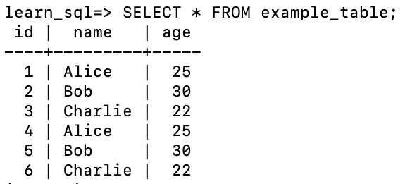
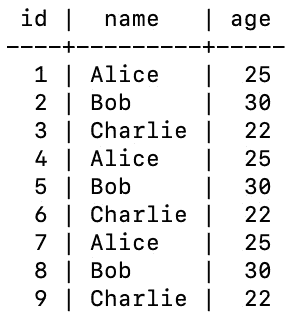
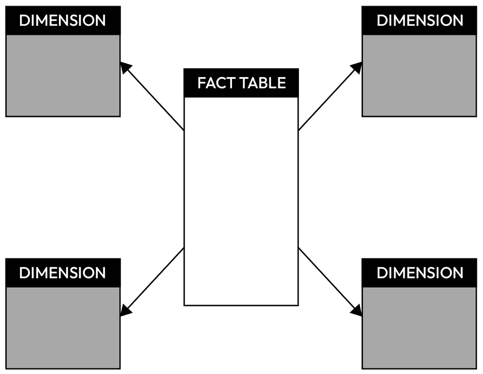
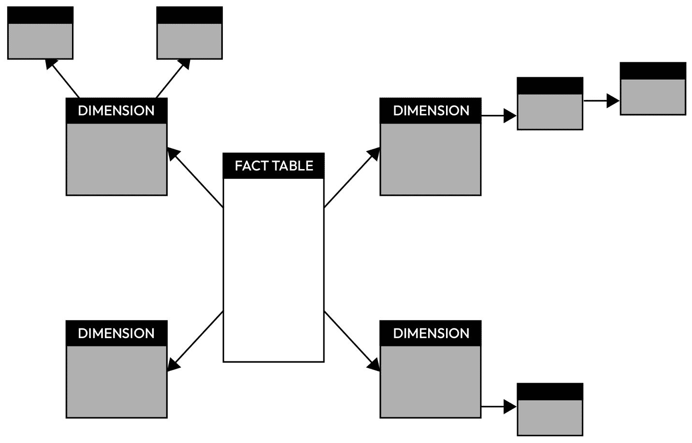
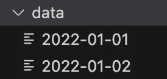
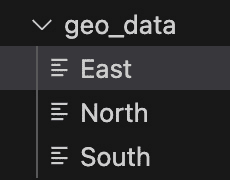
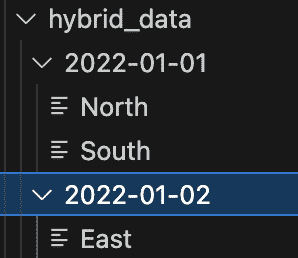

# 7

# 数据接收端

在现代数据处理的世界中，关于数据管理、存储和处理的关键决策将决定成功的结果。在本章中，我们将深入探讨支撑高效数据处理管道的三大重要支柱：选择正确的**数据接收端**、选择最优的文件类型，以及掌握分区策略。通过讨论这些关键要素及其在实际应用中的体现，本章将为你提供所需的洞察和策略，帮助你在复杂的数据处理技术领域内设计优化效率、可扩展性和性能的数据解决方案。

在本章中，我们将讨论以下主题：

+   为你的使用案例选择正确的数据接收端

+   为你的使用案例选择正确的文件类型

+   导航分区

+   设计一个在线零售数据平台

# 技术要求

本章中，我们需要安装以下库：

```py
pip install pymongo==4.8.0
pip install pyarrow
pip install confluent_kafka
pip install psycopg2-binary==2.9.9
```

和往常一样，你可以在本书的 GitHub 仓库中找到本章的所有代码：[`github.com/PacktPublishing/Python-Data-Cleaning-and-Preparation-Best-Practices/tree/main/chapter07`](https://github.com/PacktPublishing/Python-Data-Cleaning-and-Preparation-Best-Practices/tree/main/chapter07)。

每个部分后面都有一个类似命名规则的脚本，因此可以执行这些脚本或通过阅读本章进行跟进。

# 为你的使用案例选择正确的数据接收端

数据接收端指的是数据流向或存储的目标位置。术语“接收端”是用来比喻数据流入并被指定位置吸收的概念。数据接收端通常作为存储位置，数据可以在此永久或临时存储。这些存储可以是数据库、文件或其他数据结构的形式。

数据工程师和数据科学家通常根据其特定的任务和使用场景，使用多种数据接收端。让我们看看一些常见的数据接收端，并附带代码示例，同时考虑每种类型的优缺点。

## 关系型数据库

关系型数据库是一种**数据库管理系统**（**DBMS**），它将数据组织成具有行和列的表格，每行代表一条记录，每列代表一个字段。表格之间的关系通过键建立。主键唯一标识表格中的每一条记录，外键则在表格之间创建链接。

### 关系型数据库概述

以下是关系型数据库的关键组件的简要概述：

+   **表格**：数据被组织成表格，每个表格代表特定的实体或概念。例如，在一个图书馆的数据库中，可能会有关于书籍、作者和借阅者的表格。

+   **行和列**：每个表由行和列组成。行代表特定的记录（例如，一本书），每列代表该记录的特定属性或字段（例如，书名、作者和出版年份）。

+   **键**：键用于建立表之间的关系。主键唯一标识表中的每一条记录，而相关表中的外键则在它们之间创建连接。

+   **结构化查询语言** (**SQL**)：关系型数据库使用 SQL 进行数据查询和操作。SQL 允许用户检索、插入、更新和删除数据，同时定义和修改数据库的结构。

在数据领域，我们通常在以下场景中看到关系型数据库：

+   **结构化数据**：如果您的数据具有明确的结构，并且实体之间有清晰的关系，那么关系型数据库是一个合适的选择。

+   **数据完整性要求**：如果您的应用对于数据完整性有严格要求（例如，在金融系统或医疗应用中），关系型数据库提供机制来强制执行完整性约束。

+   **原子性、一致性、隔离性和持久性** **(ACID) 特性**：**原子性**确保事务是“全有或全无”的操作：要么所有更改都提交，要么都不提交。例如，在账户之间转账时，原子性保证两个账户的余额要么都更新，要么都不更新。**一致性**意味着事务将数据库从一个有效状态转移到另一个有效状态，同时遵守完整性约束。如果违反了唯一客户 ID 等规则，事务将回滚以保持一致性。**隔离性**确保事务独立执行，防止并发事务之间的干扰和未提交更改的可见性，避免了脏读等问题。最后，**持久性**保证一旦事务提交，更改就会永久保留，即使系统发生故障，也能确保更新（如在线应用中的联系人信息）的持久性。如果您的应用需要遵守 ACID 特性，关系型数据库专门设计来满足这些需求。

+   **复杂查询**：如果您的应用涉及复杂的查询和报告需求，关系型数据库凭借其 SQL 查询功能，非常适合此类场景。

市面上有许多不同的构建关系型数据库的选项，接下来我们将看到这些选项。

### 关系型数据库管理系统的不同选项

市面上有许多不同的**关系型数据库管理系统** (**RDBMSs**) 。我们在下表中总结了主要的几种：

| **数据库** | **描述** |
| --- | --- |
| MySQL | 一个以速度、可靠性著称的开源关系型数据库管理系统，广泛应用于网页开发 |
| PostgreSQL | 一个开源关系型数据库管理系统，具备高级功能、可扩展性，并支持复杂查询 |
| Oracle 数据库 | 一款商业 RDBMS，以其可扩展性、安全性以及全面的数据管理功能而著称 |
| Microsoft SQL Server | 微软推出的商业 RDBMS，集成了微软技术并支持商业智能 |
| SQLite | 一款轻量级、嵌入式、无服务器的 RDBMS，适用于数据库需求较低或中等的应用 |
| MariaDB | 一款从 MySQL 派生的开源 RDBMS，旨在兼容性同时引入新特性 |

表 7.1 – RDBMS 概述

现在，让我们看看如何快速设置本地关系型数据库、连接到它并创建一个新表的示例。

### 一个 PostgreSQL 数据库示例

首先，我们需要安装并设置 PostgreSQL。这根据**操作系统**（**OS**）有所不同，但逻辑保持一致。以下脚本自动化了在 macOS 或基于 Debian 的 Linux 系统上安装和设置 PostgreSQL 的过程：[`github.com/PacktPublishing/Python-Data-Cleaning-and-Preparation-Best-Practices/blob/main/chapter07/setup/setup_postgres.sh`](https://github.com/PacktPublishing/Python-Data-Cleaning-and-Preparation-Best-Practices/blob/main/chapter07/setup/setup_postgres.sh)。

首先，它使用 `uname` 命令检测操作系统：

```py
OS=$(uname)
```

如果检测到 macOS，它将使用 Homebrew 更新软件包列表，安装 PostgreSQL 并启动 PostgreSQL 服务。如果检测到基于 Debian 的 Linux 操作系统，它将使用 `apt-get` 更新软件包列表，安装 PostgreSQL 及其 `contrib` 包，并启动 PostgreSQL 服务。以下是安装 macOS 的代码：

```py
if [ "$OS" == "Darwin" ]; then
    echo "Detected macOS. Installing PostgreSQL via Homebrew..."
    brew update
    brew install postgresql
    brew services start postgresql
```

如果你的操作系统不被该脚本支持，则会显示以下错误消息：

```py
Unsupported OS. Please install PostgreSQL manually.
```

在这种情况下，你需要*手动安装 PostgreSQL 并启动服务*。完成后，你可以继续执行脚本的第二部分。然后，脚本切换到默认的 `postgres` 用户，以执行 SQL 命令，在该用户尚未存在时创建新数据库用户，创建一个由该用户拥有的新数据库，并授予该用户对该数据库的所有权限，如下所示：

```py
psql postgres << EOF
DO \$\$
BEGIN
    IF NOT EXISTS (
        SELECT FROM pg_catalog.pg_user
        WHERE usename = 'the_great_coder'
    ) THEN
        CREATE USER the_great_coder
        WITH PASSWORD 'the_great_coder_again';
    END IF;
END
\$\$;
EOF
psql postgres << EOF
CREATE DATABASE learn_sql2 OWNER the_great_coder;
EOF
psql postgres << EOF
-- Grant privileges to the user on the database
GRANT ALL PRIVILEGES ON DATABASE learn_sql2 TO the_great_coder;
EOF
```

要执行上述代码，请按照以下步骤操作：

1.  确保将仓库拉取到本地笔记本电脑。

1.  转到存放仓库的文件夹。

1.  在仓库文件夹位置打开终端。

1.  执行以下命令以导航到正确的文件夹：

    ```py
    cd chapter7
    setup_postgres.sh script, as shown here:

    ```

    maria.zevrou@FVFGR3ANQ05P chapter7 % cd setup

    maria.zevrou@FVFGR3ANQ05P set up % ls

    setup_postgres.sh

    ```py

    ```

1.  通过运行以下命令使脚本可执行：

    ```py
    chmod +x setup_postgres.sh
    ```

1.  最后，使用以下命令运行实际的脚本：

    ```py
    ./setup_postgres.sh
    ```

执行脚本后，你应该看到一条确认消息，表示 PostgreSQL 设置（包括数据库和用户创建）已完成：

```py
PostgreSQL setup completed. Database and user created.
```

现在，我们准备执行脚本，以便将传入的数据写入我们在前一步中创建的数据库。你可以在这里找到这个脚本：[`github.com/PacktPublishing/Python-Data-Cleaning-and-Preparation-Best-Practices/blob/main/chapter07/1.postgressql.py`](https://github.com/PacktPublishing/Python-Data-Cleaning-and-Preparation-Best-Practices/blob/main/chapter07/1.postgressql.py)。

该脚本连接到我们之前创建的 PostgreSQL 数据库并管理其中的表。让我们开始吧：

1.  我们首先导入必要的库：

    ```py
    import pandas as pd
    import psycopg2
    from psycopg2 import sql
    ```

1.  接着，我们需要定义几个函数，从 `table_exists` 开始。该函数检查指定的表是否已存在于数据库中：

    ```py
    def table_exists(cursor, table_name):
        cursor.execute(
            sql.SQL("SELECT EXISTS ( \
                    SELECT 1 FROM information_schema.tables \
                    WHERE table_name = %s)"),
            [table_name]
        )
        return cursor.fetchone()[0]
    ```

1.  我们需要的下一个函数是 `create_table` 函数，如果表在特定模式下不存在，它将创建一个新表。在我们的例子中，它将有三列：`id` 作为主键，`name` 和 `age`：

    ```py
    def create_table(cursor, table_name):
        cursor.execute(
            sql.SQL("""
                CREATE TABLE {} (
                    id SERIAL PRIMARY KEY,
                    name VARCHAR(255),
                    age INT
                )
            """).format(sql.Identifier(table_name))
        )
    ```

1.  接着，我们必须定义 `insert_data` 函数，该函数用于向表中插入数据行：

    ```py
    def insert_data(cursor, table_name, data):
        cursor.executemany(
            sql.SQL("INSERT INTO {} (name, age) \
                    VALUES (%s, %s)"
            ).format(sql.Identifier(table_name)),
            data
        )
    ```

1.  最后，我们必须使用以下函数来显示检索到的数据：

    ```py
    def print_table_data(cursor, table_name):
        cursor.execute(
            sql.SQL(
                "SELECT * FROM {}"
            ).format(sql.Identifier(table_name))
        )
        rows = cursor.fetchall()
        for row in rows:
            print(row)
    ```

    此时，脚本将创建一个包含示例数据（名称和年龄）的模拟 DataFrame：

    ```py
    data = {
        'name': ['Alice', 'Bob', 'Charlie'],
        'age': [25, 30, 22]
    }
    df = pd.DataFrame(data)
    ```

    它使用指定的连接参数（数据库名称、用户名、密码、主机和端口）建立与 PostgreSQL 数据库的连接。这些正是我们在之前的步骤中设置数据库时使用的详细信息，因此你这边无需做任何更改：

    ```py
    db_params = {
        'dbname': 'learn_sql',
        'user': 'the_great_coder',
        'password': 'the_great_coder_again',
        'host': 'localhost',
        'port': '5432'
    }
    conn = psycopg2.connect(**db_params)
    cursor = conn.cursor()
    ```

1.  最后，它会检查名为 `example_table` 的表是否存在，如有必要会创建它，然后将模拟数据插入到表中。在提交更改到数据库后，脚本从表中获取数据并打印，以确认成功插入，最后关闭数据库连接：

    ```py
    table_name = 'example_table'
    if not table_exists(cursor, table_name):
        create_table(cursor, table_name)
    insert_data(cursor, table_name, df.values.tolist())
    conn.commit()
    print_table_data(cursor, table_name)
    cursor.close()
    conn.close()
    ```

要执行前面的脚本，只需在 `chapter7` 文件夹中执行以下命令：

```py
python 1.postgressql.py
```

重要说明

记得始终关闭连接，因为这有助于避免性能问题，并确保在需要时能够建立新连接。它使数据库能够释放与连接相关的资源，并确保任何未提交的事务得到适当处理。关闭连接将其返回到连接池，使其可以被应用程序的其他部分重用。

要查看在数据库中创建的表，可以打开终端中的 PSQL 进程，并通过执行以下命令连接到 `learn_sql` 数据库：

```py
psql -h localhost -U the_great_coder -d learn_sql
```

然后，运行以下命令以列出所有可用的表：

```py
\dt
```

你应该会看到类似如下内容：


图 7.1 – 列出数据库中的表

现在你还可以通过执行以下 SQL 命令与表进行交互：



图 7.2 – 显示表中的所有行

如果你在不先删除现有表的情况下重新运行相同的 Python 脚本，你不会看到创建一个新表；相反，新的行会被添加到相同的表中：



图 7.3 – 在脚本重新运行后显示表中的所有行

在了解如何设置关系型数据库并通过写入新数据将其用作存储后，我们深入探讨关系型数据库的优缺点。

### 关系型数据库的优缺点

在这一部分，我们将总结使用关系型数据库管理系统（RDBMS）的优缺点。

优点如下：

+   RDBMS 系统具有 ACID 属性，提供了一个强大的框架来保证可靠和安全的事务

+   RDBMS 技术已经存在了几十年，产生了成熟且完善的系统，拥有丰富的文档和社区支持

然而，它们也有各种缺点：

+   RDBMS 的严格模式在处理不断变化或动态数据结构时可能成为一种限制，因为它们需要模式修改。新数据可能需要进行模式更改。

+   RDBMS 主要设计用于结构化数据，可能不适合处理非结构化或半结构化数据。

如果你在想关系型数据库中的数据是以什么文件类型存储的，那么接下来的子部分会让你觉得很有趣。

### 关系型数据库文件类型

在关系型数据库中，存储数据的文件类型通常是*抽象*的，用户和开发人员不常直接与底层文件交互。关系型数据库通过其内部机制管理数据存储和检索，这些机制通常涉及*专有的* *文件格式*。

在关系型数据库中，存储和组织数据的过程由数据库管理系统（DBMS）管理，用户使用 SQL 或其他查询语言与数据进行交互。DBMS 将物理存储细节从用户中抽象出来，提供一个逻辑层，允许数据操作和检索，而无需直接关注底层文件格式。

让我们讨论一下关系型数据库中文件类型的关键点：

+   关系型数据库供应商通常使用专有的文件格式来存储数据。每个数据库管理系统可能有*它自己的内部结构和机制来* *管理数据*。

+   关系型数据库通常将数据组织成*表空间*，这是逻辑存储容器。这些表空间由存储数据的页或块组成。页的组织和结构由特定的数据库管理系统（DBMS）决定。

+   关系型数据库优先考虑 ACID 属性，以确保数据完整性和可靠性。内部文件格式被设计用来支持这些事务性保证。

+   关系数据库使用各种索引和优化技术来提升查询性能。包括 B 树或其他索引结构在内的内部文件结构被优化以实现高效的数据检索。

+   用户使用 SQL 命令与关系数据库进行交互。

虽然用户通常不会直接与底层文件格式交互，但理解表空间、页面及数据库管理系统（DBMS）如何管理数据存储的概念，对于数据库管理员和开发人员在优化性能或排查问题时是非常有用的。

从关系数据库管理系统（RDBMS）迁移到**不仅仅是 SQL**（**NoSQL**）数据库涉及数据建模、模式设计和查询方法的转变。我们将在接下来的部分中探讨这些差异。

## NoSQL 数据库

NoSQL 数据库，也称为**不仅仅是 SQL**或**非 SQL**数据库，是一类提供灵活和可扩展的数据存储与处理方法的数据库系统。与传统的关系数据库不同，后者强制使用具有预定义表格、列和关系的结构化模式，NoSQL 数据库旨在处理多种数据模型，适应不同的数据结构和组织方式，并提供更加动态和灵活的数据建模方法。

### NoSQL 数据库概述

下面是 NoSQL 数据库关键组件的快速概述：

+   NoSQL 数据库通常采用无模式或灵活模式的方法，允许数据在没有预定义模式的情况下进行存储。这种灵活性在数据结构不断变化或无法预先确定的情况下尤其有用。

+   NoSQL 数据库有不同类型，每种类型都有自己的数据模型，如面向文档的（如 MongoDB）、键值存储（如 Redis）、列族存储（如 Apache Cassandra）和图数据库（如 Neo4j）。数据模型因应不同类型的数据和使用场景而有所不同。面向文档的数据模型将数据存储为 JSON 文档，允许每个文档具有不同的结构，适用于半结构化或非结构化数据。键值数据模型将数据存储为键值对，其中值可以是简单类型或复杂结构，提供快速的数据检索，但查询能力有限。列族数据模型将数据按列而非行组织，使得存储和检索大规模数据集更加高效。最后，图数据模型将数据表示为节点和边，非常适合关注关系的应用，如社交网络和网络分析。

+   NoSQL 数据库通常设计为横向扩展，这意味着它们能够高效地将数据分布到多个节点。

+   NoSQL 数据库通常遵循 **一致性、可用性和分区容忍性**（**CAP**）定理，该定理表明分布式系统最多只能提供三项保证中的两项。NoSQL 数据库可能会优先考虑可用性和分区容忍性，而不是严格的一致性。

在数据领域，我们通常会发现 NoSQL 数据库作为以下情况下的“数据存储”：

+   当我们处理的数据模型可能经常变化或事先定义不明确时。

+   当一个应用程序预见到或经历快速增长时，在这种情况下，水平可扩展性至关重要。

+   当数据无法放入具有固定关系的表中时，这时需要一种更灵活的存储模型。

+   当快速开发和迭代至关重要时，在这种情况下，我们需要随时修改数据模型。

+   当某一特定类型的 NoSQL 数据库的具体特性和功能与应用程序的需求相符时（例如，面向内容的应用程序使用面向文档的数据库，缓存使用键值存储，关系数据使用图数据库）。

让我们看一个如何连接到 NoSQL 数据库并写入新表的示例。

### 一个 MongoDB 数据库的示例

在深入代码之前，我们先花些时间来解释 MongoDB 以及与之相关的一些重要概念：

+   **文档**：这是 MongoDB 中的数据基本单元，以 **二进制 JSON**（**BSON**）对象的形式表示。文档类似于关系数据库中的行，但可以具有不同的结构。文档由字段（键值对）组成。每个字段可以包含不同的数据类型，例如字符串、数字、数组或嵌套文档。

+   **集合**：MongoDB 文档的集合，类似于关系数据库中的表。集合包含文档，并作为组织数据的主要方法。集合不需要预定义的架构，这使得同一集合中的文档可以具有不同的结构。

+   **数据库**：集合的容器。MongoDB 数据库包含集合，并作为数据组织的最高层级。每个数据库与其他数据库隔离，这意味着一个数据库中的操作不会影响其他数据库。

现在我们对这些概念有了更清晰的理解，让我们来看看代码。要运行这个示例，请按照操作系统的文档在本地设置 MongoDB。对于 Mac 的安装说明，请访问这里：[`www.mongodb.com/docs/manual/tutorial/install-mongodb-on-os-x/`](https://www.mongodb.com/docs/manual/tutorial/install-mongodb-on-os-x/)。以下代码示例展示了如何创建数据库并使用 `pymongo` 在 MongoDB 中写入数据。请注意，`pymongo` 是 MongoDB 的官方 Python 驱动程序，提供了一个 Python 接口来连接 MongoDB 数据库，执行查询，并通过 Python 脚本操作数据。

开始吧：

1.  安装完 MongoDB 后，打开你的终端并启动服务。这里提供的命令适用于 Mac；请根据你的操作系统，参考文档中的命令：

    ```py
    brew services start mongodb-community@7.0
    ```

1.  通过执行以下命令验证服务是否正在运行：

    ```py
    brew services list
    mongodb-community@7.0 started maria.zervou ~/Library/LaunchAgents/h
    ```

    安装完成后，我们来设置一个 MongoDB 数据库。

1.  在你的终端中，输入以下命令进入 MongoDB 编辑器：

    ```py
    no_sql_db:

    ```

    best_collection_ever:

    ```py
    db.createCollection("best_collection_ever")
    ```

    你应该看到类似以下的响应：

    ```py
    { ok: 1 }
    ```

    ```py

    ```

到此为止，我们已经准备好切换到 Python，并开始向这个集合中添加数据。你可以在这里找到代码：[`github.com/PacktPublishing/Python-Data-Cleaning-and-Preparation-Best-Practices/blob/main/chapter07/2.pymongo.py`](https://github.com/PacktPublishing/Python-Data-Cleaning-and-Preparation-Best-Practices/blob/main/chapter07/2.pymongo.py)。请按照以下步骤操作：

1.  首先，我们导入所需的库：

    ```py
    from pymongo import MongoClient
    ```

1.  每次连接到 NoSQL 数据库时，我们需要提供连接详情。更新 `mongo_params` 字典中的所有参数值，字典包含了 MongoDB 服务器主机、端口、用户名、密码和认证源：

    ```py
    mongo_params = {
        'host': 'localhost',
        'port': 27017,
        'username': 'your_mongo_username',
        'password': 'your_mongo_password',
        'authSource': 'your_auth_database'
    }
    ```

1.  让我们来看一下在本例中用于将文档插入 MongoDB 数据库的不同函数。第一个函数在创建新集合之前，会检查集合是否存在于数据库中：

    ```py
    def collection_exists(db, collection_name):
        return collection_name in db.list_collection_names()
    ```

1.  以下函数将数据库和集合名称作为参数，并创建一个我们传递的名称的集合（在我们的例子中，我们提供了`collection_name`作为名称）：

    ```py
    def create_collection(db, collection_name):
        db.create_collection(collection_name)
    ```

1.  最后，我们将使用之前创建的集合，它现在只是一个占位符，并向其中插入一些数据：

    ```py
    def insert_data(collection, data):
        collection.insert_many(data)
    ```

1.  让我们创建一些要插入到集合中的数据：

    ```py
    documents = [
        {'name': 'Alice', 'age': 25},
        {'name': 'Bob', 'age': 30},
        {'name': 'Charlie', 'age': 22}
    ]
    ```

1.  让我们指定连接所需的参数并创建连接：

    ```py
    db_name = ' no_sql_db'
    collection_name = 'best_collection_ever'
    client = MongoClient(**mongo_params)
    db = client[db_name]
    ```

1.  现在，让我们检查是否存在具有提供名称的集合。如果集合存在，则使用现有集合；如果不存在，则创建一个新的集合并使用提供的名称：

    ```py
    if not collection_exists(db, collection_name):
        create_collection(db, collection_name)
    ```

1.  然后，获取集合并插入提供的数据：

    ```py
    collection = db[collection_name]
    insert_data(collection, documents)
    ```

1.  最后，关闭 MongoDB 连接：

    ```py
    client.close()
    ```

执行此脚本后，你应该能够看到记录被添加到集合中：

```py
{'_id': ObjectId('66d833ec27bc08e40e0537b4'), 'name': 'Alice', 'age': 25}
{'_id': ObjectId('66d833ec27bc08e40e0537b5'), 'name': 'Bob', 'age': 30}
{'_id': ObjectId('66d833ec27bc08e40e0537b6'), 'name': 'Charlie', 'age': 22}
```

本脚本演示了如何与 MongoDB 数据库和集合进行交互。与关系型数据库不同，MongoDB 不需要*预先创建表或模式*。相反，你直接与数据库和集合进行操作。作为练习，为了更好地理解这种灵活的数据模型，尝试将不同结构的数据插入集合中。这与关系型数据库不同，后者是向*具有固定模式的表*中插入行。你可以在这里找到一个示例：[`github.com/PacktPublishing/Python-Data-Cleaning-and-Preparation-Best-Practices/blob/main/chapter07/3.pymongo_expand.py`](https://github.com/PacktPublishing/Python-Data-Cleaning-and-Preparation-Best-Practices/blob/main/chapter07/3.pymongo_expand.py)。

最后，脚本使用`find`方法查询并从集合中检索文档。与 SQL 查询相比，MongoDB 的查询更加灵活，特别是在处理嵌套数据时。

不要删除 MongoDB 数据库

请不要清理我们创建的 Mongo 资源，因为我们将在流式接收示例中使用它们。我们将在本章结束时清理所有资源。

在接下来的部分，我们将讨论 NoSQL 数据库所提供的优缺点。

### NoSQL 数据库的优缺点

让我们总结一下使用 NoSQL 系统的优缺点。

NoSQL 数据库的优点如下：

+   **可扩展性**：NoSQL 数据库设计时考虑了水平扩展性，可以通过将数据分布到多个服务器来处理大量数据。这使得它们特别适用于大数据应用和云环境。

+   **灵活性**：与需要固定模式的 SQL 数据库不同，NoSQL 数据库提供灵活的模式。这使得结构化、半结构化和非结构化数据可以存储，从而更容易适应不断变化的数据模型，而无需进行大规模的重构。

+   **性能**：NoSQL 数据库在处理某些类型的查询时，尤其是处理大数据集时，可能提供更优的性能。它们通常针对高速数据检索进行了优化，并能处理每秒大量的事务。

+   **成本效益**：许多 NoSQL 数据库是开源的，并且可以使用普通硬件进行扩展，这相比于通常需要昂贵硬件来扩展 SQL 数据库的成本要低。

+   **开发者灵活性**：模式和数据模型的灵活性使得开发者可以快速迭代，适应新的需求，而无需进行大量的数据库管理。

然而，它们也有一些缺点：

+   **缺乏标准化**：NoSQL 数据库没有像 SQL 那样的标准化查询语言。这可能导致学习曲线较陡，并且使得在不同 NoSQL 系统之间切换变得具有挑战性。

+   **有限的复杂查询支持**：NoSQL 数据库通常缺乏 SQL 数据库的高级查询功能，如连接和复杂事务，这可能限制它们在需要复杂数据关系的应用中的使用。

+   **数据一致性**：许多 NoSQL 数据库优先考虑可用性和分区容忍性，而不是一致性（根据 CAP 定理）。这可能导致最终一致性模型，这对于需要严格数据完整性的应用可能不适用。

+   **成熟度和社区支持**：与 SQL 数据库相比，NoSQL 数据库相对较新，这意味着它们可能拥有不那么成熟的生态系统和较小的社区。这可能使得寻找支持和资源变得更加困难。

+   **复杂的维护**：NoSQL 数据库的分布式特性可能导致复杂的维护任务，如数据分布和负载均衡，这些任务需要专业的知识。

现在，让我们讨论在使用 NoSQL 数据库时可能遇到的文件格式。

### NoSQL 数据库文件类型

最常见的文件格式是 JSON 和 BSON。JSON 是一种轻量级的、易于人类阅读的数据交换格式，采用键值对结构，并支持嵌套数据结构。由于其简洁性和易于解析，JSON 被广泛应用于基于 Web 的数据交换。JSON 是语言无关的，适用于各种编程语言。JSON 的灵活性和无模式特性与许多 NoSQL 数据库的灵活模式方法相契合，允许轻松处理不断变化的数据结构。NoSQL 数据库通常处理半结构化或非结构化数据，JSON 的层级结构能够很好地适应这种数据。以下是一个 JSON 数据文件的示例：

```py
{
    "person": {
        "name": "John Doe",
        "age": 30,
        "address": {
            "city": "New York",
            "country": "USA"
        },
        "email": ["john.doe@email.com", "john@example.com"]
    }
}
```

BSON 是一种二进制编码的序列化格式，用于类似 JSON 的文档，旨在提高存储和遍历的效率。它增加了 JSON 中没有的数据类型，如 `date` 和 `binary`。BSON 文件在存储前会被编码，在显示前会被解码。BSON 的二进制格式更适合存储和序列化，因此在需要紧凑表示数据的场景中非常合适。BSON 是 MongoDB 中使用的主要数据格式。让我们来看一下之前展示的文件的 BSON 表示：

```py
\x16\x00\x00\x00
{
    "person": {
        "name": "John Doe",
        "age": 30,
        "address": {
            "city": "New York",
            "country": "USA"
        },
        "email": ["john.doe@email.com", "john@example.com"]
    }
}\x00
```

在 NoSQL 数据库中，选择 JSON 还是 BSON 通常取决于数据库的具体需求和使用场景。虽然 JSON 在许多场景下更易于人类阅读和操作，但 BSON 的二进制效率在某些情况下，特别是在存储和序列化效率至关重要时，具有优势。

在接下来的部分，我们将讨论数据仓库，它们解决了哪些挑战，以及在使用时应该考虑实施的应用场景。

## 数据仓库

当数据的体积和复杂性以及对高级分析的需求超出了现有关系型或 NoSQL 数据库的能力时，转向数据仓库变得非常重要。如果您的关系型数据库在处理大量数据、复杂查询或在分析处理期间遇到性能问题，数据仓库可以为此类工作负载提供优化的存储和查询性能。同样，NoSQL 数据库虽然在处理非结构化或半结构化数据以及横向扩展方面表现优异，但可能缺乏深度分析和报告所需的复杂查询能力和性能。数据仓库旨在整合来自多个来源的数据，包括关系型和 NoSQL 数据库，促进全面分析和报告。它们为历史数据分析、复杂查询和数据治理提供强有力的支持，使其成为在需要提升数据整合、分析和报告能力时的理想解决方案，超越了传统数据库的能力。

### 数据仓库概览

数据仓库是一种专门的数据库系统，旨在高效地存储、组织和检索*大量数据*，这些数据用于商业智能和分析。与优化用于快速数据更新和单个记录检索的事务性数据库不同，数据仓库的结构是为了支持复杂的查询、聚合和对历史及当前数据的报告。

这里是数据仓库关键组件的快速概述：

+   各种数据源为数据仓库提供数据，包括事务性数据库、外部文件、日志等。

+   **提取、转换和加载**（**ETL**）过程用于从源系统收集数据，将其转换为一致的格式，并将其加载到数据仓库中。

+   数据仓库采用优化的存储方法，例如列式存储，以高效地存储大量数据。

+   索引和预聚合表用于优化查询性能。在数据仓库中，索引在优化查询性能方面起着至关重要的作用。索引是一种数据结构，通过创建数据的独立、有序子集来提高从表中检索数据的速度和效率。索引通常在一个或多个列上创建，以便加速查询。没有索引时，数据库必须扫描整个表才能定位相关行。索引帮助数据库快速找到符合查询条件的行。常见的索引候选列包括`WHERE`子句、`JOIN`条件和`ORDER BY`子句中使用的列。然而，过度索引可能导致收益递减并增加维护负担。虽然索引提高了查询性能，但它们也消耗额外的存储空间，并且由于需要维护索引，可能会减慢写操作的速度。

+   诸如并行处理和索引等技术被用来提高分析查询的速度。

+   与商业智能工具的集成允许用户创建报告和仪表板，并执行数据分析。

+   数据通过多维模型进行组织，通常以星型或雪花型模式的形式出现，以支持分析和报告。

让我们扩展一下维度建模。它是一种在数据仓库中用于结构化数据的设计技术，使得数据能够支持高效的分析查询和报告。与传统的关系模型不同，维度模型经过优化，专注于查询性能和易用性。在接下来的部分中，我们将介绍维度模型中的主要模式类型。

### 维度模型中的模式类型

维度建模主要涉及两种模式：星型模式和雪花模式。**星型模式**是最简单的维度建模形式，其中一个中心事实表直接连接到多个维度表，形成类似星星的结构。这种模式直观易懂，便于导航，非常适合简单的查询和报告。每个星型模式中的维度表包含一个主键，与事实表中的外键相关联，为事实表中的定量数据提供描述性上下文。例如，销售星型模式可能包括一个中心销售事实表，外键链接到产品、客户、时间和商店等维度表，从而通过减少连接的数量简化复杂查询：



图 7.4 – 星型模式

另一方面，**雪花模式**是星型模式的一个更规范化版本，在这种模式下，维度表会进一步拆分成相关的子表，形成类似雪花的结构。这种结构减少了数据冗余，可以节省存储空间，尽管由于需要额外的连接，它在查询设计上引入了更多的复杂性。例如，雪花模式中的产品维度表可能被规范化为独立的产品类别和品牌表，从而形成多层次结构，确保更高的数据完整性并减少更新异常。虽然雪花模式在查询时可能稍显复杂，但在数据维护和可扩展性方面提供了优势，尤其是在数据一致性和存储优化至关重要的环境中：



图 7.5 – 雪花模式

星型模式通常用于较简单的层次结构，并且当查询性能优先时，而雪花模式则可能在更高效地使用存储和实现更高程度的规范化时被选用。

在理解维度建模中的模式类型之后，探索在各种组织环境中实施和利用数据仓库的多种选择至关重要。

### 数据仓库解决方案

市场上有许多不同的数据仓库选择。我们在下表中总结了主要的选项：

| **数据仓库** | **描述** |
| --- | --- |
| Databricks SQL | 一种基于云的、无服务器的数据仓库，将仓库功能带入数据湖。它以其可扩展性、性能和并行处理能力而闻名，并且具备内建的机器学习功能。 |
| Amazon Redshift | 一项完全托管的、可扩展的云数据仓库服务，优化用于高性能分析。 |
| Snowflake | 一种基于云的数据仓库，具有多集群共享架构，支持多种工作负载。 |
| Google BigQuery | 一种无服务器、高度可扩展的数据仓库，具有内置的机器学习功能。 |
| **数据仓库** | **描述** |
| Teradata | 一种支持扩展性、性能和并行处理的本地或基于云的数据仓库。 |
| Microsoft Azure Synapse Analytics | 一种基于云的分析服务，提供按需和预配资源。 |

表 7.2 – 数据仓库解决方案

在下一节中，我们将查看创建 BigQuery 表的示例，以说明数据仓库的实际应用。

### 数据仓库示例

让我们来学习如何在 BigQuery 中创建一个新表。Google Cloud 为包括 Python 在内的多种编程语言提供了与 BigQuery 交互的客户端库。为了准备好并运行以下示例，请访问 BigQuery 文档：[`cloud.google.com/python/docs/reference/bigquery/latest`](https://cloud.google.com/python/docs/reference/bigquery/latest)。让我们深入研究这个示例。我们将按照本章至今介绍的相同模式进行操作。让我们开始吧：

注意

要运行此示例，您需要拥有一个**Google Cloud Platform**（**GCP**）账户，并准备好一个 Google Storage 存储桶。

1.  导入所需的库：

    ```py
    from google.cloud import bigquery
    from google.cloud.bigquery import SchemaField
    ```

1.  首先，我们将设置项目 ID。将 `your_project_id` 替换为你的实际值：

    ```py
    client = bigquery.Client(project='your_project_id')
    ```

1.  定义数据集和表名称，并更新以下字段：

    ```py
    dataset_name = 'your_dataset'
    table_name = 'your_table'
    ```

1.  检查数据集和表是否存在：

    ```py
    dataset_ref = client.dataset(dataset_name)
    table_ref = dataset_ref.table(table_name)
    table_exists = client.get_table(
        table_ref, retry=3, timeout=30, max_results=None
    ) is not None
    ```

1.  定义表的模式（如果你希望更新数据，可以替换为你的模式）。在本例中，我们将创建一个包含两列（`column1` 和 `column2`）的表。第一列将是 `STRING` 类型，第二列将是 `INTEGER` 类型。第一列不能包含缺失值，而第二列可以：

    ```py
    schema = [
        SchemaField('column1', 'STRING', mode='REQUIRED'),
        SchemaField('column2', 'INTEGER', mode='NULLABLE'),
        # Add more fields as needed
    ]
    ```

1.  让我们检查是否存在同名的表。如果表不存在，则使用提供的名称创建它：

    ```py
    if not table_exists:
        table = bigquery.Table(table_ref, schema=schema)
        client.create_table(table)
    ```

1.  让我们创建一些将被插入到表中的模拟数据：

    ```py
    rows_to_insert = [
        ('value1', 1),
        ('value2', 2),
        ('value3', 3)
    ]
    ```

1.  构建要插入的数据：

    ```py
    data_to_insert = [dict(zip([field.name for field in schema], row)) for row in rows_to_insert]
    ```

1.  插入数据并检查是否有错误。如果一切按预期工作，关闭连接：

    ```py
    errors = client.insert_rows(table, data_to_insert)
    ```

    如果发生任何插入错误，打印出错误信息：

    ```py
    print(f"Errors occurred during data insertion: {errors}")
    ```

1.  关闭 BigQuery 客户端：

    ```py
    client.close()
    ```

容器和表有什么区别？

容器（在不同系统中有不同的名称，如数据库、数据集或模式）是一种逻辑分组机制，用于组织和管理数据对象，例如表、视图和相关的元数据。容器提供了一种基于特定需求（如访问控制、数据治理或数据域的逻辑分离）分区和结构化数据的方式。另一方面，表是一种基本的数据结构，用于存储实际的数据记录，按行和列组织。表定义了模式（列名称和数据类型），并存储数据值。

现在，我们从了解数据仓库环境的基本组件转向讨论数据仓库在高效管理和分析大量数据时所提供的优缺点。

### 数据仓库的优缺点

让我们总结一下使用数据仓库的优缺点。

优点如下：

+   针对分析查询和大规模数据处理进行了优化

+   可以处理海量数据

+   与其他数据工具和服务的集成

下面是它们的缺点：

+   相比传统数据库，存储和查询的成本更高

+   可能在实时数据处理方面存在限制

### 数据仓库中的文件类型

就文件格式而言，可以准确地说，许多现代数据仓库使用**专有**的内部存储格式来写入数据。这些专有格式通常是列式存储格式，针对高效查询和分析进行了优化。

让我们来看看这些专有格式可能带来的差异：

+   数据仓库通常使用如 Parquet、ORC 或 Avro 等列式存储格式。虽然这些格式是开放且广泛采用的，但每个数据仓库可能有其内部优化或扩展。

+   这些列式存储格式的实际实现可能具有供应商特定的优化或功能。例如，某个特定数据仓库如何处理压缩、索引和元数据可能是特定于该供应商的。

+   用户通过标准接口与数据仓库进行交互，例如 SQL 查询。存储格式的选择通常不会影响用户，只要数据仓库支持常见的数据交换格式用于导入和导出。

因此，尽管内部存储机制可能有供应商特定的优化，但使用公认的、开放的且广泛采用的列式存储格式，确保了一定程度的互操作性和灵活性。用户通常使用标准 SQL 查询或数据交换格式（如 CSV、JSON 或 Avro）与数据仓库交互进行数据的导入/导出，这为这些系统的外部接口提供了一层标准化。

从传统数据仓库过渡到数据湖代表了一种战略转变，拥抱更灵活和可扩展的范式。在接下来的章节中，我们将深入探讨数据湖。

## 数据湖

从传统的数据仓库到数据湖的过渡，代表了组织处理和分析数据方式的转变。传统的数据仓库设计用于存储结构化数据，这些数据高度组织，并根据预定义的模式格式化，例如关系数据库中的表格和行列。结构化数据便于使用 SQL 进行查询和分析。然而，数据仓库在处理非结构化数据时遇到困难，非结构化数据没有预定义的格式或组织方式。非结构化数据的例子包括文本文件、电子邮件、图像、视频和社交媒体帖子。而数据湖则提供了一种更灵活、可扩展的解决方案，通过存储结构化和非结构化数据的原始格式，使组织能够摄取和存储大量数据，而无需立即进行结构化。这一过渡解决了数据仓库的局限性，提供了一种更具多样性和未来可扩展性的数据管理方法。

### 数据湖概述

数据湖是一个集中式存储库，允许组织存储大量原始和非结构化数据，且可以存储任何所需格式的数据。它们被设计用来处理多种数据类型，如结构化、半结构化和非结构化数据，并支持数据探索、分析和机器学习。数据湖解决了多个问题：它们使得不同数据源能够统一存储，打破了信息孤岛，并通过提供易于访问的所有类型数据支持高级分析。

请记住

可以将数据湖视为文件系统，就像在你的笔记本电脑上存储数据位置一样，不过规模要大得多。

### 数据湖解决方案

以下是数据空间中可用的数据湖解决方案的摘要：

| **数据湖** | **描述** |
| --- | --- |
| Amazon S3 | **亚马逊网络服务** (**AWS**) 提供的基于云的对象存储服务，通常作为数据湖的基础设施。 |
| Azure 数据湖存储 | 微软 Azure 提供的可扩展且安全的基于云的存储解决方案，旨在支持大数据分析和数据湖。 |
| **Hadoop 分布式文件** **系统** (**HDFS**) | 作为 Apache Hadoop 的存储层，HDFS 是一个分布式文件系统，Hadoop 是一个开源的大数据处理框架。 |
| Google Cloud Storage | Google Cloud 提供的对象存储服务，通常作为 GCP 中数据湖架构的一部分使用。 |

表 7.3 – 数据湖解决方案

从传统的数据仓库到数据湖的转变，代表了组织管理和分析数据方式的根本性变化。这一转变是由多个因素推动的，包括对更大灵活性、可扩展性以及处理多样化和非结构化数据类型的需求。下表突出显示了传统数据仓库和数据湖之间的主要区别：

|  | **数据仓库** | **数据湖** |
| --- | --- | --- |
| 数据种类和灵活性 | 传统的数据仓库设计用于处理结构化数据，对于处理多样化数据类型或非结构化数据的适应性较差。 | 数据湖的出现是为了应对数据量和数据种类的快速增长。它们为原始、非结构化和多样化的数据类型提供存储库，允许组织存储大量数据，而无需预定义的模式。 |
| 可扩展性 | 传统的数据仓库在处理海量数据时通常面临可扩展性挑战。扩展数据仓库可能会很昂贵，并且可能存在限制。 | 数据湖，尤其是基于云的解决方案，提供可扩展的存储和计算资源。它们可以有效地水平扩展，以应对日益增长的数据集和处理需求。 |
|  | **数据仓库** | **数据湖** |
| 成本效益 | 传统的数据仓库在扩展时可能成本高昂，并且其成本结构可能不适合存储大量原始或结构较差的数据。 | 基于云的数据湖通常采用按需付费模式，允许组织通过按使用的资源付费来更有效地管理成本。这对于存储大量原始数据特别有利。 |
| 写时模式与读时模式 | 遵循写时模式（schema-on-write），数据在加载到仓库之前被结构化和转换。 | 遵循读时模式（schema-on-read），允许存储原始、未经转换的数据。模式在数据分析时应用，提供了更多的数据探索灵活性。 |

表 7.4 – 数据仓库与数据湖

Lakehouse 架构的出现通过解决数据湖相关的关键挑战，并将传统上与数据仓库相关的特性引入数据湖环境，从而进一步完善了摆脱数据仓库的转变。以下是这一演变的关键方面概述：

+   Lakehouse 将 ACID 事务集成到数据湖中，提供了传统上与数据仓库相关的事务处理能力。这确保了数据的一致性和可靠性。

+   Lakehouse 支持模式演变，允许随时间对数据模式进行更改，而无需对现有数据进行完全转换。这提高了灵活性，并减少了模式更改对现有流程的影响。

+   Lakehouse 引入了管理数据质量的特性，包括模式强制执行和约束，确保存储在数据湖中的数据符合指定的标准。

+   Lakehouse 旨在通过结合数据湖和数据仓库的优势，提供一个统一的分析平台。它允许组织在一个集中式存储库中对结构化和半结构化数据进行分析。

+   Lakehouse 增强了元数据目录，提供了数据血缘、质量和转换的全面视图。这有助于更好的治理和对湖中数据的理解。

Lakehouse 概念通过数据和分析社区的讨论不断发展，多个公司为 Lakehouse 原则的发展和采用做出了贡献。

### 数据湖示例

让我们探索一个如何在 S3 上写入 Parquet 文件的示例，S3 是 AWS 的云存储。要设置一切，访问 AWS 文档：[`docs.aws.amazon.com/code-library/latest/ug/python_3_s3_code_examples.html`](https://docs.aws.amazon.com/code-library/latest/ug/python_3_s3_code_examples.html)。现在，按照以下步骤进行操作：

注意

要运行此示例，您需要拥有一个 AWS 账户并准备好 S3 存储桶。

1.  我们将开始导入所需的库：

    ```py
    import pandas as pd
    import pyarrow.parquet as pq
    import boto3
    from io import BytesIO
    ```

1.  现在，我们将创建一些模拟数据，以便将其写入 S3：

    ```py
    data = {'Name': ['Alice', 'Bob', 'Charlie'],
            'Age': [25, 30, 22],
            'City': ['New York', 'San Francisco', 'Los Angeles']}
    df = pd.DataFrame(data)
    ```

1.  接下来，我们必须将 DataFrame 转换为 Parquet 格式：

    ```py
    parquet_buffer = BytesIO()
    pq.write_table(pq.Table.from_pandas(df), parquet_buffer)
    ```

1.  更新您的认证密钥和我们将要写入数据的存储桶名称：

    ```py
    aws_access_key_id = 'YOUR_ACCESS_KEY_ID'
    aws_secret_access_key = 'YOUR_SECRET_ACCESS_KEY'
    bucket_name = 'your-s3-bucket'
    file_key = 'example_data.parquet'  # The key (path) of the file in S3
    ```

1.  使用前一步的连接信息连接到 S3 存储桶：

    ```py
    s3 = boto3.client('s3', aws_access_key_id=aws_access_key_id, aws_secret_access_key=aws_secret_access_key)
    ```

1.  将 Parquet 文件上传到 S3：

    ```py
    s3.put_object(Body=parquet_buffer.getvalue(), Bucket=bucket_name, Key=file_key)
    ```

如前所述，Lakehouse 具有自己的优缺点。

其优势如下：

+   Lakehouse 提供了一个统一的平台，结合了数据湖和数据仓库的优势。这使得组织能够在一个环境中同时利用数据湖的灵活性和数据仓库的事务能力。

+   Lakehouse 遵循 schema-on-read 方法，允许存储原始的、未转换的数据。

+   Lakehouse 支持多种数据类型，包括结构化、半结构化和非结构化数据。

+   Lakehouse 集成了 ACID 事务，提供了事务能力，确保数据的一致性和可靠性。这对于数据完整性至关重要的使用场景尤为重要。

+   许多 Lakehouse 解决方案提供时间旅行功能，允许用户在特定时间点查询数据。数据的版本控制提供了历史背景并支持审计要求。

+   Lakehouse 通常实现优化的存储格式（例如 Delta 和 Iceberg），这有助于提高存储效率和查询性能，特别是对于大规模分析工作负载。

其缺点如下：

+   用户和管理员可能需要适应一种新的数据处理方式，同时考虑 schema-on-read 和 schema-on-write 模式。这可能需要培训和教育。

+   根据实现和云服务提供商的不同，存储、处理和管理 Lakehouse 架构中数据的成本可能会有所不同。组织需要仔细管理成本，以确保效率。

正如我们所讨论的，Lakehouse 拥有一个惊人的优势——它可以让任何类型的数据从结构化到半结构化再到非结构化数据都可以被摄取和存储。这意味着在摄取过程中我们可以看到任何文件类型，从 CSV 文件到 Parquet 和 Avro 文件。而在写入部分，我们可以利用 Lakehouse 提供的灵活性，将数据存储为优化过的开放表格文件格式。开放表格格式是一种用于存储表格数据的文件格式，能够让数据在各种数据处理和分析工具之间轻松访问和互操作。

### 数据湖中的文件类型

在 Lakehouse 架构中，我们有三种突出格式：Delta、Apache Iceberg 和 Apache Hudi。这些格式提供了 ACID 事务、模式演变、增量数据处理以及读写优化等特性。以下是这些格式的简要概述：

+   Delta Lake 是一个开源存储层，旨在提高数据湖中数据处理的可靠性和性能。它非常适合在 S3 或 Azure 存储等基础设施上构建数据湖，并且对 ACID 事务和数据版本控制有很强的支持。

+   Apache Iceberg 是另一种开源表格格式，专为快速查询性能优化。当需要查询效率时，它是一个不错的选择，并且它对模式演变和版本控制有出色的支持。

+   Apache Hudi（Hadoop 更新、删除和增量处理）是另一种开源数据湖存储格式，它为实时数据处理和流处理特性提供了很好的支持。尽管它可能不像 Delta Lake 或 Apache Iceberg 那样广为人知，但在 Apache Spark 和 Hadoop 生态系统中，Hudi 正在逐渐获得关注。

一般来说，这些格式都是为了解决相同的挑战而构建的，这也是它们有许多共同特性的原因。因此，在选择最适合你工作负载的格式之前，有几个因素你需要考虑，以确保你走在正确的方向：

+   考虑每种技术与现有数据处理生态系统和工具的兼容性。

+   评估每种技术在数据社区中的社区支持、持续开发和采用程度。

+   评估每种技术在特定使用案例中的性能特征，尤其是在读写操作方面。

最终，Delta Lake、Apache Iceberg 和 Apache Hudi 之间的选择应该由你的数据湖或湖仓环境的具体需求和优先事项驱动。通过实验和基准测试每个解决方案，结合你的数据和工作负载，可以做出更明智的决策。

我们将要讨论的最后一种接收器技术是流数据接收器。

## 流数据接收器

从批处理和微批处理到流处理技术的过渡，标志着数据处理和分析的重大进步。批处理涉及在预定的时间间隔内收集和处理大量离散数据，这可能导致数据可用性和洞察力的延迟。微批处理通过在更频繁的时间间隔内处理较小的批次来改进这一点，减少了延迟，但仍未实现实时数据处理。而流处理技术则能够实现数据的实时摄取和处理，使组织能够在数据到达时立即进行分析并采取行动。这一向流处理技术的转变，解决了当今快速变化的商业环境中对实时分析和决策的日益增长的需求，为数据管理提供了更加动态和响应迅速的方法。

### 流数据接收端概述

流数据接收端是实时消费和存储流数据的组件或服务。它们作为流数据被摄取、处理并持久化以供进一步分析或检索的终端。以下是流数据接收端及其主要组件的概述：

+   **摄取组件**：它负责接收和接纳传入的数据流

+   **处理逻辑**：这是一种定制的逻辑，可能包括数据丰富、转化或聚合的组件

+   **存储组件**：它用于持久化流数据，便于未来分析或检索

+   **连接器**：它们的主要作用是与各种数据处理或存储系统进行交互

我们通常在以下领域实施流数据接收端：

+   在实时分析系统中，允许组织在事件发生时实时获取数据洞察。

+   在系统监控中，流数据接收端捕获和处理实时指标、日志或事件，从而实现对问题或异常的即时告警和响应。

+   在金融交易或电子商务中，流数据接收端可用于通过分析交易数据中的模式和异常实现实时欺诈检测。

+   在**物联网**（**IoT**）场景中，流数据接收端处理来自传感器和设备的持续数据流，支持实时监控和控制。

现在，让我们来看看可用于流数据接收端的可选项。

### 流数据接收端解决方案

许多云平台提供托管的流数据服务，这些服务充当数据接收端，如亚马逊 Kinesis、Azure Event Hubs 和 Google Cloud Dataflow，如下表所示：

| **流数据接收端** | **描述** |
| --- | --- |
| 亚马逊 Kinesis | AWS 中用于实时流处理的完全托管服务。它支持数据流、分析和存储。 |
| Azure Event Hub | Azure 中用于处理和分析流数据的基于云的实时分析服务。 |
| Google Cloud Dataflow | GCP 上的完全托管流处理和批处理服务。 |
| Apache Kafka | 一个分布式流平台，既可以作为流数据的源，也可以作为流数据的接收器。 |
| Apache Spark Streaming | 一个实时数据处理框架，是 Apache Spark 生态系统的一部分。 |
| Apache Flink | 一种流处理框架，支持事件时间处理和各种接收器连接器。 |

表 7.5 – 不同的流数据服务

在下一节中，我们将使用最流行的流数据接收器之一 Kafka，了解在流接收器中写入数据的过程。

### 流数据接收器示例

首先，让我们对 Apache Kafka 的主要组件有一个初步了解：

+   **代理**是构成 Kafka 集群的核心服务器。它们处理消息的存储和管理。每个代理都有一个唯一的 ID。代理负责在集群中复制数据，以确保容错能力。

+   **主题**是 Kafka 中用于组织和分类消息的主要抽象。它们就像数据库中的表或文件系统中的文件夹。消息被发布到特定的主题，并从这些主题中读取。主题可以进行分区，以实现可扩展性和并行处理。

+   **分区**是 Kafka 中的并行单元。每个主题被划分为一个或多个分区，这样可以实现数据的分布式存储和处理。分区中的消息是有序且不可变的。

+   **生产者**是将消息发布（写入）到 Kafka 主题的客户端应用程序。它们可以选择将消息发送到哪个分区，或使用分区策略。生产者负责序列化、压缩数据，并在各个分区之间进行负载均衡。

+   **消费者**是从 Kafka 主题中订阅（读取）消息的客户端应用程序。它们可以从主题的一个或多个分区读取消息，并跟踪它们已经消费的消息。

+   **ZooKeeper**用于管理和协调 Kafka 代理。它维护关于 Kafka 集群的元数据。Kafka 的新版本正逐步去除对 ZooKeeper 的依赖。

现在我们已经对 Kafka 的主要组件有了更好的理解，接下来我们将开始我们的逐步指南。为了完成这个示例，我们需要安装几个组件，请跟随我一起完成整个过程。为了简化这个过程，我们将使用 Docker，因为它可以让你通过 `docker-compose.yml` 文件定义整个环境，轻松地设置 Kafka 和 ZooKeeper，并进行最小的配置。这避免了手动在本地机器上安装和配置每个组件的需要。请按照以下步骤操作：

1.  按照公共文档下载 Docker：[`docs.docker.com/desktop/install/mac-install/`](https://docs.docker.com/desktop/install/mac-install/)。

1.  接下来，使用 Docker 设置 Kafka。为此，让我们查看位于 [`github.com/PacktPublishing/Python-Data-Cleaning-and-Preparation-Best-Practices/blob/main/chapter07/setup/docker-compose.yml`](https://github.com/PacktPublishing/Python-Data-Cleaning-and-Preparation-Best-Practices/blob/main/chapter07/setup/docker-compose.yml) 的 `docker-compose.yml` 文件。

1.  此 Docker Compose 配置使用 Docker Compose 文件格式的第 3 版设置了一个简单的 Kafka 和 Zookeeper 环境。该配置定义了两个服务：`zookeeper` 和 `kafka`。

1.  Zookeeper 使用 `confluentinc/cp-zookeeper:latest` 镜像。它将主机机器的端口 `2181` 映射到容器的端口 `2181`，用于客户端连接。`ZOOKEEPER_CLIENT_PORT` 环境变量设置为 `2181`，指定 Zookeeper 将侦听客户端请求的端口：

    ```py
    version: '3'
    services:
        zookeeper:
            image: confluentinc/cp-zookeeper:latest
            ports:
                - "2181:2181"
            environment:
                ZOOKEEPER_CLIENT_PORT: 2181
    ```

1.  Kafka 使用 `confluentinc/cp-kafka:latest` 镜像。它将主机机器的端口 `9092` 映射到容器的端口 `9092`，用于外部客户端连接：

    ```py
    kafka:
        image: confluentinc/cp-kafka:latest
        ports:
            - "9092:9092"
        environment:
            KAFKA_BROKER_ID: 1
            KAFKA_ZOOKEEPER_CONNECT: zookeeper:2181
            KAFKA_ADVERTISED_LISTENERS: PLAINTEXT://kafka:29092,PLAINTEXT_HOST://localhost:9092
            KAFKA_LISTENER_SECURITY_PROTOCOL_MAP: PLAINTEXT:PLAINTEXT,PLAINTEXT_HOST:PLAINTEXT
            KAFKA_INTER_BROKER_LISTENER_NAME: PLAINTEXT
            KAFKA_OFFSETS_TOPIC_REPLICATION_FACTOR: 1
    ```

    这里有一些配置 Kafka 的关键环境变量：

    +   `KAFKA_BROKER_ID` 设置为 `1`，在 Kafka 集群中唯一标识此代理。

    +   `KAFKA_ZOOKEEPER_CONNECT` 指向 Zookeeper 服务 (`zookeeper:2181`)，允许 Kafka 连接到 Zookeeper 管理集群元数据。

    +   `KAFKA_ADVERTISED_LISTENERS` 广告两个监听器：

        +   `PLAINTEXT://kafka:29092` 用于 Docker 内部网络通信。

        +   `PLAINTEXT_HOST://localhost:9092` 用于来自 Docker 网络外部的连接（例如，来自主机机器）

    +   `KAFKA_LISTENER_SECURITY_PROTOCOL_MAP` 确保两个公布的监听器使用 `PLAINTEXT` 协议，意味着没有加密或认证。

    +   `KAFKA_INTER_BROKER_LISTENER_NAME` 设置为 `PLAINTEXT`，指定 Kafka 代理之间将使用哪个监听器进行通信。

    +   `KAFKA_OFFSETS_TOPIC_REPLICATION_FACTOR` 设置为 `1`，表示偏移主题（用于存储消费者组偏移量）不会跨多个代理复制，这在单代理设置中很典型。

    这种设置非常适合本地开发或测试，您需要一个简单的单节点 Kafka 环境，而无需多节点生产级集群的复杂性。现在，我们准备运行容器。

1.  让我们运行 Docker 容器以启动 Kafka 和 Zookeeper。在您的终端中，输入以下命令：

    ```py
    docker-compose up –d
    ```

    这将获取 Kafka 和 Zookeeper 镜像，并将它们安装在您的环境中。您应该在终端上看到类似以下的输出：

    ```py
    [+] Running 3/3
    ✔ Network setup_default        Created         0.0s
    ✔ Container setup-kafka-1      Started         0.7s
    ✔ Container setup-zookeeper-1  Started         0.6s
    ```

#### Kafka 生产者

现在，让我们回到 Python IDE，看看如何将数据推送到 Kafka 生产者。为此，我们将从 MongoDB 读取数据，并将其传递到 Kafka。你可以在此处找到代码：[`github.com/PacktPublishing/Python-Data-Cleaning-and-Preparation-Best-Practices/blob/main/chapter07/4a.kafka_producer.py`](https://github.com/PacktPublishing/Python-Data-Cleaning-and-Preparation-Best-Practices/blob/main/chapter07/4a.kafka_producer.py)。让我们开始吧：

1.  首先，让我们导入所需的库：

    ```py
    from pymongo import MongoClient
    from confluent_kafka import Producer
    import json
    ```

1.  接下来，定义 MongoDB 连接：

    ```py
    mongo_client = MongoClient('mongodb://localhost:27017')
    db = mongo_client['no_sql_db']
    collection = db['best_collection_ever']
    ```

    在这里，`MongoClient('mongodb://localhost:27017')`连接到本地运行的 MongoDB 实例，默认端口为`27017`。这将创建一个客户端对象，允许与数据库进行交互。然后，`db = mongo_client['no_sql_db']`从 MongoDB 实例中选择`no_sql_db`数据库。最后，`collection = db['best_collection_ever']`从`no_sql_db`数据库中选择`best_collection_ever`集合。

1.  让我们进行 Kafka 生产者配置，创建一个带有指定配置的 Kafka 生产者对象。该生产者将用于将消息（在此案例中为 MongoDB 文档）发送到 Kafka 主题：

    ```py
    kafka_config = {
        'bootstrap.servers': 'localhost:9092'
    }
    producer = Producer(kafka_config)
    ```

1.  以下函数是一个回调函数，当 Kafka 生产者完成发送消息时将被调用。它检查消息传递过程中是否出现错误，并打印指示成功或失败的消息。此函数提供了有关消息是否成功发送到 Kafka 的反馈，对于调试和监控非常有用：

    ```py
    def delivery_report(err, msg):
        if err is not None:
            print(f'Message delivery failed: {err}')
        else:
            print(f'Message delivered to {msg.topic()} [{msg.partition()}]')
    ```

1.  从 MongoDB 读取并将文档通过`collection.find()`发送到 Kafka：

    ```py
        message = json.dumps(document, default=str)
        producer.produce('mongodb_topic',
                         alue=message.encode('utf-8'),
                         callback=delivery_report)
        producer.poll(0)
    ```

    前面的代码遍历了`best_collection_ever`集合中的每个文档。`find()`方法从集合中检索所有文档。然后，`message = json.dumps(document, default=str)`将每个 MongoDB 文档（一个 Python 字典）转换为 JSON 字符串。`default=str`参数通过将无法序列化为 JSON 的数据类型转换为字符串，处理这些数据类型。接下来，`producer.produce('mongodb_topic', value=message.encode('utf-8'), callback=delivery_report)`将 JSON 字符串作为消息发送到`mongodb_topic` Kafka 主题。消息采用 UTF-8 编码，`delivery_report`函数作为回调函数，用于处理投递确认。最后，`producer.poll(0)`确保 Kafka 生产者处理投递报告和其他事件。这是保持生产者活跃和响应所必需的。

1.  这确保生产者队列中的所有消息在脚本退出前都被发送到 Kafka。如果没有这一步骤，可能会有未发送的消息残留在队列中：

    ```py
    producer.flush()
    ```

运行此脚本后，你应该会看到以下打印语句：

```py
Message delivered to mongodb_topic [0]
Message delivered to mongodb_topic [0]
Message delivered to mongodb_topic [0]
Message delivered to mongodb_topic [0]
Message delivered to mongodb_topic [0]
Message delivered to mongodb_topic [0]
Message delivered to mongodb_topic [0]
Message delivered to mongodb_topic [0]
```

到目前为止，我们已经连接到 MongoDB 数据库，读取了集合中的文档，并将这些文档作为消息发送到 Kafka 主题。

#### Kafka 消费者

接下来，让我们运行消费者，以便它能够从 Kafka 生产者消费消息。完整代码可以在 [`github.com/PacktPublishing/Python-Data-Cleaning-and-Preparation-Best-Practices/blob/main/chapter07/4b.kafka_consumer.py`](https://github.com/PacktPublishing/Python-Data-Cleaning-and-Preparation-Best-Practices/blob/main/chapter07/4b.kafka_consumer.py) 找到：

1.  让我们先导入所需的库：

    ```py
    from confluent_kafka import Consumer, KafkaError
    import json
    import time
    ```

1.  接下来，我们必须创建 Kafka 消费者配置，指定要连接的 Kafka broker。这里，它连接到运行在本地主机上的 Kafka broker，端口为 `9092`。在这种情况下，`group.id` 设置消费者组 ID，这使得多个消费者能够协调并共享处理来自主题消息的工作。消息将在同一组的消费者之间分发。接下来，`auto.offset.reset` 定义了在 Kafka 中没有初始偏移量或当前偏移量不存在时的行为。将此设置为 `earliest` 表示消费者将从主题中最早的可用消息开始读取：

    ```py
    consumer_config = {
        'bootstrap.servers': 'localhost:9092',
        'group.id': 'mongodb_consumer_group',
        'auto.offset.reset': 'earliest'
    }
    ```

1.  现在，我们将实例化一个 Kafka 消费者，并使用之前指定的配置。这里，`consumer.subscribe(['mongodb_topic'])` 将消费者订阅到 `mongodb_topic` Kafka 主题。这意味着消费者将接收来自此主题的消息：

    ```py
    consumer = Consumer(consumer_config)
    consumer.subscribe(['mongodb_topic'])
    ```

1.  设置消费者运行的时长（以秒为单位）：

    ```py
    run_duration = 10 # For example, 10 seconds
    start_time = time.time()
    print("Starting consumer...")
    ```

1.  以下代码开始一个无限循环，直到显式中断。这个循环不断地轮询 Kafka 是否有新消息。这里，`if time.time() - start_time > run_duration` 检查消费者是否已经运行超过了指定的 `run_duration`。如果是，它会打印一条消息并退出循环，停止消费者：

    ```py
    while True:
        if time.time() - start_time > run_duration:
            print("Time limit reached, shutting down consumer.")
            break
        msg = consumer.poll(1.0)
        if msg is None:
            continue
        if msg.error():
            if msg.error().code() == KafkaError._PARTITION_EOF:
                print('Reached end of partition')
            else:
                print(f'Error: {msg.error()}')
        else:
            document = json.loads(msg.value().decode('utf-8'))
            print(f'Received document: {document}')
    consumer.close()
    print("Consumer closed.")
    ```

运行上述代码后，您应该会看到以下打印输出：

```py
Starting consumer...
Received document: {'_id': '66d833ec27bc08e40e0537b4', 'name': 'Alice', 'age': 25}
Received document: {'_id': '66d833ec27bc08e40e0537b5', 'name': 'Bob', 'age': 30}
Received document: {'_id': '66d833ec27bc08e40e0537b6', 'name': 'Charlie', 'age': 22}
Received document: {'_id': '66d835aa1798a2275cecaba8', 'name': 'Alice', 'age': 25, 'email': 'alice@example.com'}
Received document: {'_id': '66d835aa1798a2275cecaba9', 'name': 'Bob', 'age': 30, 'address': '123 Main St'}
Received document: {'_id': '66d835aa1798a2275cecabaa', 'name': 'Charlie', 'age': 22, 'hobbies': ['reading', 'gaming']}
Received document: {'_id': '66d835aa1798a2275cecabab', 'name': 'David', 'age': 40, 'email': 'david@example.com', 'address': '456 Elm St', 'active': True}
Received document: {'_id': '66d835aa1798a2275cecabac', 'name': 'Eve', 'age': 35, 'email': 'eve@example.com', 'phone': '555-1234'}
```

本示例的目标是向您展示如何从 MongoDB 等 NoSQL 数据库中持续读取数据，并通过 Kafka 实时流式传输到其他系统。Kafka 充当消息系统，允许数据生产者（例如 MongoDB）与数据消费者解耦。此示例还说明了如何分阶段处理数据，从而实现可扩展和灵活的数据管道。

从实际应用场景来看，假设我们正在构建一个拼车应用。实时处理事件，例如乘车请求、取消请求和司机状态，对于高效地将乘客与司机匹配至关重要。MongoDB 存储这些事件数据，如乘车请求和司机位置，而 Kafka 将事件流式传输到各种微服务。这些微服务随后处理这些事件以做出决策，例如将司机分配给乘客。通过使用 Kafka，系统变得高度响应、可扩展且具备弹性，因为它将事件生产者（例如乘车请求）与消费者（例如司机分配逻辑）解耦。

总结我们迄今为止所看到的内容，与涉及具有定义模式的结构化数据的关系型接收端不同，Kafka 可以作为数据摄取的缓冲区或中介，允许解耦和可扩展的数据管道。NoSQL 接收端通常处理非结构化或半结构化数据，类似于 Kafka 对消息格式的灵活性。Kafka 处理高吞吐量数据流的能力与 NoSQL 数据库的可扩展性和灵活性相辅相成。

为了清理到目前为止使用的所有资源，请执行清理脚本：[`github.com/PacktPublishing/Python-Data-Cleaning-and-Preparation-Best-Practices/blob/main/chapter07/setup/cleanup_script.sh`](https://github.com/PacktPublishing/Python-Data-Cleaning-and-Preparation-Best-Practices/blob/main/chapter07/setup/cleanup_script.sh)。

在下一部分，我们将深入探讨流式数据接收端所看到的文件格式。

### 流式数据接收端的文件类型

流式数据接收端主要处理消息或事件，而不是传统的文件存储。通过流式数据接收端传输的数据通常采用 JSON、Avro 或二进制等格式。这些格式在流式场景中被广泛用于数据的序列化和编码。它们高效并且支持模式演化。在本章的*NoSQL 数据库*部分，我们深入探讨了 JSON 文件格式。在这里，我们将讨论 Avro 和二进制格式。

Apache Avro 是一个在 Apache Hadoop 项目中开发的二进制序列化格式。它使用模式来定义数据结构，从而实现高效的序列化和反序列化。Avro 以其紧凑的二进制表示而著称，提供快速的序列化和高效的存储。在流式场景中，最小化数据大小对于高效的网络传输至关重要。Avro 的紧凑二进制格式减少了数据大小，提升了带宽利用率。Avro 还支持模式演化，允许数据结构随时间变化而不需要同时更新所有组件。Avro 的基于模式的方法使得不同系统和语言之间能够实现互操作性，适用于多样的生态系统。我们来看一个 Avro 文件示例：

```py
{
  "type": "record",
  "name": "SensorData",
  "fields": [
    {"name": "sensor_id", "type": "int"},
    {"name": "timestamp", "type": "long"},
    {"name": "value", "type": "float"},
    {"name": "status", "type": "string"}
  ]
}
```

二进制格式使用紧凑的二进制数据表示方式，从而实现高效的存储和传输。可以根据具体需求使用各种二进制协议，例如 Google 的**协议缓冲区**（**protobuf**）或 Apache Thrift。二进制格式通过最小化传输数据的大小，在流式场景中减少带宽使用。二进制序列化和反序列化通常比基于文本的格式更快，这在高吞吐量流式环境中至关重要。我们来看一个 protobuf 的二进制文件示例：

```py
syntax = "proto3";
message SensorData {
  int32 sensor_id = 1;
  int64 timestamp = 2;
  float value = 3;
  string status = 4;
}
```

在流式数据接收端，选择 JSON、Avro 还是二进制格式取决于流式使用场景的具体需求，包括互操作性、模式演化和数据大小等因素。

到目前为止，我们已经讨论了数据工程师和数据科学家使用的最常见数据存储系统，以及我们通常会遇到的不同文件类型。在接下来的章节中，我们将总结所有讨论过的数据存储系统和文件类型，以及它们的优缺点和最佳使用时机。

## 哪种数据存储系统最适合我的使用场景？

让我们总结一下关于不同数据存储系统的知识，并深入理解何时使用哪种系统：

| **技术** | **优点** | **缺点** | **何时选择** | **使用场景** |
| --- | --- | --- | --- | --- |
| 关系型数据库 | ACID 属性确保数据一致性。成熟的查询语言（SQL）支持复杂查询。支持复杂的事务和连接操作。 | 对于读密集型工作负载的可扩展性有限。架构更改可能具有挑战性，并容易导致停机。可能无法水平扩展。 | 具有明确定义架构的结构化数据。需要维护数据实体之间关系的情况。 | 事务应用程序。处理结构化数据的企业应用程序。 |
| NoSQL 数据库 | 灵活的架构，适用于半结构化或非结构化数据。可扩展性——水平扩展通常更容易。某些工作负载下具有高写入吞吐量。 | 缺乏标准化的查询语言，可能需要学习特定的 API。可能缺乏 ACID 一致性，而偏向最终一致性。对复杂事务的支持有限。 | 动态或不断变化的数据架构。快速开发和迭代。处理结构各异的大量数据。 | 用于内容管理的文档数据库。具有可变架构的实时应用程序。用于 Web 应用程序的 JSON 数据存储。 |
| 数据仓库 | 针对复杂分析和报表优化。高效的数据压缩和索引。适用于读密集型分析工作负载的可扩展性。 | 对于高吞吐量事务工作负载可能成本较高。实时查询可能存在较高延迟。可能需要专门的技能来维护和优化。 | 对大数据集进行分析处理。聚合和分析历史数据。 | 商业智能和报表工具。在 TB 级数据上运行复杂查询。 |
| **技术** | **优点** | **缺点** | **何时选择** | **使用场景** |
| Lakehouse | 结合了数据湖和数据仓库特征的统一平台。提供可扩展的存储和计算资源。可以高效地横向扩展，以应对不断增长的数据集和处理需求。按需付费模式，使组织能够通过为所用资源付费来更有效地管理成本。这对于存储大量原始数据尤其有利。采用按需读取模式，允许存储未经转换的原始数据。 | 管理按需读取和按需写入模式的复杂性。根据实现方式和云服务提供商，Lakehouse 架构中存储、处理和管理数据的成本可能有所不同。组织需要仔细管理成本，以确保高效性。 | 在灵活性和事务能力之间的平衡。 | 实时分析与长期存储。任何工程、机器学习和分析用例 |
| 流数据存储 | 实现实时处理和流数据分析。水平扩展以处理大量的输入数据。构建事件驱动架构的核心组成部分。 | 实现和管理流数据存储可能很复杂。流数据的处理和持久化会引入一些延迟。根据所选解决方案，基础设施成本可能是一个考虑因素。 | 实时持续摄取和处理数据 | 物联网、实时分析应用场景、系统监控 |

表 7.6 – 所有数据存储的总结表，包括它们的优缺点和使用场景

在*表 7.8*中，**用例**列提供了更多的背景信息和实际示例，说明如何在实际场景中有效地应用每种数据存储技术。

从选择合适的数据存储技术到选择适当的文件类型，这是设计有效数据处理管道的关键步骤。一旦确定了数据存储的位置（数据存储），接下来就需要考虑数据如何存储（文件类型）。文件类型的选择会影响数据存储效率、查询性能、数据完整性以及与其他系统的互操作性。

# 解码文件类型以实现最佳使用

在选择数据存储时，选择合适的文件类型对优化数据存储、处理和检索至关重要。我们至今未讨论过的一种文件类型，但它非常重要，因为它作为其他文件格式的底层格式使用，那就是 Parquet 文件。

Parquet 是一种列式存储文件格式，旨在大数据和分析环境中实现高效的数据存储和处理。它是一个开放标准文件格式，提供高压缩比、列式存储和对复杂数据结构的支持等优点。Parquet 在 Apache Hadoop 生态系统中得到了广泛应用，并且被各种数据处理框架所支持。

Parquet 以列式格式存储数据，这意味着来自同一列的值会一起存储。这种设计对于分析工作负载非常有利，尤其是查询通常涉及选择一部分列时。Parquet 还支持多种压缩算法，用户可以选择最适合自己需求的算法，从而减少存储空间并提升查询性能。Parquet 文件还能处理模式演化，使得可以在不完全重写数据集的情况下添加或删除列。这一特性在数据模式演化的场景中尤为重要。由于其诸多优势，Parquet 已成为大数据生态系统中广泛采用并标准化的文件格式，为 Delta 和 Iceberg 等其他优化格式奠定了基础。

在讨论完 Parquet 文件后，我们现在可以比较常见的文件类型，以及它们的优缺点，并为不同数据存储提供选择建议：

| **文件类型** | **优点** | **缺点** | **何时选择** |
| --- | --- | --- | --- |
| JSON | 人类可读 | 与二进制格式相比文件较大，序列化/反序列化速度较慢 | 需要半结构化或人类可读数据 |
| BSON | 紧凑的二进制格式，支持更丰富的数据类型 | 可能不像 JSON 那样易于人类阅读，并且在 MongoDB 以外的地方采用有限 | 存储和传输效率至关重要时选择 |
| Parquet | 列式存储，适合分析，压缩和编码减少文件大小 | 不像 JSON 那样易于人类阅读，不能直接更新表格 – 需要重写 | 分析处理、数据仓储 |
| Avro | 紧凑的二进制序列化基于模式，支持模式演化，跨不同系统互操作 | 与 JSON 相比，稍微不那么易于人类阅读 | 带宽高效的流处理和多语言支持 |
| Delta | 提供 ACID 事务以确保数据一致性，适用于数据湖的高效存储格式，支持模式演化和时间旅行查询 | 文件比 Parquet 大 | 实时分析与长期存储 |
| Hudi | 高效的增量数据处理，支持 ACID 事务以实现实时数据 | 文件比 Parquet 大 | 流数据应用和变更数据捕获 |
| Iceberg | 支持模式演化、ACID 事务，优化存储格式如 Parquet | 文件比 Parquet 大 | 时间旅行查询和模式演化 |
| **文件类型** | **优点** | **缺点** | **何时选择** |
| 二进制格式 | 紧凑且高效的存储，快速序列化和反序列化 | 不易于人类阅读，支持的模式演化有限 | 在带宽使用和处理速度方面对效率要求高时选择 |

表 7.7 – 所有文件格式的汇总表，包括它们的优缺点和使用案例

在下一节中，我们将讨论**分区**，这是数据存储中一个重要的概念，尤其是在分布式存储系统的上下文中。尽管分区这一概念与数据湖、数据仓库和分布式文件系统密切相关，但它在更广泛的数据存储讨论中也具有重要意义。

# 导航分区

**数据分区**是一种技术，用于将大型数据集划分并组织成更小、更易管理的子集，称为分区。当将数据写入存储系统时，例如数据库或分布式存储系统，采用适当的数据分区策略对优化查询性能、数据检索和存储效率至关重要。数据存储系统中的分区，包括基于时间、地理位置和混合分区，在读操作、更新和写操作方面提供了多个好处：

+   在查询数据时，分区使得系统能够迅速跳过无关数据。例如，在**基于时间的分区**中，如果你只关心某一特定日期的数据，系统可以直接访问与该日期对应的分区，从而提高查询速度。它确保只扫描必要的分区，减少了需要处理的数据量。

+   分区可以简化更新，尤其是当更新集中在特定分区时。例如，如果你需要更新特定日期或地区的数据，系统可以隔离受影响的分区，从而减少更新操作的范围。

+   分区可以提高写操作的效率，特别是在附加数据时。新数据可以写入适当的分区，而不影响现有数据，从而使写入过程更简单、更快速。

+   分区支持并行处理。不同的分区可以并行读取或写入，从而更好地利用资源并加快整体处理速度。

+   分区提供了数据的逻辑组织方式。它简化了数据管理任务，如归档旧数据、删除过时记录或根据访问模式将特定分区迁移到不同的存储层次。

+   使用分区，你可以根据使用模式优化存储。例如，频繁访问的分区可以存储在高性能存储中，而不常访问的分区则可以存储在低成本存储中。

+   分区支持修剪，系统可以在查询执行过程中排除整个分区的考虑。这种修剪机制进一步加速了查询性能。

让我们深入了解不同的分区策略。

## 水平分区与垂直分区

在讨论数据库或分布式系统中的分区策略时，我们通常提到两种主要类型：**水平分区**和**垂直分区**。每种方法以不同的方式组织数据，以提高性能、可扩展性或可管理性。让我们先从水平分区开始。

水平分区，也称为分片，涉及将表的行分割成多个分区，每个分区包含数据的一个子集。这种方法通常用于通过将数据分布到多个服务器上来扩展数据库，其中每个分片保持相同的模式，但包含不同的行。例如，一个大型应用中的用户表可以根据用户 ID 进行分片，ID 1 到 10,000 在一个分区中，ID 10,001 到 20,000 在另一个分区中。这种策略使得系统能够处理比单台机器更大的数据集，从而提升大规模应用中的性能。

另一方面，垂直分区涉及将表的列分割成不同的分区，每个分区包含一部分列，但包含所有行。当不同的列以不同的频率被访问或更新时，这种策略是有效的，因为它通过最小化查询过程中处理的数据量来优化性能。例如，在用户资料表中，基本信息如姓名和电子邮件可以存储在一个分区中，而像用户头像这样的二进制大数据列则存储在另一个分区中。这使得针对特定列的查询可以访问更小、更高效的数据集，从而提升性能。

这两种策略可以结合使用，以满足数据库系统的特定需求，具体取决于数据结构和访问模式。实际上，在数据领域，**水平分区**比垂直分区更常见和广泛采用。这在需要处理大量数据、高流量或地理分散的用户的大规模分布式数据库和应用程序中特别如此。在接下来的部分，我们将看到一些水平分区的例子。

## 基于时间的分区

基于时间的分区涉及根据时间戳来组织数据。每个分区代表一个特定的时间区间，例如一天、一小时或一分钟。它有助于高效地检索历史数据和进行基于时间的聚合操作，同时还便于实施数据保留和归档策略。

在这个例子中，你将学习如何使用 Parquet 文件在本地笔记本电脑上创建基于时间的分区。你可以在这里找到完整的代码：[`github.com/PacktPublishing/Python-Data-Cleaning-and-Preparation-Best-Practices/blob/main/chapter07/5.time_based_partitioning.py`](https://github.com/PacktPublishing/Python-Data-Cleaning-and-Preparation-Best-Practices/blob/main/chapter07/5.time_based_partitioning.py)。按照以下步骤操作：

1.  导入所需的库：

    ```py
    import os
    import pandas as pd
    import pyarrow as pa
    import pyarrow.parquet as pq
    from datetime import datetime
    ```

1.  定义一个示例数据集，包含两列：`timestamp`和`value`。该数据集表示带有时间戳和相应值的时间序列数据：

    ```py
    data = {
        "timestamp": ["2022-01-01", "2022-01-01", "2022-01-02"],
        "value": [10, 15, 12]
    }
    ```

1.  创建一个 pandas DataFrame：

    ```py
    df = pd.DataFrame(data)
    ```

1.  将`timestamp`列转换为`datetime`类型。这确保了时间戳作为日期时间对象进行处理，以便进行准确的基于时间的操作：

    ```py
    df["timestamp"] = pd.to_datetime(df["timestamp"])
    ```

1.  更新路径以存储数据。使用现有路径：

    ```py
    base_path = " path_to_write_data"
    ```

1.  遍历 DataFrame，通过`timestamp`列的`date`部分对行进行分组。将每个组转换为 PyArrow 表，并将其写入相应的分区路径，以 Parquet 格式存储：

    ```py
    for timestamp, group in df.groupby(df["timestamp"].dt.date):
    ```

1.  如果目录不存在，创建该目录：

    ```py
    os.makedirs(base_path, exist_ok=True)
    partition_path = os.path.join(base_path, str(timestamp))
    table = pa.Table.from_pandas(group)
    pq.write_table(table, partition_path)
    ```

执行此脚本后，你将在基础目录中看到两个 Parquet 文件被创建——每周的每一天对应一个文件：



图 7.6 – 基于时间的分区输出

让我们来看一下另一种常见的分区策略，称为地理分区（geographic partitioning）。

## 地理分区

**地理分区**涉及根据地理属性（如地区、国家或城市）对数据进行划分。这种策略在处理地理空间数据或基于位置的分析时非常有价值。它能够快速、精准地检索与特定地理区域相关的数据，从而支持空间查询和分析。

这是一个示例，展示了如何在本地笔记本电脑上使用 Parquet 文件创建基于地理位置的分区。你可以在这里找到完整的代码：[`github.com/PacktPublishing/Python-Data-Cleaning-and-Preparation-Best-Practices/blob/main/chapter07/6.geo_partitioning.py`](https://github.com/PacktPublishing/Python-Data-Cleaning-and-Preparation-Best-Practices/blob/main/chapter07/6.geo_partitioning.py)。按照以下步骤操作：

1.  创建一个用于存储分区数据的基础目录：

    ```py
    base_directory = "/geo_data"
    os.makedirs(base_directory, exist_ok=True)
    ```

1.  将每个组（特定地区的数据）转换为 PyArrow 表。然后，将表写入相应的路径：

    ```py
    geo_data = {"region": ["North", "South", "East"],
                "value": [10, 15, 12]}
    geo_df = pd.DataFrame(geo_data)
    for region, group in geo_df.groupby("region"):
    ```

1.  在基础目录中为每个区域创建一个目录：

    ```py
    region_path = os.path.join(base_directory, region)
    ```

1.  将组转换为 PyArrow 表，并将其写入分区路径：

    ```py
    table = pa.Table.from_pandas(group)
    pq.write_table(table, region_path)
    ```

1.  执行此脚本后，你会在基础目录中看到三个 Parquet 文件被创建——每个文件对应数据中一个地理位置：



图 7.7 – 基于地理位置的分区输出

让我们来看一下最后一种常见的分区策略，称为混合分区。

注意

地理分区是一种基于类别分区的专门形式，它根据地理属性或空间标准来组织数据。**类别分区**是数据组织中的基本策略，它涉及根据特定的类别或属性对数据进行分组，例如客户人口统计、产品类型或交易特征。

## 混合分区

**混合分区**是指将多种分区策略结合起来，以优化特定使用场景的数据组织。例如，您可以先按时间进行分区，然后再根据某个键或地理位置进一步对每个时间段进行分区。它为处理复杂的查询模式和多样化的数据访问需求提供了灵活性。

下面是一个如何在本地笔记本电脑上使用 Parquet 文件创建混合分区的示例。您可以在这里找到完整的代码：[`github.com/PacktPublishing/Python-Data-Cleaning-and-Preparation-Best-Practices/blob/main/chapter07/7.hybrid_partitioning.py`](https://github.com/PacktPublishing/Python-Data-Cleaning-and-Preparation-Best-Practices/blob/main/chapter07/7.hybrid_partitioning.py)。请按照以下步骤操作：

1.  创建一个基础目录来存储分区数据：

    ```py
    base_directory = "/hybrid_data"
    ```

1.  执行混合分区：

    ```py
    hybrid_data = {
        "timestamp": ["2022-01-01", "2022-01-01", "2022-01-02"],
        "region": ["North", "South", "East"],
        "value": [10, 15, 12]}
    hybrid_df = pd.DataFrame(hybrid_data)
    for (timestamp, region), group in hybrid_df.groupby(
        ["timestamp", "region"]):
    ```

1.  在基础目录中为每个时间戳和地区组合创建一个目录：

    ```py
    timestamp_path = os.path.join(base_directory, str(timestamp))
    os.makedirs(timestamp_path, exist_ok=True)
    timestamp_region_path = os.path.join(
        base_directory, str(timestamp), str(region))
    ```

1.  将分组转换为 PyArrow 表并写入分区路径：

    ```py
    table = pa.Table.from_pandas(group)
    pq.write_table(table, timestamp_region_path)
    ```

1.  执行此脚本后，您将在基础目录中看到创建了三个 Parquet 文件——两个是 2022 年 1 月 1 日的文件，一个是 2022 年 1 月 2 日的文件：



图 7.8 – 混合分区输出

请记住

到目前为止，我们已经探讨了多种分区类型，例如基于时间和地理位置的分区。然而，请记住，您可以根据数据、使用场景以及表的查询模式，选择任何有意义的列作为分区列。

现在我们已经讨论了不同的分区策略，接下来我们要讨论如何选择用于分区的数据列。

## 选择分区策略的考虑因素

为数据选择合适的分区策略需要考虑多种因素，以优化性能、查询效率和数据管理。以下是选择分区策略时的一些关键考虑因素：

+   **查询模式**：根据您的应用程序或分析平台最常执行的查询类型来选择分区策略。

+   **数据分布**：确保分区均匀分布，以防止数据热点和资源争用。

+   **数据大小**：考虑每个分区中存储的数据量。较小的分区可以提高查询性能，但过多的小分区可能会增加管理开销。

+   **查询复杂性**：某些查询可能会从混合分区中受益，特别是那些涉及多个属性的查询。

+   **可扩展性**：分区应支持未来的可扩展性，并能够随着时间推移适应数据增长。

数据分区是一个关键的架构决策，它可能会显著影响数据处理管道的效率和性能。通过采用适当的数据分区策略，可以确保数据按照查询模式进行组织，从而最大化所选数据接收技术的好处。

在接下来的部分，我们将通过描述一个实际案例并逐步讲解所有定义与数据接收和文件类型相关的最佳策略，将本章所学内容付诸实践。

# 设计一个在线零售数据平台

一家在线零售商希望创建一个分析平台，用于收集和分析其电子商务网站生成的所有数据。该平台旨在提供实时数据处理和分析能力，以改善客户体验、优化业务运营并推动在线零售业务的战略决策。

在与团队的长时间讨论后，我们确定了四个主要需求需要考虑：

+   **处理大量交易数据**：平台需要高效地摄取和转换大量交易数据。这需要考虑可扩展性、高吞吐量和成本效益。

+   **提供实时洞察**：业务分析师需要即时访问从交易数据中得出的实时洞察。平台应支持实时数据处理和分析，以支持及时决策。

+   需要结合批处理和流数据摄取，以处理实时网站数据和慢速更新的批量客户数据。

+   **使用 AWS 作为云服务提供商**：选择 AWS 作为云服务提供商，源于该零售商目前正在使用其他 AWS 服务，且希望继续使用同一提供商。

让我们快速看一下如何解决这些需求：

1.  选择合适的数据接收技术：

    +   **思考过程**：由于 Lakehouse 架构能够处理大规模数据，具备可扩展性、高吞吐量和成本效益，因此它是满足数据平台需求的理想解决方案。它利用分布式存储和计算资源，实现高效的数据摄取和转换。此外，该架构支持实时数据处理和分析，使业务分析师能够即时访问交易数据，以便及时决策。通过结合批处理和流数据摄取，Lakehouse 可以将实时网站数据与批量更新的客户数据无缝集成。

    +   **选择**：选择 AWS 上的 Lakehouse 解决方案，因为其具有可扩展性、成本效益，并能够与其他 AWS 服务无缝集成。AWS 与 Lakehouse 架构兼容。

1.  评估并选择数据文件格式：

    +   **数据特征**：客户数据包括结构化的交易记录，包括客户 ID、产品 ID、购买金额、时间戳和地理位置。流数据包括客户 ID 和其他网站指标，例如每个客户当前在网站上浏览的内容。

    +   **选择**：选择 Delta 文件格式是因为其事务能力和 ACID 合规性。它还支持批量和流式工作负载。

1.  实现批量和流数据的摄取：

    +   **数据摄取**：ETL 过程旨在将传入的交易数据转换为 Delta 文件。实时交易数据通过 AWS Kinesis 进行流式传输，以便即时处理，并作为 Delta 文件存储，同时来自不同系统的批量数据也被整合。

    +   **分区逻辑**：批量和流数据正在处理并存储为 Delta 文件。流数据在写入时按日期进行*分区*。接下来，进行转换和数据整合，然后将其存储为最终的分析表。

1.  为分析表定义分区策略：

    +   **查询模式**：分析师通常基于特定时间段或基于产品类别的某些表进行数据查询。

    +   **选择**：正如我们在*选择分区策略的考虑因素*一节中所学，我们需要考虑用户查询表的方式。为了获得最佳的查询读取性能，必须实现基于时间和类别的分区。在用户经常查询的分析表中，数据按日期分区，并进一步按产品类别进行分区。

1.  监控与优化：

    +   **性能监控**：定期使用 AWS 监控和日志服务监控查询性能、流式传输吞吐量和资源利用率。

    +   **优化**：根据观察到的性能和变化的数据模式，持续优化批量和流组件。

    +   **架构演变**：确保 Delta 架构能够适应流数据的变化，并与现有的批量数据保持兼容。

通过这种架构，在线零售分析平台能够以有效且具有成本优化的方式处理批量和实时数据。

# 总结

在本章中，我们重点讨论了数据写入操作的设计和优化组件。我们讨论了如何选择合适的数据接收技术，文件格式如何显著影响存储效率和查询性能，以及为什么选择正确的文件格式对你的使用案例至关重要。最后，我们讨论了为什么数据分区对于优化查询性能和资源利用率至关重要。

在下一章中，我们将开始转换已写入数据接收器的数据，通过检测和处理异常值和缺失值，为下游分析做好准备。

# 第二部分：下游数据清洗——消费结构化数据

本部分深入探讨了为分析准备结构化数据所需的清理过程，重点处理更精细数据集中常见的数据挑战。它提供了处理缺失值和离群值的实用技巧，通过归一化和标准化确保数据的一致性，并有效处理类别特征。此外，还介绍了处理时间序列数据的专业方法，这是一种常见但复杂的数据类型。通过掌握这些下游清理和准备技巧，读者将能够将结构化数据转化为可操作的见解，供高级分析使用。

本部分包含以下章节：

+   *第八章**，检测和处理缺失值与离群值*

+   *第九章**，归一化与标准化*

+   *第十章**，处理类别特征*

+   *第十一章**，处理时间序列数据*
