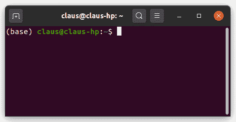
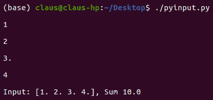

与操作系统交互

本节是 Python 简介的附加内容。它将 Python 放入计算机操作系统的上下文中，并展示了如何在命令窗口（也称为控制台）中使用 Python。我们演示系统命令和 Python 命令如何互动以及如何创建新应用程序。

在许多其他操作系统和各种 *方言* 中，桌面计算机和笔记本电脑上使用的三个主要操作系统是：Windows 10、macOS 和 Linux。在本章中，我们讨论如何在 Linux 环境中使用 Python。所有示例均在广泛分发的 Ubuntu 环境中进行测试。这里介绍的原则同样适用于其他大型操作系统。但本章内容仅限于 Linux，作为一个完全自由获取的环境。

首先，假设我们已经编写并测试了一个 Python 程序，并且现在希望直接从控制台窗口而不是从诸如 IPython 的 Python shell 运行它。

本章涵盖以下主题：

+   在 Linux shell 中运行 Python 程序

+   模块 `sys`

+   如何从 Python 执行 Linux 命令

# 17.1 在 Linux shell 中运行 Python 程序

打开终端应用程序时，会获得一个带有命令提示符的窗口；参见 *图 17.1*：



图 17.1：Ubuntu 20.04 中的终端窗口

终端窗口带有命令提示符，通常由用户名和计算机名称前缀，后跟目录名称。这取决于个人设置。

要执行名为 `myprogram.py` 的 Python 命令文件，您有两个选择：

+   执行命令 `python myprogram.py`

+   直接执行命令 `myprogram.py`

第二种变体需要一些准备工作。首先，您必须允许执行该文件，其次，您必须告诉系统需要执行该文件的命令。通过以下命令来允许执行该文件：

```py
chmod myprogram.py o+x
```

`chmod` 代表更改文件模式。该命令后跟文件名，最后是所需的新模式，在这里是 `o+x`。

在该示例中给出的模式代表“授予（`+`）文件所有者（`o`）执行（`x`）该文件的权限”。我们假设您是文件的所有者，并且它位于当前目录中。

然后，我们必须找到计算机上命令 `python` 的位置。通过运行以下命令来完成：

```py
which python
```

如果您像在 第 1.1 节 中描述的那样通过 Anaconda 安装 Python，则会获得有关命令 `python` 在您的系统上位置的信息，例如 `/home/claus/anaconda3/bin/python`。

这些信息必须写在 Python 脚本的第一行，以告知系统通过哪个程序可以将文本文件转换为可执行文件。以下是一个示例：

```py
#! /home/claus/anaconda3/bin/python
a=3
b=4
c=a+b
print(f'Summing up {a} and {b} gives {c}')
```

Python 视角中的第一行只是一个注释，会被忽略。但是 Linux 会将第一行中*shebang*组合符号`#!`之后的部分视为将文件转化为可执行文件所需的命令。这里，它学习使用位于目录`/home/claus/anaconda3/bin/`中的`python`命令来实现这一点。

我们可以通过逻辑路径来定义 Python 解释器的位置，而不是通过绝对路径，这样可以使代码更具可移植性。你可以将其提供给使用 Linux 系统的同事，而无需修改：

```py
#! /usr/bin/env  python   # a logical path to Python (mind the blank)
```

现在你可以直接在控制台执行示例代码；见 *图 17.2*：


图 17.2：在 Linux 终端中执行示例文件 example.py

我们需要在命令前加上`./`，这告诉操作系统在当前目录中查找该命令。如果没有这个前缀，Linux 会在搜索路径中列出的某个目录中查找文件`example.py`。

在接下来的部分中，我们将展示如何直接从命令行传递参数给 Python 程序。

# 17.2 sys 模块

模块`sys`提供了与系统命令进行通信的工具。我们可以直接从命令行传递带有参数的 Python 脚本，并将结果输出到控制台。

## 17.2.1 命令行参数

为了说明命令行参数的使用，我们考虑以下代码段，我们将其保存到名为`demo_cli.py`的文件中：

```py
#! /usr/bin/env  python 
import sys
text=f"""
You called the program{sys.argv[0]}
with the {len(sys.argv)-1} arguments, namely {sys.argv[1:]}"""
print(text)
```

在通过`chmod o+x demo_cli.py`给予文件执行权限后，我们可以在 Shell 中带参数执行它；见 *图 17.3*：


图 17.3：在终端命令行上带三个参数执行 Python 脚本

控制台中给出的三个参数可以通过列表`sys.argv`在 Python 脚本中访问。这个列表中的第一个元素——索引为`0`的元素——是脚本的名称。其他元素是给定的参数，作为字符串形式。

参数是传递给 Python 脚本的调用。它们不应与脚本执行过程中用户输入的内容混淆。

## 17.2.2 输入与输出流

在前面的示例中，我们使用了命令`print`来显示终端中生成的消息（甚至是在 Python Shell 中）。脚本的先前输入通过参数和变量`sys.argv`获取。与`print`相对的命令是`input`，它提示从终端（或 Python Shell）获取数据。

在第 14.1 节：*文件处理*中，我们看到了如何通过文件对象和相关方法向脚本提供数据以及如何输出数据。模块`sys`使得可以将键盘当作输入的文件对象（例如，`readline`、`readlines`），而将控制台当作输出的文件对象（例如，`write`、`writelines`）。

在 UNIX 中，信息流通过三个流组织：

+   标准输入流：`STDIN`

+   标准输出流：`STDOUT`

+   标准错误流：`STDERR`

这些流对应于文件对象，可以通过`sys.stdin`、`sys.stdout`和`sys.stderr`在 Python 中访问。

为了举个例子，我们考虑一个小脚本`pyinput.py`，它计算一些数字的总和：

```py
#!/usr/bin/env python3
from numpy import *
import sys

# Terminate input by CTRL+D
a=array(sys.stdin.readlines()).astype(float)
print(f'Input: {a}, Sum {sum(a)}'
```

语句`sys.stdin.readlines()`创建了一个生成器。命令`array`会迭代这个生成器，直到用户输入结束符号，该符号在 Linux 系统上是`CTRL-D`，在 Windows 系统上是`CTRL-Z`。请参见*图 17.4*中的截图：



图 17.4：使用`sys.stdin`执行脚本的终端截图。

请注意，给定的结束符号 CTRL-D 是不可见的。

### 重定向流

标准输入正在等待来自键盘的数据流。但输入可以通过文件进行重定向。通过在 Linux 中使用重定向符号`<`可以实现这一点。我们通过使用与之前相同的脚本，但这次由数据文件`intest.txt`提供数据来展示这一点；请参见*图 17.5*：


图 17.5：展示输入重定向（`sys.stdin`）的截图

脚本本身无需修改。无论哪种方式都可以使用。

输出也是如此。默认情况下，输出会显示在终端中，但这里也有将输出重定向到文件的选项。在这种情况下，重定向符号是`>`；请参见*图 17.6*：


图 17.6：重定向输入和重定向输出的截图

现在，创建了一个名为`result.txt`的文件，并将脚本的输出写入该文件。如果该文件已经存在，其内容将被覆盖。如果输出应该附加到已有文件的末尾，则必须使用重定向符号`>>`。

最后，有时可能希望将输出与错误或警告信息分开。这就是 Linux 提供两个输出流通道的原因，分别是`sys.stdout`和`sys.stderr`。默认情况下，两者都指向同一个位置，即终端。但通过使用重定向符号，错误信息可以例如写入文件，而主输出则显示在屏幕上，或者反之亦然。

为了演示这一点，我们修改示例`pyinput.py`，以便在没有提供输入时生成错误信息：

```py
#!/usr/bin/env python3
from numpy import *
import sys

# Terminate input by CTRL+D
a=array(sys.stdin.readlines()).astype(float)
print(f'Input: {a}, Sum {sum(a)}')
if a.size == 0:
    sys.stderr.write('No input given\n')
```

在终端窗口中，重定向输入和错误输出的脚本典型调用呈现在*图 17.7*中：


图 17.7：带有标准输入和标准错误输出重定向的终端窗口截图

如果输入文件为空，错误信息会写入文件 `error.txt`，而输出则显示在终端窗口中。

错误消息是来自未捕获异常的消息，包括语法错误和显式写入 `sys.stderr` 的文本。

在*表 17.1*中，汇总了不同的重定向情况：

| **任务** | **Python 对象** | **重定向符号** | **替代符号** |
| --- | --- | --- | --- |
| 数据输入 | `sys.stdin` |  < |  |
| 数据输出 | `sys.stdout` | > | 1> |
| 数据输出附加到文件 | `sys.stdout` | >> | 1>> |
| 错误输出 | `sys.stderr` | 2> |  |
| 错误输出附加到文件 | `sys.stderr` | 2>> |  |
| 所有输出 | `sys.stdout`, `sys.stderr` | &> |  |
| 所有输出附加到文件 | `sys.stdout`, `sys.stderr` | &>> |  |

表 17.1：不同重定向场景的汇总

### 在 Linux 命令与 Python 脚本之间建立管道

在上一节中，我们展示了如何将 Python 程序的输入和输出重定向到文件。当不同 Python 程序之间，或者 Python 程序与 Linux 命令之间的数据流时，数据通常通过文件传递。如果数据不在其他地方使用或应当保留供以后使用，这个过程就显得冗长：仅仅为了直接将信息从一段代码传递到另一段代码，需要创建、命名和删除文件。替代方案是使用 Linux **管道**，让数据从一个命令直接流向另一个命令。

让我们从一个纯 Linux 示例开始，然后将管道构造应用于 Python。

Linux 命令 `ifconfig` 显示有关 Linux 计算机当前网络配置的大量信息。在这些信息中，你可以找到 IP 地址（即当前使用的网络地址）。例如，要自动判断计算机（如笔记本电脑）是否通过某个网络单元连接到家庭网络，而不是连接到外部网络，你可能需要扫描 `ifconfig` 的输出，查找包含网络适配器标识符（例如 `wlp0s20f3`）的行，并在其下几行中查找包含网络前缀的字符串（如 `192.168`）。如果找到这个字符串，输出应仅显示包含该字符串的行；即行数计数应返回 `1`。如果计算机未连接到家庭网络，则行数计数返回 `0`。

我们使用三个命令：

+   `ifconfig` 用于显示完整的网络配置信息。

+   `grep` 用于查找包含特定模式的行。该行及根据参数 `-A` 的要求，显示一些后续行。

+   `wc` 用于对文件执行各种计数操作。参数 `-l` 指定计数行数。

这些命令的输出会直接传递给下一个命令。这是通过使用管道符号 `|` 来实现的：

```py
ifconfig|grep -A1 wlp0s20f3 | grep 192.168|wc -l
```

此命令行在家庭网络中执行时仅在屏幕上显示 `1`。所有中间输出直接传递到下一个命令，而无需显示任何内容，并且不使用任何文件来临时存放信息，直到下一个命令读取它。一个命令的标准输出，`stdout`，成为下一个命令的标准输入，`stdin`。

这也适用于 Python 脚本直接调用。

我们通过在管道中演示 Python 脚本来继续上一个示例。在这里，我们简单地使用 Python 生成一个友好的消息：

```py
#!/usr/bin/env python3

import sys

count = sys.stdin.readline()[0]
status = '' if count == '1' else 'not'

print(f"I am {status} at home")
```

现在，我们可以通过添加此脚本扩展管道；请参见 *图 17.8* 中的截图：


图 17.8：带有五个管道和一个 Python 脚本的命令链

在此示例中，我们在终端窗口中执行了一系列 Linux 程序和一个 Python 脚本。或者，可以让 Python 脚本调用 UNIX 命令。这将在下一节中演示。

# 17.3 如何从 Python 执行 Linux 命令

在上一节中，我们看到如何从 Linux 终端执行 Python 命令。在本节中，我们考虑如何在 Python 程序中执行 Linux 命令的重要情况。

## 17.3.1 模块 subprocess 和 shlex

要在 Python 中执行系统命令，首先需要导入模块 `subprocess`。此模块提供的高级工具是 `run`。使用此工具，您可以快速访问 Python 中的 Linux 命令，并处理它们的输出。

更复杂的工具是 `Popen`，我们将在解释如何在 Python 中模拟 Linux 管道时进行简要介绍。

### 完整的过程：subprocess.run

我们将通过最标准和简单的 UNIX 命令 `ls` 来演示此工具——列出目录内容的命令。它带有各种可选参数；例如，`ls -l` 以扩展信息显示列表。

要在 Python 脚本中执行此命令，我们使用 `subprocess.run`。最简单的用法是仅使用一个参数，将 Linux 命令拆分为几个文本字符串的列表：

```py
import subprocess as sp
res = sp.run(['ls','-l'])
```

模块 `shlex` 提供了一个特殊工具来执行此分割：

```py
_import shlex
command_list = shlex.split('ls -l') # returns ['ls', '-l']
```

它还尊重文件名中的空格，并且不将其用作分隔符。

命令 `run` 显示 Linux 命令的结果和 `subprocess.CompletedProcess` 对象 `res`。

以这种方式执行 UNIX 命令是相当无用的。大多数情况下，您希望处理输出。因此，必须将输出提供给 Python 脚本。为此，必须将可选参数 `capture_output` 设置为 `True`。通过这种方式，UNIX 命令的 `stdout` 和 `stderr` 流将作为返回对象的属性可用：

```py
import subprocess as sp
import shlex
command_list = shlex.split('ls -l') # returns ['ls', '-l']
res = sp.run(command_list, capture_output=True)
print(res.stdout.decode())
```

注意，此处使用方法 `decode` 将字节字符串解码为标准字符串格式。

如果 Linux 命令返回错误，属性 `res.returncode` 将获得非零值，并且 `res.stderr` 包含错误消息。

Python 的做法是抛出一个错误。可以通过将可选参数`check`设置为`True`来实现：

```py
import subprocess as sp
import shlex
command ='ls -y'
command_list = shlex.split(command) # returns ['ls', '-y'] 
try:
    res = sp.run(command_list, capture_output=True, check=True)
    print(res.stdout.decode())
except sp.CalledProcessError:
 print(f"{command} is not a valid command")
```

### 创建进程：subprocess.Popen

当你对一个需要用户输入才能终止的进程应用`subprocess.run`时会发生什么？

这样一个程序的简单示例是`xclock`。它打开一个新窗口，显示一个时钟，直到用户关闭窗口。

由于命令`subprocess.run`创建了一个`CompletedProcess`对象，下面的 Python 脚本：

```py
import subprocess as sp
res=sp.run(['xclock'])
```

启动一个进程并等待它结束，也就是说，直到有人关闭带有时钟的窗口；参见*图 17.9*：


图 17.9：xclock 窗口

这对`subprocess.Popen`有影响。它创建了一个 _`Popen`对象。进程本身变成了一个 Python 对象。它不需要完成才能成为一个可访问的 Python 对象：

```py
import subprocess as sp
p=sp.Popen(['xclock'])
```

进程通过用户在时钟窗口上的操作或通过显式终止进程来完成，命令如下：

```py
p.terminate()
```

使用`Popen`，我们可以在 Python 中构建 Linux 管道。下面的脚本：

```py
import subprocess as sp_
p1=sp.Popen(['ls', '-l'],stdout=sp.PIPE)
cp2=sp.run(['grep','apr'], stdin=p1.stdout, capture_output=True)
print(cp2.stdout.decode())
```

对应于 UNIX 管道：

```py
ls -l |grep 'apr
```

它显示了在四月最后访问的目录中的所有文件。

模块`subprocess`有一个对象`PIPE`，它接受第一个进程`p1`的输出。然后，它被作为`stdin`传递给命令`run`。该命令然后返回一个带有`stdout`属性（类型为`bytes`）的`CompletedProcess`对象`cp2`。最后，调用方法`decode`可以很好地打印结果。

另外，也可以通过使用两个`Popen`进程来实现相同的效果。第二个进程也使用管道，可以通过方法`communicate`进行显示：

```py
import subprocess as sp
p1=sp.Popen(['ls', '-l'],stdout=sp.PIPE)
p2=sp.Popen(['grep','apr'], stdin=p1.stdout, stdout=sp.PIPE)
print(p2.communicate()[0].decode)
```

方法`communicate`返回一个元组，其中包含`stdout`和`stderr`上的输出。

# 17.4 小结

在本章中，我们演示了 Python 脚本与系统命令的交互。Python 脚本可以像系统命令一样被调用，或者 Python 脚本本身可以创建系统进程。本章基于 Linux 系统，如 Ubuntu，仅作为概念和可能性的演示。它允许将科学计算任务置于应用场景中，在这些场景中，通常需要将不同的软件结合起来。甚至硬件组件可能也会涉及其中。
