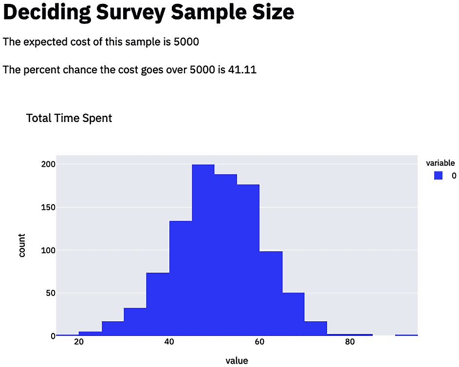
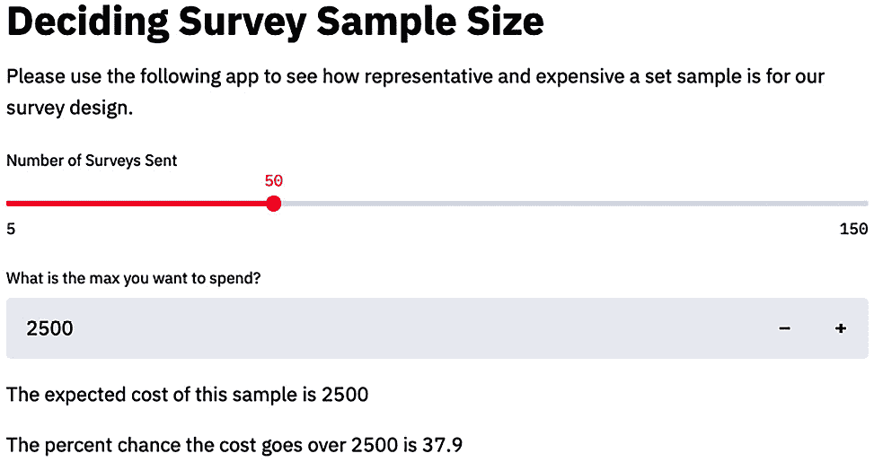
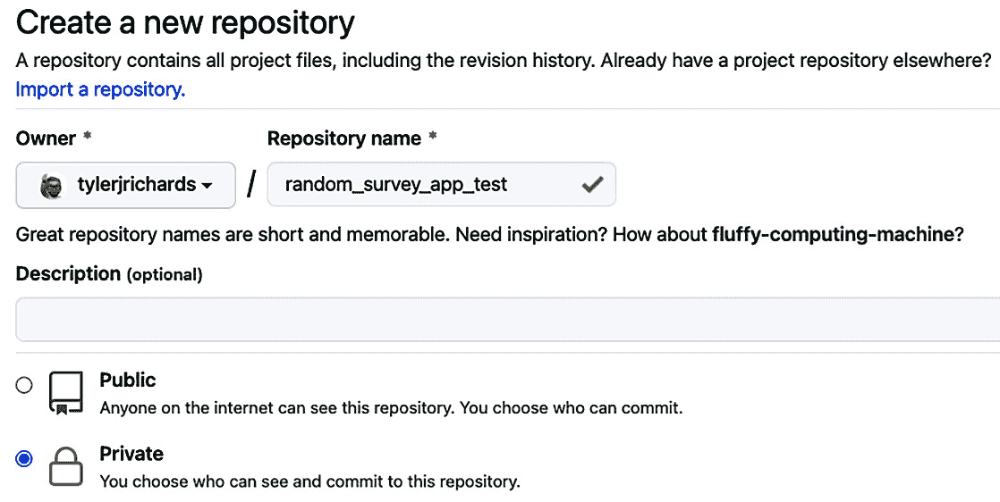
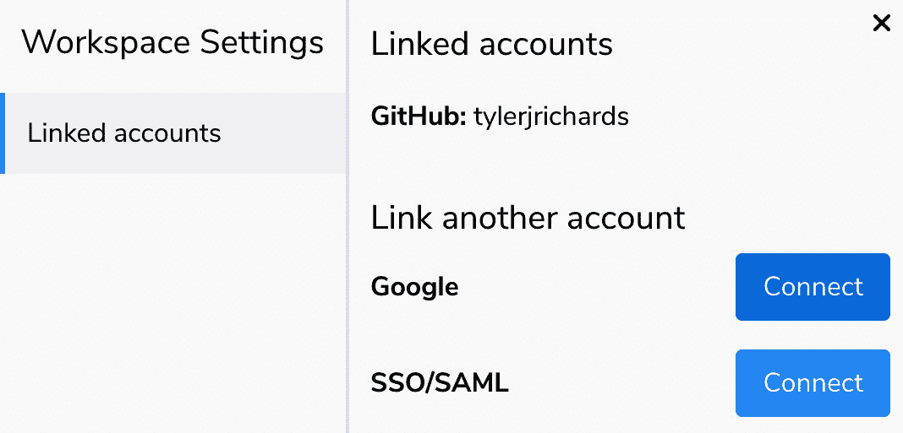
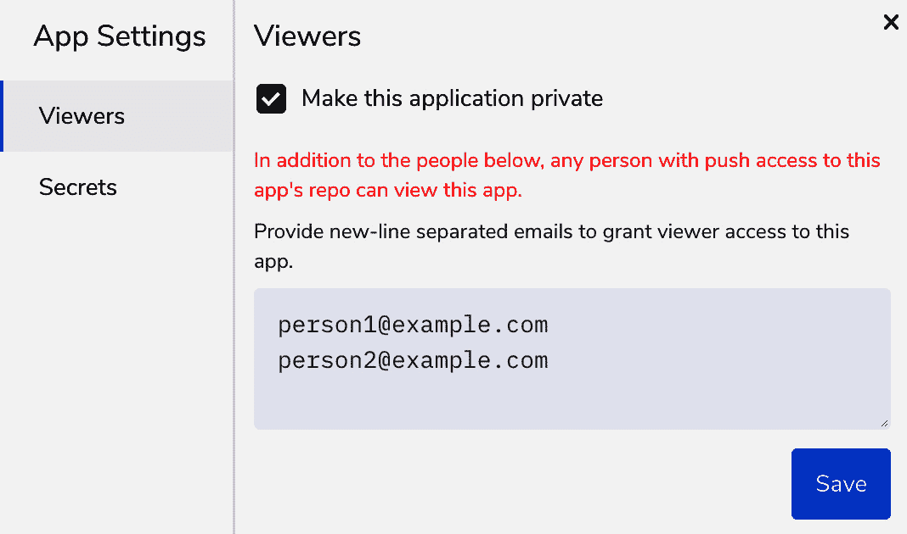

# *第十一章*：为团队使用 Streamlit

在过去的两章中，我们深入探讨了如何使用 Streamlit 来进行个人数据项目、简历构建项目，甚至是创建适用于家庭作业求职申请的应用。在本章中，我们将重点讨论如何在工作中使用 Streamlit，作为数据科学家、机器学习工程师或数据分析师。我们已经知道，Streamlit 可以作为一个有说服力的工具，通过深思熟虑的互动分析来影响周围的人，我们将把这一点应用到数据科学家实际进行的工作中。

Streamlit 既是一家公司，又是一个开源库，通过成为数据科学工具包中一个如此优秀的工具来赚取收入，从而使公司愿意为增加数据科学家生产力的特别功能和定制化付费。最棒的一点是，公司的收益直接与用户体验相关，Streamlit 被激励让使用工具的体验尽可能有用且有价值；如果你因为 Streamlit 而成为更好的数据科学家，那么你的公司就更有可能为访问这些功能支付更多费用。

此外，Streamlit 已经设计为协作型工具。如果其他开发人员能够访问正在用于 Streamlit 应用的 GitHub 仓库，那么他们所做的任何修改都会自动出现在已部署的应用中。因此，Streamlit 天生适合个人数据科学家和从事类似分析或应用的团队协作。

在本章中，我们将讨论以下内容：

+   使用 Streamlit for Teams 分析假设性的调查成本

+   从私有仓库创建和部署应用

+   使用 Streamlit 进行用户身份验证

本章的开始，我们将通过一个例子来说明在工作中何时使用 Streamlit for Teams，而不是静态分析。

# 使用 Streamlit for Teams 分析假设性的调查成本

假设你是**大型互联网公司**（**BIC**）的一名数据科学家。BIC 向用户销售预算软件，你负责调查应用的用户，看看软件在哪些方面可以改进。你与一个相当典型的团队合作，团队成员包括一位产品经理、两位软件工程师、三位项目经理、两位用户体验研究员，以及你自己，唯一的数据科学家。一天，你的产品经理在 Slack 上给你发消息，要求你找出年龄在 16 到 24 岁之间的用户群体，这是业务中的一个关键 segment，让他们参加一个包含 10 个问题的调查。在一次头脑风暴会议上，你的研究员发现给用户一个 10% 获得 $500 礼品卡的机会，比给用户 $50 更能提高调查的回复率，并希望你将此纳入分析中。

这里有很多因素需要考虑：团队愿意花费多少？我们应该选择多少样本？最难的部分是样本的成本与代表性之间的取舍。我们有几个选项。我们可以推荐一个样本大小，但没有真正告诉团队为什么推荐这个大小。我们也可以给团队提供几个成本选项，列出一些优缺点。比这更好的选择是创建一个简短的 Streamlit 应用程序，帮助我们作为团队做出决定，从而了解所有的取舍。

假设我们想要做后者！我们接下来的步骤是：

1.  设置新的 Streamlit 应用程序文件夹

1.  说明样本的代表性

1.  计算样本的成本

1.  使用交互来展示取舍

现在我们需要从第一个选项开始，设置我们的文件夹。

## 设置新的 Streamlit 应用程序文件夹

我们在本书中之前已经多次进行过这一步。请创建一个名为`random_survey_app`的文件夹，并在其中放入一个名为`app.py`的文件，我们将在这个文件中编写新的 Streamlit 应用程序。现在进入核心问题！

## 说明样本的代表性

如果我们是 BIC 的 数据科学家，我们已经了解了很多关于目标用户群的数据。我们希望确保我们抓取的样本能够代表整个用户群，尤其是与业务的一个或多个关键变量相关的部分。对于这个例子，我们可以假设业务最重要的指标是用户在我们应用程序上花费的时间。我们已经知道了用户时间消耗的分布，可以使用以下代码在应用程序中表示这一点：

```py
import streamlit as st
import numpy as np
st.title('Deciding Survey Sample Size')
np.random.seed(1)
user_time_spent = np.random.normal(50.5, 10, 1000)
```

我们使用`np.random.seed(1)`这一行代码，是为了让你看到与本书中图示相同的样本，但在开发面向用户的应用程序时，我建议去掉这一行，否则聪明的用户可能会对你的随机选择方法产生怀疑！在`numpy`中设置种子能够确保随机数据选择的结果可重复。

现在我们已经知道了用户在应用程序上花费的时间的分布，我们可以通过并排展示用户时间分布的两个样本，向用户展示不同规模的子样本代表性如何。虽然这并不是判断代表性的最佳方法，但它足以向你的观众证明一个大致的观点。接下来的代码块从 1,000 个样本中随机抽取 100 个，并绘制每个样本的直方图：

```py
import streamlit as st
import numpy as np
import plotly.express as px
st.title('Deciding Survey Sample Size')
np.random.seed(1)
user_time_spent = np.random.normal(50.5, 10, 1000)
my_sample = np.random.choice(user_time_spent, 100)
fig = px.histogram(user_time_spent, title='Total Time Spent')
fig.update_traces(xbins=dict(start=0,end=100, size=5))
st.plotly_chart(fig)
fig = px.histogram(my_sample, title='Sample Time Spent')
fig.update_traces(xbins=dict(start=0,end=100, size=5))
st.plotly_chart(fig)
```

这个代码块将生成如下应用程序，显示在 100 个用户的情况下，它看起来相当具有代表性，能够反映总的时间消耗：


图 11.1 – 调查样本大小

现在我们需要弄清楚权衡点——如何确定一组用户样本的成本。

## 计算样本的成本

如我们之前讨论的那样，我们可以通过查看调查响应者的数量乘以每个响应者的成本来计算样本的成本。每个调查响应者的成本是 10% 的概率获得 $500 礼品卡，因此我们应该将期望值显示为 10% 乘以 $500，平均为 $50。我们还应能够动态地回答*实验的成本有多少百分比的时间低于某个金额？*，以便向团队说明与随机性相关的成本风险。

我们可以使用以下代码计算并输出预期成本：

```py
np.random.seed(1)
num_surveys = 100
user_time_spent = np.random.normal(50.5, 10, 1000)
my_sample = np.random.choice(user_time_spent, num_surveys)
expected_cost = 50 * num_surveys
st.write(f'The expected cost of this sample is {expected_cost}')
```

一旦我们有了这个，我们可以模拟这个调查运行 10,000 次，统计实验的成本超过某个值的次数，这个值在下一个代码块中称为 `max_cost`。我们再次使用 `numpy` 库从二项分布中进行采样，这是给定一组独立事件和相同概率时的成功次数（例如，如果你投掷 10 次硬币，结果正面朝上的次数）：

```py
np.random.seed(1)
num_surveys = 100
user_time_spent = np.random.normal(50.5, 10, 1000)
my_sample = np.random.choice(user_time_spent, num_surveys)
#costing section
expected_cost = 50 * num_surveys
max_amount = 5000
percent_change_over = 100 * sum(np.random.binomial(num_surveys, 0.1, 10000) > max_amount/500)/10000
st.write(f'The expected cost of this sample is {expected_cost}')
st.write(f'The percent chance the cost goes over {max_amount} is {percent_change_over}')
```

对于我们的调查样本量 100 和最大成本 $5,000，期望成本为 $5,000，并且成本大约 41% 的时间会超过我们的限制：



图 11.2 – 调查的预期成本

现在我们已经有了所有的基本组件，接下来需要通过 Streamlit 的功能让这个应用变得交互式。

## 使用交互显示权衡

为了让这个应用比静态分析更好，我们需要让用户与我们的应用互动。我们可以通过两种方式来实现：首先允许用户更改调查人数，其次是更改我们指定的最大成本变量。我们可以使用以下代码块来实现这两项功能：

```py
st.title('Deciding Survey Sample Size')
np.random.seed(1)
num_surveys = 100
num_surveys = st.slider(label='Number of Surveys Sent', 
     min_value=5, max_value=150, value=50)
max_amount = st.number_input(label='What is the max you want to spend?', 
     value=num_surveys*50, step=500)
user_time_spent = np.random.normal(50.5, 10, 1000)
my_sample = np.random.choice(user_time_spent, num_surveys)
```

在这个代码块中，我们为 Streamlit 滑块设置了最小值和最大值，并且将最大值的默认值设置为期望值，这样用户在更改调查人数时会更容易。我们还应该在此上方添加一些文本，指导用户如何与我们的应用互动，具体如下所示：

```py
st.title('Deciding Survey Sample Size')
'''
Please use the following app to see how 
representative and expensive a set sample
is for our survey design. 
'''
np.random.seed(1)
num_surveys = 100
```

这两个功能的添加产生了以下截图：



图 11.3 – 带成本计算的 Streamlit 滑块

到目前为止，这一切运行得非常顺利。然而，由于你在公司工作，你希望确保应用中的这些信息不会被公开或泄露给竞争对手。因此，公开部署这个应用不可行，我们需要找出如何私下部署这个应用。在*第九章*，*使用 Streamlit 改进工作申请*中，我们讨论了如何通过密码保护让应用程序保持私密，但 Streamlit for Teams 还允许我们从私有 GitHub 仓库进行部署，这也是我们下一节的内容。

# 从私有仓库创建和部署应用程序

Streamlit for Teams 产品的一个强大功能是可以通过私有 GitHub 仓库使用 Streamlit Sharing。它的使用方式与我们在*第五章*《使用 Streamlit Sharing 部署 Streamlit》学到的一样，只不过是从私有仓库而非公共仓库进行部署。要进行这个更改，您需要拥有 Streamlit Teams 的访问权限，或者从 Streamlit 团队获取权限（如果你礼貌地请求，他们或许会允许你试用！）。

要创建一个私有 GitHub 仓库，前往[`github.com/new`](https://github.com/new)，确保选择**私有**而不是**公共**选项，如下图所示：



图 11.4 – GitHub 上的私有仓库

在将当前代码添加到我们的 GitHub 仓库后，我们可以像往常一样通过访问[`share.streamlit.io`](https://share.streamlit.io)并按照一键部署的指引进行部署。我已经使用自己的私有仓库部署了这个 Streamlit 应用，可以通过[`share.streamlit.io/tylerjrichards/random_survey_app/main/app.py`](https://share.streamlit.io/tylerjrichards/random_survey_app/main/app.py)找到这个 Streamlit 应用。接下来的问题是寻找替代我们已经探索过的密码方法的方案，尤其是与 Streamlit 的用户特定认证。

# 用户认证与 Streamlit

Streamlit for Teams 目前在测试阶段的一个功能，预计将于 2021 年末发布，是基于 Google 的**单点登录**（**SSO**）认证。这将允许我们将应用设置为完全私密，仅对我们在允许列表中的用户可见。我们需要做的第一步是将我们的 Google 账户关联起来，方法是前往[`share.streamlit.io`](https://share.streamlit.io)并点击右上角的**设置**。到达页面后，我们将看到接下来截图所示的界面：



图 11.5 – 关联 Google 账户

现在我们可以点击蓝色的**连接**按钮，然后登录我们的 Google 账户。完成后，我们需要前往[`share.streamlit.io`](https://share.streamlit.io)的主页，找出我们希望限制流量的应用：


图 11.6 – Streamlit 共享选项

在这种情况下，我想限制第二个应用的访问，因此我将点击页面最右侧的图标进入该应用的设置，并选择**设置**，正如我们之前所做的那样。

在我们关联 Google 账户之前，我们只能编辑应用的**Secrets**部分，但现在我们有了一个全新的部分，叫做**观看者**，如下图所示：



图 11.7 – 观看者身份验证

我们可以通过勾选复选框将我们的应用设置为私有，并通过电子邮件将人们添加到此列表中。如果他们不在列表上，尝试访问应用时将收到 404 错误！这种方法对少量用户非常有效，但如果你试图覆盖数百或数千个用户，尤其是那些没有 Google 相关电子邮件账户的用户，这个方法就不太适用了。

# 总结

在这一章中，我们探讨了一个成本分析的例子，它展示了 Streamlit 在特定工作场景中的应用。在这个例子中，我们讨论了如何使用交互式的 Streamlit 应用程序来帮助团队改进并制定基于数据的决策。之后，我们还学习了如何从私有 GitHub 仓库部署 Streamlit 应用程序，并了解了几种方法，使我们的 Streamlit 应用程序仅对具有密码保护和 Google 单点登录的私密观众可用。本章到此结束。

在下一章中，我们将重点采访一些 Streamlit 的高级用户和创作者，了解他们的使用技巧和经验，为什么他们如此广泛地使用 Streamlit，以及他们认为这个库的未来发展方向。我们在那里见！
