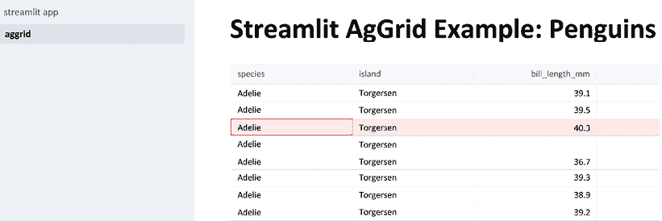
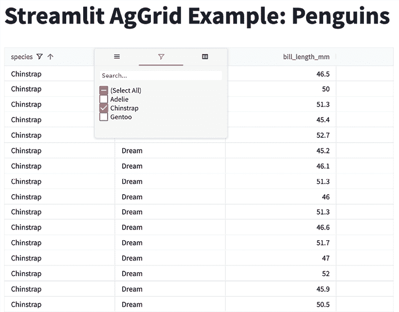
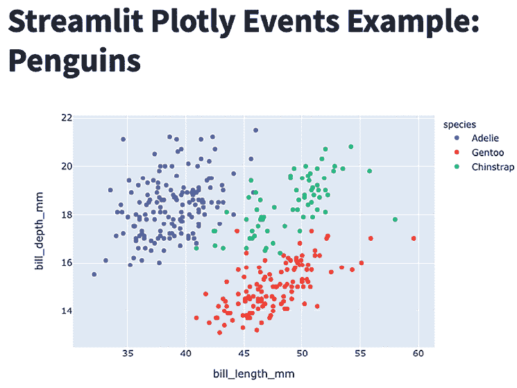
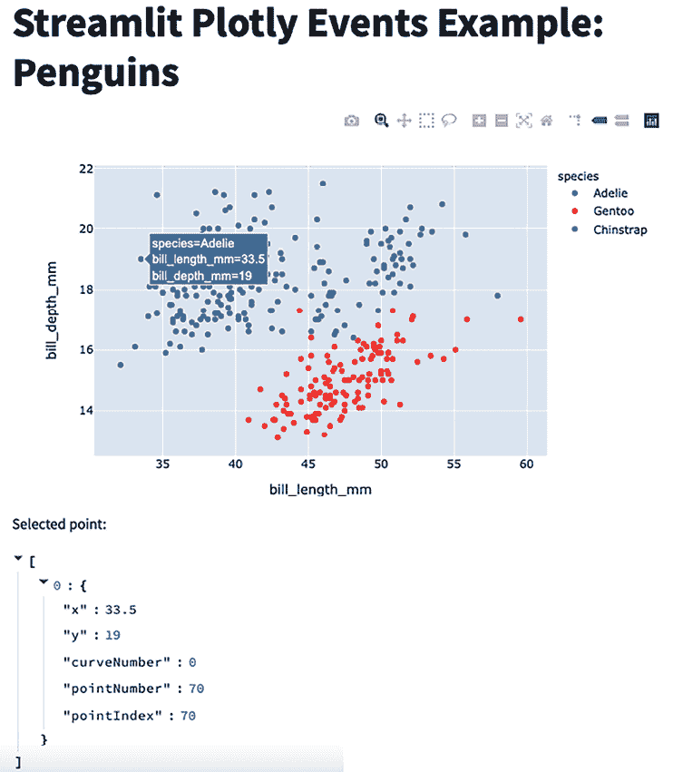
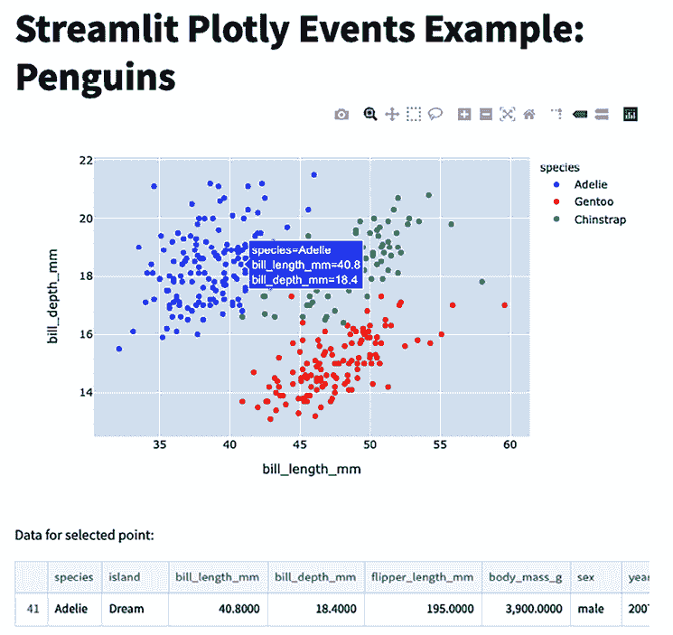
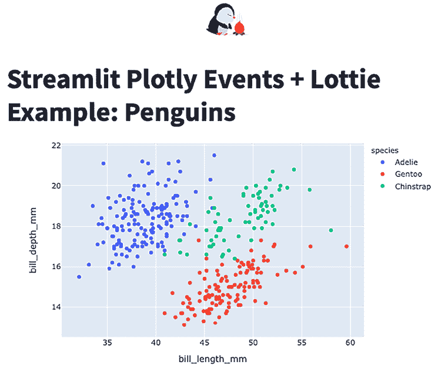
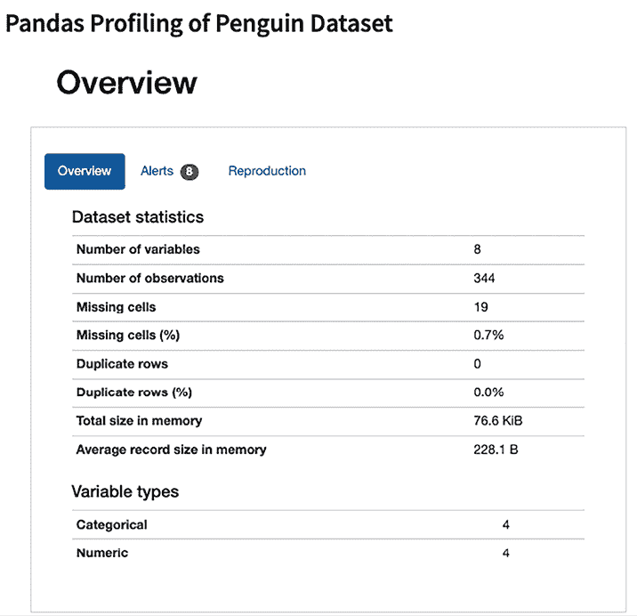
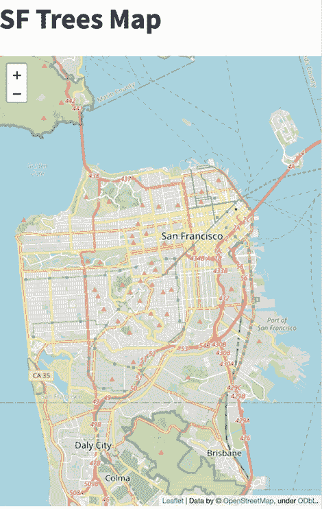
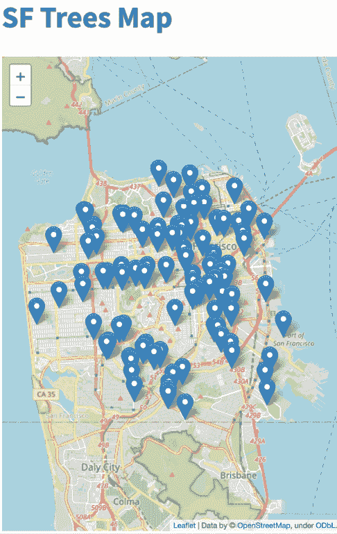
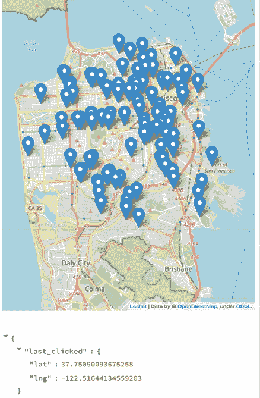

# 探索 Streamlit 组件

到目前为止，在本书中，我们已经探索了由 Streamlit 核心开发团队开发的功能，他们全职致力于这些新奇且令人兴奋的功能。然而，本章将专注于社区驱动的开发，通过 Streamlit 组件。在构建 Streamlit 时，团队创建了一种方法，允许其他开发者在我们已经看到的所有现有 Streamlit 开源魔法之上，创建额外的功能。这种方法被称为组件（Components）！Streamlit 组件允许开发者灵活地构建出对他们工作流程至关重要的功能，或者仅仅是有趣和好玩的功能。

随着 Streamlit 成为越来越流行的框架，其组件也在不断增加。感觉每天我都能看到一个新颖且有趣的组件，我想在自己的应用程序中尝试！本章将重点介绍如何查找和使用社区制作的 Streamlit 组件。

在本章中，我们将介绍以下六个 Streamlit 组件：

+   使用 `streamlit-aggrid` 添加可编辑的 DataFrame

+   使用 `streamlit-plotly-events` 创建钻取图

+   使用 `streamlit-lottie` 创建美丽的 GIF 动画

+   使用 `pandas-profiling` 进行自动化分析

+   使用 `st-folium` 创建交互式地图

+   使用 `streamlit-extras` 创建有用的小函数

+   查找更多组件

接下来，我们来看看下一节中的技术要求。

# 技术要求

在我们可以使用新的 Streamlit 组件之前，首先需要下载它们。我们可以像在*第一章*《Streamlit 简介》中一样，使用 `pip`（或其他包管理器）下载每个组件。这些是需要下载的组件：

+   `streamlit-aggrid`

+   `streamlit-plotly-events`

+   `streamlit-lottie`

+   `streamlit-pandas-profiling`

+   `streamlit-folium`

+   `streamlit-extras`

为了尝试所有这些库，我们将创建一个多页应用，每个库都是一个独立的 Streamlit 应用。我们将在一个新文件夹中进行尝试，并命名为 `components_example`。对于我们的多页应用，我们需要一个名为 `pages` 的文件夹，而对于我们的第一个库（`streamlit-aggrid`），我们需要在 `pages` 文件夹中添加一个名为 `aggrid.py` 的 Python 文件。我们将使用之前已使用过的企鹅和树木数据集中的数据，因此也要将它们复制到文件夹中。

在所有这些操作结束后，您的 `components_example` 文件夹应该是这样的：


图 7.1：文件夹结构

在 `streamlit_app.py` 中，我们可以添加以下代码，以告知用户所有示例都位于其余的多页应用中：

```py
import streamlit as st
st.title("Streamlit Components Examples")
st.write(
    """This app contains examples of 
    Streamlit Components, find them 
    all in the sidebar!"""
) 
```

现在，进入 `streamlit-aggrid`！

# 使用 `streamlit-aggrid` 添加可编辑的 DataFrame

我们已经在 Streamlit 应用中使用了几种显示 DataFrame 的方法，如内置的`st.write`和`st.dataframe`函数。我们还介绍了 Streamlit 在 1.19 版本中发布的实验性可编辑 DataFrame，尽管它的功能不如`streamlit-aggrid`丰富，但使用起来显著更简单！`streamlit-aggrid`本质上创建了一个漂亮、交互式且可编辑的`st.dataframe`版本，构建在一个名为`AgGrid`的 JavaScript 产品之上（[`www.ag-grid.com/`](https://www.ag-grid.com/)）。

理解这个库的最佳方式是亲自尝试！我们从使用企鹅数据集的例子开始，目的是制作一个交互式和可编辑的 DataFrame，而这是`AgGrid`的强项。

在`aggrid.py`中，我们可以提取企鹅数据，并使用`streamlit-aggrid`中的核心函数`AgGrid`来在 Streamlit 应用中显示数据。代码如下所示：

```py
import pandas as pd
import streamlit as st
from st_aggrid import AgGrid
st.title("Streamlit AgGrid Example: Penguins")
penguins_df = pd.read_csv("penguins.csv")
AgGrid(penguins_df) 
```

这使我们接近了 80%的理想解决方案。它创建了一个具有丰富功能的应用！目前这个应用看起来是这样的：



图 7.2：AgGrid 示例

如果你点击每一列，它会带有自动过滤机制、按值排序、显示和隐藏列等功能。例如，我们可以在数据集中过滤**species**列，仅包含**Chinstrap**值，DataFrame 会如以下截图所示进行响应：



图 7.3：第一次过滤

我鼓励你尝试`AgGrid`中的功能，看看它提供的完整功能集。有一点你可能会注意到的是，它默认显示整个 DataFrame。我发现这对于 Streamlit 应用来说有点突兀，但幸运的是，`streamlit-aggrid`中有一个`height`参数，可以强制将 DataFrame 显示在特定高度内。请参见以下代码，了解如何确保这一点：

```py
import pandas as pd
import streamlit as st
from st_aggrid import AgGrid
st.title("Streamlit AgGrid Example: Penguins")
penguins_df = pd.read_csv("penguins.csv")
AgGrid(penguins_df, height=500) 
```

我们已经讨论过但还没有展示的最后一个特性是能够在 AgGrid 中编辑 DataFrame。同样，这和在 AgGrid 函数中添加一个参数一样简单。该函数返回编辑后的 DataFrame，我们可以在应用的其余部分使用它。这意味着该组件是双向的，和我们已经使用过的所有 Streamlit 输入控件一样。接下来的这段代码添加了编辑功能，并展示了我们如何访问编辑后的 DataFrame：

```py
import pandas as pd
import streamlit as st
from st_aggrid import AgGrid
st.title("Streamlit AgGrid Example: Penguins")
penguins_df = pd.read_csv("penguins.csv")
st.write("AgGrid DataFrame:")
response = AgGrid(penguins_df, height=500, editable=True)
df_edited = response["data"]
st.write("Edited DataFrame:")
st.dataframe(df_edited) 
```

从这段代码，我们可以看到以下应用：


图 7.4：可编辑的 DataFrame

上面的应用展示了我修改了数据框架（DataFrame）中的一行，将值从 `Adelie` 改为 `Adelie_example` 后的效果。我们可以在应用的其余部分中使用这个数据框架，并可以执行从基于编辑过的数据框显示图表到将数据框保存回 CSV 文件等任何操作；这里的可能性是巨大的。`streamlit-aggrid` 是最受欢迎的 Streamlit 组件之一，希望你现在明白为什么了！该库中还有几十个其他功能，你可以在 [`streamlit-aggrid.readthedocs.io/`](https://streamlit-aggrid.readthedocs.io/) 查找更多。现在，继续介绍下一个组件 `streamlit-plotly-events` 进行钻取图表！

# 使用 `streamlit-plotly-events` 创建钻取图表

任何绘图库中最受欢迎的高级功能之一是能够钻取图表的部分或区域。你的应用用户常常会对你的数据提出一些你没有预料到的问题！与其围绕图表创建新的 Streamlit 输入，用户通常希望点击图表中的项目（如点或条形图），并获取该点的更多信息。例如，在我们的企鹅散点图中，用户可能希望查看与某只企鹅相关的所有数据，这些数据由鼠标悬停在数据框（DataFrame）中的某个点上表示。

`streamlit-plotly-events` 将单向的 `st.plotly_chart` 函数转变为双向的函数，在其中我们可以接收像点击或悬停之类的事件，并将其返回到我们的 Streamlit 应用中。为了测试这个功能，我们将在 `pages` 文件夹内创建另一个应用，这个应用名为 `plotly_events`，并将基于企鹅数据集创建一个图表。

首先，我们可以导入库，读取数据，并在 Plotly 中绘制一个常见的图表：

```py
import pandas as pd
import plotly.express as px
import streamlit as st
from streamlit_plotly_events import plotly_events
st.title("Streamlit Plotly Events Example: Penguins")
df = pd.read_csv("penguins.csv")
fig = px.scatter(df, x="bill_length_mm", y="bill_depth_mm", color="species")
plotly_events(fig) 
```

我们没有调用 `st.plotly_chart`，而是将其替换为 `plotly_events` 函数调用。除此之外，与我们常规使用 Plotly 的方式没有区别。目前，这不会做任何特别的事情，我们的应用应该看起来比较标准：



图 7.5：Plotly 图表原始版本

`plotly_events` 函数接受一个名为 `click_event` 的参数，如果我们将其设置为 `true`，将把所有点击事件作为变量返回给 Streamlit。接下来的脚本使用了这个参数，并将点击事件写回 Streamlit：

```py
import pandas as pd
import plotly.express as px
import streamlit as st
from streamlit_plotly_events import plotly_events

st.title("Streamlit Plotly Events Example: Penguins")
df = pd.read_csv("penguins.csv")
fig = px.scatter(df, x="bill_length_mm", y="bill_depth_mm", color="species")
selected_point = plotly_events(fig, click_event=True)
st.write("Selected point:")
st.write(selected_point) 
```

现在，当我们运行这个应用并点击图表上的点时，我们可以看到被点击的值！



图 7.6：点击事件

现在这还不是特别特别的，因为 Plotly 已经可以在悬停时显示这些点。我们可以通过显示点击的点的所有数据来改进这一点，以下是改进后的代码（为了简洁，我省略了导入部分）。如果没有选择任何点，我们需要停止应用，否则应用将报错！

```py
st.title("Streamlit Plotly Events Example: Penguins")
df = pd.read_csv("penguins.csv")
fig = px.scatter(df, x="bill_length_mm", y="bill_depth_mm", color="species")
selected_point = plotly_events(fig, click_event=True)
if len(selected_point) == 0:
    st.stop()
selected_x_value = selected_point[0]["x"]
selected_y_value = selected_point[0]["y"]
df_selected = df[
    (df["bill_length_mm"] == selected_x_value)
    & (df["bill_depth_mm"] == selected_y_value)
]
st.write("Data for selected point:")
st.write(df_selected) 
```

现在，我们的最终应用看起来如下：



图 7.7：钻取仪表盘

将 Plotly 图表轻松转换为钻取式、双向仪表板真的很容易！在此示例中，用户可以查看所选择企鹅的性别和鳍长度等信息，理论上我们可以在应用程序的其余部分中随意使用此选择事件。

`streamlit-plotly-events`库还有另外两个事件（`select_event`和`hover_event`），这些事件也同样有用，并以相同方式返回。如果你使用了其中一个，当需要时你可以轻松地使用另一个。随着钻取式仪表板的完成，让我们转而使用`streamlit-lottie`向我们的应用程序添加美丽的动画！

# 使用 Streamlit 组件 - streamlit-lottie

**Lottie** 是由*Airbnb*创建的一种网页原生开源库，使得在您的网站上放置动画与放置静态图像一样简单。大型、盈利的技术公司将开源软件发布给开发者社区是一种非常普遍的做法，这样做不仅是回馈开发者社区（或者更可能是为了招募那些认为他们的软件很酷的开发者），这个库也不例外。在这种情况下，`streamlit-lottie`封装了`lottie`文件，并直接将它们放入我们的 Streamlit 应用程序中。

在我们尝试之前，我们首先需要导入`streamlit-lottie`库，然后将`st_lottie()`函数指向我们的`lottie`文件。我们可以导入本地的`lottie`文件，或者更可能的是，我们可以在免费网站（[`lottiefiles.com/`](https://lottiefiles.com/)）上找到一个有用的动画文件，并从那里加载到我们的应用程序中。

为了测试这个功能，我们可以将一个可爱的企鹅动画（[`lottiefiles.com/39646-cute-penguin`](https://lottiefiles.com/39646-cute-penguin)）添加到我们在本章早些时候创建的企鹅应用程序的顶部。为了保持一切井然有序，让我们将`plotly_events.py`文件的当前状态复制到名为`penguin_animated.py`的新文件中，同样放在`pages`文件夹中。我们可以从`components_example`文件夹运行以下代码，或者手动复制文件：

```py
cp pages/plotly_events.py pages/penguin_animated.py 
```

然后，在这个新文件中，我们可以对旧应用程序进行一些更改。以下代码块创建了一个函数，如`streamlit-lottie`库的示例所示（[`github.com/andfanilo/streamlit-lottie`](https://github.com/andfanilo/streamlit-lottie)），允许我们从 URL 加载`lottie`文件，然后在应用程序顶部加载此动画：

```py
import pandas as pd
import plotly.express as px
import requests
import streamlit as st
# add streamlit lottie
from streamlit_lottie import st_lottie
from streamlit_plotly_events import plotly_events
def load_lottieurl(url: str):
    r = requests.get(url)
    if r.status_code != 200:
        return None
    return r.json()
lottie_penguin = load_lottieurl(
    "https://assets9.lottiefiles.com/private_files/lf30_lntyk83o.json"
)
st_lottie(lottie_penguin, height=200)
st.title("Streamlit Plotly Events + Lottie Example: Penguins") 
```

应用的其余部分与 Plotly 事件库部分保持一致。现在当我们运行 Streamlit 应用程序时，我们在顶部看到动画：



图 7.8：可爱的企鹅

上一节的代码使用了`requests`库来定义一个函数，我们可以用它从链接加载`lottie`文件。在这个例子中，我已经预填了一个链接，指向一个可爱的企鹅动画。然后我们加载了这个文件，并使用从`streamlit-lottie`库中导入的`st_lottie()`函数来调用该文件。正如你所看到的，我们在顶部有一个动画！

`streamlit-lottie`还允许我们通过`speed`、`width`和`height`参数分别改变动画的速度、宽度和高度。如果动画的速度太慢，可以将速度增大到例如`1.5`或`2`，这将分别使速度增加 50%或 100%。然而，`height`和`width`参数是动画的像素高度/宽度，默认为动画的原生大小。

我强烈建议运行这个应用，因为企鹅动画实在是非常可爱。这也标志着我们对`streamlit-lottie`的介绍已经完成！我已经养成了在每个我创建的 Streamlit 应用顶部加入一个精美动画的习惯——它创造了一种设计感，使得 Streamlit 应用显得更有目的性，并且立即提醒用户，这不是一个静态文档，而是一个动态交互式应用。

# 使用 Streamlit 组件 – streamlit-pandas-profiling

`pandas-profiling`是一个非常强大的 Python 库，它自动化了一些 EDA（探索性数据分析），这是任何数据分析、建模甚至数据工程任务的第一步。在数据科学家开始几乎所有数据工作之前，他们都希望首先了解他们数据的分布情况、缺失行的数量、变量之间的相关性，以及许多其他基本信息。正如我们之前提到的，这个库自动化了这个过程，然后将这个交互式分析文档放入 Streamlit 应用中供用户使用。

在名为`pandas-profiling`的 Streamlit 组件背后，有一个相同名称的完整 Python 库，组件从中导入其函数。这个 Streamlit 组件实际上将来自`pandas-profiling` Python 库的输出渲染为一种非常容易集成的方式。在这一部分中，我们将首先学习如何实现这个库，然后探索生成的输出。

对于我们的示例，我们将继续使用上一节关于企鹅的代码，并将自动生成的个人资料添加到应用程序的底部。这段代码只有几行——我们需要为数据集生成报告，然后使用 Streamlit 组件将生成的报告添加到应用程序中。同样，像之前一样，将`streamlit-lottie`部分的代码复制到一个新文件中，命名为`penguin_profiled.py`：

```py
cp pages/penguin_animated.py pages/penguin_profiled.py 
```

下一段代码导入了我们分析所需的库！

```py
import pandas as pd
import plotly.express as px
import requests
import streamlit as st
from pandas_profiling import ProfileReport
from streamlit_lottie import st_lottie
from streamlit_pandas_profiling import st_profile_report
from streamlit_plotly_events import plotly_events 
```

应用的中间部分保持不变，因此我们不会在这里复制所有代码。然而，最后使用了我们之前导入的函数来获取 DataFrame 的概况：

```py
fig = px.scatter(df, x="bill_length_mm", y="bill_depth_mm", color="species")
selected_point = plotly_events(fig, click_event=True)
st.subheader("Pandas Profiling of Penguin Dataset")
penguin_profile = ProfileReport(df, explorative=True)
st_profile_report(penguin_profile) 
```

现在，我们得到了整个企鹅数据集的概况，内容如下所示：



图 7.9：企鹅数据集概况

这有一个概述部分，警告我们关于高度相关的变量或缺失数据，甚至允许我们非常轻松地深入查看特定列。我们可以在 Streamlit 中重新制作整个库（我将这一点作为非常高级的练习留给读者！），但拥有这样的自动化探索分析也是非常不错的。

这也是一个关于组合性的重要课程——我们可以将 Streamlit 组件视为独特的乐高积木，随意组合它们来创建新的、有趣的 Streamlit 应用。

这是另一个你应该自己尝试的组件，看看它能向用户展示哪些信息。接下来，我们将介绍使用`st-folium`的双向应用！

# 使用 st-folium 的互动地图

在本章前面，我们学到了通过`streamlit-plotly-events`为可视化添加双向功能的重要性。深入分析图表是商业用户经常要求的功能，地图也不例外！`st-folium`非常类似于`streamlit-plotly-events`，但它是针对地理空间地图的。

本示例重点使用了我们在本书中一再使用的树木数据集，所以请创建一个新的文件`folium_map.py`，并将其放入`pages`文件夹中，然后我们可以开始。以下代码段加载库，添加数据，创建`folium`地图，并将该地图添加到我们的 Streamlit 应用中。这基本上是我们之前图表的重复，映射了旧金山的树木数据，但增加了 Folium 库：

```py
import folium
import pandas as pd
import streamlit as st
from streamlit_folium import st_folium
st.title("SF Trees Map")
trees_df = pd.read_csv("trees.csv")
trees_df = trees_df.dropna(subset=["longitude", "latitude"])
trees_df = trees_df.head(n=100)
lat_avg = trees_df["latitude"].mean()
lon_avg = trees_df["longitude"].mean()
m = folium.Map(
location=[lat_avg, lon_avg], 
zoom_start=12)
st_folium(m) 
```

这段代码将创建如下应用，目前它只是旧金山的一个地图！但你会注意到，我们可以滚动、缩放，使用地图的所有正常功能：



图 7.10：我们的第一个 Folium 地图

在此基础上，我们希望为每个树木数据集中的点添加一个小标记，以复制我们已经创建的树木地图。我们可以使用一个基本的`for`循环来实现这一点！

```py
lat_avg = trees_df["latitude"].mean()
lon_avg = trees_df["longitude"].mean()
m = folium.Map(location=[lat_avg, lon_avg], zoom_start=12)
for _, row in trees_df.iterrows():
    folium.Marker(
        [row["latitude"], row["longitude"]],
    ).add_to(m)
st_folium(m) 
```

现在，我们的应用将拥有 100 棵树的标记，像这样：



图 7.11：向 Folium 添加点

这还不算特别！很酷，但与我们可以制作的其他地图并没有太大区别。真正有趣的部分是，当我们意识到`st_folium`函数默认返回地图上的点击事件时！所以现在，我们可以接收这些事件，并通过以下代码将其打印到 Streamlit 应用中：

```py
for _, row in trees_df.iterrows():
    folium.Marker(
        [row["latitude"], row["longitude"]],
    ).add_to(m)
events = st_folium(m)
st.write(events) 
```

现在，我们的应用将点击事件打印到 Streamlit 应用中，然后我们可以像在`streamlit-plotly-events`中那样以编程方式使用它们！



图 7.12：双向地图

这就是 Streamlit 的魔力，以及 `st-folium`！交互性非常直观，动态的应用程序就在每一个转角处，给用户带来惊喜。

现在是本章的最后一个库，它是由 Streamlit 数据产品团队创建的名为 `streamlit-extras` 的库！

# streamlit-extras 中的有用迷你函数

自 2022 年初以来，我一直是 Streamlit 数据产品团队的一员，毫无意外地，我们的工作围绕着为 Streamlit 这家公司创建 Streamlit 应用程序展开。团队为众多商业伙伴创建了几十个应用程序，在这项工作中，我们还创造了几十个辅助函数，使得创建 Streamlit 应用程序变得更加有趣和高效。

每个团队都有类似的功能。在 Streamlit，我们鼓励尽可能多地将你的工作开源，因此我们决定将这些功能做成一个 Python 包并发布到社区。

例如，我们曾遇到一个问题，应用程序的用户不小心在日期范围中只选择了一个日期，结果整个应用无法正常运行。为了解决这个问题，我们构建了一个强制性的日期范围选择器，只有在选择了两个日期后，应用才会运行！它可以这样使用：

```py
from streamlit_extras.mandatory_date_range import date_range_picker
result = date_range_picker("Select a date range")
st.write("Result:", result) 
```

另一个例子是，我们希望有一个输入框，看起来像我们最喜欢的文档管理软件 Notion 中的切换开关。所以我们构建了一个小的版本！它可以这样使用：

```py
from streamlit_extras.stoggle import stoggle
stoggle(
    "Click me!",
    """ Surprise! Here's some additional content""",
) 
```

现在，我们可以创建像这样的切换开关！


图 7.13：切换！

所有这些功能，以及更多的功能，都存在于一个小小的库中。这个工作中的很大一部分要归功于我的队友 Arnaud Miribel ([`github.com/arnaudmiribel`](https://github.com/arnaudmiribel)) 和 Zachary Blackwood ([`github.com/blackary`](https://github.com/blackary))！他们构建并发布了这个库，是值得在 GitHub 上关注的优秀 Streamlit 开发者。你可以在 ([`extras.streamlit.app/`](https://extras.streamlit.app/)) 找到其余的 Streamlit extras，赶紧用 `pip` `install` 安装并尝试一下吧！

# 寻找更多组件

这些组件只是 Streamlit 社区创建的所有组件中的一小部分，而在你读到这篇文档时，我相信已有的组件数量会大幅增加。寻找新的、有趣的组件的最佳地方是 Streamlit 网站的[`streamlit.io/gallery?type=components&category=featured`](https://streamlit.io/gallery?type=components&category=featured) 或讨论论坛[`discuss.streamlit.io/c/streamlit-components/18`](https://discuss.streamlit.io/c/streamlit-components/18)。

当你找到一个你觉得有趣的组件时，可以像我们之前做的那样，通过 `pip` 下载并试用，并阅读足够的文档以开始使用！

# 总结

到此为止，我希望你已经非常熟练地下载并使用了在这里学习到的 Streamlit 组件，也能轻松地找到社区创建的其他 Streamlit 组件。你应该真正理解如何找到、下载和使用 Streamlit 组件，以增强你构建的应用程序。

在下一章中，我们将深入探讨如何通过 **Heroku** 或 **Hugging Face** 等云服务提供商部署你自己的 Streamlit 应用！

# 在 Discord 上了解更多

要加入本书的 Discord 社区——你可以在这里分享反馈、向作者提问、并了解最新的发布——请扫描下面的二维码：

[`packt.link/sl`](https://packt.link/sl)


