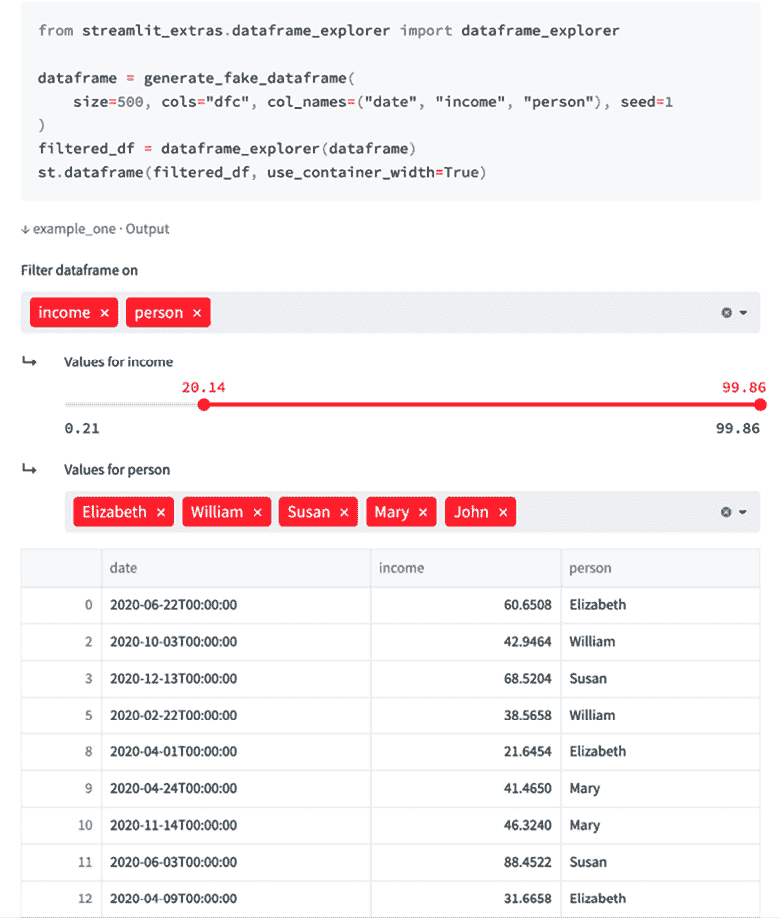
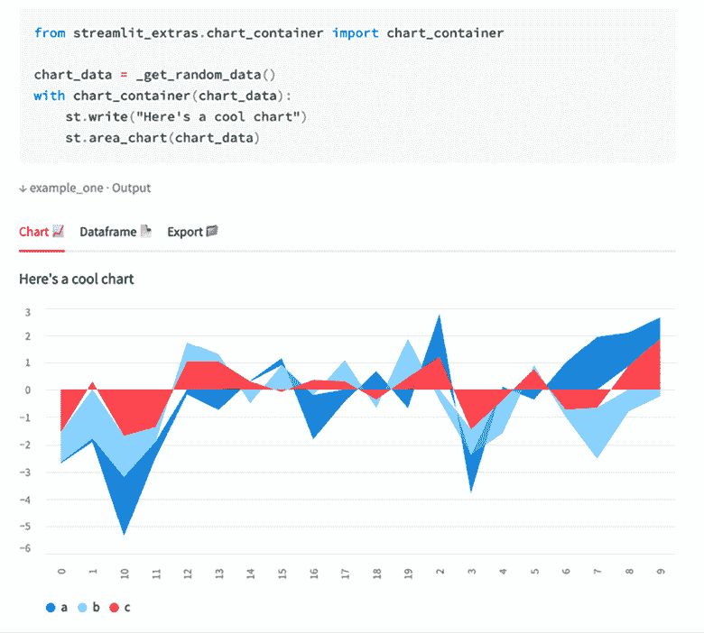
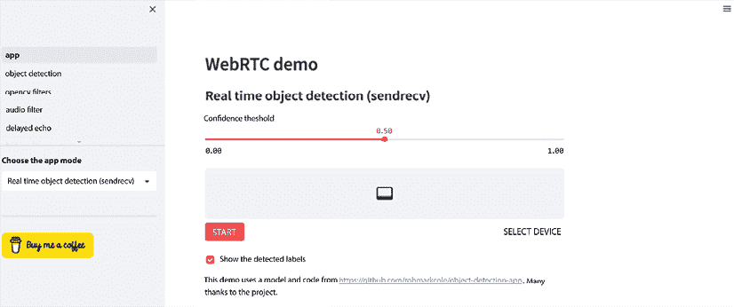
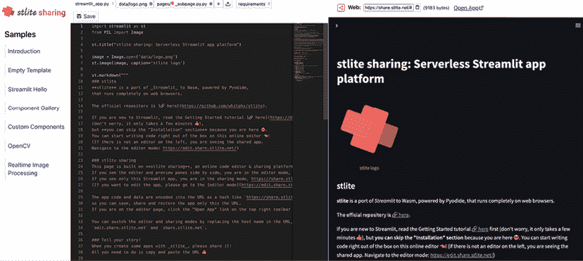

# Streamlit 资深用户

欢迎来到本书的最后一章！在这一章中，我们将向最顶尖的人士学习——Streamlit 的创作者，他们有着创建了数十个应用和组件的经验，Streamlit 的资深用户转变为 Streamlit 的员工，甚至还有 Streamlit 库的创始人，他如今在 Snowflake 内部领导公司。我采访了六位不同的用户，了解了他们的背景、使用 Streamlit 的经验，以及他们对不同经验层次的用户的建议。从这些访谈中，我们将了解到他们是如何在日常工作中使用 Streamlit 的，如何在教学中使用 Streamlit，并且我们还会探讨 Streamlit 的未来发展方向。

本章分为五个访谈：

+   Fanilo Andrianasolo，Streamlit 创作者以及 Worldline 的技术负责人

+   Adrien Treuille，Streamlit 创始人兼 CEO

+   Gerard Bentley，Streamlit 创作者和软件工程师

+   Arnaud Miribel 和 Zachary Blackwood，Streamlit 数据团队成员

+   Yuichiro Tachibana，stlite 的创作者以及 Streamlit 创作者

我们先从 Fanilo 开始！

# Fanilo Andrianasolo

**Tyler**：嘿，Fanilo！我想我们可以开始了，你想先向大家介绍一下自己吗？你是做什么的？现在在忙些什么？

**Fanilo**：大家好，我叫 Fanilo。我在 WorldLine 工作了 10 年，最开始是做大数据工程师，后来转到业务拓展，再到产品管理，最后回到了管理数据科学团队。现在我主要作为开发者倡导者工作，负责内部和外部的数据科学与商业智能相关事务。

主要是与内部团队讨论他们如何在支付产品中利用数据分析，然后向外部做演讲，推广我们的数据分析和数据科学技能。

此外，我还是一名大学讲师。我讲授大数据和 SQL 课程，并且在讲课时使用 Streamlit 做演示。

最后，我还做了一些内容创作，主要是在 YouTube（`www.youtube.com/@andfanilo/videos`）和 Twitter（[`twitter.com/andfanilo`](https://twitter.com/andfanilo)）上，以及进行外部演讲。

**Tyler**：真是做了好多事！我意思是，你已经是这个 Streamlit 社区的一部分很长时间了。你是第一版书中的首批访谈对象之一，长期活跃于 Streamlit 论坛，并且现在你还是这个领域的大型 YouTuber。

Streamlit 作为公司以及开源库有哪些大的变化？

**Fanilo**：我刚刚意识到，自己已经用了 Streamlit 构建应用 3 年了！当我刚开始使用 Streamlit 时，团队只有 9 个人，社区也非常小。现在它已经真正爆发了，社交媒体上有那么多的帖子，真的是很难跟上所有的动态。

我觉得即使在如此庞大的用户基础和受欢迎程度下，Streamlit 依然非常适合新手或者非开发人员，作为创建数据应用的一种方式。

Streamlit 一直非常小心地确保它易于使用，同时也能让开发者构建更高级的应用，同时能够倾听庞大社区的声音。

一个变化是他们稍微放宽了一些限制，例如，我们两年前在 Markdown 中无法进行样式设置，但现在可以了。

**Tyler**：这真是太棒了。那么，当谈到 Streamlit 时，你的内容获取方式是什么样的？如果我想进入这个领域，了解发生了什么，看到人们在做什么，Twitter 是不是最好的发现平台？

**Fanilo**：我其实更喜欢使用 Streamlit 论坛上的每周总结（[`discuss.streamlit.io/`](https://discuss.streamlit.io/)），由 Jessica 管理。我不知道她是怎么把所有内容整合在一起的，但它一直是我最可靠的保持受 Streamlit 应用启发的方式之一。

我还在 Hugging Face Spaces（[`huggingface.co/spaces`](https://huggingface.co/spaces)）看到了很多应用。我经常看到强大的应用程序，通常这两个来源都会出现在 Twitter 或 YouTube 上，所以等我看到的时候，已经是重复内容了。

**Tyler**：说到信息获取方式，你有没有一些最近创建的或者看到的你喜欢的应用程序？

**Fanilo**：我和多个想要与我分享自己应用的人交谈过。例如，有一位市场营销人员，他刚开始学习 Python，想创建一个小型 Python 应用来生成发票，并将其发送给客户。他还让同事们也能在这个应用上生成发票，所以这类小型应用是每个人都可以构建的。

我知道另外一个用例，一位用户围绕一个 Streamlit 多页面应用建立了自己的创业公司，他将这个应用提供给一些医疗机构，帮助他们在各个建筑之间跟踪药品库存。

看到这些人创造应用程序，即使这不是他们作为开发者的初衷，甚至他们不是开发者，我觉得非常有趣。我认为这些应用给我留下的印象最深刻。

**Tyler**：我完全理解；你真的会遇到很多有趣的人，他们会来和你谈论 Streamlit 或者他们遇到的问题。基于这个背景，构建 Streamlit 应用最困难的部分是什么？你觉得新的开发者常在哪些方面走错方向？

**Fanilo**：我经常看到很多人尝试构建实时应用程序，这是可能的，但也非常难以处理，因为他们会突然生成新的 Python 线程，或者线程与主线程发生冲突。管理这些线程很麻烦。

我还看到有些人想要将 Streamlit 与公司内部的设计模式整合，涉及所有视觉定制，或者将所有数据放入缓存或会话状态中。这些设计模式对于初学者来说，不太容易整合到 Streamlit 应用中。

我还看到有些人试图构建非常大的应用程序，而这会变得非常混乱，因为他们很难理解缓存是如何随着应用从头到尾的重新运行而工作的。

**Tyler**：你说的大应用是指什么呢？是指一个非常大的多页面应用，还是一个非常长的应用？

**Fanilo**：两者都有，但大多数情况下，我看到的是有些人想做的，例如在同一页面上对 40 个不同的图表进行交叉筛选。也许这样一个页面上的内容有点过多，你应该考虑把它拆分成多个应用，让每个应用有单一的责任，这样反而更有利于目标达成。把所有内容塞进一个页面，可能不如分开做多个页面好。

**Tyler**：相反，我提到过你看到了很多人学习 Streamlit，而且你在 YouTube 频道上有一些非常不错的教程。我觉得你目前最受欢迎的视频是那部史诗般的 Streamlit 教程视频（[`www.youtube.com/watch?v=vIQQR_yq-8I`](https://www.youtube.com/watch?v=vIQQR_yq-8I)）。我该如何从观看你精彩的视频内容到构建酷炫的应用呢？

**Fanilo**：我认为做一件事一百次是成为它的高手的最佳方式。我做法是几乎每有一个随机的想法，我就做一个 Streamlit 应用。例如，最近我做了一个应用来追踪我何时开始参加羽毛球比赛。我做了另一个应用来查询 MongoDB 数据库。我还做了一个应用来查询我的 Outlook 邮箱，检查最近附加的文件，看看我是否需要下载它们。

所以，每次我有了一个创意，我就会做一个应用，做得越多，我就越熟悉 Streamlit 的生命周期。我理解 Streamlit 讲究的是创意表达性，我可以有一个想法，做个草稿，然后一点一点地迭代。我觉得这就是最好的学习方式。

**Tyler**：每次我看你的视频时，我既感到娱乐又感到受到了启发，我相信其他人也有类似的感受。说到 YouTube，你最喜欢自己制作的关于 Streamlit 的视频是哪些？

**Fanilo**：当你开始做 YouTube 时，你会发现你根本不知道人们到底喜欢什么。我自己最喜欢的视频反而是那些表现最差的视频，而我最不喜欢的视频正是那些表现最好的。

我最喜欢的视频是关于创建组件的，因为说实话，和 Python 开发者讨论 JavaScript 和 React 真的有点棘手。我有点为自己编辑这个视频的方式感到骄傲，它也让我想起了我在教程制作上的进步。

**Tyler**：你对那些有兴趣成为 Streamlit 内容创作者或教育者的人有什么建议吗？我知道你最近发布了一个关于这个的视频，我会把链接放在这里（[`www.youtube.com/watch?v=pT6lNKtGyP8&t=163s`](https://www.youtube.com/watch?v=pT6lNKtGyP8&t=163s)）。但我也想给你一个机会提到一些事情。

**Fanilo**：首先，我只能鼓励你去做，因为这为我带来了很多机会，认识了许多伟大的人，他们愿意与我分享应用，如果我只是停留在 Twitter 上，或者只是待在论坛上回答问题，我是不会有这些机会的。所以，这对我来说是一个巨大的好处，甚至在我自己的公司也是如此。

关于开始创作内容的不幸事实是，每个创作者都会有这种感受。每个内容创作者都会这么说。总是会有一种担心，也许人们不会喜欢你，或者人们会评判你。我也有这些对话，关于人们会评判我。如果我犯错了怎么办？或者如果人们取笑我怎么办？

我给的建议通常是，从小做起，并保持一致的进步，因为这才是创造事物的方式，慢慢做。而且，也不要把现在的自己或当前的旅程与那些已经做了 5 年的创作者作比较，因为没有什么可以比较的，那样做会是最快让你筋疲力尽的方式。

**Tyler**：我觉得这是一个很棒的建议。在职业生涯中也是一样的，你要确保不要把自己的第一年与别人第十年的情况作比较。

这真是太棒了，我只是想再次感谢你接受了两次采访！在我们结束之前，你还有什么其他想说的或者想聊的吗？

**Fanilo**：我很容易在网上找到，所以可以去看看我的 YouTube 频道——其他的一切都可以通过我的用户名`andfanilo`找到。

**Tyler**：Fanilo 可以在 GitHub（[`github.com/andfanilo`](https://github.com/andfanilo)）、YouTube（`www.youtube.com/@andfanilo`）和 Twitter（[`twitter.com/andfanilo`](https://twitter.com/andfanilo)）找到。

# Adrien Treuille

**Tyler**：嘿，Adrien！很高兴再次和你聊天，谢谢你同意接受采访。你想先做个简短的介绍吗？

**Adrien**：是的！我曾是 Streamlit 的创始人兼 CEO 大约四年半，可能五年，之后在收购后，我成为了 Snowflake 内部 Streamlit 的负责人。

我们这里有两个主要目标，一个是将 Streamlit 的优秀第一方版本融入到 Snowflake 中，影响整个 Snowflake 产品线，另一个是维护和运营这个快速增长的精彩开源项目，它已经被全球最大的公司广泛使用。

从独立公司转变为 Snowflake，真的让我的工作职责得到了极大的提升，并且为其增加了许多维度，这让人非常兴奋。

**Tyler**：很好，我想我们可以直接开始，首先谈谈收购。这是我们第一次采访时最大的变化，当时这本书的第一版刚刚发布。正如你提到的，在 2022 年春天，Streamlit 被 Snowflake 收购。这个过程是怎样的？

**Adrien**：Streamlit 是一家不寻常的公司，它最初是一个个人项目，即使它成为了商业公司，它仍然是一个社区和开源项目，与作为商业公司的身份一样重要。显然，我们认为这个商业模式会有长期的成功，但我们始终是一个以使命为驱动的组织，因为我们真心相信我们带给世界的这个产品将推动技术的进步，并使人们的生活变得更好。

作为其中的一部分，我们从未一次性看 Streamlit 并问自己为何要做这个，或者我们如何尽可能榨取更多的利润。我们创建了一个平台，能够让尽可能多的人接触到这个产品，并与有才华的设计师、工程师和数据科学家一起继续改进它，造福每个人。

然后，当 Snowflake 接触我们并提出收购时，我们其实并没有真正考虑过这个选项。我们的预期是通过原来的公司来实现这一切。改变并且完全震撼我们的事情是，我们意识到 Snowflake 想要并且需要一个 Streamlit，正如我们当初试图为社区创造的那样。而这一点真的很酷。

这其实并不是我们从未想过的一个新商业计划，而是整个生态层级上激励机制的一种契合。我们有非常互补的激励和目标，这就像是，等一下，这真是太棒了。让我们与那些对成功有着和我们一样理解的人一起工作，而这不仅在收购时成立，现在依然成立。

我觉得 Streamlit 和 Snowflake 是一个绝妙的组合，并且随着时间的推移，它们的合作变得更加契合，而不是减少，这真的很棒，很酷。

**Tyler**：完全正确。正如你提到的，Streamlit 周围有一个庞大的社区，而你显然很在乎这个社区。在 Streamlit 还是一个新兴库的时候，故意去发展这个社区可能会稍微容易一些；那么随着它的规模不断扩大，这种情况有什么变化吗？

**Adrien**：当你经历这些快速扩展的变化时（如果你不想摧毁一切），关键是要时刻关注那些帮助你到达现在的东西，以及最重要的原则。

从 Streamlit 的早期，我们并没有把社区看作是产品的附属部分，而是把产品、论坛、网站、创作者计划以及我们在沟通上所做的努力，都视为社区的输入。

所以，退一步说，我们喜欢大声清晰地说出我们的原则，并在扩展过程中坚持这些原则。其中之一就是社区是一个有生命的东西，它是我们一切的核心。这一点在今天依然成立。另一个原则是我们如何谈论 Streamlit，以及我们对产品本身的热情。你会在我们的所有文档和论坛中注意到这一点，我们使用大量的感叹号和表情符号。我们写作的方式就像是一个对自己所讲内容充满热情的人，这对我们来说是真的！

社区是一个有生命的东西，它被培养并赋予了情感特征，比如对数据的真正热情、对探索的兴奋以及分享自己工作的热忱。我认为，这也是为什么人们即使在我们不断壮大的过程中，仍然能在 Streamlit 中发现持续的主题之一。

**Tyler**：在加入 Streamlit 之前，我注意到的一件事，并且作为员工仍然在注意到的，是对善意的强调。无论是与社区的互动，还是与其他员工的交流，这与我过去见过的其他团队明显不同。

**Adrien**：是的，即使在我年轻的时候，每当我领导一个小组时，它总是一个很友好的团队。我认为这点常常在 Streamlit 中得到体现，从联合创始人到员工，甚至是我们吸引到的社区成员和产品的使用者。多年来，这些特点已经形成了自己的生命力，且这些特征也发展成了各自独立的生命。例如，当我们开始招聘第一批员工时，我们有意识地筛选并选拔那些具有善意的人。后来我有点惊讶，发现很多员工在面试时也会筛选善意！某些情感维度已经以一种最酷的方式，变得自我推动。

**Tyler**：接下来，在我们之前版本的这本书的第一次访谈中，当我们讨论 Streamlit 随着时间的变化时，你提到 Streamlit 对 Python 编程的意义比对机器学习或数据科学的意义更为基础，而且 Streamlit 那时候是如此“玩具化”。你觉得这个愿景现在实现了吗？

**Adrien**：我完全同意。Streamlit 正在超越仅仅构建丰富有趣的应用程序的能力，开始着手实现作为 Python 之上视觉层的目标。

另一个方面是，Python 有很多细分领域，比如它是计算机科学教育的主要语言，也是数据工程工作的绝佳语言。它也是一种脚本语言，用于在成千上万种不同的 API 和文件格式之间进行协调。所以，我们看到了像 GPTZero 应用（[`gptzero.me/`](https://gptzero.me/)）这样的应用，它源自 Streamlit，并且做着硬核的机器学习工作，或者是其他用于全球打击人口贩卖的应用。

现在甚至有一些由 GPT-3 自己创建的 Streamlit 应用实例。如果有任何语言或框架能作为像 GPT-3 这样的大型语言模型的产物，Streamlit 就是最合适的选择，因为它具有独特且简单的数据流。它非常适合这一类模型，并且简化了它们能创建的应用程序的复杂性。我们现在只是看到这一切的开始，我认为它有着极其丰富和令人惊叹的未来。我迫不及待了。

**Tyler**：Adrien，非常感谢你来和我们分享。你有没有其他想聊的事情？

**Adrien**：我认为 Streamlit 非常酷的一点是，我们关于数据科学趋势的许多假设都通过我们创建产品的经验得到了验证。核心想法非常简单；这不是火箭科学！这是一种全新的数据工作方式，原生支持 Python，连接了 API、`pandas`、机器学习和所有其他 Python 概念。在所有不同的方向中，我认为仍然有大量绿地待开发的是机器学习，而且有许多不同的角度可以探讨。我们已经讨论过的一个角度是 AI 生成应用程序，我认为这是非常现实的，未来几年我们将会看到越来越多这样的应用。另一个角度是将 Streamlit 更深入地融入机器学习开发过程中，特别是在构建模型和探索大型数据集时。机器学习工程师的工作体验中几乎对可视化层有无限的需求，所以看到这一发展并为之助力是非常令人兴奋的。

**Tyler**：再次感谢你来参加这个访谈，Adrien！你可以在 Twitter 上找到 Adrien，网址是 [`twitter.com/myelbows`](https://twitter.com/myelbows)。

# Gerard Bentley

**Tyler**：嘿，Gerard！我们开始吧，我想知道你能不能简单介绍一下你的背景。你做什么工作？是什么让你进入数据领域的？

**Gerard**：现在，我在一家叫 Sensible Weather 的初创公司从事后台 Web 服务工作。我们销售一种针对恶劣天气的保险担保，这是气候科技领域的新产品。我在这里没有太多时间使用 Streamlit，但我在一些内部使用的工具上用到了它，虽然这些工具还没有完全部署。

之前，我在一家抵押贷款公司工作，主要做批量 ETL 工作，那时我接触到了一些金融领域的数据科学和预测模型。在那里，使用 Streamlit 创建一个内部工具来可视化如果一个人的信用评分更高，或者如果他们支付更多的本金等情况，感觉很有趣。在 Streamlit 之前，我们没有工具能快速回答这些问题。

**Tyler**：那么，你主要是专注于数据科学团队创建的模型，并制作互动应用程序来展示这些模型，对吧？是什么让你进入数据领域的？

**Gerard**：在本科毕业后，我与 Pomona College 的 Osborn 教授一起做了一年的 AI 研究，我们研究的是经典电子游戏中的计算机视觉。我们训练了卷积神经网络，并构建了数据管道来记录游戏截图并标注训练数据。

那时 Streamlit 还不存在。我当时构建的是一个加载图像的界面，要求用户标注图像特征，然后保存新的训练数据。但我花了好几个月的时间才学会足够的 JavaScript、Nginx 和 Docker，才得以部署一个有用的 Flask 应用。

**Tyler**：我在尝试使用 Flask 和 Django 创建项目时有很多经验，它们确实非常难以使用。那么，在这些经历之后，你是怎么开始接触 Streamlit 的呢？

**Gerard**：我是在为 AI Camp 做远程教学工作时听说 Streamlit 的。有一位老师建议我用它来和学生们一起做项目。有一个 Python 初学者仅仅花了一天时间就做了一个个人网站，然后在接下来的一周里，自己添加了图片和交互性。他们构建了一个完整的计算机视觉应用，这让他们充满了信心，在我看来也非常令人印象深刻。所以，我就是从这里开始接触 Streamlit 的，之后我开始做一些小项目，尝试理解工作中的新东西，也用它来做自己的项目。

**Tyler**：那真是太酷了。很多应用程序都有教学性质，你的目标是教会别人某些东西，可能是学生，或者是工作中的不同合作伙伴。那么你在使用 Streamlit 时，是什么时刻让你有了“啊哈”时刻？在什么情况下你意识到你真的喜欢这个库？

**Gerard**：我想我很早就看到了这一点。当一个学生只用了大约一天的时间就运行了一个带有摄像头支持的 YOLO 计算机视觉 Web 应用时，我就知道了。我清楚地记得，当时我花了好几周才用 HTML 和 JavaScript 构建一个这样的应用。从那时起，我就明白了，Streamlit 可以用来与任何机器学习模型进行交互。

**Tyler**：从那时起，你做了很多不同的 Streamlit 应用。你学习 Streamlit 的曲线是怎样的？你觉得它在一开始进展很快，然后进入了瓶颈期吗？是容易学习，难以精通，还是难学，易精通？或者是持续不断的学习过程？

**Gerard**：Streamlit 确实很容易上手。为了学习，我浏览了它的画廊，并复制了我想要模仿的应用的源代码。然后，我会进行一些修改，让它们成为我自己的。我已经对 Python 很熟悉了，所以这个过程进行得很顺利。

很容易学习，但要精通则更难。当我试图将传统 web 应用中的一些功能实现出来，比如客户端状态和异步函数时，我不得不在论坛和网上搜索解决方案。

**Tyler**：我也是这么觉得的。那么，为什么你会创建像 Fidelity 应用这样的 Streamlit 应用（[`github.com/gerardrbentley/fidelity-account-overview`](https://github.com/gerardrbentley/fidelity-account-overview)）？这是你掌握 Streamlit 过程中的一部分吗？

图 12.1：Gerard 的 Streamlit 应用

**Gerard**：部分原因是为了建立一个我可以展示给可能雇用我的公司的作品集。部分原因是我自己的兴趣；这些是我主要为自己构建的应用程序，看看它们是否能工作。对于我来说，Streamlit 目前是最快的方式。

**Tyler**：在 Fidelity 应用上，是更多地偏向于“我开始寻找新工作，并且想要开发一个作品集”，还是更多地偏向于“我有一个个人问题，我正在试图解决”？

**Gerard**：这个例子是两者的强烈结合。我想为自己的数据构建一个仪表盘，所以这是一个个人问题。同时，我也在考虑一个可以展示数据分析技能的项目，以便申请数据科学职位。其他应用程序则更多地集中于后端概念，这在面试中非常有用。

**Tyler**：Fidelity 应用花了多长时间？你是怎么得到这个想法的？你能讲讲构建和思考过程吗？

**Gerard**：我想第一版可能花了大约 4 小时的编码和研究时间。我对自己从电脑中的 CSV 文件加载 DataFrame 的技能很有信心，而且我已经构建了几个带有文件上传输入的应用，Streamlit 让这一过程非常简单。加载数据很容易，接下来我需要清理数据，展示数据并添加过滤器。

构建它最耗时的部分是制作视觉效果。根据我的经验，Plotly 拥有最漂亮的默认图表，所以这帮助我在没有大量代码的情况下尝试了多种图表的组合。

**Tyler**：第一版 Fidelity 应用花了四个小时，之后发生了什么？

**Gerard**：之后，我基本上想，哦，我怎么分享这个呢？我怎么才能让别人轻松使用这个，而不必在他们的电脑上运行 Streamlit 呢？所以，这就包括了一个可用的描述，然后是一些关于添加颜色和使用 Streamlit AG Grid 的细节。

那大约又是 2 小时的工作，用来清理并美化它。然后，我对它能够发布出去感到满意。这是在我读完你书的第一版后，在 Twitter 上私信你讨论过之后。然后，你分享了这个应用，我立刻想，哦，我应该把它做得更漂亮一点。

**Tyler**：我很喜欢这个应用！你有没有考虑过为一个应用收费？也许考虑如何收费超出基本功能？

**Gerard**：我有想过一点。比如我构建的一些应用，比如 QR 码生成器（[`github.com/gerardrbentley/flash_qr`](https://github.com/gerardrbentley/flash_qr)），与现有的 SaaS 产品类似，但我只是做了一个有趣的版本。我肯定认为一些应用可以采用分层或免费增值结构，但我从未付出过努力去实现这一点。

**Tyler**：你发布应用之后，第一次与 Streamlit 社区的互动是什么样的？大致来说，之后发生了什么？人们是通过 GitHub 或 Twitter 联系你吗，还是有什么回应？

**Gerard**：在那之后，我发布了一些关于应用的内容，大家开始在 GitHub 上关注我，并且 fork 了代码。这是我看到的主要互动。

然后，Streamlit Community Cloud 推出了观众数据功能，我看到大家每个月都会使用这个应用，或者至少查看过它！

**Tyler**：在你们开发第一个应用集之后，有没有一些你们希望早点知道的大事？比如关于 Streamlit 的流程、存储、状态或缓存之类的？

**Gerard**：绝对的，使用表单来防止重新运行是非常重要的。我做过几个时间序列预测的应用，每当你调整一个滑块时，它会触发到处的变化。但如果你将这些放在一个表单中，就能更好地控制执行过程。

当我刚开始时，像 `st.stop()` 或 `st.experimental_rerun()` 这样的控制流函数还很少。但现在，我使用它们来防止代码在一堆 `if` 语句中嵌套得太深。而且，在应用停止时显示一个警告说明原因也是很好的做法，因为用户并不如你了解你的应用。

**Tyler**：我只是想感谢你们进行了一场精彩的采访。我真的很喜欢你们的所有应用！如果你正在阅读这篇内容并且想找 Gerard，你可以在 LinkedIn 上找到他：[`www.linkedin.com/in/gerardrbentley`](https://www.linkedin.com/authwall?trk=bf&trkInfo=AQGvqeLue1E4AgAAAYqwwTpAtU_XFg4R7ziS3xw_A0DX1t3WxqoXwFBo04Bq81h43Wgi50U_SpVL270lZXr8eWZ_BsX5oKUcR3-Vy9Z3hSudrGFdiIXyKGehp76ZDS5WcYbNjFc=&original_referer=&sessionRedirect=https%3A%2F%2Fwww.linkedin.com%2Fin%2Fgerardrbentley) 或者访问他的网站：[`home.gerardbentley.com/`](https://home.gerardbentley.com/)。

# Arnaud Miribel 和 Zachary Blackwood

**Tyler**：嘿，Zachary 和 Arnaud！首先，你们每个人能跟大家简单介绍一下自己吗？

**Zachary**：正如你提到的，我是 Zachary Blackwood。我最开始是做教师的，但当这份工作无法支付账单时，我转行做了网页开发，后来因为他们使用 Python，我被吸引到数据团队，感觉这很有趣。

我之前在一个小型农业科技创业公司工作，后来被一个更大的公司收购，在那里我学到了很多关于基础设施和数据工程的知识。期间，我为数据科学团队开发了多个仪表板，我们尝试了好几种不同的框架。我的一个朋友向我展示了 Streamlit，这也许是我有些超前了，但我很喜欢它。

后来，那个朋友告诉我，他有个朋友在 Streamlit 工作，正在找一位数据工程师。我立刻申请了，现在，我在 Streamlit 的数据团队工作。

**Arnaud**: 大家好，我是 Arnaud Miribel。我从事数据科学已经超过五年了。我开始在几家不同领域的公司工作，这也是我一直喜欢数据科学的原因：你可以涉足任何领域。第一个公司是在法律领域，做的是法院判决的**自然语言处理**（**NLP**）。另一个是在医院，我做的是医学报告上的机器学习。还有一个是在继续教育领域，教授机器学习给很多人。

在过去的两家公司，我使用了 Streamlit，并且非常喜欢它。我认为它是有史以来最棒的东西；它突然让我的工作变得轻松多了。这与我之前在学生项目中使用 Plotly、Jupyter 或 Flask 时的困境完全不同。所以，当我发现它时，我非常高兴。

我在 Twitter 上看到 Johannes，他和我有类似的背景，开始在柏林的 Streamlit 工作。这让我感到非常惊讶，因为我一直以为 Streamlit 只存在于旧金山湾区！我在 Twitter 上给他发了私信，他让我和 Adrien 会面，然后……我开始为 Streamlit 工作了。那是大约两年前，这就是我开始的方式。

**Tyler**: 有时候事情就是这么奇妙地运作；我知道我也是通过 Twitter 发现了 Streamlit。那么，既然你们俩也和我在 Streamlit 的数据团队工作，而你们在过去大约六个月的时间里一起花了很多时间建立了一个名为 `streamlit-extras` 的库（[`extras.streamlitapp.com/`](https://extras.streamlitapp.com/)），其中包含了我们多年来在 Streamlit 数据团队上构建的许多小工具。你们能谈谈是什么中心问题激发了你们的灵感吗？

**Arnaud**: 从某种程度上来说，这是有些自私的，因为我们希望有某种方式分享我们所有的发现。然后我们意识到这是一个开源产品，我们应该将其分享给每个人，这是我们展示自己作为重度 Streamlit 用户的经验和教学的一种方式。我们也希望将它作为一种实验发布，看看社区对此做出什么反应，并从中汲取灵感，进一步发展。

**Tyler**: 所以，当你说到经验和教学时，你指的是什么？

**Arnaud**: 在数据团队中，我们有一个大型的多页面应用程序正在开发。在这个应用中，我们做了很多基于 Streamlit 的视觉功能或技巧，作为增强视觉效果和提升观看体验的方法。因此，我们希望将这些功能隔离出来，并打包成一个单独的包。

还有一些功能是为了让数据科学家更高效，比如系统地让图表始终显示底层的 DataFrame，以及一个将数据导出为 CSV 文件的按钮。我们希望将这些功能打包在一起，因为它们作为组件非常契合，我们认为将一组小组件称为“extras”是有意义的！

**Zachary**：除了我们内部使用的功能外，另一个额外功能的来源是社区论坛！我们定期花时间关注论坛，看到人们遇到的各种问题及其解决方法非常有趣。经常会有一些非常常见的问题，虽然需要一些设置代码，但一旦设置好了就能很好地工作。一个简单的例子是，有人希望在多页面应用中把应用的 logo 放在页面列表上方的左上角。实际上，这并不难做到，但我们确实看到很多人询问过这个问题。所以，我们将其做成了一个功能，并把这个功能放到了`streamlit-extras`中（[`extras.streamlit.app/App%20logo`](https://extras.streamlit.app/App%20logo)）。许多额外功能直接来自论坛上有人提出的需求。我们要么自己弄明白了，要么其他人弄明白了，然后我们将其加入 extras 中，便于让大家发现并避免重复造轮子。

**Tyler**：我最喜欢的额外功能之一是那个让你轻松添加带有实心底线的标题（[`extras.streamlit.app/Color%20ya%20Headers`](https://extras.streamlit.app/Color%20ya%20Headers)）和数据资源管理器功能（[`extras.streamlit.app/Dataframe%20explorer%20UI`](https://extras.streamlit.app/Dataframe%20explorer%20UI)）。你们两个有最喜欢的吗？

图 12.2：资源管理器

**Arnaud**：我最喜欢的是最近添加的一个叫做“图表容器”（[`extras.streamlit.app/Chart%20container`](https://extras.streamlit.app/Chart%20container)），它是一个非常高效的 API，用于快速创建 BI 组件。这样，无论你在处理 DataFrame 时，都可以创建图表、显示 DataFrame，并且通过一个函数将其导出为 CSV 文件。

图 12.3：图表容器

**Zachary**：我也喜欢这个！我有一个功能我们内部不常用，但它是一个经常会遇到的问题。人们会对点击按钮后，做完其他操作再返回时，按钮“不保持点击状态”感到困惑或沮丧。这是因为 Streamlit 的模型是每次交互时都从头到尾重新运行脚本。人们有时期望它像复选框一样工作，点击一次后会记住已被点击。

我们制作的额外功能叫做 Stateful Button（[`extras.streamlit.app/Stateful%20Button`](https://extras.streamlit.app/Stateful%20Button)），它在重新运行时依然保持被点击状态。虽然它很简单，但我认为它非常好，并且解决了人们在实际应用中常遇到的问题。

**Tyler**：我将所有这些额外功能看作是一个途径，如果你是团队中的一名独立开发者，可以通过这些功能了解最佳实践，并在使用 Streamlit 时获得优势。到目前为止，尚未提到的一个功能叫做图表注释（[`extras.streamlit.app/Chart%20annotations`](https://extras.streamlit.app/Chart%20annotations)），它允许你在图表上添加可点击的注释。我认为这是在工作中使用的一个极好的附加功能，尤其是在你希望能够在图表本身上解释图表中大幅波动时：

图 12.4：注释

就库本身的开发而言，开发这样的东西遇到了哪些困难？

**Zachary**：它最初其实是作为一个叫做 `st-hub` 的项目开始的！我们希望能够让组件和函数都能轻松地在一个地方发现。这个项目变成了一个独立的项目，但其中一个重要部分就是建立了我们现在在 [`extras.streamlit.app`](http://extras.streamlit.app) 上的这个画廊。对我们俩来说，这个过程非常有趣。目前，画廊是基于每个附加功能的源代码和一些你设置的魔法变量（[`www.pythonmorsels.com/dunder-variables/`](https://www.pythonmorsels.com/dunder-variables/)）动态生成的。然后，它构建了你在主画廊页面上看到的所有页面，包括代码、文档字符串、使用示例等。这是我最喜欢的 `streamlit-extras` 部分之一——技术挑战以及为生成这种动态页面所做的巧妙解决方案。我们在这上面花了很多时间，因为我们希望尽可能降低门槛，让社区中的其他人也能参与进来。

**Arnaud**：我同意，画廊可能占了 75% 的工作量。有趣的是，最开始挑战并不那么明确，我们做这件事的动机也不完全清晰。但我们知道我们确实想让 Streamlit 团队中的项目变得更容易被发现，也想让组件更易于被发现和创建，所以我们认为这是一个很好的社区起点。

**Tyler**：写这本书时，我遇到的一个困难是，实际上我可以写出很多关于组件的章节。而且很可能，我必须教大家一定量的 CSS、HTML 或 JavaScript，或者在 Python 中，我必须展示如何创建和上传包到 PyPI。在创建美丽的 Streamlit 应用和创建组件之间，存在着一个非常大的跨度。

这也是我想邀请你们俩的一个重要原因，鼓励大家从 `streamlit-extras`（[`extras.streamlit.app/Contribute`](https://extras.streamlit.app/Contribute)）开始他们的组件创建之旅。

我总是在这些访谈的最后问嘉宾是否还有其他想说的，或者是否还有其他想聊的话题。现在是你的时间了！

**Zachary**：在加入 Streamlit 之前，我在公司开始第一次创建开源包，虽然这些包在我的团队之外没有被广泛使用，但我真的很享受成为开源生态系统的一部分。现在能够参与一个被广泛使用、拥有强大用户基础并且正在积极开发的项目真的很有趣。我认为 Streamlit 有很多方法可以让贡献变得更加容易，但我真的很高兴能够成为这个社区的一部分，并将这些工作传递下去。为我的团队创造解决他们问题的工具真的很有趣，然后把它发布到论坛供其他人使用也很有趣。

**Arnaud**：正如他所说的那样。我鼓励每个人尝试 `streamlit-extras`，玩得开心，并告诉我们他们觉得好的或不好的地方。更一般地说，这是我第一次做开源贡献，非常有成就感，因为你会看到有人在使用它，甚至在 YouTube 视频中引用它。最终，这也是一种承诺，因为你会受到那些提交 PR 或问题的人施加的压力，你会意识到某些东西看起来不好或没有按预期工作。我鼓励大家尝试一下，并尝试构建自己的开源包，因为这确实是一次美好的冒险。

**Tyler**：非常感谢你们两位过来和我们聊天！你可以在 GitHub 上找到 Zachary，网址是 [`github.com/blackary`](https://github.com/blackary)，在 Twitter 上是 [`twitter.com/blackaryz`](https://twitter.com/blackaryz)，你可以在 GitHub 上找到 Arnaud，网址是 [`github.com/arnaudmiribel`](https://github.com/arnaudmiribel)，在 Twitter 上是 [`twitter.com/arnaudmiribel`](https://twitter.com/arnaudmiribel)。

# Yuichiro Tachibana

**Tyler**：嘿，Yuichiro，和你一起做这个真的太棒了！你想先向大家介绍一下自己吗？谈谈你的背景吧。

**Yuichiro**：好的，我是 Yuichiro Tachibana，目前在日本。我也是 Streamlit Creators 计划的成员，正在开发和维护一些 Streamlit 库。我的个人开源项目托管在 GitHub 上！

就我的背景而言，我在大学学习了计算机视觉和机器学习的应用。我与做机器人研究的人合作，软件对于帮助建立机器人智能，尤其是在计算机视觉方面是必要的。这就是为什么我对计算机视觉和机器学习的知识更侧重于实践而非理论的原因。

之后，我休学了一年，开始了自己的个人项目，并获得了日本政府的部分财政支持，在这个项目中我构建了一个基于**现场可编程门阵列**（**FPGA**）的深度学习加速器。当时我使用的是非常底层的技术；大约是 2014 年。

然后，我去了一个商业公司，在那里我参与了从自然语言处理到计算机视觉的各种项目，重点是商业产品。那时，我的主要技能逐渐转向更侧重软件开发，而不仅仅是计算机视觉或机器学习。

在这家公司，我开始开发一个基于网页的视频流录制系统，其中一些部分与我最终构建的`Streamlit-webrtc`组件类似。

然后，我加入了我朋友创办的公司，开始处理更结构化的数据。我是软件工程师，负责构建内部应用程序，用来展示一些基于日志的数据或分析结果。那时，我开始大量使用 Streamlit。

现在，我没有工作。我在休息，这就是我长篇的自我介绍！

**泰勒**：真酷，真是一段有趣的旅程。你是在做网页视频流工作时了解 Streamlit 的，还是主要是在最后一家公司才接触的？

**裕一郎**：实际上，我是在我第一家公司作为软件开发人员时开始接触 Streamlit 的。我与一些计算机视觉领域的研究人员合作，他们通常通过 OpenCV 展示他们的演示。他们会把笔记本电脑拿到我座位旁边，展示他们工作的酷炫！我最初的动机是寻找一些替代工具，帮助他们创建一些便携和可分享的演示。我想我最初是通过 Twitter 发现 Streamlit 的。

之后，我在 Streamlit 中找不到任何能帮助我进行实时视频流的工具，于是我构建了`Streamlit-webrtc`（[`github.com/whitphx/streamlit-webrtc`](https://github.com/whitphx/streamlit-webrtc)），它是一个组件，允许你在 Streamlit 中处理实时视频和音频流。

**泰勒**：我觉得`Streamlit-webrtc`真的很酷，不仅因为它有用，而且因为它看起来非常非常难以制作。你想谈谈这个组件的开发过程吗？人们是怎么使用它的？

图 12.5：WebRTC

**裕一郎**：首先，非常感谢。我认为创建和开发这个库的最初动机是帮助计算机视觉研究人员或软件开发者，他们希望在自己的模型和实时视频流的基础上创建演示。因此，从我的角度来看，它替代了 OpenCV 的一部分功能。

**泰勒**：我觉得这也引出了你与 stlite（[`github.com/whitphx/stlite`](https://github.com/whitphx/stlite)）的工作，stlite 是 Streamlit 的无服务器版本，基本上意味着你可以与某人分享一个 Streamlit 应用，他们可以在自己的浏览器中本地运行它，而不需要为该应用做任何 Python 设置。你能谈谈构建 stlite 时的动机吗？当时的核心问题是什么？

图 12.6：stlite

**Yuichiro**：嗯，我该从哪里开始呢？一开始，我先从 Jupyter 开始看，Jupyter 和 Streamlit 类似，因为它将一些前端代码抽象出来，隐藏了开发者的视线，让开发者主要只需编写 Python 代码。然后我看到 Jupyter 可以转换为 WebAssembly，这意味着它可以在浏览器中运行并完全本地运行。那时，我就知道我也可以用 Streamlit 做同样的事情。

我也有这样的感受，认为离线体验很重要。有些人会希望拥有一个以隐私为中心的体验，所有内容都在本地运行。

**Tyler**：没错，有些事情你希望集中管理，而有些事情则真心希望使用自己的电脑来处理。到处都是薄客户端和厚客户端！

**Yuichiro**：没错。在我与深度学习加速器合作的过程中，我有一个假设，认为离线、本地化的能力对计算机视觉或机器学习领域尤其有利，主要是因为隐私的考虑。

**Tyler**：然后，你对隐私和本地开发的重要性有了更深的看法，并且你也有了 WebAssembly 解决方案的技术想法。从那之后，事情是如何发展的呢？

**Yuichiro**：在那个时候，我已经有了这个想法，但我知道这会非常困难。大概过了半年，我才真正开始动手，尽管那时 Streamlit 论坛上有一些讨论，但我无法找到一个从实现角度来解决技术问题的清晰方法。

这一切在 2022 年 4 月下旬发生了变化，PyScript（[`pyscript.net/`](https://pyscript.net/)）的发布使得你可以在浏览器中运行 Python。这是一个潜在的竞争者，在看到它之后，我决定将我所有的精力投入到这个项目中。于是，我在下周就开始了开发。

**Tyler**：那太棒了；我推荐 stlite 给许多刚开始接触 Streamlit 的人，因为他们不需要自己做开发环境的设置。他们可以直接开始编程，立刻就能看到结果，简直像魔法一样。

在你看来，接下来会怎么发展？

**Yuichiro**：我在这方面有很多待办事项。但是我仍然没有完全清晰的未来发展蓝图。所以，首先，我希望你和这次采访的观众能告诉我关于 stlite 的有趣应用。如果你们有任何想法，请告诉我！

其他一些应用可能与边缘计算相关，比如 Cloudflare 及其基于 WebAssembly 的边缘计算服务，但它们不支持 Python。也许我们可以在那方面做些集成。

工业公司也可以使用 stlite 创建商业级产品，将 Streamlit 应用程序运行在客户端，以降低服务器成本，或者如果他们的大部分客户非常重视数据隐私，就像你说的那样。

**Tyler**：换个话题，你显然已经投入了大量时间参与 Streamlit 组件生态系统和论坛；是什么让你一直留在这个社区和库中？

**Yuichiro**：我会说我有三个理由。

首先，Streamlit 的技术设计。这个库的设计使它恰好位于简洁性和可扩展性之间的关键点。它是一个极其优秀的 API 设计。Streamlit 还帮助我将我的技术兴趣和技术构思转化为实际应用，并将其托管并与用户或同事共享。

第二个原因是社区和公司。公司本身也非常重视社区，我认为他们投入了大量的资金和努力来管理和维护社区。还有很多致力于维护社区健康的组织者，包括我自己。这让我在与 Streamlit 合作时感到非常舒适。

第三个原因是 Streamlit 的可扩展性。这也是我最初选择它的原因。没有其他选择可以让我在其基础上创建一个实时视频流组件！

**Tyler**：这些都是很棒的理由。我只是想给你一个机会，在采访结束时推广你正在做的任何事情，或者谈谈你在思考的任何事情。

**Yuichiro**：我没有太多要说的，但我想说我热爱开源软件。在更高层次上，每当你使用开源软件时，全球的开发者都免费为你创建了它，你可以用它来向世界表达你的意图、奉献和兴趣，并且创造一些非常有趣的原创内容。所以，我想这是我对全球开发者的自我宣传。与此同时，你应该尽可能地向世界表达你的兴趣，并且也应该尽力为开源软件生态系统做贡献和支持。资助一些项目，以便开发者可以继续制作你所使用的产品！

**Tyler**：再次感谢 Yuichiro！你可以在 GitHub 上找到 Yuichiro：[`github.com/whitphx`](https://github.com/whitphx)，在 Twitter 上找到：[`twitter.com/whitphx`](https://twitter.com/whitphx)。

# 总结

这也意味着*第十二章*，*Streamlit 高级用户*，以及本书的结束！我们在这一章中涵盖了许多深刻的内容，从与 Fanilo 讨论社区开发的重要性，到与 Arnaud 和 Zachary 分享一些流行组件的实际示例，再到与 Adrien 讨论 Streamlit 的玩具般功能以及 Streamlit 未来的方向。我们与 Yuichiro 一起了解了无服务器的 Streamlit，并与 Gerard 一起探索了 Streamlit 的新趣味应用。

我只是想对你阅读本书表示感谢；这本书对我来说是一次充满热情的创作，我希望你能与我联系，告诉我它是如何影响你的 Streamlit 开发者体验的。你可以在 Twitter 上找到我：[`twitter.com/tylerjrichards`](https://twitter.com/tylerjrichards)，我希望你在阅读这本书时，能像我写这本书时那样享受其中。感谢你，去创造一些精彩的 Streamlit 应用吧！

# 在 Discord 上了解更多

要加入这本书的 Discord 社区——你可以在这里分享反馈、向作者提问并了解新版本——请扫描下面的二维码：

[`packt.link/sl`](https://packt.link/sl)

