# 通过自定义和 UI 功能优化 Streamlit 网页应用的用户体验

在*第八章*中，我们开始开发一个新的网页应用——*Covid-19 检测工具*。我们已经创建了虚拟环境和应用骨架，并做了一些基本的装饰。现在是时候集中精力于我们新工具的三个主要部分：**图像增强**、**诊断**和**免责声明** **及信息**。

**对比度**和**亮度**是 UI 元素，允许用户调整图像的对比度和亮度。这些功能有助于改善显示图像的可见性和清晰度。滑块和单选按钮是小部件，允许用户与网页应用中的数据互动和操作。滑块允许用户通过拖动滑块按钮设置一个范围内的值，而单选按钮允许用户从一组选项中选择一个选项。总体而言，对比度、亮度、滑块和单选按钮是强大的 UI 功能，使我们能够创建非常吸引人和互动性强的网页应用，适用于 COVID-19 检测。在像我们正在一起构建的这种进行预测或预测的应用中，添加*免责声明*非常重要，以免向用户传达任何错误信息。

通过开发这些新功能，我们有机会学习如何使用 Streamlit 的更高级技巧和技能。

本章我们将涵盖以下主要内容：

+   处理更高级的网页应用功能

+   使用 Pillow 库添加**图像增强**部分

+   添加**免责声明**和**信息**部分

# 技术要求

+   本章我们将使用以下库、包和工具：

    +   Sublime Text

    +   Python 3

    +   `pipenv`

    +   Streamlit

    +   Pillow

    +   `numpy`

+   本章的代码可以通过以下 GitHub 链接访问：[`github.com/PacktPublishing/Web-App-Development-Made-Simple-with-Streamlit/tree/f1bd9c354072092c268f27621680c858ce93c823/Chapter09`](https://github.com/PacktPublishing/Web-App-Development-Made-Simple-with-Streamlit/tree/f1bd9c354072092c268f27621680c858ce93c823/Chapter09)

# 处理更高级的网页应用功能

在*第八章*中，我们的开发停留在下图所示的位置：

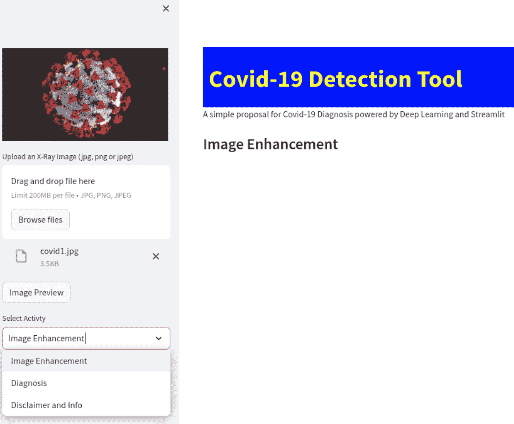

图 9.1：第九章起始点

那么，让我们开始处理菜单的三个选项：**图像增强**、**诊断**和**免责声明及信息**。在此之前，既然我们要进入一些 Streamlit 的高级功能，并且考虑到新版本更新频繁，非常重要的一点是记住，Streamlit 的官方文档（[`docs.streamlit.io/`](https://docs.streamlit.io/)）永远是获取所有可用组件和 API 详细信息的最佳地方；例如，如果你对 **图像** 小部件有任何疑问，你只需在官方文档页面左侧的 **API 参考** 菜单中搜索，或者直接在右上角的搜索框中搜索，查看所有相关结果。

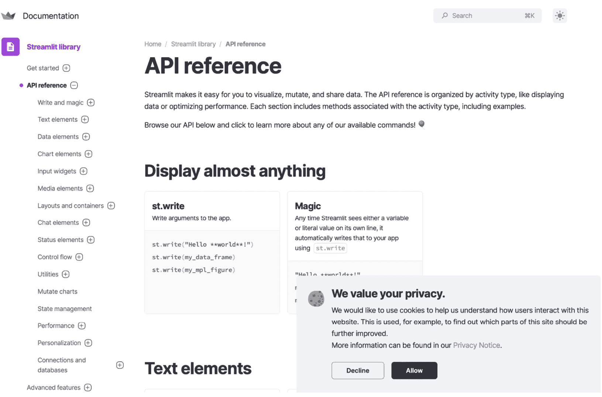

图 9.2：Streamlit 的官方文档

让我们在 Sublime Text 中打开代码，继续我们的开发，因为此时我们只有一个空菜单。

我们已经定义了一个名为 `activities` 的菜单选项列表，并定义了一个 `if` 语句来检查这些选项中哪个被选中，并将其存入名为 `choice` 的变量；现在我们的任务是为这三种可能性中的每一种编写业务逻辑：

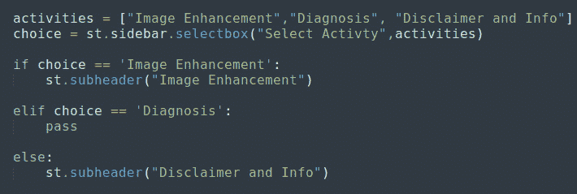

图 9.3：需要插入业务逻辑的点

我们非常清楚 `pass` 只是一个占位符，因此我们可以从菜单选项中的第一个开始编码：**图像增强**。

图像可以通过多种方式增强——例如，通过调整亮度或对比度。所以我们可以在侧边栏使用一些单选按钮，让用户选择他们想要执行的增强类型。

正如我们应该知道的，单选按钮有几个必填的参数：一个标签（标题）和一个可选择的项目列表：

图 9.4：图像增强的单选按钮

像往常一样，单选按钮中的项目列表包含我们想在屏幕上展示的所有功能：

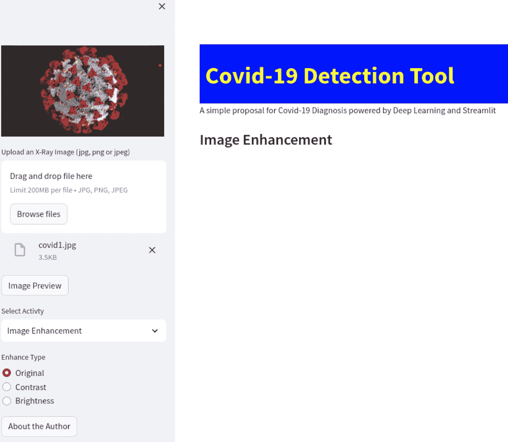

图 9.5：浏览器中的单选按钮

很明显，现在我们需要一些 `if` 语句。因为如果 `enhance_type` 变量是 `原始`，我们需要做某些事情；如果是 `对比度`，我们需要做不同的事情；如果是 `亮度`，我们还需要做其他事情：

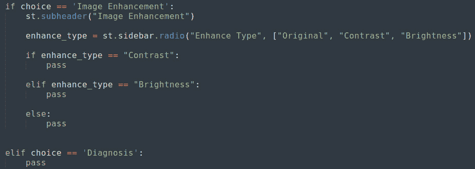

图 9.6：“图像增强”的 if 语句

如前所述，`pass` 只是一个占位符，因此让我们逐个处理这些 `if` 语句。第一个是 `对比度`。

# 使用 Pillow 库添加图像增强部分

在我们最初导入的库中，`ImageEnhance` 实际上负责所有与图像增强相关的功能。这意味着我们可以使用 Pillow 的 `ImageEnhance` 模块中已包含的 `Contrast` 和 `Brightness` 方法，因为我们所需的所有功能以及许多其他功能都已经为我们实现了。

Pillow，或称 **Python Imaging Library**，是一个非常强大的库，它能够做的不仅仅是本书中展示的这些功能。基于这个原因，我们建议你浏览其在 PyPI 上的官方页面（[`pypi.org/project/Pillow/`](https://pypi.org/project/Pillow/)），并阅读那里包含的所有文档。

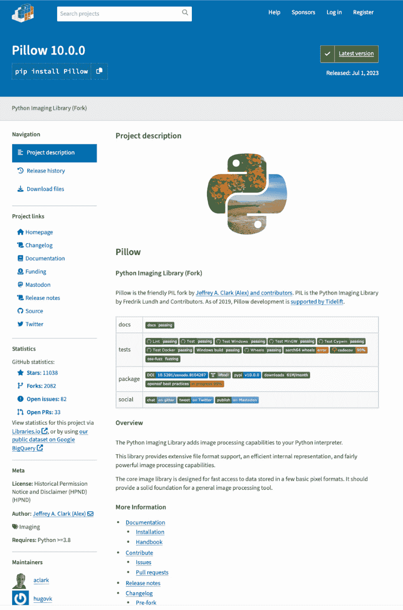

图 9.7：PyPI 上的 Pillow 页面

让我们从 `Contrast` 开始。

## 对比度

如 *图 9.8* 所示，使用 Pillow 的方法管理 `Contrast` 实际上非常简单：

图 9.8：对比度功能

在子标题后的 `if` 语句中，我们首先添加了一个 *滑块*。这个滑块的值范围从 `0.5` 到 `5.0`；你可以调整这个范围，观察不同的效果。

添加滑块后，我们需要使用之前通过 `file_uploader` 打开的图像（`our_image`）实例化一个 `ImageEnhance.Contrast` 对象。然后，使用滑块选择的值应用 `enhance` 方法到这张图像上。

最终，结果通过 `st.image` 打印到屏幕上，这是 Streamlit 的经典控件之一。

这是从浏览器的角度看到的结果：

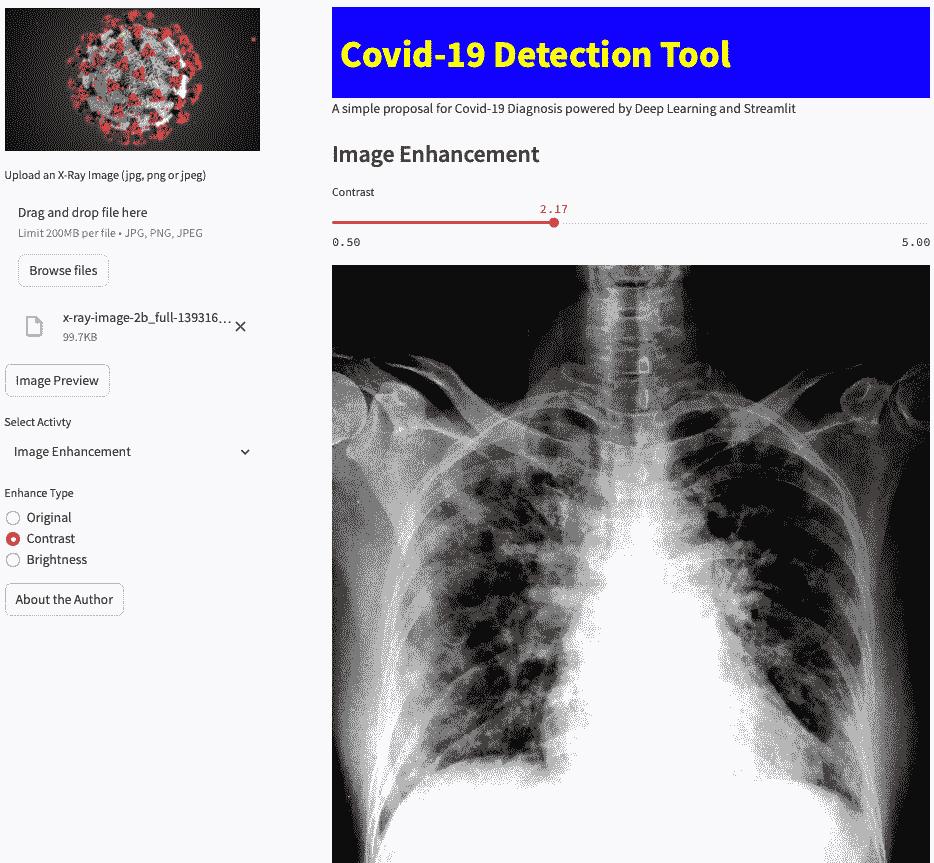

图 9.9：对比度功能演示

结果非常好，并且使用 Pillow 管理这种图像增强非常简单。

如我们刚才看到的，Pillow 默认包含了 `Contrast` 功能。因此，可以想象它也包含了 `Brightness` 功能。

## 亮度

事实上，针对 `Brightness` 功能所需编写的代码与 `Contrast` 功能差不多。我们可以输入以下内容：

图 9.10：亮度功能

前面的代码与我们为 `Contrast` 编写的代码完全相同，不过这次我们使用了 `ImageEnhance.Brightness` 方法，而不是 `ImageEnhance.Contrast` 方法。

所以，再一次地，我们通过滑块设置亮度值，创建一个从 `file_uploader` 打开的图像中获取的 `enhancer` 对象，应用亮度到这张图像，并将结果打印到屏幕上。

这是我们在网页应用中的结果：

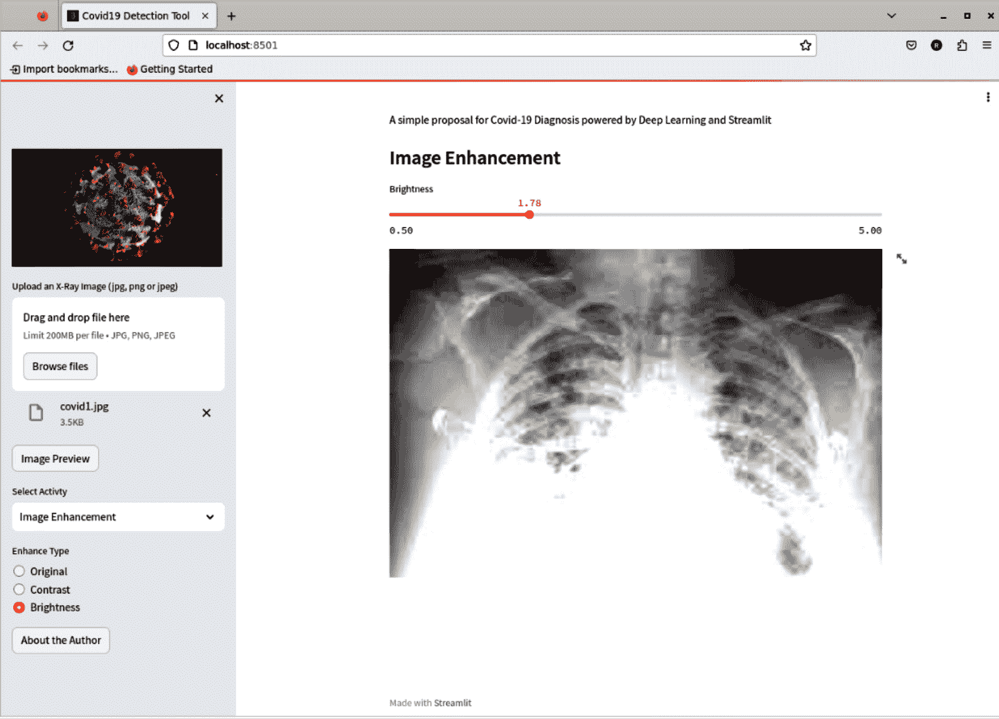

图 9.11：亮度功能演示

在`亮度`和`对比度`的两种情况下，你可以通过使用滑块选择不同的值来改变效果的强度，如果你不喜欢结果，也可以随时更改我们设置的范围，从`0.5`到`5.0`。

我们可以通过选择单选按钮来选择的最后一个选项是`Original`。

## 原始

在`file_uploader`的情况下并将其显示在屏幕上。代码如下：

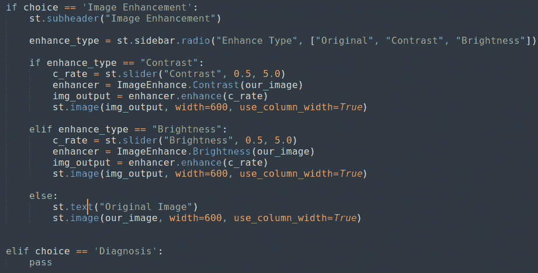

图 9.12：原始图像功能

如果你愿意，你可以尝试将`st.image`中的`use_column_width`参数设置为`False`并查看结果，或者如果你更喜欢的话，可以指定一个不同于`600`的宽度。

这是浏览器中的效果：

图 9.13：原始图像功能的实际效果

使用**原始**图像功能后，我们可以认为菜单中的**图像增强**选项已完成。感谢 Pillow 库，我们可以非常顺畅地实现该选项的所有功能。这是 Python 最棒的地方之一，你总能找到一个已经具备所有所需功能的优秀库！

让我们继续看**免责声明和信息**部分。**诊断**部分稍微复杂一些，我们将在下一章讨论它。

# 添加免责声明和信息部分

处理提供预测的应用程序，特别是健康预测，可能有些危险，因此一个好的做法是写下免责声明，以避免任何误解。

该网页应用的免责声明，名为**免责声明和信息**，还起到提供一些关于用于从图像预测 COVID-19 的模型以及训练该模型所用数据集的信息的作用。

简而言之，免责声明的主要目的是澄清该应用程序只是 Streamlit 功能的一个示范，从医学角度来看没有任何价值。此外，免责声明还包含了一些关于用于进行预测的 AI 模型的信息。

在*第十章*中，我们将看到每当我们需要进行预测时，一个好的策略是使用机器学习模型。

特别地，我们的网页应用中使用的模型是所谓的`tensorflow`，并且使用了一个包含 206 张受影响人员和 206 张健康个体图像的数据集。

附加信息

CNN 是特别的神经网络架构，在图像相关问题（如图像分类）中表现非常好。我们在这个应用中要做的，正是图像分类，特别是胸部 X 光图像，来发现它们是否显示 COVID-19 病例。确定给定图像是否代表 COVID-19 病例是一个典型的二分类问题，这意味着判断某件事情是否为真或假。CNN 在这种任务中是非常好的分类器。然而，为了更好的性能，它们需要大量的图像，因此需要一个大的数据集来训练这些模型。

我们使用的 CNN 表现相当不错，即使它是用有限数量的图像训练的。该模型在分类 COVID-19 病例和健康个体的图像时表现良好，但在分类 SARS 病例的图像时预测性能较差（SARS 与 COVID-19 相似）。

免责声明必须插入到与菜单相关的`if`语句的`else`部分，如下图所示：

图 9.14：免责声明的插入点

我们可以选择以多种方式编写这个免责声明，但最简单的一种方式就是使用一些`st.write`对象。通过这种方式，我们可以得到非常清晰、格式良好的文本，并且可以添加指向一些可以作为参考的网站链接。我们使用的是**Markdown**语法，因此可以使用粗体、斜体、项目符号、列表等。

注意

文本中链接的网站是真实的，它们启发作者在第一次 COVID-19 封锁期间创建了这个工具。如果你想了解它们，它们非常有趣！

这是我们可以用来添加免责声明的代码：

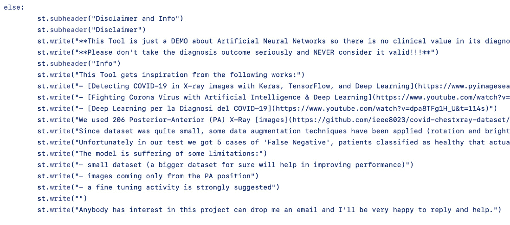

图 9.15：免责声明部分使用的代码

实际上，这段代码只是一个提议。你不需要在你版本的*COVID-19 检测工具*网页应用中复制它。你可以根据自己的需求进行修改，如果你决定使用其他模型进行预测（如今，在线可以轻松找到多个预训练的模型，例如，[`ieeexplore.ieee.org/document/9340145`](https://ieeexplore.ieee.org/document/9340145) 或 [`www.nature.com/articles/s41598-023-33685-z`](https://www.nature.com/articles/s41598-023-33685-z)），你可以插入关于你自己版本和新模型的信息，并附上其性能和准确度的解释。

这是我版本应用的**免责声明**部分：

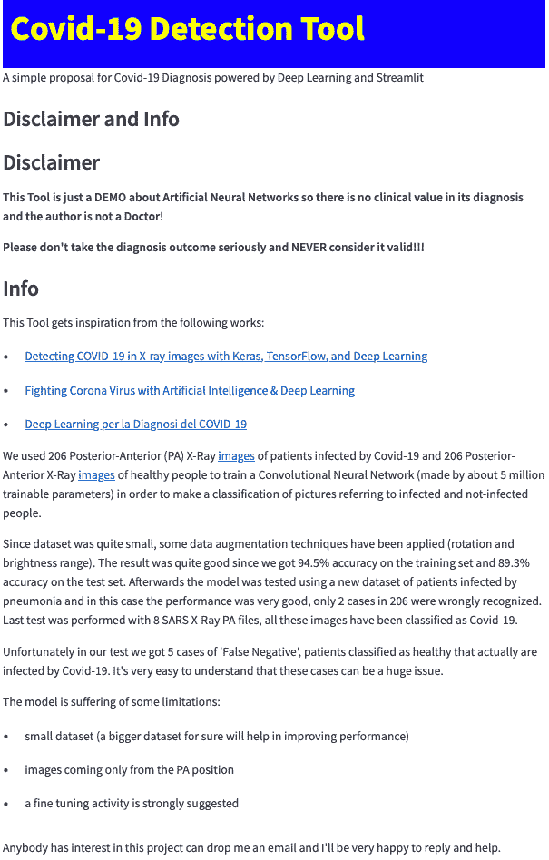

图 9.16：浏览器中的免责声明

结果非常干净整洁，因为我们使用了标题、粗体、带有项目符号的列表和指向外部网站的超链接。

像往常一样，让我们打印出到目前为止我们实现的代码，以确保我们的 Web 应用程序的所有内容都已正确编写且没有错误：

图 9.17：代码的第一部分

回顾一下，在*图 9.17*中，我们有代码的第一部分，在这一部分中，我们导入了所有相关的库，设置了页面标题和图标，定义了`main`函数，并在其中将图像放入侧边栏，同时添加了应用程序的菜单。

这个菜单包含了三个功能：**图像增强**、**诊断**和**免责声明及信息**。在**图像增强**部分，我们可以选择三种选项：**原始**、**对比度**和**亮度**。

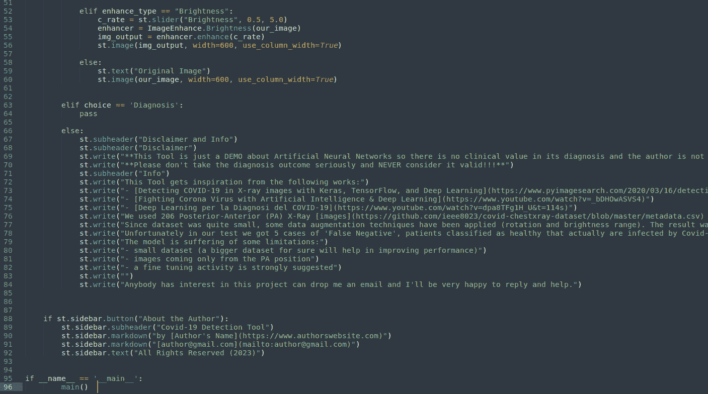

图 9.18：代码的第二部分

在代码的第二部分，如*图 9.18*所示，我们完成了**免责声明及信息**和**关于作者**部分，而将**诊断**部分暂时留空。

# 总结

在本章中，我们完成了构成我们*COVID-19 检测工具* Web 应用程序菜单的三个功能中的两个。

为了处理**图像增强**功能，我们利用了 Pillow 库，这是一个非常强大的库，使得通过很少的代码行就能管理一些非常强大的功能，例如图像对比度和亮度。

我们还为用户创建了多个选择，采用了单选按钮和`if`语句。单选按钮是一种非常简洁且强大的选择方式，确保了在整个过程中不会产生任何歧义。

将滑块与图像可视化结合使用，是调整各种参数（如对比度和亮度）的强大工具。滑块让用户能够精确且连续地选择任何给定参数的所需值。

另一个需要强调的重要技巧是，每次我们修改图像（例如进行亮度调整）时，我们都在其副本上进行操作，而不是在原始图像上。通过这种方式，我们可以很简单地返回到原始状态，只需展示通过`file_uploader`加载的图像即可。

我们还了解到，利用 Markdown 语法格式良好的文本可以为用户提供丰富的信息——例如，展示使用的技术和灵感来源的文档。毫无疑问，这种简洁且格式规范的文本是创建免责声明的完美方式，有助于避免未来的任何问题。

在下一章，我们将学习如何将人工智能和机器学习模型集成到我们的 Web 应用程序中。
